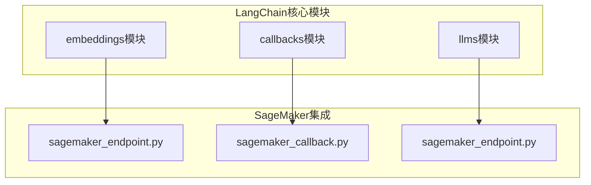
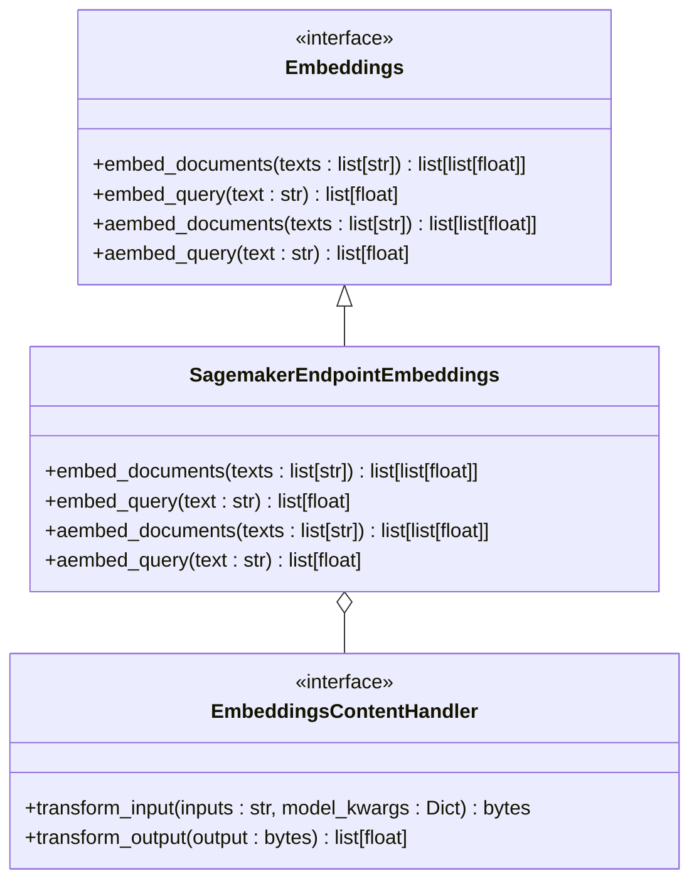
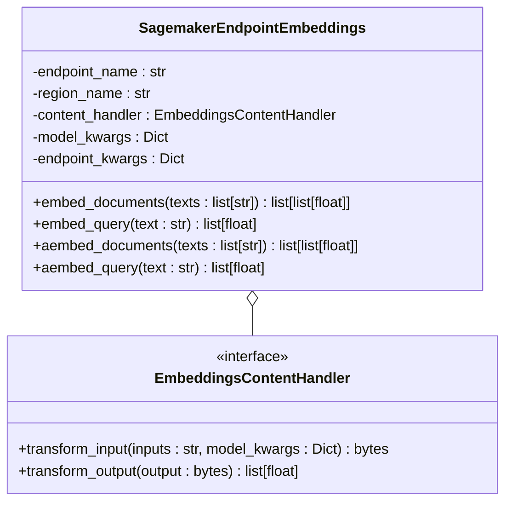
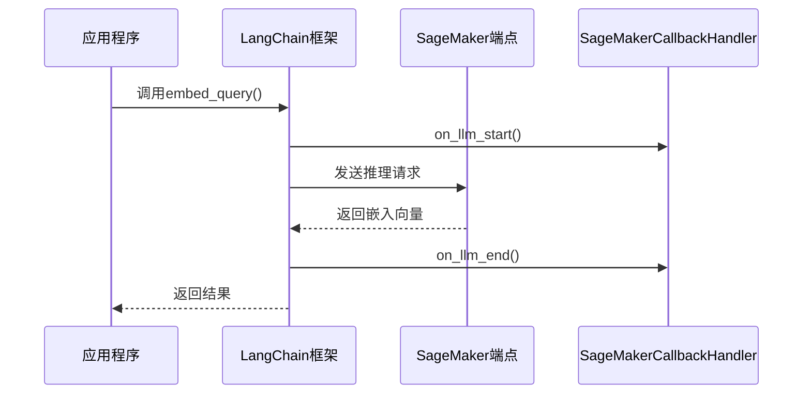

# SageMaker Embeddings

<cite>
**本文档中引用的文件**
- [sagemaker_endpoint.py](file://libs/langchain/langchain_classic/embeddings/sagemaker_endpoint.py)
- [base.py](file://libs/langchain/langchain_classic/embeddings/base.py)
- [embeddings.py](file://libs/core/langchain_core/embeddings/embeddings.py)
- [sagemaker_callback.py](file://libs/langchain/langchain_classic/callbacks/sagemaker_callback.py)
- [llms/sagemaker_endpoint.py](file://libs/langchain/langchain_classic/llms/sagemaker_endpoint.py)
</cite>

## 目录
1. [简介](#简介)
2. [项目结构](#项目结构)
3. [核心组件](#核心组件)
4. [架构概述](#架构概述)
5. [详细组件分析](#详细组件分析)
6. [依赖关系分析](#依赖关系分析)
7. [性能考虑](#性能考虑)
8. [故障排除指南](#故障排除指南)
9. [结论](#结论)

## 简介
本文档深入探讨了如何使用LangChain与Amazon SageMaker集成，以部署和调用自定义嵌入模型。重点介绍SageMaker端点的配置、IAM权限设置、模型版本管理以及大规模推理请求的处理。文档还涵盖了生产环境中的最佳实践，包括成本管理、自动伸缩配置、监控和日志记录。此外，讨论了SageMaker Embeddings在需要完全控制模型生命周期和数据隐私的企业级应用中的优势。

## 项目结构
LangChain项目结构清晰地组织了与SageMaker相关的组件。核心的嵌入功能位于`libs/langchain/langchain_classic/embeddings/`目录下，而回调处理则位于`libs/langchain/langchain_classic/callbacks/`目录中。这种模块化设计使得SageMaker集成组件易于维护和扩展。



**Diagram sources**
- [sagemaker_endpoint.py](file://libs/langchain/langchain_classic/embeddings/sagemaker_endpoint.py)
- [sagemaker_callback.py](file://libs/langchain/langchain_classic/callbacks/sagemaker_callback.py)
- [llms/sagemaker_endpoint.py](file://libs/langchain/langchain_classic/llms/sagemaker_endpoint.py)

**Section sources**
- [sagemaker_endpoint.py](file://libs/langchain/langchain_classic/embeddings/sagemaker_endpoint.py)
- [sagemaker_callback.py](file://libs/langchain/langchain_classic/callbacks/sagemaker_callback.py)

## 核心组件
SageMaker Embeddings的核心组件包括`SagemakerEndpointEmbeddings`类和`EmbeddingsContentHandler`接口。这些组件共同实现了与SageMaker端点的通信，允许用户部署和调用自定义的嵌入模型。`SagemakerEndpointEmbeddings`类负责管理与SageMaker的连接，而`EmbeddingsContentHandler`则定义了如何处理请求和响应的数据格式。

**Section sources**
- [sagemaker_endpoint.py](file://libs/langchain/langchain_classic/embeddings/sagemaker_endpoint.py)
- [embeddings.py](file://libs/core/langchain_core/embeddings/embeddings.py)

## 架构概述
LangChain与SageMaker的集成架构采用了一种动态导入机制，通过`create_importer`函数来处理废弃的导入路径。这种设计确保了向后兼容性，同时允许开发者使用最新的API。架构的核心是`SagemakerEndpointEmbeddings`类，它继承自`Embeddings`抽象基类，并实现了`embed_documents`和`embed_query`方法。



**Diagram sources**
- [embeddings.py](file://libs/core/langchain_core/embeddings/embeddings.py)
- [sagemaker_endpoint.py](file://libs/langchain/langchain_classic/embeddings/sagemaker_endpoint.py)

## 详细组件分析
### SagemakerEndpointEmbeddings 分析
`SagemakerEndpointEmbeddings`类是LangChain与SageMaker集成的核心。它通过AWS SDK与SageMaker端点进行通信，支持同步和异步的嵌入生成。该类的设计遵循了LangChain的可运行（Runnable）接口，使其能够无缝集成到更复杂的链式操作中。

#### 类图分析


**Diagram sources**
- [sagemaker_endpoint.py](file://libs/langchain/langchain_classic/embeddings/sagemaker_endpoint.py)

**Section sources**
- [sagemaker_endpoint.py](file://libs/langchain/langchain_classic/embeddings/sagemaker_endpoint.py)

### SageMaker回调处理
SageMaker回调处理组件允许开发者监控和记录与SageMaker端点的交互。`SageMakerCallbackHandler`类可以捕获请求和响应的详细信息，这对于调试和性能优化非常有用。



**Diagram sources**
- [sagemaker_callback.py](file://libs/langchain/langchain_classic/callbacks/sagemaker_callback.py)

**Section sources**
- [sagemaker_callback.py](file://libs/langchain/langchain_classic/callbacks/sagemaker_callback.py)

## 依赖关系分析
SageMaker集成组件依赖于多个外部库和内部模块。主要依赖包括AWS SDK for Python (boto3)、LangChain核心模块以及特定于SageMaker的社区包。这些依赖关系通过动态导入机制进行管理，确保了组件的灵活性和可维护性。

```mermaid
graph TD
SagemakerEmbeddings --> boto3[AWS SDK (boto3)]
SagemakerEmbeddings --> LangChainCore[LangChain Core]
SagemakerEmbeddings --> LangChainCommunity[LangChain Community]
SagemakerCallback --> CloudWatch[Amazon CloudWatch]
SagemakerLLM --> SageMakerRuntime[SageMaker Runtime]
style SagemakerEmbeddings fill:#f9f,stroke:#333
style SagemakerCallback fill:#f9f,stroke:#333
style SagemakerLLM fill:#f9f,stroke:#333
```

**Diagram sources**
- [sagemaker_endpoint.py](file://libs/langchain/langchain_classic/embeddings/sagemaker_endpoint.py)
- [sagemaker_callback.py](file://libs/langchain/langchain_classic/callbacks/sagemaker_callback.py)
- [llms/sagemaker_endpoint.py](file://libs/langchain/langchain_classic/llms/sagemaker_endpoint.py)

**Section sources**
- [sagemaker_endpoint.py](file://libs/langchain/langchain_classic/embeddings/sagemaker_endpoint.py)
- [sagemaker_callback.py](file://libs/langchain/langchain_classic/callbacks/sagemaker_callback.py)
- [llms/sagemaker_endpoint.py](file://libs/langchain/langchain_classic/llms/sagemaker_endpoint.py)

## 性能考虑
在使用SageMaker Embeddings时，性能优化是一个关键考虑因素。建议使用自动伸缩功能来应对流量波动，并配置适当的实例类型以平衡成本和性能。此外，利用缓存机制可以显著减少重复请求的延迟。

## 故障排除指南
常见的问题包括IAM权限不足、端点配置错误和网络连接问题。建议使用SageMaker Studio进行调试，并检查CloudWatch日志以获取详细的错误信息。确保`EmbeddingsContentHandler`正确实现了输入输出转换逻辑。

**Section sources**
- [sagemaker_endpoint.py](file://libs/langchain/langchain_classic/embeddings/sagemaker_endpoint.py)
- [sagemaker_callback.py](file://libs/langchain/langchain_classic/callbacks/sagemaker_callback.py)

## 结论
SageMaker Embeddings为LangChain用户提供了一种强大而灵活的方式来部署和管理自定义嵌入模型。通过深入理解其架构和组件，开发者可以充分利用SageMaker的可扩展性和安全性，构建高性能的AI应用。