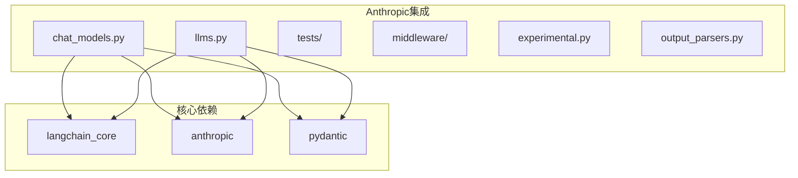
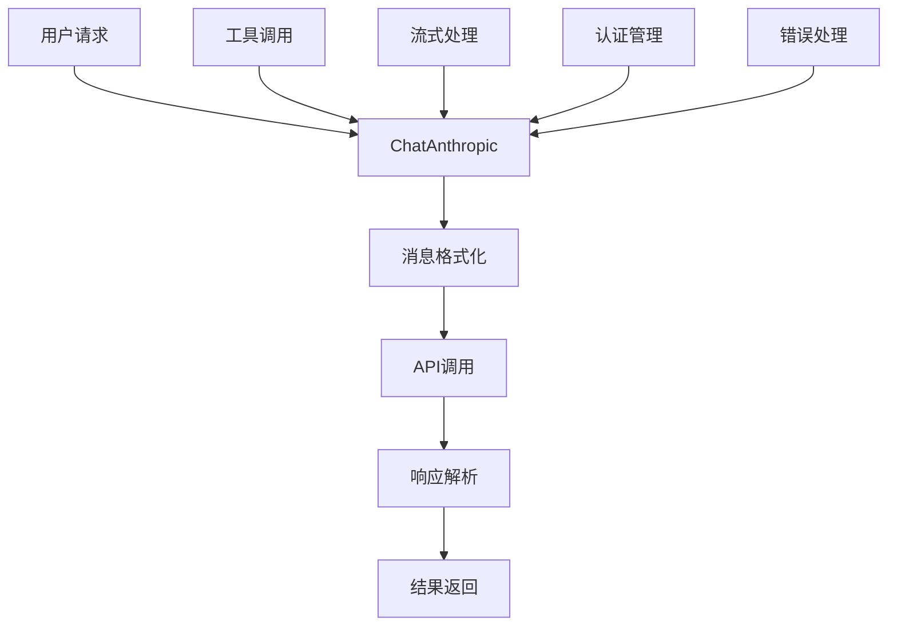
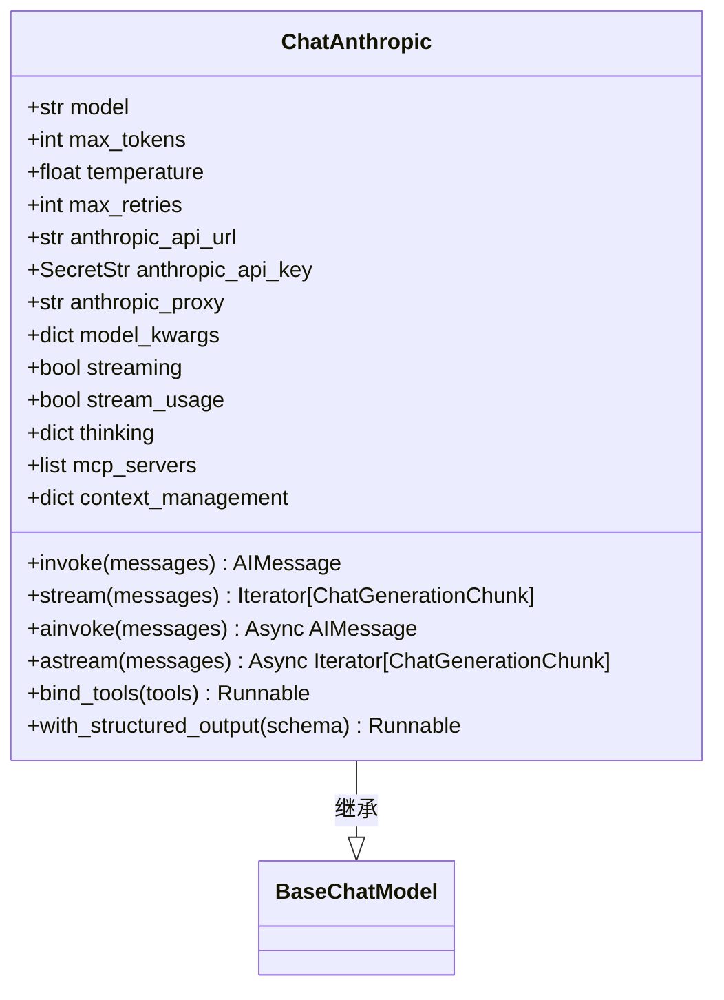
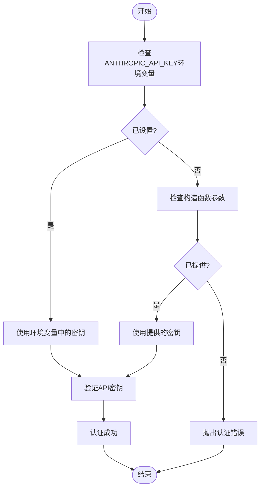
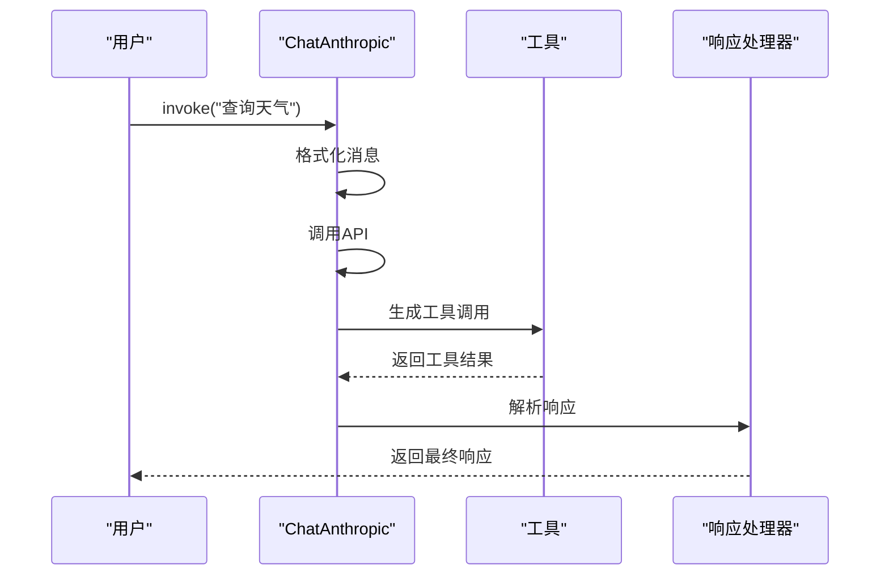
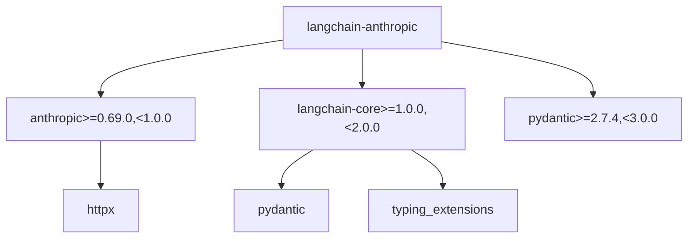

# Anthropic LLM

<cite>
**本文档中引用的文件**   
- [chat_models.py](file://libs/partners/anthropic/langchain_anthropic/chat_models.py)
- [llms.py](file://libs/partners/anthropic/langchain_anthropic/llms.py)
- [pyproject.toml](file://libs/partners/anthropic/pyproject.toml)
- [README.md](file://libs/partners/anthropic/README.md)
- [test_chat_models.py](file://libs/partners/anthropic/tests/unit_tests/test_chat_models.py)
</cite>

## 目录
1. [简介](#简介)
2. [项目结构](#项目结构)
3. [核心组件](#核心组件)
4. [架构概述](#架构概述)
5. [详细组件分析](#详细组件分析)
6. [依赖分析](#依赖分析)
7. [性能考虑](#性能考虑)
8. [故障排除指南](#故障排除指南)
9. [结论](#结论)

## 简介
Anthropic LLM集成文档详细阐述了如何在LangChain框架中集成和使用Anthropic的Claude系列模型。该文档涵盖了从认证流程到高级功能如工具调用、流式响应处理和性能优化的各个方面。通过本指南，开发者可以全面了解如何配置和使用Claude模型（如claude-2, claude-instant-1等），并掌握所有特定参数的最佳实践。

## 项目结构
Anthropic LLM集成位于`libs/partners/anthropic`目录下，遵循LangChain的模块化设计原则。该集成包含核心的聊天模型和LLM实现，以及相关的测试和配置文件。

**图源**
- [chat_models.py](file://libs/partners/anthropic/langchain_anthropic/chat_models.py)
- [llms.py](file://libs/partners/anthropic/langchain_anthropic/llms.py)

**本节源**
- [chat_models.py](file://libs/partners/anthropic/langchain_anthropic/chat_models.py)
- [llms.py](file://libs/partners/anthropic/langchain_anthropic/llms.py)

## 核心组件
Anthropic LLM集成的核心组件包括`ChatAnthropic`类和`AnthropicLLM`类，它们分别提供了聊天模型和基础语言模型的功能。`ChatAnthropic`是主要的接口，支持最新的Anthropic Messages API，而`AnthropicLLM`则作为遗留接口存在，已被标记为弃用。

**本节源**
- [chat_models.py](file://libs/partners/anthropic/langchain_anthropic/chat_models.py#L1-L2704)
- [llms.py](file://libs/partners/anthropic/langchain_anthropic/llms.py#L1-L429)

## 架构概述
Anthropic LLM集成的架构基于LangChain的核心抽象，实现了`BaseChatModel`接口。该架构通过分层设计将API调用、消息格式化和响应处理分离，确保了代码的可维护性和扩展性。

**图源**
- [chat_models.py](file://libs/partners/anthropic/langchain_anthropic/chat_models.py#L1-L2704)

## 详细组件分析

### ChatAnthropic类分析
`ChatAnthropic`类是Anthropic LLM集成的主要入口点，提供了完整的聊天模型功能。该类实现了所有必要的方法来处理同步和异步调用、流式响应以及工具集成。

#### 类图

**图源**
- [chat_models.py](file://libs/partners/anthropic/langchain_anthropic/chat_models.py#L1-L2704)

#### 参数详解
`ChatAnthropic`类支持多种参数来配置模型行为：

- **model**: 指定要使用的Claude模型名称，如`claude-3-5-sonnet-latest`
- **max_tokens**: 生成的最大令牌数
- **temperature**: 控制输出随机性的温度参数
- **max_retries**: API请求失败时的最大重试次数
- **anthropic_api_url**: API请求的基础URL
- **anthropic_api_key**: Anthropic API密钥
- **anthropic_proxy**: 用于API调用的代理
- **model_kwargs**: 传递给底层Anthropic客户端的额外参数
- **streaming**: 是否启用流式响应
- **stream_usage**: 是否在流式输出中包含使用情况元数据
- **thinking**: 启用扩展思考功能的参数
- **mcp_servers**: MCP服务器配置
- **context_management**: 上下文管理配置

**本节源**
- [chat_models.py](file://libs/partners/anthropic/langchain_anthropic/chat_models.py#L1-L2704)

### 认证流程分析
Anthropic LLM集成提供了灵活的认证机制，支持环境变量和直接参数传递两种方式。API密钥的安全存储是通过`SecretStr`类型实现的，确保密钥不会被意外暴露。

#### 认证流程图

**图源**
- [chat_models.py](file://libs/partners/anthropic/langchain_anthropic/chat_models.py#L1-L2704)
- [llms.py](file://libs/partners/anthropic/langchain_anthropic/llms.py#L1-L429)

**本节源**
- [chat_models.py](file://libs/partners/anthropic/langchain_anthropic/chat_models.py#L1-L2704)
- [llms.py](file://libs/partners/anthropic/langchain_anthropic/llms.py#L1-L429)

### 工具调用分析
Anthropic LLM集成支持丰富的工具调用功能，包括内置工具和自定义工具。`bind_tools`方法允许将工具绑定到模型实例，实现复杂的交互式应用。

#### 工具调用序列图

**图源**
- [chat_models.py](file://libs/partners/anthropic/langchain_anthropic/chat_models.py#L1-L2704)

**本节源**
- [chat_models.py](file://libs/partners/anthropic/langchain_anthropic/chat_models.py#L1-L2704)

## 依赖分析
Anthropic LLM集成依赖于多个核心库，这些依赖关系确保了功能的完整性和稳定性。

**图源**
- [pyproject.toml](file://libs/partners/anthropic/pyproject.toml#L1-L127)

**本节源**
- [pyproject.toml](file://libs/partners/anthropic/pyproject.toml#L1-L127)

## 性能考虑
在使用Anthropic LLM集成时，需要考虑多个性能因素，包括API调用延迟、令牌使用效率和流式处理的内存消耗。通过合理配置`max_retries`、`timeout`和`streaming`参数，可以优化应用的性能表现。

## 故障排除指南
当遇到问题时，可以参考以下常见问题的解决方案：

- **认证失败**: 检查API密钥是否正确设置，确认环境变量`ANTHROPIC_API_KEY`是否存在
- **API调用超时**: 增加`default_request_timeout`参数的值
- **流式处理中断**: 确保网络连接稳定，检查代理设置
- **工具调用失败**: 验证工具定义是否符合Anthropic的格式要求

**本节源**
- [test_chat_models.py](file://libs/partners/anthropic/tests/unit_tests/test_chat_models.py#L1-L1592)

## 结论
Anthropic LLM集成提供了强大而灵活的接口，使开发者能够轻松地将Claude系列模型集成到LangChain应用中。通过本文档的指导，开发者可以充分利用各种高级功能，如工具调用、流式响应和上下文管理，构建出高效、可靠的AI应用。