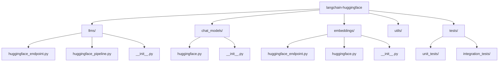
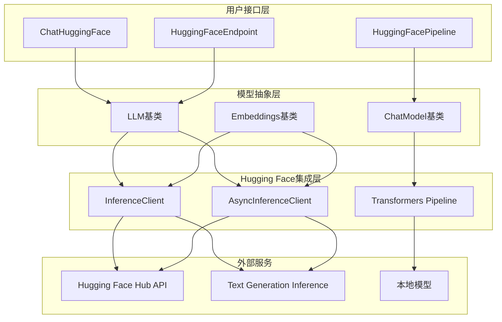
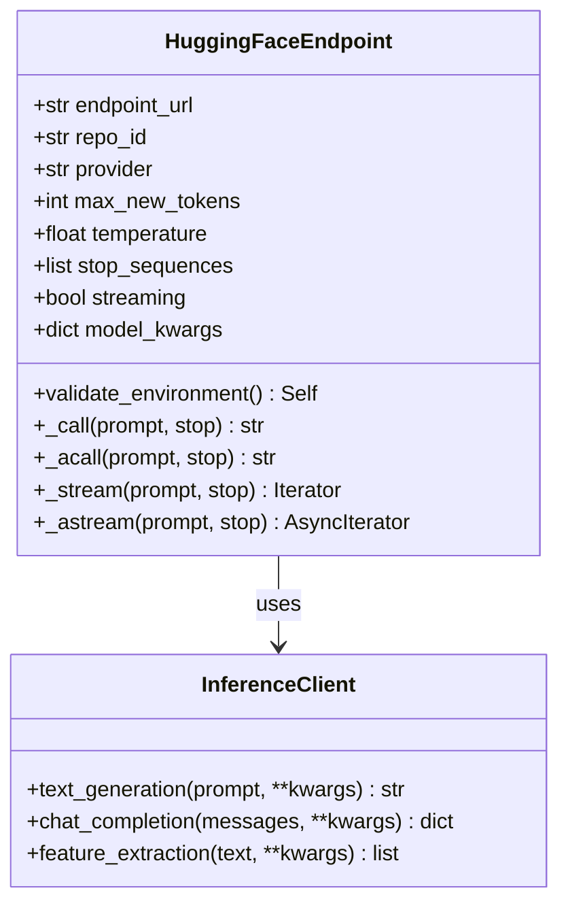
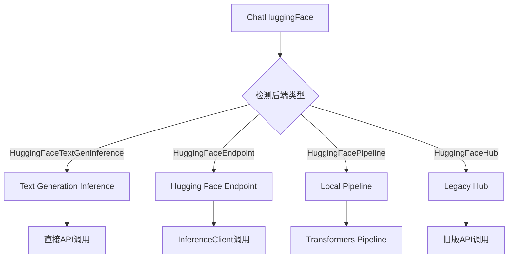
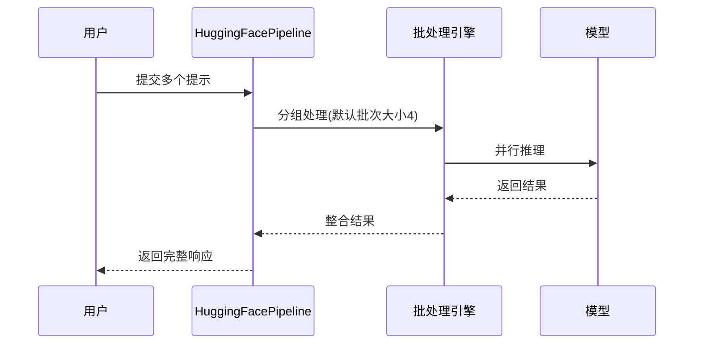
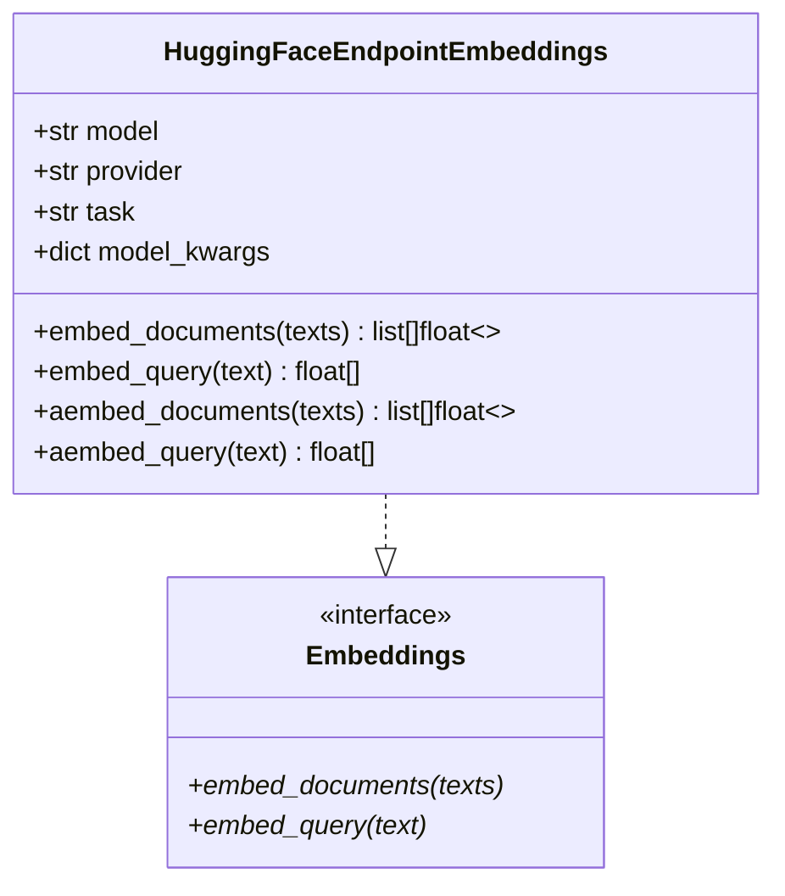
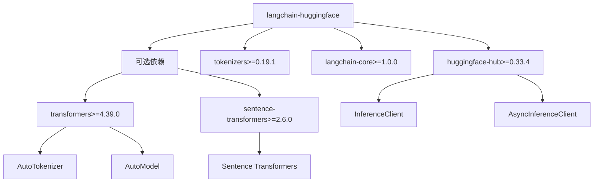
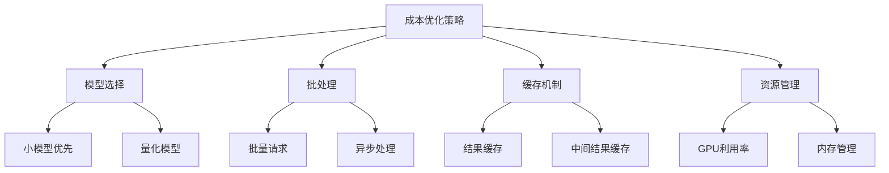

# Hugging Face Hub LLM 集成详细文档

<cite>
**本文档中引用的文件**
- [README.md](file://libs/partners/huggingface/README.md)
- [huggingface_endpoint.py](file://libs/partners/huggingface/langchain_huggingface/llms/huggingface_endpoint.py)
- [huggingface.py](file://libs/partners/huggingface/langchain_huggingface/chat_models/huggingface.py)
- [huggingface_pipeline.py](file://libs/partners/huggingface/langchain_huggingface/llms/huggingface_pipeline.py)
- [huggingface_endpoint.py](file://libs/partners/huggingface/langchain_huggingface/embeddings/huggingface_endpoint.py)
- [pyproject.toml](file://libs/partners/huggingface/pyproject.toml)
- [test_chat_models.py](file://libs/partners/huggingface/tests/unit_tests/test_chat_models.py)
- [test_llms.py](file://libs/partners/huggingface/tests/integration_tests/test_llms.py)
</cite>

## 目录
1. [简介](#简介)
2. [项目结构](#项目结构)
3. [核心组件](#核心组件)
4. [架构概览](#架构概览)
5. [详细组件分析](#详细组件分析)
6. [依赖关系分析](#依赖关系分析)
7. [性能考虑](#性能考虑)
8. [故障排除指南](#故障排除指南)
9. [结论](#结论)

## 简介

Hugging Face Hub LLM集成是LangChain生态系统中的重要组成部分，提供了与Hugging Face平台的无缝连接。该集成支持多种推理方式，包括远程API调用、本地模型管道和文本生成推理服务器，为开发者提供了灵活的语言模型访问方案。

该集成涵盖了三个主要组件：
- **HuggingFaceEndpoint**: 远程推理端点访问
- **HuggingFacePipeline**: 本地模型管道集成  
- **ChatHuggingFace**: 聊天模型封装器
- **HuggingFaceEndpointEmbeddings**: 嵌入模型支持

## 项目结构



**图表来源**
- [huggingface_endpoint.py](file://libs/partners/huggingface/langchain_huggingface/llms/huggingface_endpoint.py#L1-L50)
- [huggingface.py](file://libs/partners/huggingface/langchain_huggingface/chat_models/huggingface.py#L1-L50)
- [huggingface_pipeline.py](file://libs/partners/huggingface/langchain_huggingface/llms/huggingface_pipeline.py#L1-L50)

**章节来源**
- [README.md](file://libs/partners/huggingface/README.md#L1-L23)
- [pyproject.toml](file://libs/partners/huggingface/pyproject.toml#L1-L30)

## 核心组件

### 模型标识符命名规范

Hugging Face模型标识符遵循特定的命名约定，格式为`{organization}/{model_name}`：

| 组件 | 示例 | 说明 |
|------|------|------|
| 组织 | `microsoft/Phi-3-mini-4k-instruct` | 模型所有者或组织名称 |
| 模型名称 | `Phi-3-mini-4k-instruct` | 具体模型的标识符 |
| 完整标识符 | `microsoft/Phi-3-mini-4k-instruct` | 组织/模型名组合 |

### 任务类型选择依据

系统支持多种任务类型，每种对应不同的模型用途：

| 任务类型 | 描述 | 使用场景 |
|----------|------|----------|
| `text-generation` | 文本生成任务 | 对话、创作、补全 |
| `text2text-generation` | 文本到文本转换 | 翻译、摘要、问答 |
| `summarization` | 文本摘要 | 长文档压缩 |
| `conversational` | 对话处理 | 多轮对话系统 |
| `feature-extraction` | 特征提取 | 文本嵌入、相似度计算 |

**章节来源**
- [huggingface_endpoint.py](file://libs/partners/huggingface/langchain_huggingface/llms/huggingface_endpoint.py#L20-L25)
- [huggingface_pipeline.py](file://libs/partners/huggingface/langchain_huggingface/llms/huggingface_pipeline.py#L18-L25)

## 架构概览



**图表来源**
- [huggingface.py](file://libs/partners/huggingface/langchain_huggingface/chat_models/huggingface.py#L287-L333)
- [huggingface_endpoint.py](file://libs/partners/huggingface/langchain_huggingface/llms/huggingface_endpoint.py#L218-L255)

## 详细组件分析

### HuggingFaceEndpoint - 远程推理端点

HuggingFaceEndpoint是最常用的集成方式，通过Hugging Face的Inference API访问模型。

#### 核心特性



**图表来源**
- [huggingface_endpoint.py](file://libs/partners/huggingface/langchain_huggingface/llms/huggingface_endpoint.py#L25-L100)
- [huggingface_endpoint.py](file://libs/partners/huggingface/langchain_huggingface/llms/huggingface_endpoint.py#L218-L255)

#### API令牌管理

系统支持多种API令牌配置方式：

| 配置方式 | 优先级 | 示例 |
|----------|--------|------|
| 参数传递 | 最高 | `huggingfacehub_api_token="your-token"` |
| 环境变量 | 中等 | `export HF_TOKEN="your-token"` |
| 默认值 | 最低 | 从环境变量`HUGGINGFACEHUB_API_TOKEN`读取 |

#### 自定义推理参数

| 参数 | 类型 | 默认值 | 说明 |
|------|------|--------|------|
| `max_new_tokens` | int | 512 | 最大生成token数 |
| `temperature` | float | 0.8 | 控制随机性的温度参数 |
| `top_k` | int | None | Top-K采样参数 |
| `top_p` | float | 0.95 | Top-P采样参数 |
| `repetition_penalty` | float | None | 重复惩罚系数 |
| `do_sample` | bool | False | 是否启用采样 |
| `seed` | int | None | 随机种子 |

**章节来源**
- [huggingface_endpoint.py](file://libs/partners/huggingface/langchain_huggingface/llms/huggingface_endpoint.py#L100-L200)

### ChatHuggingFace - 聊天模型封装器

ChatHuggingFace提供了统一的聊天模型接口，支持多种底层实现。

#### 支持的后端类型



**图表来源**
- [huggingface.py](file://libs/partners/huggingface/langchain_huggingface/chat_models/huggingface.py#L287-L333)

#### 工具调用支持

ChatHuggingFace原生支持OpenAI风格的工具调用：

```python
# 工具定义示例
class GetWeather(BaseModel):
    location: str = Field(..., description="城市和州，例如：旧金山，加利福尼亚")

# 绑定工具
chat_with_tools = chat.bind_tools([GetWeather])
ai_msg = chat_with_tools.invoke("今天洛杉矶热还是纽约热？")
```

**章节来源**
- [huggingface.py](file://libs/partners/huggingface/langchain_huggingface/chat_models/huggingface.py#L400-L500)

### HuggingFacePipeline - 本地模型管道

HuggingFacePipeline允许直接在本地运行Hugging Face模型，提供更好的控制和隐私保护。

#### 支持的后端优化

| 后端 | 适用任务 | 性能优势 |
|------|----------|----------|
| `default` | 通用 | 标准PyTorch性能 |
| `openvino` | 推理优化 | Intel硬件加速 |
| `ipex` | Intel优化 | Intel Extension优化 |

#### 批量推理支持



**图表来源**
- [huggingface_pipeline.py](file://libs/partners/huggingface/langchain_huggingface/llms/huggingface_pipeline.py#L300-L400)

**章节来源**
- [huggingface_pipeline.py](file://libs/partners/huggingface/langchain_huggingface/llms/huggingface_pipeline.py#L200-L300)

### HuggingFaceEndpointEmbeddings - 嵌入模型

专门用于文本嵌入生成的组件，支持特征提取任务。

#### 核心功能



**图表来源**
- [huggingface_endpoint.py](file://libs/partners/huggingface/langchain_huggingface/embeddings/huggingface_endpoint.py#L15-L50)

**章节来源**
- [huggingface_endpoint.py](file://libs/partners/huggingface/langchain_huggingface/embeddings/huggingface_endpoint.py#L50-L100)

## 依赖关系分析

### 核心依赖



**图表来源**
- [pyproject.toml](file://libs/partners/huggingface/pyproject.toml#L8-L20)

### 版本兼容性

| 组件 | 最低版本 | 推荐版本 | 说明 |
|------|----------|----------|------|
| huggingface-hub | 0.33.4 | 最新稳定版 | 核心API客户端 |
| tokenizers | 0.19.1 | 最新稳定版 | 分词器支持 |
| transformers | 4.39.0 | 4.x系列 | 可选本地模型支持 |
| sentence-transformers | 2.6.0 | 2.x系列 | 可选嵌入模型 |

**章节来源**
- [pyproject.toml](file://libs/partners/huggingface/pyproject.toml#L8-L30)

## 性能考虑

### 延迟对比分析

| 方式 | 延迟特点 | 适用场景 |
|------|----------|----------|
| HuggingFaceEndpoint | 网络延迟+推理时间 | 快速原型、云端部署 |
| HuggingFacePipeline | 本地延迟+内存占用 | 高频调用、隐私敏感 |
| ChatHuggingFace | 包装器开销 | 统一接口需求 |

### 成本优化策略



### 隐私保护考量

| 层面 | HuggingFaceEndpoint | HuggingFacePipeline |
|------|-------------------|-------------------|
| 数据传输 | 本地→云端 | 本地→本地 |
| 模型存储 | 不存储 | 本地存储 |
| 计算处理 | 云端执行 | 本地执行 |
| 合规性 | 第三方托管 | 自主控制 |

## 故障排除指南

### 常见问题及解决方案

#### API令牌问题

```python
# 问题：认证失败
# 解决方案1：检查令牌有效性
from huggingface_hub import login
login()  # 交互式登录

# 解决方案2：设置环境变量
import os
os.environ["HF_TOKEN"] = "your-token"

# 解决方案3：直接传递参数
model = HuggingFaceEndpoint(
    repo_id="model-name",
    huggingfacehub_api_token="your-token"
)
```

#### 模型加载问题

```python
# 问题：模型下载失败
# 解决方案：检查网络连接和权限
try:
    from transformers import AutoTokenizer, AutoModelForCausalLM
    tokenizer = AutoTokenizer.from_pretrained("model-name")
    model = AutoModelForCausalLM.from_pretrained("model-name")
except Exception as e:
    print(f"模型加载失败: {e}")
```

#### 性能优化建议

```python
# 批量处理优化
from langchain_core.runnables import RunnableParallel

# 使用并行处理提高吞吐量
parallel_chain = RunnableParallel({
    "response1": model.with_config({"max_concurrency": 4}),
    "response2": model.with_config({"max_concurrency": 4}),
})
```

**章节来源**
- [test_chat_models.py](file://libs/partners/huggingface/tests/unit_tests/test_chat_models.py#L1-L50)
- [test_llms.py](file://libs/partners/huggingface/tests/integration_tests/test_llms.py#L1-L21)

## 结论

Hugging Face Hub LLM集成提供了完整的语言模型访问解决方案，通过三种不同的实现方式满足了不同场景的需求：

1. **HuggingFaceEndpoint** 提供了最简单的云端模型访问方式，适合快速原型和生产部署
2. **HuggingFacePipeline** 在本地运行模型，提供了更好的性能和隐私保护
3. **ChatHuggingFace** 作为统一接口，简化了多后端的使用复杂度

该集成的优势在于：
- **灵活性**：支持多种部署方式和优化选项
- **易用性**：简洁的API设计和丰富的配置选项
- **扩展性**：良好的模块化设计便于功能扩展
- **兼容性**：与LangChain生态系统的深度集成

通过合理选择和配置这些组件，开发者可以构建高效、可靠的AI应用，同时在性能、成本和隐私之间找到最佳平衡点。