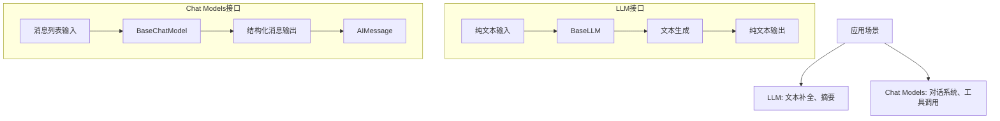
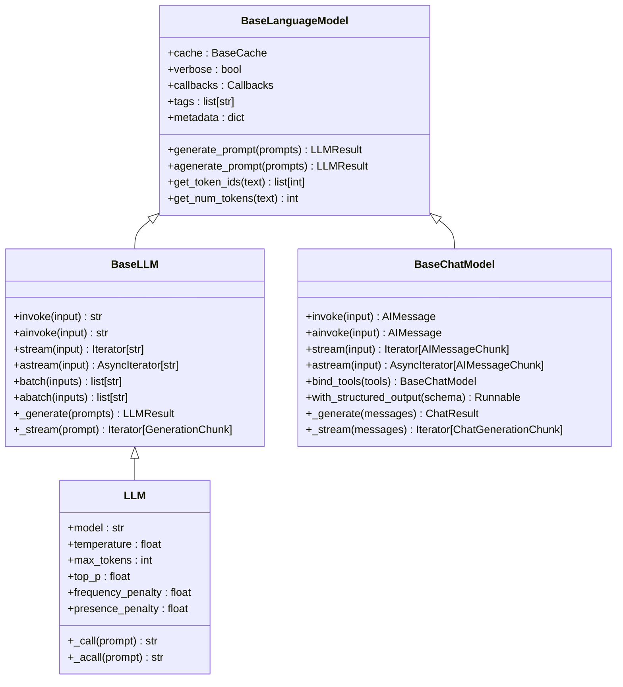
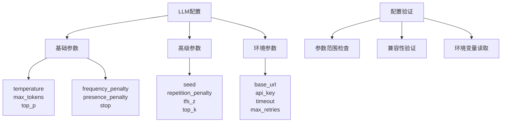
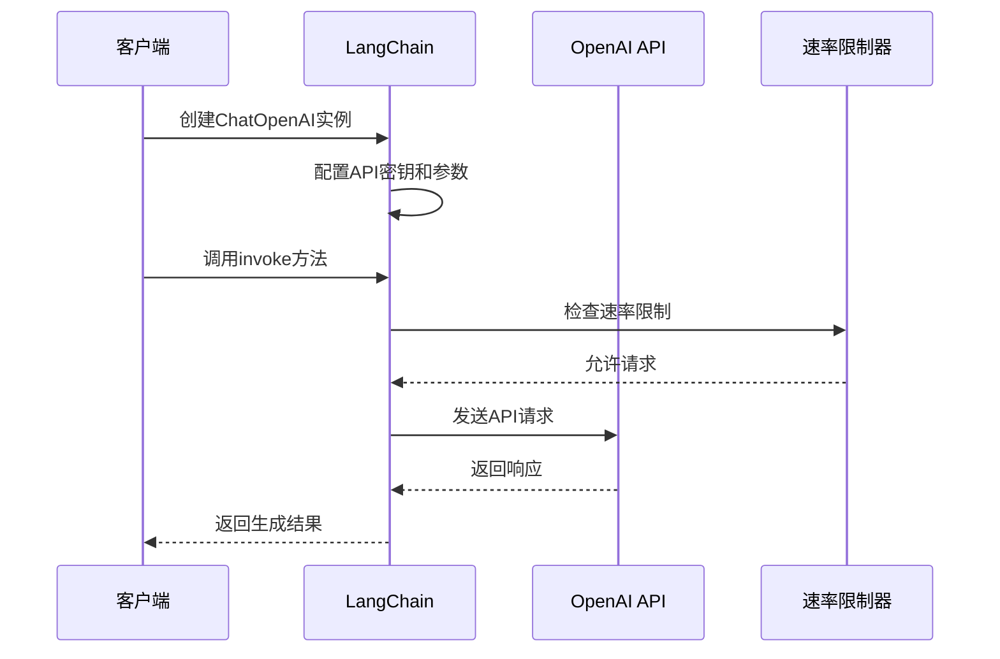
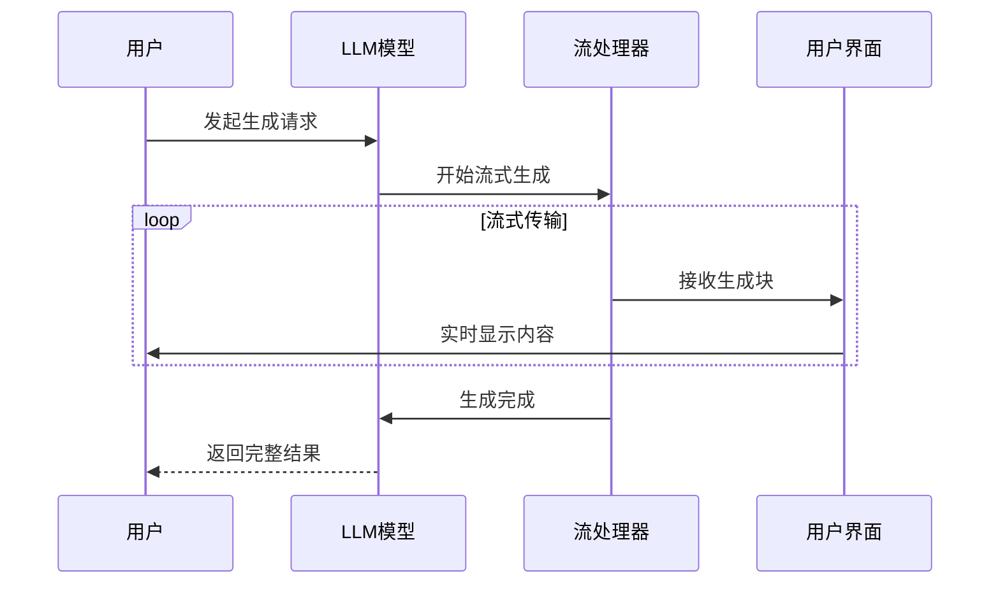
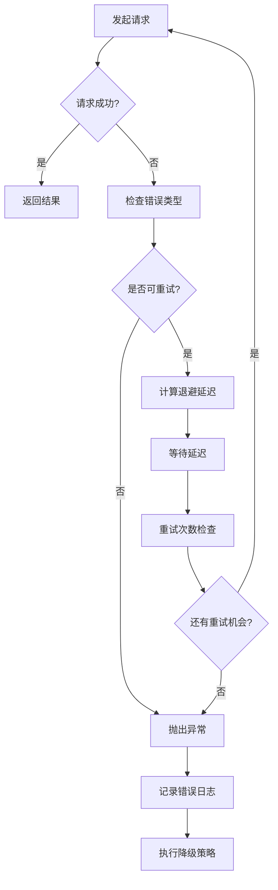
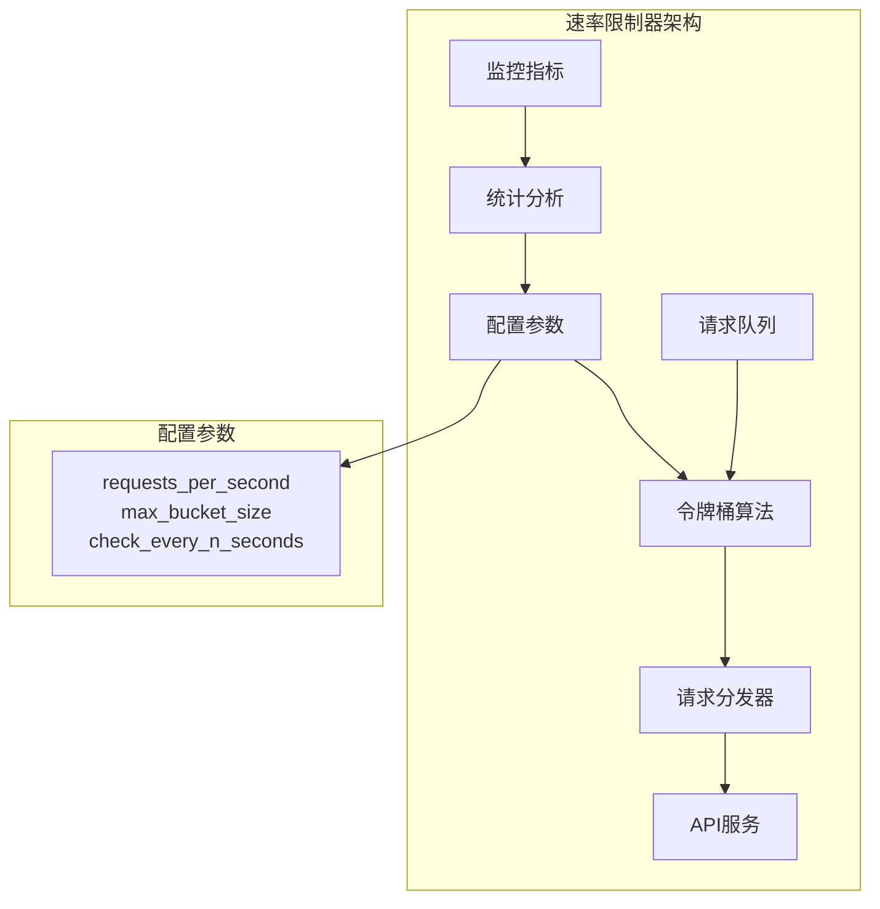

# LLMs

<cite>
**本文档中引用的文件**
- [llms.py](file://libs/core/langchain_core/language_models/llms.py)
- [base.py](file://libs/core/langchain_core/language_models/base.py)
- [chat_models.py](file://libs/core/langchain_core/language_models/chat_models.py)
- [rate_limiters.py](file://libs/core/langchain_core/rate_limiters.py)
- [fake.py](file://libs/core/langchain_core/language_models/fake.py)
- [openai.py](file://libs/langchain/langchain/llms/openai.py)
- [anthropic.py](file://libs/langchain/langchain/llms/anthropic.py)
- [ollama.py](file://libs/partners/ollama/langchain_ollama/llms.py)
- [mistralai.py](file://libs/partners/mistralai/langchain_mistralai/chat_models.py)
- [huggingface.py](file://libs/partners/huggingface/langchain_huggingface/chat_models/huggingface.py)
</cite>

## 目录
1. [简介](#简介)
2. [LLM与Chat Models的区别](#llm与chat-models的区别)
3. [核心架构](#核心架构)
4. [LLM配置与参数](#llm配置与参数)
5. [主流LLM服务集成](#主流llm服务集成)
6. [高级功能](#高级功能)
7. [性能优化与生产部署](#性能优化与生产部署)
8. [最佳实践](#最佳实践)
9. [故障排除](#故障排除)
10. [总结](#总结)

## 简介

大型语言模型（LLMs）是现代AI应用的核心引擎，负责处理文本生成、补全、翻译等各种自然语言处理任务。在LangChain框架中，LLMs被设计为可插拔的组件，支持多种提供商和服务类型，为开发者提供了灵活且强大的语言生成能力。

LangChain的LLM抽象层不仅统一了不同提供商的API接口，还提供了丰富的配置选项、错误处理机制和性能优化功能，使开发者能够轻松地在各种LLM服务之间切换，并针对特定应用场景进行优化。

## LLM与Chat Models的区别

在LangChain中，LLM和Chat Models代表两种不同的语言模型接口，它们各自适用于不同的使用场景：

### LLM（语言模型）
- **主要用途**：纯文本生成、补全、摘要等任务
- **输入格式**：字符串形式的提示文本
- **输出格式**：纯文本字符串
- **适用场景**：代码生成、文本补全、简单问答等

### Chat Models（聊天模型）
- **主要用途**：对话系统、多轮交互、工具调用等复杂场景
- **输入格式**：消息列表（包含角色信息）
- **输出格式**：结构化消息对象
- **适用场景**：聊天机器人、智能助手、多轮对话等



**图表来源**
- [llms.py](file://libs/core/langchain_core/language_models/llms.py#L200-L300)
- [chat_models.py](file://libs/core/langchain_core/language_models/chat_models.py#L200-L400)

**章节来源**
- [llms.py](file://libs/core/langchain_core/language_models/llms.py#L200-L400)
- [chat_models.py](file://libs/core/langchain_core/language_models/chat_models.py#L200-L500)

## 核心架构

LangChain的LLM架构采用分层设计，确保了灵活性和可扩展性：



**图表来源**
- [base.py](file://libs/core/langchain_core/language_models/base.py#L100-L200)
- [llms.py](file://libs/core/langchain_core/language_models/llms.py#L200-L400)
- [chat_models.py](file://libs/core/langchain_core/language_models/chat_models.py#L200-L500)

### 核心组件说明

1. **BaseLanguageModel**：所有语言模型的基础抽象类，定义了通用的语言模型接口
2. **BaseLLM**：专门用于纯文本生成的LLM基类，提供批量处理和流式输出功能
3. **BaseChatModel**：专为对话场景设计的聊天模型基类，支持工具调用和结构化输出
4. **LLM**：具体LLM实现的基类，包含常见的模型参数配置

**章节来源**
- [base.py](file://libs/core/langchain_core/language_models/base.py#L100-L320)
- [llms.py](file://libs/core/langchain_core/language_models/llms.py#L200-L600)
- [chat_models.py](file://libs/core/langchain_core/language_models/chat_models.py#L200-L600)

## LLM配置与参数

LangChain提供了丰富的配置选项来优化LLM的性能和行为：

### 基础参数配置

| 参数名称 | 类型 | 默认值 | 描述 | 适用场景 |
|---------|------|--------|------|----------|
| `temperature` | float | 1.0 | 控制随机性，范围0.0-2.0 | 需要创造性输出时使用较低值 |
| `max_tokens` | int | 16 | 最大生成token数 | 控制输出长度 |
| `top_p` | float | 1.0 | 核采样参数，范围0.0-1.0 | 替代temperature的另一种采样方式 |
| `frequency_penalty` | float | 0.0 | 频率惩罚，范围-2.0到2.0 | 减少重复内容 |
| `presence_penalty` | float | 0.0 | 存在惩罚，范围-2.0到2.0 | 鼓励话题多样性 |
| `stop` | list[str] | [] | 停止词列表 | 控制生成结束时机 |

### 高级参数配置



**图表来源**
- [ollama.py](file://libs/partners/ollama/langchain_ollama/llms.py#L170-L210)
- [llms.py](file://libs/core/langchain_core/language_models/llms.py#L330-L360)

### 模型参数优化策略

1. **温度调节**：
   - 低温度（0.1-0.3）：适合需要准确性和一致性的任务
   - 中等温度（0.7-0.9）：适合平衡创造性和准确性
   - 高温度（1.0-2.0）：适合创意写作和头脑风暴

2. **令牌数量控制**：
   - 短文本任务：设置较小的max_tokens
   - 长文本生成：根据上下文长度动态调整
   - 摘要任务：通常设置为输入长度的10-20%

3. **停止词策略**：
   - 使用语义相关的停止词提高生成质量
   - 避免使用过于宽泛的停止词导致意外中断

**章节来源**
- [llms.py](file://libs/core/langchain_core/language_models/llms.py#L330-L370)
- [ollama.py](file://libs/partners/ollama/langchain_ollama/llms.py#L170-L210)

## 主流LLM服务集成

LangChain支持多种主流LLM服务提供商，每种都有其独特的特性和优化策略：

### OpenAI集成

OpenAI是最广泛使用的LLM服务之一，支持多种模型变体：



**图表来源**
- [openai.py](file://libs/langchain/langchain/llms/openai.py#L1-L100)

### Anthropic Claude集成

Anthropic的Claude模型以其安全性和可靠性著称：

- **优势**：长上下文支持、安全性高、推理能力强
- **适用场景**：法律咨询、医疗问答、复杂推理任务
- **特殊功能**：内置安全过滤、可配置的安全级别

### Ollama本地部署

Ollama允许用户在本地运行大型语言模型：

- **优势**：数据隐私保护、离线使用、成本控制
- **适用场景**：企业内部应用、敏感数据处理
- **配置要点**：模型选择、内存分配、GPU加速

### Hugging Face Hub集成

Hugging Face提供了丰富的开源模型资源：

- **优势**：模型种类丰富、社区活跃、更新及时
- **适用场景**：研究项目、定制化需求、开源友好
- **注意事项**：模型质量参差不齐、需要额外验证

**章节来源**
- [openai.py](file://libs/langchain/langchain/llms/openai.py#L1-L200)
- [anthropic.py](file://libs/langchain/langchain/llms/anthropic.py#L1-L200)
- [ollama.py](file://libs/partners/ollama/langchain_ollama/llms.py#L170-L210)
- [huggingface.py](file://libs/partners/huggingface/langchain_huggingface/chat_models/huggingface.py#L380-L420)

## 高级功能

### 流式输出

流式输出允许实时接收生成的内容，提升用户体验：



**图表来源**
- [llms.py](file://libs/core/langchain_core/language_models/llms.py#L500-L600)
- [chat_models.py](file://libs/core/langchain_core/language_models/chat_models.py#L500-L600)

### 异步调用

异步操作提高并发处理能力：

- **优势**：提高系统吞吐量、减少等待时间
- **适用场景**：高并发应用、长时间运行的任务
- **实现方式**：使用`ainvoke`、`astream`等异步方法

### 错误处理与重试机制

LangChain提供了完善的错误处理和重试机制：



**图表来源**
- [llms.py](file://libs/core/langchain_core/language_models/llms.py#L50-L150)

### 缓存机制

智能缓存提高响应速度和降低成本：

- **缓存策略**：基于提示和参数的组合
- **缓存类型**：内存缓存、持久化缓存
- **缓存失效**：自动清理、手动清理

**章节来源**
- [llms.py](file://libs/core/langchain_core/language_models/llms.py#L50-L200)
- [llms.py](file://libs/core/langchain_core/language_models/llms.py#L500-L700)

## 性能优化与生产部署

### 成本控制

有效的成本控制策略对于生产环境至关重要：

| 优化策略 | 描述 | 效果 | 实现难度 |
|---------|------|------|----------|
| 提示优化 | 减少不必要的token消耗 | 显著降低费用 | 中等 |
| 批量处理 | 合并多个请求 | 提高效率 | 简单 |
| 缓存策略 | 避免重复计算 | 显著节省成本 | 中等 |
| 模型选择 | 根据任务选择合适模型 | 平衡质量和成本 | 困难 |

### 速率限制

合理的速率限制确保API稳定性和公平使用：



**图表来源**
- [rate_limiters.py](file://libs/core/langchain_core/rate_limiters.py#L100-L200)

### 模型版本管理

生产环境中需要严格的模型版本控制：

- **版本策略**：语义版本控制、特性分支管理
- **测试流程**：自动化测试、A/B测试
- **回滚机制**：快速回滚、灰度发布
- **监控告警**：性能监控、错误追踪

**章节来源**
- [rate_limiters.py](file://libs/core/langchain_core/rate_limiters.py#L100-L249)

## 最佳实践

### 开发阶段

1. **使用Fake LLM进行测试**
   - 利用`FakeListLLM`模拟不同响应
   - 验证业务逻辑正确性
   - 快速迭代开发

2. **参数调优**
   - 基于具体任务调整参数
   - 进行A/B测试比较效果
   - 记录最佳实践配置

3. **错误处理**
   - 实现完整的异常捕获
   - 提供有意义的错误信息
   - 设计优雅的降级策略

### 生产阶段

1. **监控和日志**
   - 实时监控模型性能
   - 记录详细的使用日志
   - 设置关键指标告警

2. **安全考虑**
   - 输入验证和过滤
   - 输出审核机制
   - 数据隐私保护

3. **性能优化**
   - 合理使用缓存
   - 优化请求批处理
   - 监控资源使用情况

**章节来源**
- [fake.py](file://libs/core/langchain_core/language_models/fake.py#L1-L137)

## 故障排除

### 常见问题及解决方案

| 问题类型 | 症状 | 可能原因 | 解决方案 |
|---------|------|----------|----------|
| 请求超时 | 连接超时或响应超时 | 网络问题、服务器负载过高 | 增加超时时间、使用重试机制 |
| 速率限制 | 429错误 | 请求频率过高 | 实现速率限制器、分散请求 |
| 内存不足 | OOM错误 | 上下文过长、批处理过大 | 减少上下文长度、分批处理 |
| 结果质量差 | 输出不符合预期 | 参数设置不当、提示设计问题 | 调整参数、优化提示模板 |

### 调试技巧

1. **启用详细日志**
   ```python
   # 设置详细日志级别
   import logging
   logging.basicConfig(level=logging.DEBUG)
   ```

2. **使用回调函数**
   - 监控请求过程
   - 收集性能指标
   - 记录中间结果

3. **分步调试**
   - 单独测试每个组件
   - 验证数据流完整性
   - 检查参数传递正确性

**章节来源**
- [llms.py](file://libs/core/langchain_core/language_models/llms.py#L50-L150)

## 总结

LangChain的LLM系统提供了强大而灵活的语言生成能力，通过统一的接口支持多种LLM服务，同时提供了丰富的配置选项和高级功能。合理使用这些功能，结合最佳实践和生产部署经验，可以帮助开发者构建高质量的AI应用。

关键要点：
- 选择合适的LLM类型（LLM vs Chat Models）
- 根据任务特点优化模型参数
- 实施有效的成本控制和性能优化策略
- 建立完善的监控和故障处理机制
- 遵循安全和隐私保护的最佳实践

通过深入理解和正确使用LangChain的LLM功能，开发者可以充分发挥大型语言模型的潜力，构建出既高效又可靠的AI应用程序。