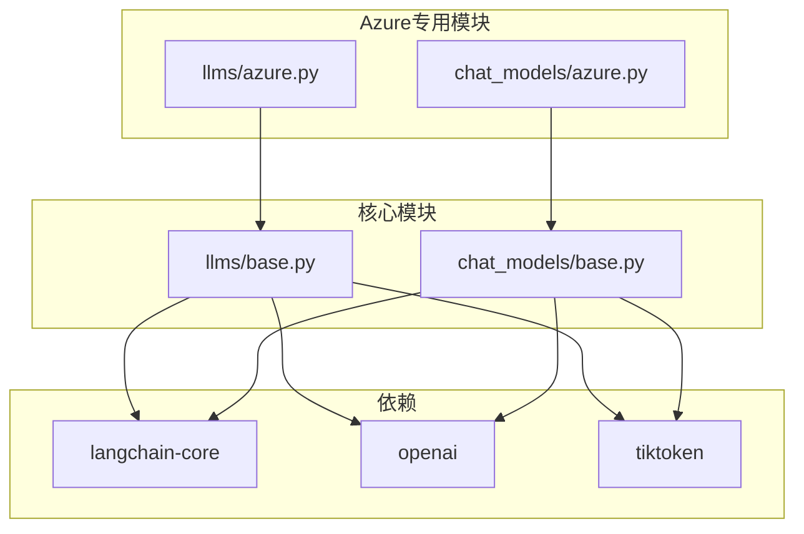
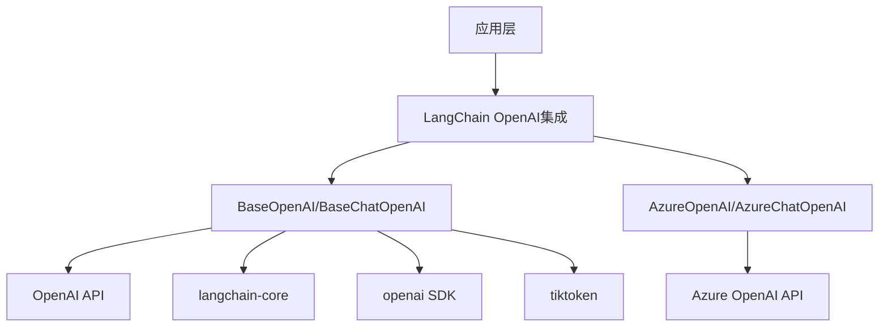
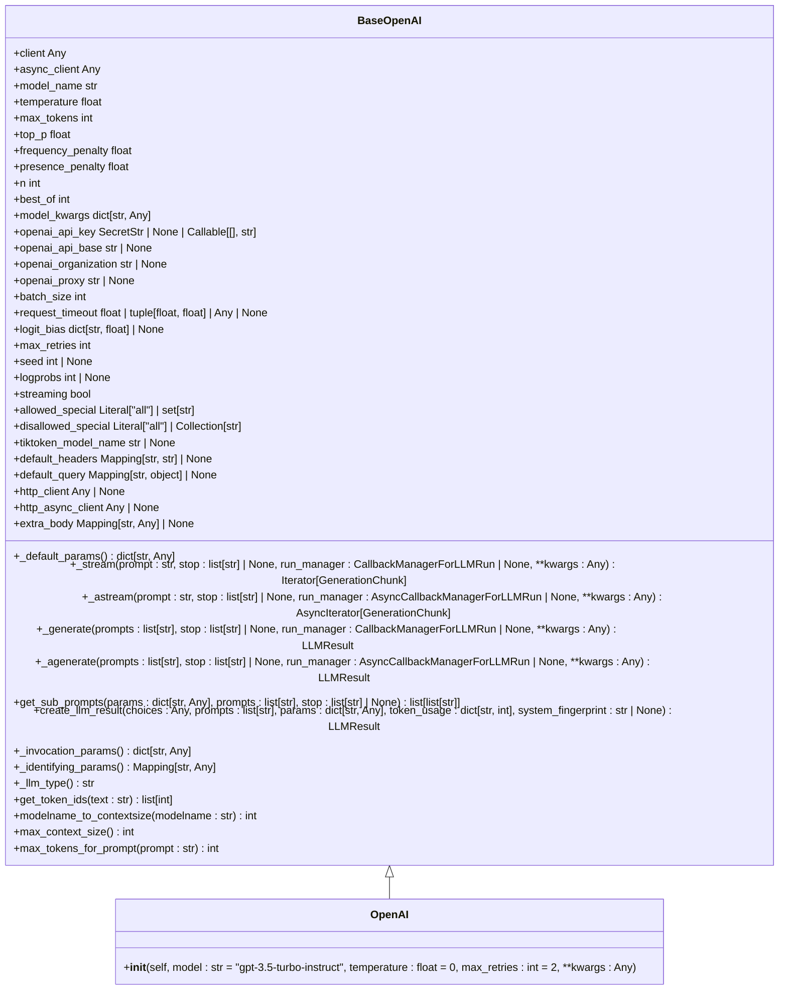
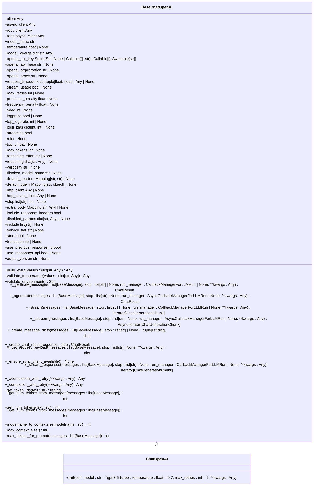
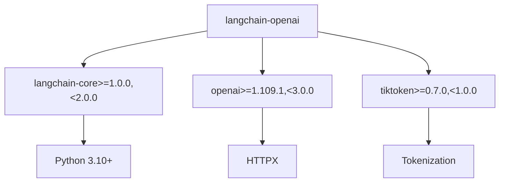

# OpenAI LLM

<cite>
**本文档中引用的文件**  
- [base.py](file://libs/partners/openai/langchain_openai/llms/base.py)
- [base.py](file://libs/partners/openai/langchain_openai/chat_models/base.py)
- [pyproject.toml](file://libs/partners/openai/pyproject.toml)
- [azure.py](file://libs/partners/openai/langchain_openai/llms/azure.py)
- [azure.py](file://libs/partners/openai/langchain_openai/chat_models/azure.py)
</cite>

## 目录
1. [简介](#简介)
2. [项目结构](#项目结构)
3. [核心组件](#核心组件)
4. [架构概述](#架构概述)
5. [详细组件分析](#详细组件分析)
6. [依赖分析](#依赖分析)
7. [性能考虑](#性能考虑)
8. [故障排除指南](#故障排除指南)
9. [结论](#结论)

## 简介
本文档全面介绍了如何配置和使用OpenAI的文本生成模型，包括gpt-3.5-turbo-instruct和text-davinci-003等。文档详细说明了所有可配置参数（如temperature、max_tokens、top_p、frequency_penalty等）对生成结果的影响及优化策略。提供了完整的认证配置指南，涵盖API密钥管理、组织ID设置和代理配置。展示了同步调用、流式输出和异步处理的具体代码示例。深入探讨了错误处理机制，特别是针对速率限制（429错误）和配额超限的重试策略。分析了成本计算方法和token使用监控的最佳实践。

## 项目结构
该项目是一个LangChain的OpenAI集成包，提供了与OpenAI大语言模型的接口。项目结构清晰，主要分为LLM基础类、聊天模型、Azure特定实现等模块。核心功能实现在`langchain_openai/llms/base.py`和`langchain_openai/chat_models/base.py`文件中，而Azure相关的特定实现则在`azure.py`文件中。

**Diagram sources**
- [base.py](file://libs/partners/openai/langchain_openai/llms/base.py)
- [base.py](file://libs/partners/openai/langchain_openai/chat_models/base.py)
- [azure.py](file://libs/partners/openai/langchain_openai/llms/azure.py)
- [azure.py](file://libs/partners/openai/langchain_openai/chat_models/azure.py)

**Section sources**
- [base.py](file://libs/partners/openai/langchain_openai/llms/base.py)
- [base.py](file://libs/partners/openai/langchain_openai/chat_models/base.py)

## 核心组件
核心组件包括`BaseOpenAI`和`BaseChatOpenAI`两个基类，分别用于处理传统的文本生成模型和聊天模型。这些类提供了对OpenAI API的封装，包括参数配置、请求处理、响应解析等功能。`OpenAI`和`ChatOpenAI`类继承自这些基类，提供了具体的实现。

**Section sources**
- [base.py](file://libs/partners/openai/langchain_openai/llms/base.py#L1-L100)
- [base.py](file://libs/partners/openai/langchain_openai/chat_models/base.py#L1-L100)

## 架构概述
该集成包的架构设计遵循了分层原则，将基础功能与特定实现分离。基础层提供了通用的LLM和聊天模型接口，而Azure专用层则在此基础上添加了Azure特有的配置和处理逻辑。这种设计使得代码具有良好的可扩展性和可维护性。

**Diagram sources**
- [base.py](file://libs/partners/openai/langchain_openai/llms/base.py)
- [base.py](file://libs/partners/openai/langchain_openai/chat_models/base.py)

## 详细组件分析

### BaseOpenAI 分析
`BaseOpenAI`类是所有OpenAI LLM的基类，提供了核心功能的实现。

#### 类图

**Diagram sources**
- [base.py](file://libs/partners/openai/langchain_openai/llms/base.py#L1-L833)

### BaseChatOpenAI 分析
`BaseChatOpenAI`类是所有OpenAI聊天模型的基类，提供了聊天相关的功能实现。

#### 类图

**Diagram sources**
- [base.py](file://libs/partners/openai/langchain_openai/chat_models/base.py#L1-L4456)

## 依赖分析
该集成包依赖于几个关键的外部库，这些依赖关系确保了与OpenAI API的兼容性和功能完整性。

**Diagram sources**
- [pyproject.toml](file://libs/partners/openai/pyproject.toml#L1-L153)

**Section sources**
- [pyproject.toml](file://libs/partners/openai/pyproject.toml#L1-L153)

## 性能考虑
在使用OpenAI LLM时，性能是一个重要的考虑因素。以下是一些关键的性能优化策略：

1. **批处理**：通过设置合适的`batch_size`参数，可以有效地批量处理多个请求，提高整体吞吐量。
2. **流式输出**：对于长文本生成，使用流式输出可以立即开始处理结果，而不需要等待整个响应完成。
3. **缓存**：合理利用缓存机制可以避免重复计算，特别是在处理相似请求时。
4. **连接管理**：复用HTTP连接可以显著减少建立新连接的开销。
5. **超时设置**：合理设置`request_timeout`可以防止请求无限期挂起，影响整体系统性能。

**Section sources**
- [base.py](file://libs/partners/openai/langchain_openai/llms/base.py#L1-L833)
- [base.py](file://libs/partners/openai/langchain_openai/chat_models/base.py#L1-L4456)

## 故障排除指南
在使用OpenAI LLM集成时，可能会遇到各种问题。以下是一些常见问题及其解决方案：

1. **API密钥错误**：确保`OPENAI_API_KEY`环境变量正确设置，或者在代码中正确传递API密钥。
2. **速率限制**：当遇到429错误时，实现适当的重试策略，使用指数退避算法。
3. **连接超时**：调整`request_timeout`参数，根据网络状况设置合理的超时时间。
4. **模型不可用**：检查指定的模型名称是否正确，并确认该模型对您的账户可用。
5. **token限制**：监控输入和输出的token数量，确保不超过模型的上下文窗口限制。

**Section sources**
- [base.py](file://libs/partners/openai/langchain_openai/llms/base.py#L1-L833)
- [base.py](file://libs/partners/openai/langchain_openai/chat_models/base.py#L1-L4456)

## 结论
本文档详细介绍了LangChain OpenAI集成的各个方面，从核心组件到具体实现，再到性能优化和故障排除。通过遵循本文档中的指导，开发者可以有效地配置和使用OpenAI的文本生成模型，充分利用其强大的功能。该集成包的设计考虑了可扩展性和易用性，为构建复杂的语言模型应用提供了坚实的基础。