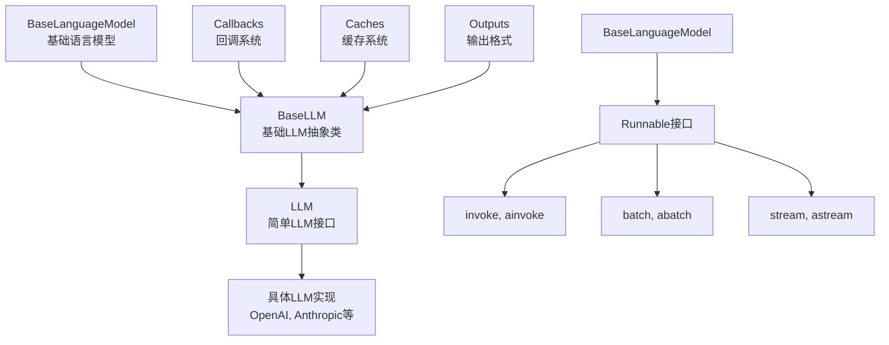
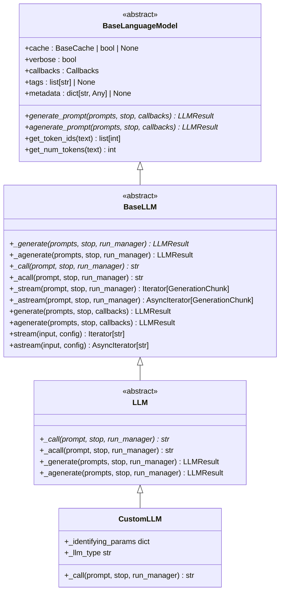
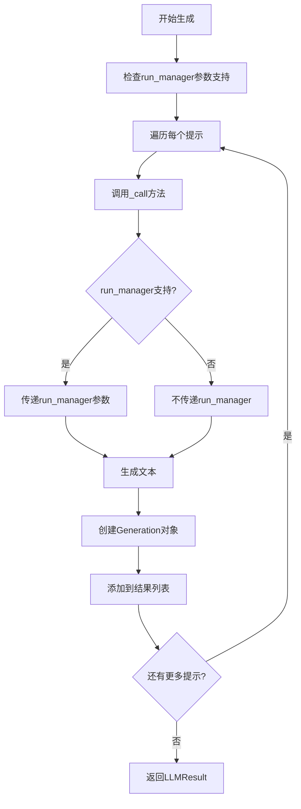
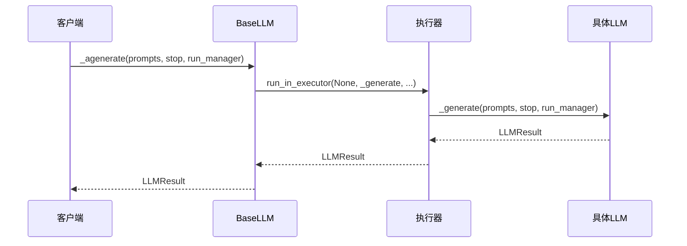
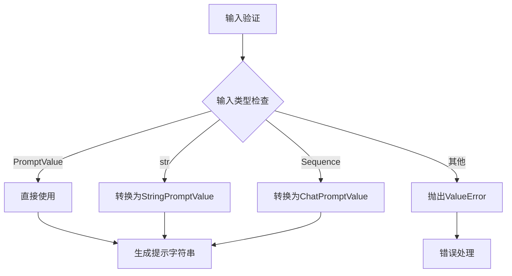
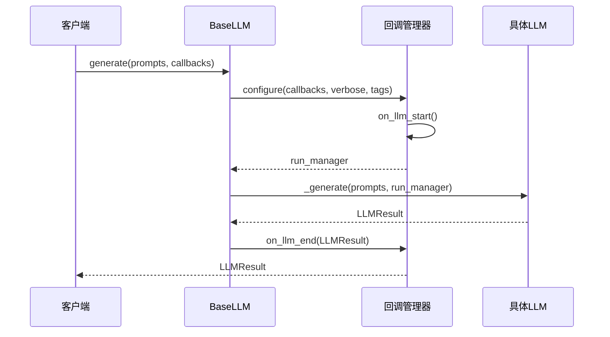
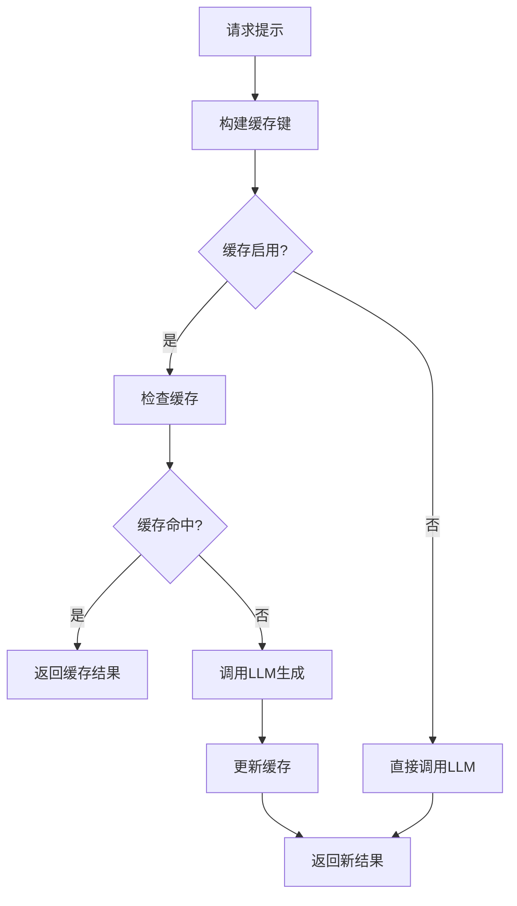
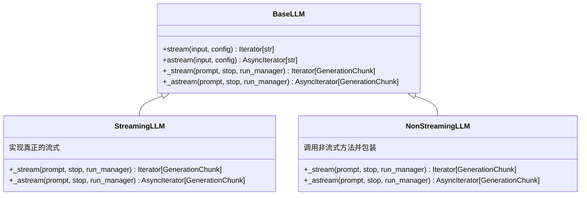
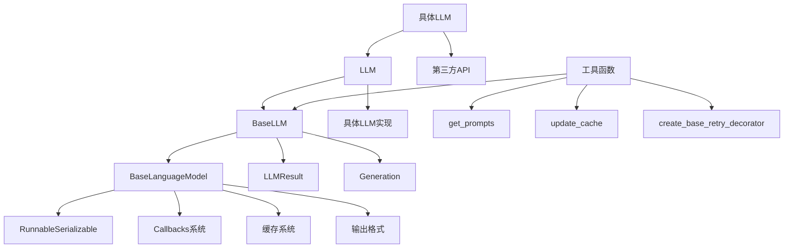

# 基础LLM类

<cite>
**本文档中引用的文件**
- [base.py](file://libs/core/langchain_core/language_models/base.py)
- [llms.py](file://libs/core/langchain_core/language_models/llms.py)
- [fake.py](file://libs/core/langchain_core/language_models/fake.py)
- [fake_chat_models.py](file://libs/core/langchain_core/language_models/fake_chat_models.py)
- [__init__.py](file://libs/langchain/langchain_classic/llms/__init__.py)
- [openai.py](file://libs/langchain/langchain_classic/llms/openai.py)
</cite>

## 目录
1. [简介](#简介)
2. [项目结构](#项目结构)
3. [核心组件](#核心组件)
4. [架构概览](#架构概览)
5. [详细组件分析](#详细组件分析)
6. [依赖关系分析](#依赖关系分析)
7. [性能考虑](#性能考虑)
8. [故障排除指南](#故障排除指南)
9. [结论](#结论)

## 简介

LangChain的基础LLM类是整个语言模型生态系统的核心抽象层，它定义了所有具体LLM实现必须遵循的标准接口。这个抽象基类不仅提供了统一的API设计，还包含了参数验证、回调处理、流式输出支持等关键功能，为上层应用提供了稳定可靠的接口。

BaseLLM类作为所有具体LLM实现的基类，承担着以下重要职责：
- 统一不同LLM提供商的API差异
- 提供同步和异步生成方法的实现机制
- 处理参数验证和类型转换
- 支持缓存、回调和流式输出
- 提供令牌计数和上下文窗口检查功能

## 项目结构

LangChain的语言模型模块采用分层架构设计，主要包含以下核心文件：

**图表来源**
- [base.py](file://libs/core/langchain_core/language_models/base.py#L100-L150)
- [llms.py](file://libs/core/langchain_core/language_models/llms.py#L286-L350)

**章节来源**
- [base.py](file://libs/core/langchain_core/language_models/base.py#L1-L50)
- [llms.py](file://libs/core/langchain_core/language_models/llms.py#L1-L50)

## 核心组件

### BaseLanguageModel抽象基类

BaseLanguageModel是整个语言模型层次结构的最顶层抽象，它定义了所有语言模型的基本接口和行为规范。

主要特性：
- 定义了输入输出类型约束
- 提供了缓存、回调、标签等通用配置
- 实现了可序列化接口
- 定义了抽象的generate_prompt方法

### BaseLLM抽象基类

BaseLLM继承自BaseLanguageModel，专门为纯文本生成任务设计，是大多数具体LLM实现的直接基类。

核心方法：
- `_generate`: 同步生成方法的抽象实现
- `_agenerate`: 异步生成方法的默认实现
- `_call`: 单个提示的同步调用方法
- `_acall`: 单个提示的异步调用方法
- `_stream`: 流式输出的默认实现

### LLM具体接口

LLM类提供了更简单的接口，要求子类实现最少的方法即可完成基本功能。

**章节来源**
- [base.py](file://libs/core/langchain_core/language_models/base.py#L100-L200)
- [llms.py](file://libs/core/langchain_core/language_models/llms.py#L286-L400)

## 架构概览

LangChain的LLM架构采用了多层抽象设计，每一层都有明确的职责分工：

**图表来源**
- [base.py](file://libs/core/langchain_core/language_models/base.py#L100-L200)
- [llms.py](file://libs/core/langchain_core/language_models/llms.py#L286-L400)

## 详细组件分析

### BaseLLM的核心方法实现

#### _generate方法

_generate方法是BaseLLM的核心同步生成方法，它负责处理批量提示的生成逻辑：

**图表来源**
- [llms.py](file://libs/core/langchain_core/language_models/llms.py#L1459-L1494)

#### _agenerate方法

_agenerate方法提供了异步生成的默认实现，它使用run_in_executor来避免阻塞事件循环：

**图表来源**
- [llms.py](file://libs/core/langchain_core/language_models/llms.py#L668-L680)

#### 参数验证和类型转换

BaseLLM提供了强大的输入验证和类型转换机制：

**图表来源**
- [llms.py](file://libs/core/langchain_core/language_models/llms.py#L330-L350)

**章节来源**
- [llms.py](file://libs/core/langchain_core/language_models/llms.py#L1459-L1494)
- [llms.py](file://libs/core/langchain_core/language_models/llms.py#L668-L680)

### 回调系统集成

BaseLLM与LangChain的回调系统深度集成，提供了完整的生命周期管理：

#### 回调管理流程

**图表来源**
- [llms.py](file://libs/core/langchain_core/language_models/llms.py#L1000-L1100)

### 缓存机制

BaseLLM集成了智能缓存机制，支持同步和异步缓存操作：

#### 缓存工作流程

**图表来源**
- [llms.py](file://libs/core/langchain_core/language_models/llms.py#L150-L250)

**章节来源**
- [llms.py](file://libs/core/langchain_core/language_models/llms.py#L1000-L1200)

### 流式输出支持

BaseLLM提供了完整的流式输出支持，包括同步和异步两种模式：

#### 流式输出架构

**图表来源**
- [llms.py](file://libs/core/langchain_core/language_models/llms.py#L700-L850)

**章节来源**
- [llms.py](file://libs/core/langchain_core/language_models/llms.py#L700-L900)

## 依赖关系分析

LangChain的LLM模块具有清晰的依赖层次结构：

**图表来源**
- [base.py](file://libs/core/langchain_core/language_models/base.py#L1-L50)
- [llms.py](file://libs/core/langchain_core/language_models/llms.py#L1-L50)

**章节来源**
- [base.py](file://libs/core/langchain_core/language_models/base.py#L1-L100)
- [llms.py](file://libs/core/langchain_core/language_models/llms.py#L1-L100)

## 性能考虑

### 并发处理

BaseLLM支持多种并发模式：

- **批量处理**: 通过batch和abatch方法支持批量提示处理
- **最大并发控制**: 可以设置max_concurrency参数限制并发数量
- **异步执行**: 内置异步支持，避免阻塞事件循环

### 缓存优化

- **智能缓存**: 自动识别重复请求，避免不必要的API调用
- **异步缓存**: 支持异步缓存操作，不影响主流程
- **缓存策略**: 支持全局缓存、局部缓存和禁用缓存

### 内存管理

- **生成器模式**: 流式输出使用生成器，减少内存占用
- **延迟加载**: 按需加载资源，优化启动时间
- **资源清理**: 自动清理临时资源，防止内存泄漏

## 故障排除指南

### 常见问题及解决方案

#### 1. 回调系统问题

**问题**: 回调函数未被正确调用
**解决方案**: 
- 检查回调函数签名是否正确
- 确保回调管理器配置正确
- 验证异常处理是否中断了回调链

#### 2. 缓存问题

**问题**: 缓存未生效或返回错误结果
**解决方案**:
- 检查缓存配置是否正确
- 验证缓存键生成逻辑
- 确认缓存存储后端可用性

#### 3. 流式输出问题

**问题**: 流式输出不工作或输出不完整
**解决方案**:
- 确认子类实现了_stream方法
- 检查生成块的正确性
- 验证回调管理器配置

**章节来源**
- [llms.py](file://libs/core/langchain_core/language_models/llms.py#L50-L150)

## 结论

LangChain的基础LLM类提供了一个强大而灵活的抽象层，它成功地统一了不同LLM提供商的API差异，同时保持了良好的扩展性和性能。通过精心设计的多层抽象架构，开发者可以轻松地集成新的LLM提供商，而无需修改上层应用代码。

### 主要优势

1. **统一接口**: 提供了一致的API设计，简化了LLM集成
2. **异步支持**: 内置异步方法，支持高性能应用开发
3. **回调集成**: 深度集成回调系统，便于监控和调试
4. **缓存机制**: 智能缓存减少API调用，提高性能
5. **流式输出**: 支持实时流式输出，改善用户体验

### 最佳实践建议

1. **继承选择**: 根据需求选择合适的基类（BaseLLM或LLM）
2. **错误处理**: 实现完善的异常处理机制
3. **性能监控**: 利用回调系统进行性能监控
4. **测试覆盖**: 使用FakeListLLM进行单元测试
5. **文档维护**: 为自定义LLM提供完整的文档

通过遵循这些最佳实践和充分利用BaseLLM提供的功能，开发者可以构建高质量、高性能的语言模型应用程序。