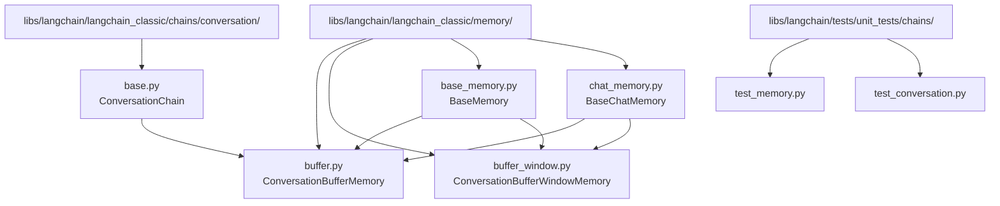
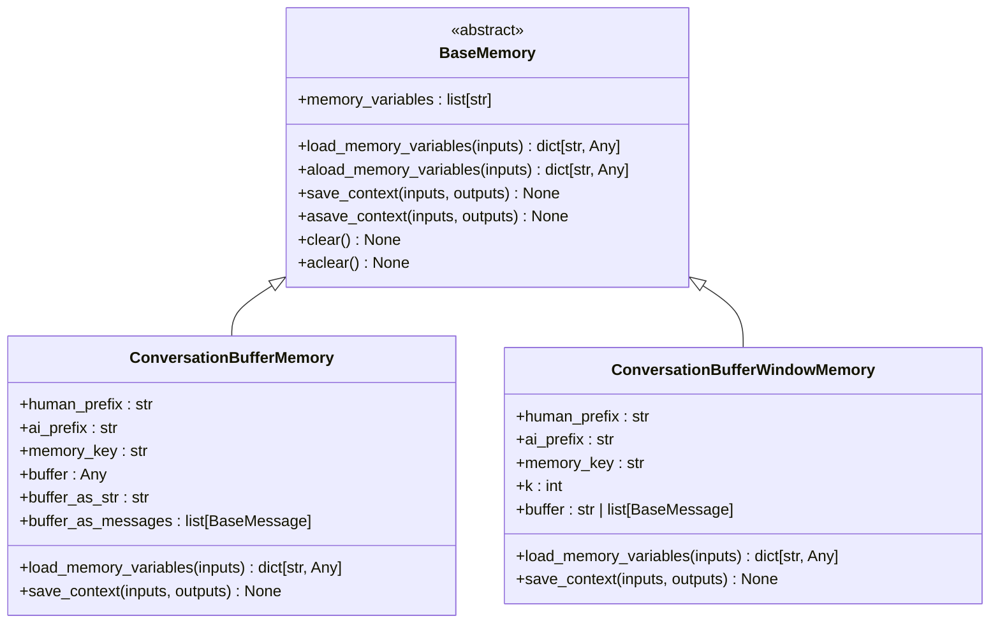
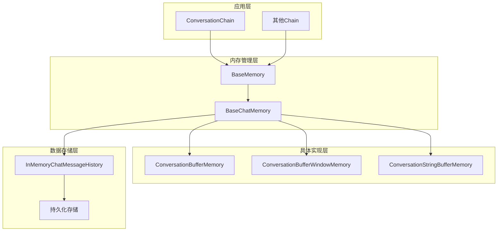
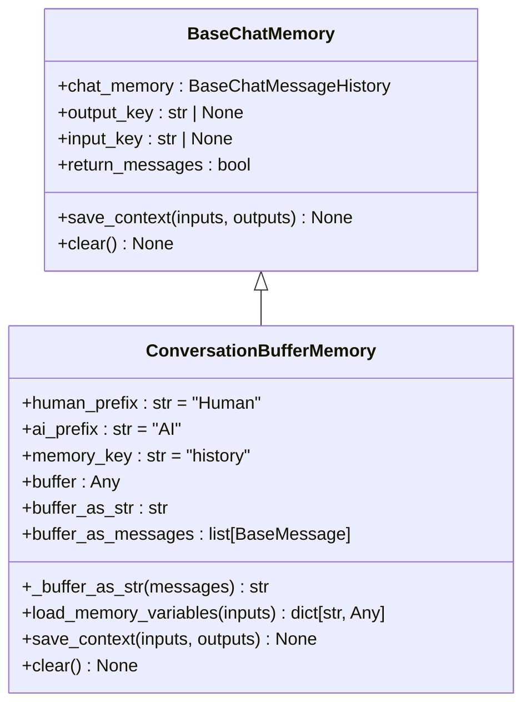
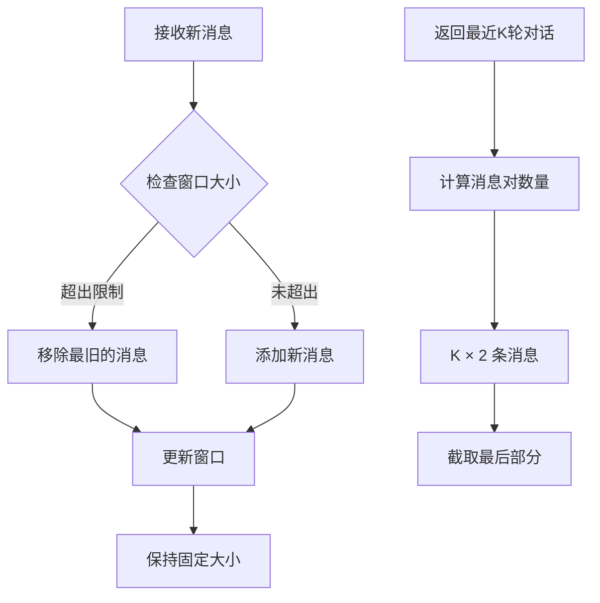
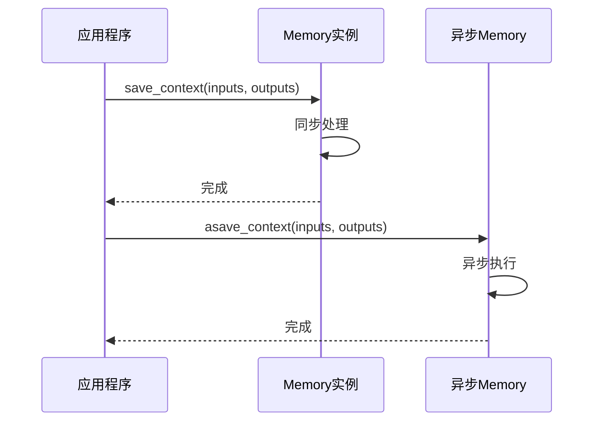
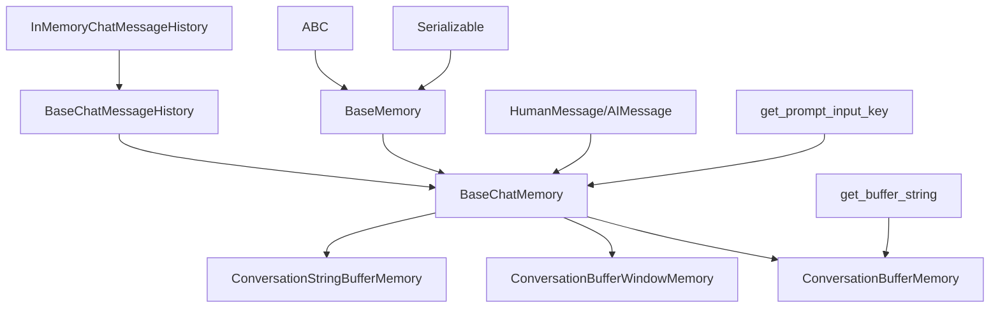

# Buffer Memory

<cite>
**本文档中引用的文件**
- [buffer.py](file://libs/langchain/langchain_classic/memory/buffer.py)
- [buffer_window.py](file://libs/langchain/langchain_classic/memory/buffer_window.py)
- [base_memory.py](file://libs/langchain/langchain_classic/base_memory.py)
- [chat_memory.py](file://libs/langchain/langchain_classic/memory/chat_memory.py)
- [test_memory.py](file://libs/langchain/tests/unit_tests/chains/test_memory.py)
- [test_conversation.py](file://libs/langchain/tests/unit_tests/chains/test_conversation.py)
- [base.py](file://libs/langchain/langchain_classic/chains/conversation/base.py)
</cite>

## 目录
1. [简介](#简介)
2. [项目结构](#项目结构)
3. [核心组件](#核心组件)
4. [架构概览](#架构概览)
5. [详细组件分析](#详细组件分析)
6. [依赖关系分析](#依赖关系分析)
7. [性能考虑](#性能考虑)
8. [故障排除指南](#故障排除指南)
9. [结论](#结论)

## 简介

Buffer Memory是LangChain框架中用于维护对话上下文的核心组件，通过存储最近的N条对话消息来为需要短期记忆的应用场景提供支持。它特别适用于需要保持对话连贯性的聊天机器人和交互式应用。

Buffer Memory系统包含两个主要实现：
- **ConversationBufferMemory**: 存储完整的对话历史
- **ConversationBufferWindowMemory**: 仅存储最近的K轮对话

这些组件通过继承基础内存抽象类，提供了统一的接口来管理对话状态，同时支持同步和异步操作模式。

## 项目结构

Buffer Memory相关文件在LangChain项目中的组织结构如下：



**图表来源**
- [buffer.py](file://libs/langchain/langchain_classic/memory/buffer.py#L1-L180)
- [buffer_window.py](file://libs/langchain/langchain_classic/memory/buffer_window.py#L1-L63)
- [base_memory.py](file://libs/langchain/langchain_classic/base_memory.py#L1-L117)
- [chat_memory.py](file://libs/langchain/langchain_classic/memory/chat_memory.py#L1-L105)

**章节来源**
- [buffer.py](file://libs/langchain/langchain_classic/memory/buffer.py#L1-L180)
- [buffer_window.py](file://libs/langchain/langchain_classic/memory/buffer_window.py#L1-L63)

## 核心组件

### BaseMemory抽象基类

BaseMemory是所有内存实现的基础抽象类，定义了内存系统的核心接口：



**图表来源**
- [base_memory.py](file://libs/langchain/langchain_classic/base_memory.py#L20-L117)
- [buffer.py](file://libs/langchain/langchain_classic/memory/buffer.py#L15-L180)
- [buffer_window.py](file://libs/langchain/langchain_classic/memory/buffer_window.py#L15-L63)

### ConversationBufferMemory详解

ConversationBufferMemory是最基础的Buffer Memory实现，它简单地存储整个对话历史而不进行任何额外处理：

**主要特性：**
- 存储完整的对话历史记录
- 支持字符串和消息对象两种格式
- 提供前缀自定义功能（默认为"Human"和"AI"）
- 可配置的记忆键名

**工作原理：**
1. 接收用户输入和模型输出
2. 将对话转换为标准的消息格式
3. 存储到内部缓冲区
4. 在需要时返回完整的对话历史

**章节来源**
- [buffer.py](file://libs/langchain/langchain_classic/memory/buffer.py#L15-L180)

### ConversationBufferWindowMemory详解

ConversationBufferWindowMemory是ConversationBufferMemory的窗口版本，只保留最近的K轮对话：

**主要特性：**
- 可配置的窗口大小（k值）
- 自动丢弃最旧的消息
- 高效的内存使用
- 支持消息数量限制

**工作原理：**
1. 维护固定大小的消息窗口
2. 当新消息到达时自动移除最旧的消息
3. 保持对话的最新上下文
4. 支持基于消息数量或字符长度的限制

**章节来源**
- [buffer_window.py](file://libs/langchain/langchain_classic/memory/buffer_window.py#L15-L63)

## 架构概览

Buffer Memory系统采用分层架构设计，确保了良好的可扩展性和一致性：



**图表来源**
- [base_memory.py](file://libs/langchain/langchain_classic/base_memory.py#L20-L117)
- [chat_memory.py](file://libs/langchain/langchain_classic/memory/chat_memory.py#L20-L105)
- [buffer.py](file://libs/langchain/langchain_classic/memory/buffer.py#L15-L180)
- [buffer_window.py](file://libs/langchain/langchain_classic/memory/buffer_window.py#L15-L63)

## 详细组件分析

### ConversationBufferMemory实现分析

#### 类结构和属性

ConversationBufferMemory类提供了完整的对话历史存储功能：



**图表来源**
- [buffer.py](file://libs/langchain/langchain_classic/memory/buffer.py#L15-L50)
- [chat_memory.py](file://libs/langchain/langchain_classic/memory/chat_memory.py#L20-L60)

#### 核心方法实现

**load_memory_variables方法：**
该方法负责从内存中加载当前的对话历史，支持两种返回格式：
- 字符串格式：将消息列表转换为可读的文本格式
- 消息对象格式：直接返回原始的消息对象列表

**save_context方法：**
该方法处理对话上下文的保存，包括：
- 输入输出参数验证
- 消息格式标准化
- 调用底层消息历史存储

**章节来源**
- [buffer.py](file://libs/langchain/langchain_classic/memory/buffer.py#L50-L180)

### ConversationBufferWindowMemory实现分析

#### 窗口管理机制

ConversationBufferWindowMemory实现了智能的窗口管理：



**图表来源**
- [buffer_window.py](file://libs/langchain/langchain_classic/memory/buffer_window.py#L25-L60)

#### 参数配置

| 参数 | 类型 | 默认值 | 描述 |
|------|------|--------|------|
| `k` | int | 5 | 窗口中要保留的消息对数 |
| `memory_key` | str | "history" | 内存变量的键名 |
| `human_prefix` | str | "Human" | 用户消息的前缀标识 |
| `ai_prefix` | str | "AI" | AI响应的前缀标识 |

**章节来源**
- [buffer_window.py](file://libs/langchain/langchain_classic/memory/buffer_window.py#L20-L63)

### 异步操作支持

所有Buffer Memory实现都提供了完整的异步操作支持：



**图表来源**
- [base_memory.py](file://libs/langchain/langchain_classic/base_memory.py#L60-L117)

**章节来源**
- [base_memory.py](file://libs/langchain/langchain_classic/base_memory.py#L60-L117)

## 依赖关系分析

Buffer Memory系统的依赖关系展现了清晰的层次结构：



**图表来源**
- [base_memory.py](file://libs/langchain/langchain_classic/base_memory.py#L1-L20)
- [chat_memory.py](file://libs/langchain/langchain_classic/memory/chat_memory.py#L1-L30)
- [buffer.py](file://libs/langchain/langchain_classic/memory/buffer.py#L1-L20)

### 外部依赖

Buffer Memory系统依赖以下外部组件：
- **langchain_core.messages**: 消息格式化和序列化
- **pydantic**: 数据验证和序列化
- **typing_extensions**: 类型注解支持

**章节来源**
- [base_memory.py](file://libs/langchain/langchain_classic/base_memory.py#L1-L20)
- [chat_memory.py](file://libs/langchain/langchain_classic/memory/chat_memory.py#L1-L20)

## 性能考虑

### 内存使用优化

Buffer Memory系统在内存使用方面采用了多种优化策略：

1. **ConversationBufferWindowMemory的窗口限制**
   - 防止内存无限增长
   - 固定的内存占用
   - 适合长时间运行的应用

2. **消息格式选择**
   - 字符串格式：更小的内存占用
   - 消息对象格式：更高的灵活性

3. **异步操作支持**
   - 非阻塞的内存访问
   - 更好的并发性能

### 性能监控指标

| 指标 | 监控方法 | 建议阈值 |
|------|----------|----------|
| 内存使用量 | 系统监控工具 | < 100MB |
| 响应时间 | 应用日志 | < 100ms |
| 消息数量 | 内存统计 | 根据k值设定 |

### 最佳实践建议

1. **合理设置窗口大小**
   - 根据应用场景确定合适的k值
   - 平衡上下文质量和内存使用

2. **选择合适的消息格式**
   - 简单查询使用字符串格式
   - 复杂交互使用消息对象格式

3. **定期清理过期数据**
   - 实现定期清理机制
   - 监控内存使用情况

## 故障排除指南

### 常见问题及解决方案

#### 1. 上下文丢失问题

**症状：** 对话过程中突然失去之前的上下文信息

**原因分析：**
- 内存实例被重新初始化
- 会话ID配置错误
- 内存存储后端故障

**解决方案：**
```python
# 确保使用相同的内存实例
memory = ConversationBufferMemory()
chain = ConversationChain(llm=llm, memory=memory)

# 或者使用会话管理
from langchain_core.runnables.history import RunnableWithMessageHistory
chain = RunnableWithMessageHistory(model, get_session_history)
```

#### 2. 内存溢出问题

**症状：** 应用程序内存使用持续增长

**原因分析：**
- 使用ConversationBufferMemory而没有设置大小限制
- 会话清理逻辑缺失

**解决方案：**
```python
# 使用窗口内存
memory = ConversationBufferWindowMemory(k=10)

# 或者定期清理
memory.clear()
```

#### 3. 异步操作超时

**症状：** 异步内存操作出现超时错误

**原因分析：**
- 网络延迟或存储后端响应慢
- 并发请求过多

**解决方案：**
```python
# 设置合理的超时时间
import asyncio
asyncio.wait_for(memory.asave_context(inputs, outputs), timeout=30)
```

**章节来源**
- [test_conversation.py](file://libs/langchain/tests/unit_tests/chains/test_conversation.py#L101-L170)
- [base_memory.py](file://libs/langchain/langchain_classic/base_memory.py#L60-L117)

### 调试技巧

1. **启用详细日志**
   ```python
   import logging
   logging.getLogger("langchain").setLevel(logging.DEBUG)
   ```

2. **监控内存使用**
   ```python
   import psutil
   process = psutil.Process()
   print(f"Memory usage: {process.memory_info().rss / 1024 / 1024:.2f} MB")
   ```

3. **验证消息格式**
   ```python
   memory = ConversationBufferMemory(return_messages=True)
   messages = memory.load_memory_variables({})
   print(f"Message count: {len(messages)}")
   ```

## 结论

Buffer Memory系统为LangChain提供了强大而灵活的对话上下文管理能力。通过ConversationBufferMemory和ConversationBufferWindowMemory两个核心实现，开发者可以根据具体需求选择最适合的内存策略。

### 主要优势

1. **简单易用**：提供直观的API接口
2. **高性能**：支持同步和异步操作
3. **灵活配置**：丰富的参数选项
4. **类型安全**：完整的类型注解支持
5. **向后兼容**：与现有代码的良好兼容性

### 发展方向

随着LangChain生态系统的不断发展，Buffer Memory系统也在持续演进：
- 更好的序列化支持
- 分布式内存存储
- 智能的上下文压缩算法
- 更多的集成选项

### 使用建议

1. **新项目**：优先考虑使用RunnableWithMessageHistory替代传统的ConversationChain
2. **性能敏感应用**：使用ConversationBufferWindowMemory并合理设置k值
3. **复杂交互**：启用return_messages=True以获得完整的消息对象
4. **生产环境**：实施监控和清理策略

Buffer Memory系统作为LangChain生态系统的重要组成部分，为构建高质量的对话应用提供了坚实的基础。通过深入理解其工作机制和最佳实践，开发者可以更好地利用这一强大的工具来创建出色的用户体验。