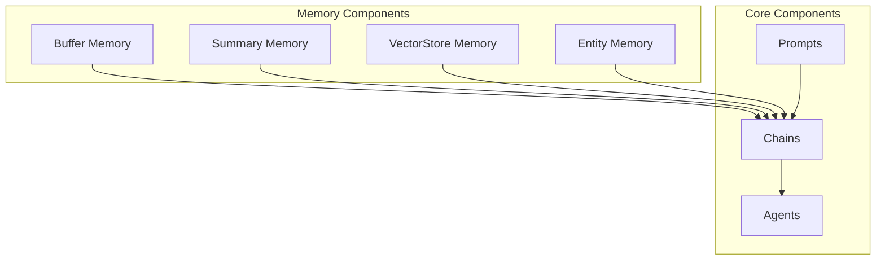
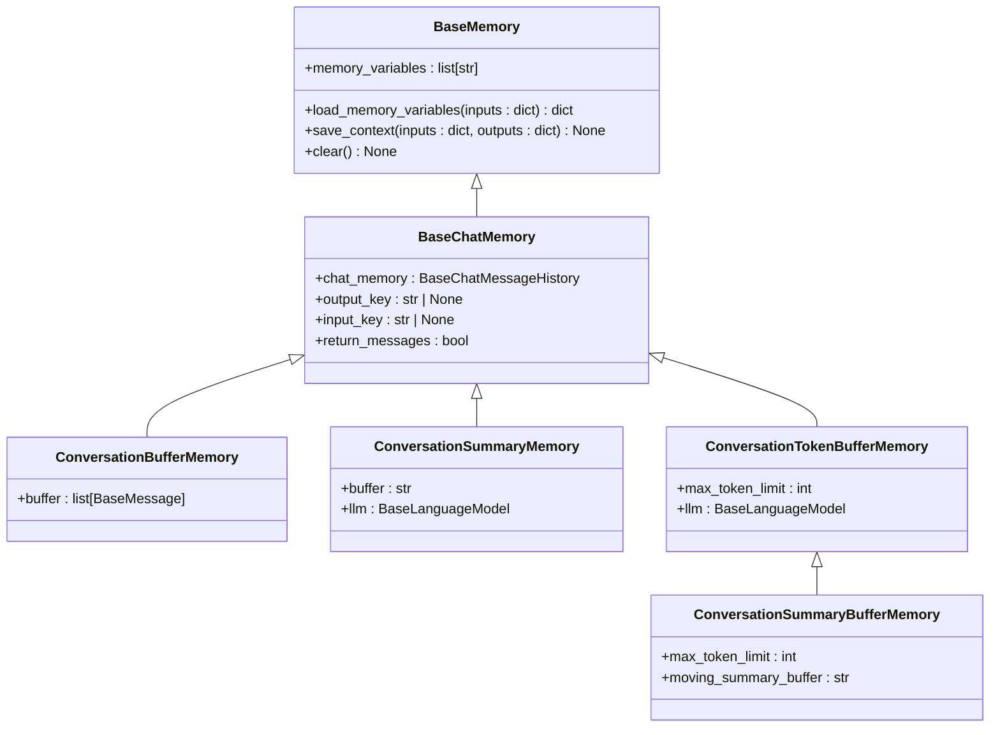
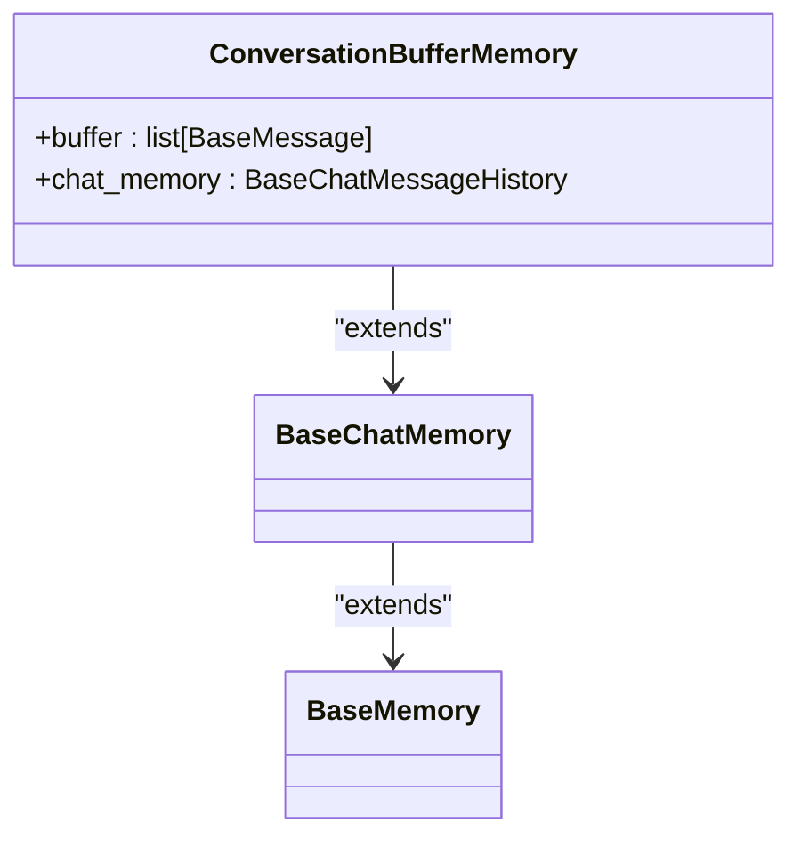
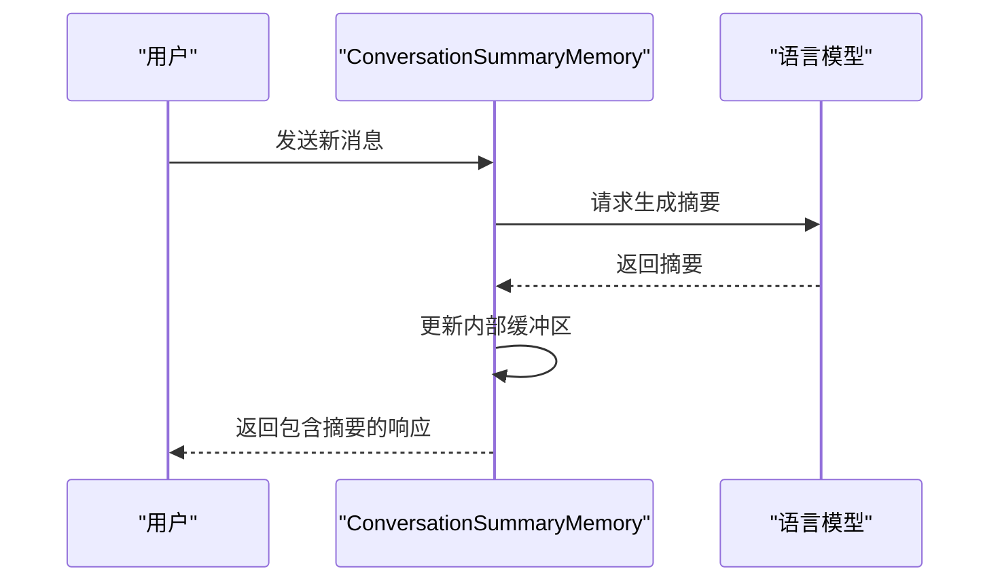
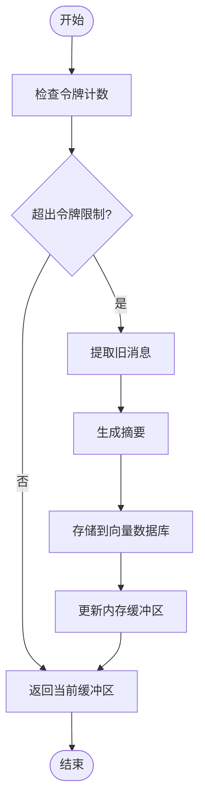
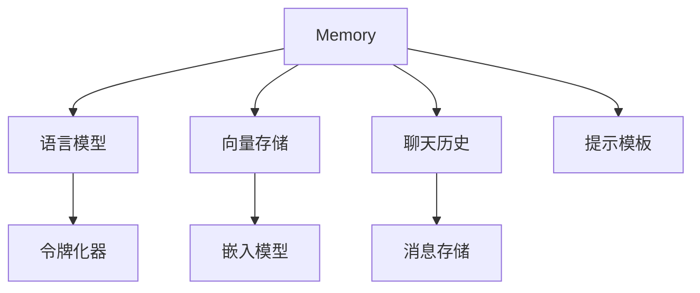

# Memory

<cite>
**本文档中引用的文件**
- [base_memory.py](file://libs/langchain/langchain_classic/base_memory.py)
- [chat_memory.py](file://libs/langchain/langchain_classic/memory/chat_memory.py)
- [summary.py](file://libs/langchain/langchain_classic/memory/summary.py)
- [summary_buffer.py](file://libs/langchain/langchain_classic/memory/summary_buffer.py)
- [token_buffer.py](file://libs/langchain/langchain_classic/memory/token_buffer.py)
- [vectorstore_token_buffer_memory.py](file://libs/langchain/langchain_classic/memory/vectorstore_token_buffer_memory.py)
- [entity.py](file://libs/langchain/langchain_classic/memory/entity.py)
- [time_weighted_retriever.py](file://libs/langchain/langchain_classic/retrievers/time_weighted_retriever.py)
</cite>

## 目录
1. [简介](#简介)
2. [项目结构](#项目结构)
3. [核心组件](#核心组件)
4. [架构概述](#架构概述)
5. [详细组件分析](#详细组件分析)
6. [依赖分析](#依赖分析)
7. [性能考虑](#性能考虑)
8. [故障排除指南](#故障排除指南)
9. [结论](#结论)

## 简介
LangChain Memory组件为对话应用提供了维护上下文信息的能力，使大型语言模型（LLM）能够进行连贯的多轮对话。Memory通过存储和管理对话历史，将上下文信息注入到后续的模型调用中。本文档深入探讨了不同类型的Memory实现，包括缓冲内存、摘要内存和基于向量存储的内存，以及它们的实现原理、适用场景和配置方法。

## 项目结构
LangChain的Memory组件位于`libs/langchain/langchain_classic/memory`目录下，与其他核心组件如chains、agents和prompts并列。该结构体现了模块化设计，使Memory可以独立开发和维护，同时能够与其他组件无缝集成。

**Diagram sources**
- [base_memory.py](file://libs/langchain/langchain_classic/base_memory.py)
- [chat_memory.py](file://libs/langchain/langchain_classic/memory/chat_memory.py)

**Section sources**
- [base_memory.py](file://libs/langchain/langchain_classic/base_memory.py)
- [memory/__init__.py](file://libs/langchain/langchain_classic/memory/__init__.py)

## 核心组件
LangChain Memory的核心是`BaseMemory`抽象基类，它定义了所有Memory实现必须遵循的接口。这个基类提供了内存变量管理、上下文加载和保存、以及清除内存的基本方法。具体的Memory实现通过继承这个基类来提供特定的功能。

**Section sources**
- [base_memory.py](file://libs/langchain/langchain_classic/base_memory.py)
- [chat_memory.py](file://libs/langchain/langchain_classic/memory/chat_memory.py)

## 架构概述
LangChain Memory的架构基于分层设计，从抽象的`BaseMemory`类到具体的实现类，形成了一个清晰的继承体系。这种设计允许开发者根据具体需求选择合适的Memory类型，同时保持了API的一致性。

**Diagram sources**
- [base_memory.py](file://libs/langchain/langchain_classic/base_memory.py)
- [chat_memory.py](file://libs/langchain/langchain_classic/memory/chat_memory.py)
- [summary.py](file://libs/langchain/langchain_classic/memory/summary.py)
- [summary_buffer.py](file://libs/langchain/langchain_classic/memory/summary_buffer.py)
- [token_buffer.py](file://libs/langchain/langchain_classic/memory/token_buffer.py)

## 详细组件分析
### 缓冲内存分析
缓冲内存是最基本的Memory类型，它简单地存储对话中的消息序列。这种内存类型适用于需要完整对话历史的场景，但可能会导致上下文过长的问题。

#### 对于对象导向组件：

**Diagram sources**
- [chat_memory.py](file://libs/langchain/langchain_classic/memory/chat_memory.py)
- [buffer.py](file://libs/langchain/langchain_classic/memory/buffer.py)

### 摘要内存分析
摘要内存通过使用语言模型生成对话的摘要来维护上下文。这种方法可以有效地压缩长对话历史，同时保留关键信息。

#### 对于API/服务组件：

**Diagram sources**
- [summary.py](file://libs/langchain/langchain_classic/memory/summary.py)

### 基于向量存储的内存分析
基于向量存储的内存使用向量数据库来存储和检索相关的历史对话。这种方法特别适合处理非常长的对话历史，因为它可以根据相关性检索最重要的上下文。

#### 对于复杂逻辑组件：

**Diagram sources**
- [vectorstore_token_buffer_memory.py](file://libs/langchain/langchain_classic/memory/vectorstore_token_buffer_memory.py)

**Section sources**
- [vectorstore_token_buffer_memory.py](file://libs/langchain/langchain_classic/memory/vectorstore_token_buffer_memory.py)
- [time_weighted_retriever.py](file://libs/langchain/langchain_classic/retrievers/time_weighted_retriever.py)

## 依赖分析
LangChain Memory组件依赖于多个核心模块，包括语言模型、向量存储和消息历史管理。这些依赖关系确保了Memory能够有效地与整个LangChain生态系统集成。

**Diagram sources**
- [base_memory.py](file://libs/langchain/langchain_classic/base_memory.py)
- [chat_memory.py](file://libs/langchain/langchain_classic/memory/chat_memory.py)
- [vectorstore_token_buffer_memory.py](file://libs/langchain/langchain_classic/memory/vectorstore_token_buffer_memory.py)

**Section sources**
- [base_memory.py](file://libs/langchain/langchain_classic/base_memory.py)
- [chat_memory.py](file://libs/langchain/langchain_classic/memory/chat_memory.py)

## 性能考虑
在使用LangChain Memory时，需要考虑几个性能因素。首先是上下文长度限制，过长的上下文会增加计算成本并可能导致性能下降。其次是内存管理，特别是在处理大量对话时，需要有效的策略来管理内存使用。最后是隐私保护，确保敏感信息不会被不当存储或泄露。

## 故障排除指南
在使用Memory组件时，常见的问题包括上下文丢失、性能下降和集成问题。确保正确配置Memory类型和参数，监控上下文长度，并定期清理不必要的历史记录可以帮助解决这些问题。

**Section sources**
- [base_memory.py](file://libs/langchain/langchain_classic/base_memory.py)
- [chat_memory.py](file://libs/langchain/langchain_classic/memory/chat_memory.py)

## 结论
LangChain Memory组件为构建具有上下文感知能力的对话应用提供了强大的基础。通过理解不同Memory类型的特性和适用场景，开发者可以设计出更加智能和高效的对话系统。随着技术的发展，Memory组件将继续演进，提供更高级的功能和更好的性能。