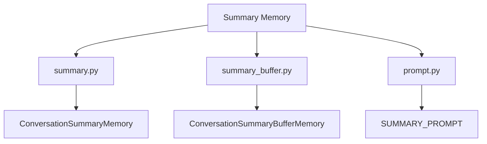
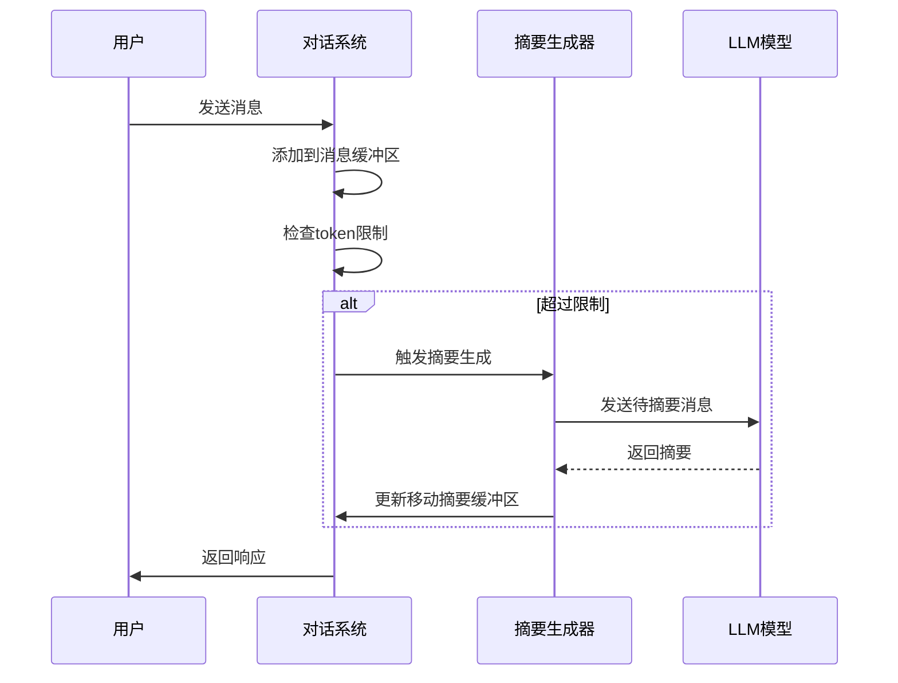
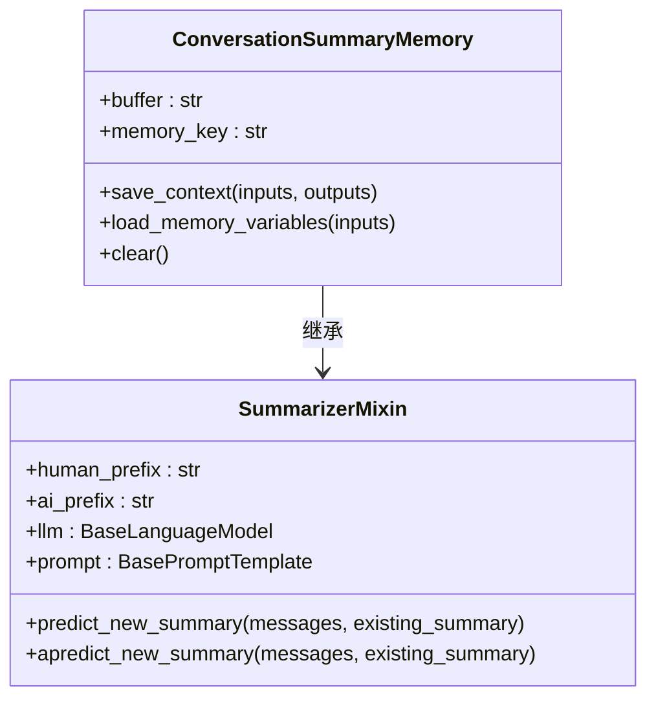
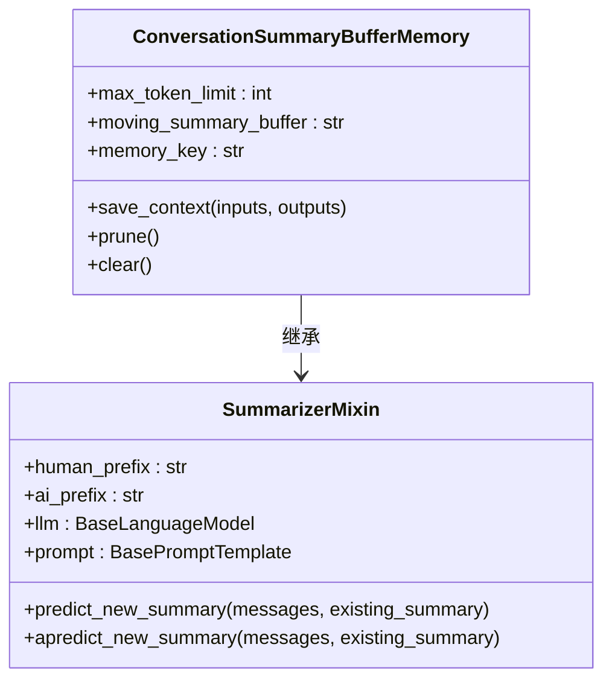
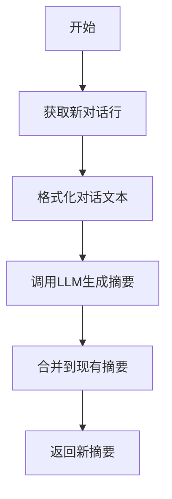
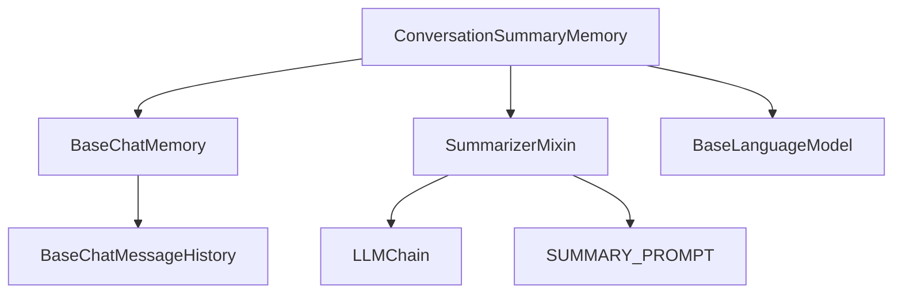

# Summary Memory

<cite>
**本文档中引用的文件**  
- [summary.py](file://libs/langchain/langchain_classic/memory/summary.py)
- [summary_buffer.py](file://libs/langchain/langchain_classic/memory/summary_buffer.py)
- [prompt.py](file://libs/langchain/langchain_classic/memory/prompt.py)
- [test_summary_buffer_memory.py](file://libs/langchain/tests/unit_tests/chains/test_summary_buffer_memory.py)
- [chat_memory.py](file://libs/langchain/langchain_classic/memory/chat_memory.py)
</cite>

## 目录
1. [简介](#简介)
2. [项目结构](#项目结构)
3. [核心组件](#核心组件)
4. [架构概述](#架构概述)
5. [详细组件分析](#详细组件分析)
6. [依赖分析](#依赖分析)
7. [性能考虑](#性能考虑)
8. [故障排除指南](#故障排除指南)
9. [结论](#结论)

## 简介
Summary Memory 是 LangChain 框架中用于管理长对话历史的核心组件。它通过定期生成对话摘要来压缩历史信息，从而在有限的上下文窗口内保留更长时间的对话记忆。这种机制特别适用于需要长期上下文理解的对话系统，能够有效平衡内存使用和计算开销。

## 项目结构
Summary Memory 相关的实现主要分布在 LangChain 的 memory 模块中，包括摘要生成的核心逻辑、缓冲区管理以及相关的提示模板。

**图示来源**  
- [summary.py](file://libs/langchain/langchain_classic/memory/summary.py)
- [summary_buffer.py](file://libs/langchain/langchain_classic/memory/summary_buffer.py)
- [prompt.py](file://libs/langchain/langchain_classic/memory/prompt.py)

**本节来源**  
- [summary.py](file://libs/langchain/langchain_classic/memory/summary.py)
- [summary_buffer.py](file://libs/langchain/langchain_classic/memory/summary_buffer.py)

## 核心组件
Summary Memory 的核心组件包括 ConversationSummaryMemory 和 ConversationSummaryBufferMemory，它们都继承自 BaseChatMemory 并实现了摘要生成的功能。这些组件通过 LLM 模型定期生成对话摘要，将历史对话压缩为简洁的总结，从而在有限的上下文窗口内保留更长时间的对话记忆。

**本节来源**  
- [summary.py](file://libs/langchain/langchain_classic/memory/summary.py#L1-L170)
- [summary_buffer.py](file://libs/langchain/langchain_classic/memory/summary_buffer.py#L1-L150)

## 架构概述
Summary Memory 的架构基于观察者模式和责任链模式，通过定期触发摘要生成来维护对话历史。系统会监控对话的长度，当达到预设阈值时自动触发摘要过程。

**图示来源**  
- [summary.py](file://libs/langchain/langchain_classic/memory/summary.py#L159-L170)
- [summary_buffer.py](file://libs/langchain/langchain_classic/memory/summary_buffer.py#L100-L126)

## 详细组件分析

### ConversationSummaryMemory 分析
ConversationSummaryMemory 是一个持续总结对话历史的内存组件。它在每次对话轮次后更新摘要，通过 predict_new_summary 方法生成新的摘要。

**图示来源**  
- [summary.py](file://libs/langchain/langchain_classic/memory/summary.py#L118-L157)

**本节来源**  
- [summary.py](file://libs/langchain/langchain_classic/memory/summary.py#L1-L170)

### ConversationSummaryBufferMemory 分析
ConversationSummaryBufferMemory 结合了缓冲区和摘要器的功能，在保持最近对话消息的同时，通过移动摘要缓冲区来存储历史信息。

**图示来源**  
- [summary_buffer.py](file://libs/langchain/langchain_classic/memory/summary_buffer.py#L41-L66)

**本节来源**  
- [summary_buffer.py](file://libs/langchain/langchain_classic/memory/summary_buffer.py#L1-L150)

### 摘要生成机制
摘要生成机制基于预定义的提示模板，通过 LLM 模型逐步总结对话内容。系统会将新对话行与现有摘要结合，生成更新后的摘要。

**图示来源**  
- [prompt.py](file://libs/langchain/langchain_classic/memory/prompt.py#L42-L79)

**本节来源**  
- [prompt.py](file://libs/langchain/langchain_classic/memory/prompt.py#L1-L164)

## 依赖分析
Summary Memory 组件依赖于多个核心模块，包括语言模型、消息处理和提示模板系统。这些依赖关系确保了摘要生成的准确性和效率。

**图示来源**  
- [summary.py](file://libs/langchain/langchain_classic/memory/summary.py)
- [summary_buffer.py](file://libs/langchain/langchain_classic/memory/summary_buffer.py)

**本节来源**  
- [summary.py](file://libs/langchain/langchain_classic/memory/summary.py#L1-L170)
- [summary_buffer.py](file://libs/langchain/langchain_classic/memory/summary_buffer.py#L1-L150)

## 性能考虑
Summary Memory 的性能主要受 LLM 调用频率和 token 计算开销的影响。通过合理设置 max_token_limit 参数，可以在内存使用和计算成本之间取得平衡。异步方法（如 aprune 和 apredict_new_summary）提供了非阻塞的摘要生成能力，有助于提高系统响应速度。

## 故障排除指南
在使用 Summary Memory 时，常见的问题包括摘要质量不佳和性能瓶颈。建议通过调整提示模板和 LLM 配置来优化摘要质量，通过监控 token 使用情况来避免性能问题。

**本节来源**  
- [test_summary_buffer_memory.py](file://libs/langchain/tests/unit_tests/chains/test_summary_buffer_memory.py#L0-L66)
- [summary.py](file://libs/langchain/langchain_classic/memory/summary.py#L159-L170)

## 结论
Summary Memory 为长对话管理提供了一种有效的解决方案，通过定期生成对话摘要来压缩历史信息。开发者可以根据具体应用场景选择合适的摘要策略，在保留重要对话信息的同时控制计算开销。