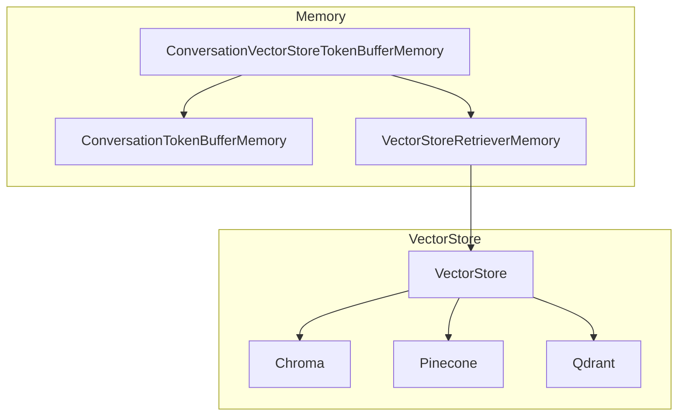
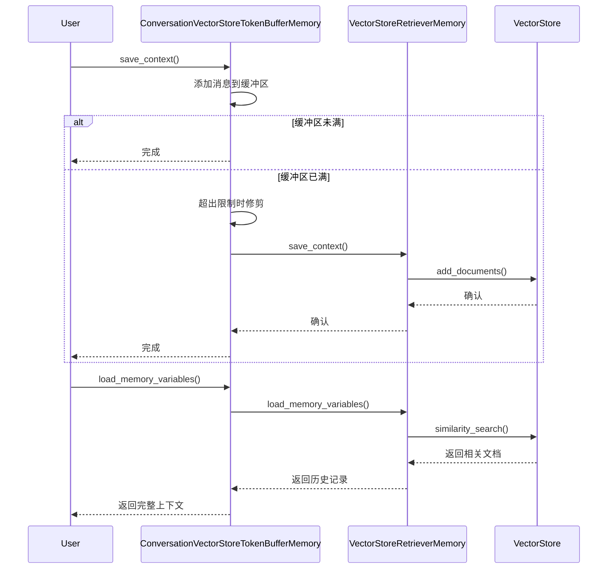
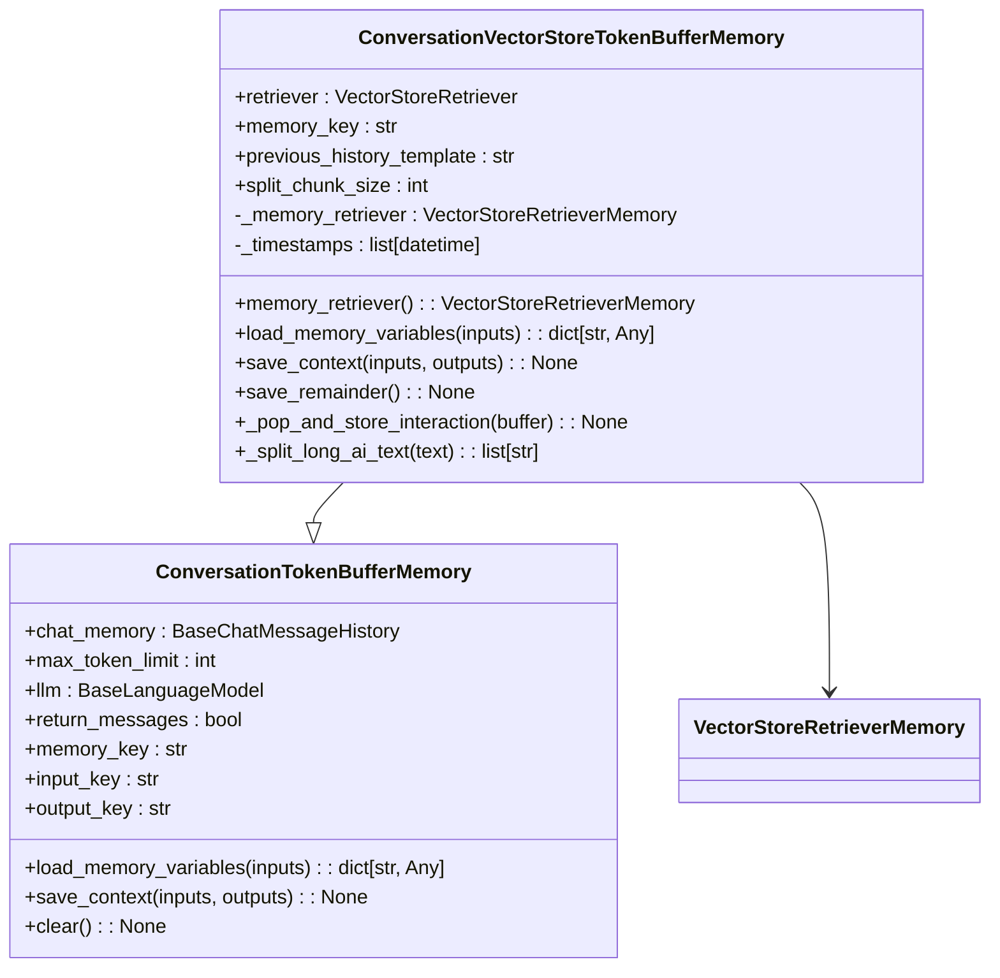
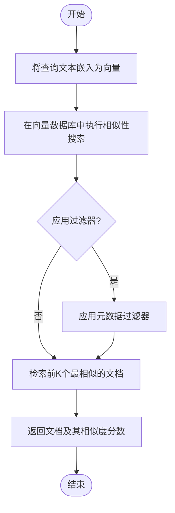
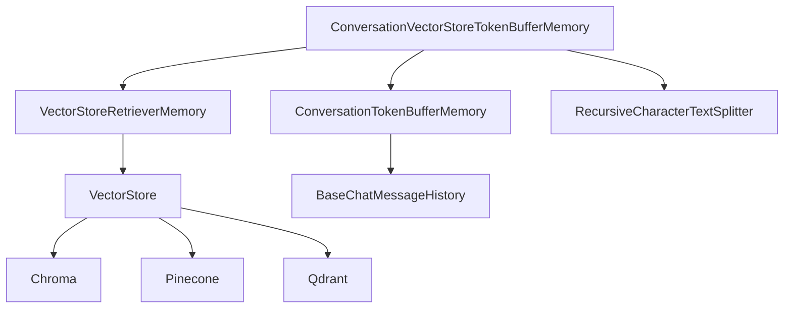

# VectorStore Memory

<cite>
**本文档中引用的文件**  
- [vectorstore_token_buffer_memory.py](file://libs/langchain/langchain_classic/memory/vectorstore_token_buffer_memory.py)
- [base.py](file://libs/core/langchain_core/vectorstores/base.py)
- [in_memory.py](file://libs/core/langchain_core/vectorstores/in_memory.py)
- [chat_memory.py](file://libs/langchain/langchain_classic/memory/chat_memory.py)
- [vectorstores.py](file://libs/partners/qdrant/langchain_qdrant/vectorstores.py)
- [__init__.py](file://libs/langchain/langchain_classic/memory/__init__.py)
</cite>

## 目录
1. [简介](#简介)
2. [项目结构](#项目结构)
3. [核心组件](#核心组件)
4. [架构概述](#架构概述)
5. [详细组件分析](#详细组件分析)
6. [依赖分析](#依赖分析)
7. [性能考虑](#性能考虑)
8. [故障排除指南](#故障排除指南)
9. [结论](#结论)

## 简介
VectorStore Memory 是 LangChain 框架中的一个关键组件，用于管理对话历史记录。它通过将对话消息嵌入为向量并存储在向量数据库中，实现基于内容的相关性搜索。当对话上下文超过指定的令牌限制时，较早的消息会被移出内存缓冲区，并存储到向量数据库中。这种方法允许在大规模对话历史中高效检索相关信息，同时保持当前对话的上下文连贯性。

## 项目结构
VectorStore Memory 的实现分布在多个模块中，主要位于 `libs/langchain/langchain_classic/memory/` 目录下。核心功能由 `ConversationVectorStoreTokenBufferMemory` 类提供，该类继承自 `ConversationTokenBufferMemory` 并利用 `VectorStoreRetriever` 作为后端存储。向量数据库的通用接口定义在 `libs/core/langchain_core/vectorstores/` 模块中，支持多种具体的向量数据库实现，如 Chroma、Pinecone 和 Qdrant。

**图示来源**  
- [vectorstore_token_buffer_memory.py](file://libs/langchain/langchain_classic/memory/vectorstore_token_buffer_memory.py)
- [base.py](file://libs/core/langchain_core/vectorstores/base.py)

**章节来源**  
- [vectorstore_token_buffer_memory.py](file://libs/langchain/langchain_classic/memory/vectorstore_token_buffer_memory.py)
- [__init__.py](file://libs/langchain/langchain_classic/memory/__init__.py)

## 核心组件
`ConversationVectorStoreTokenBufferMemory` 是 VectorStore Memory 的核心实现。它结合了内存缓冲区和向量数据库的优势，确保最近的对话消息保留在内存中以实现快速访问，而较早的消息则被存储在向量数据库中以节省内存。该组件的关键特性包括基于令牌数量的自动缓冲区修剪、时间戳标记以帮助 LLM 理解历史上下文，以及可配置的检索策略。

**章节来源**  
- [vectorstore_token_buffer_memory.py](file://libs/langchain/langchain_classic/memory/vectorstore_token_buffer_memory.py#L36-L184)

## 架构概述
VectorStore Memory 的架构采用分层设计，上层是内存管理组件，下层是向量存储接口。`ConversationVectorStoreTokenBufferMemory` 负责管理对话状态，当内存缓冲区达到容量限制时，它会调用 `VectorStoreRetrieverMemory` 将旧消息保存到向量数据库中。`VectorStoreRetriever` 提供了与底层向量数据库的交互接口，支持相似性搜索和基于分数的检索。

**图示来源**  
- [vectorstore_token_buffer_memory.py](file://libs/langchain/langchain_classic/memory/vectorstore_token_buffer_memory.py)
- [base.py](file://libs/core/langchain_core/vectorstores/base.py)

## 详细组件分析

### ConversationVectorStoreTokenBufferMemory 分析
`ConversationVectorStoreTokenBufferMemory` 类实现了基于令牌限制的对话内存管理。它通过 `save_context` 方法保存新的对话交互，并在缓冲区超过 `max_token_limit` 时自动将最旧的交互移至向量数据库。`load_memory_variables` 方法则负责检索相关的历史对话，结合内存中的最近消息和从向量数据库中检索到的较早消息，形成完整的上下文。

#### 类图

**图示来源**  
- [vectorstore_token_buffer_memory.py](file://libs/langchain/langchain_classic/memory/vectorstore_token_buffer_memory.py#L36-L184)

**章节来源**  
- [vectorstore_token_buffer_memory.py](file://libs/langchain/langchain_classic/memory/vectorstore_token_buffer_memory.py#L36-L184)

### 向量存储机制分析
向量存储机制的核心是将文本内容转换为高维向量，并通过相似性搜索算法（如余弦相似度）来检索相关内容。`VectorStore` 接口定义了 `similarity_search` 和 `similarity_search_with_score_by_vector` 等方法，这些方法被具体的向量数据库实现所重写。例如，`InMemoryVectorStore` 使用余弦相似度计算来找到与查询向量最相似的文档。

#### 流程图

**图示来源**  
- [in_memory.py](file://libs/core/langchain_core/vectorstores/in_memory.py#L315-L355)
- [base.py](file://libs/core/langchain_core/vectorstores/base.py#L606-L637)

**章节来源**  
- [in_memory.py](file://libs/core/langchain_core/vectorstores/in_memory.py#L315-L355)

## 依赖分析
VectorStore Memory 依赖于多个核心组件，包括 `langchain_core.vectorstores` 提供的向量存储接口、`langchain_core.messages` 用于消息表示，以及 `langchain_classic.text_splitter` 用于处理长文本。此外，它还依赖于外部向量数据库的集成，如 `langchain_chroma` 和 `langchain_pinecone`，这些集成通过统一的 `VectorStore` 接口进行交互。

**图示来源**  
- [vectorstore_token_buffer_memory.py](file://libs/langchain/langchain_classic/memory/vectorstore_token_buffer_memory.py)
- [base.py](file://libs/core/langchain_core/vectorstores/base.py)

**章节来源**  
- [vectorstore_token_buffer_memory.py](file://libs/langchain/langchain_classic/memory/vectorstore_token_buffer_memory.py)
- [base.py](file://libs/core/langchain_core/vectorstores/base.py)

## 性能考虑
使用 VectorStore Memory 时需要考虑查询延迟和存储成本。向量数据库的查询性能取决于索引结构和数据规模，而存储成本则与向量维度和文档数量成正比。为了优化性能，可以调整 `k` 参数以控制检索的文档数量，使用 `score_threshold` 来过滤低相关性的结果，并选择适合应用场景的向量数据库。

## 故障排除指南
常见问题包括向量数据库连接失败、嵌入模型加载错误和检索结果不相关。确保向量数据库服务正在运行，检查嵌入模型的配置是否正确，并验证检索查询与存储内容的相关性。如果遇到性能问题，可以尝试优化索引设置或减少检索的文档数量。

**章节来源**  
- [vectorstore_token_buffer_memory.py](file://libs/langchain/langchain_classic/memory/vectorstore_token_buffer_memory.py#L144-L165)
- [base.py](file://libs/core/langchain_core/vectorstores/base.py#L606-L637)

## 结论
VectorStore Memory 提供了一种高效的方法来管理大规模对话历史，通过结合内存缓冲区和向量数据库的优势，实现了上下文连贯性和检索效率的平衡。开发者可以通过配置不同的向量数据库和检索策略，根据具体需求优化对话系统的性能和相关性。