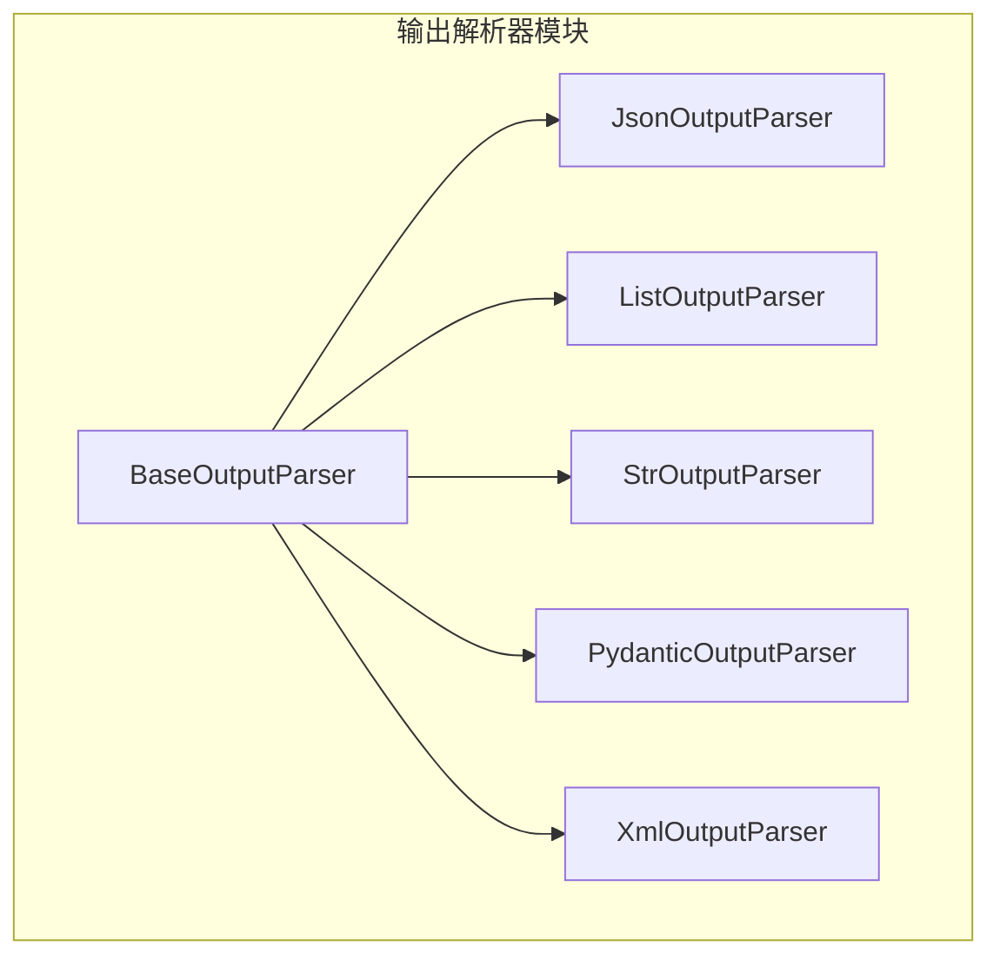
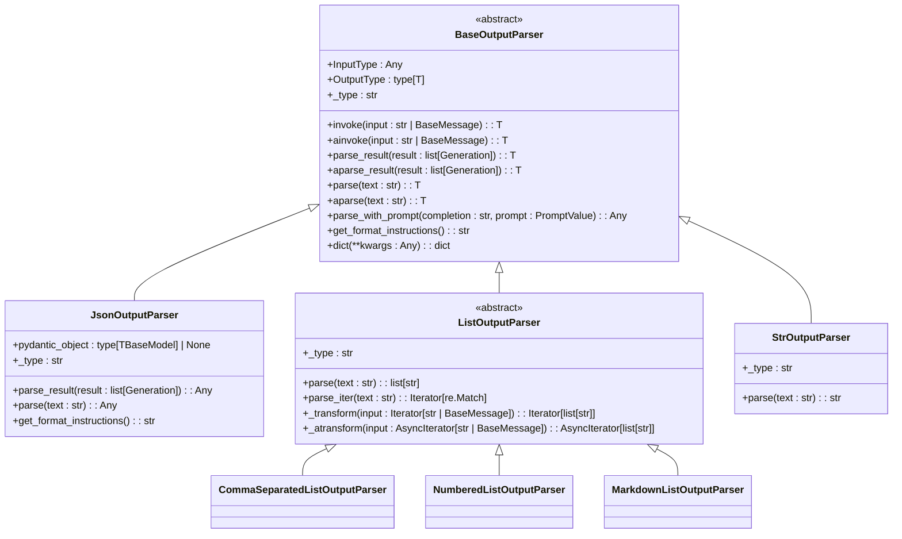
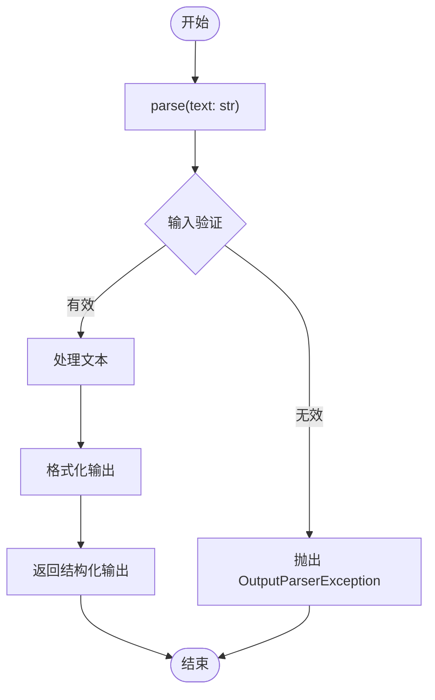
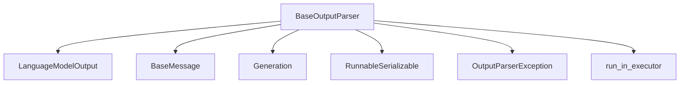

# Base Output Parser

<cite>
**本文档中引用的文件**  
- [base.py](file://libs/core/langchain_core/output_parsers/base.py)
- [format_instructions.py](file://libs/core/langchain_core/output_parsers/format_instructions.py)
- [json.py](file://libs/core/langchain_core/output_parsers/json.py)
- [string.py](file://libs/core/langchain_core/output_parsers/string.py)
- [list.py](file://libs/core/langchain_core/output_parsers/list.py)
- [pydantic.py](file://libs/core/langchain_core/output_parsers/pydantic.py)
</cite>

## 目录
1. [简介](#简介)
2. [项目结构](#项目结构)
3. [核心组件](#核心组件)
4. [架构概述](#架构概述)
5. [详细组件分析](#详细组件分析)
6. [依赖分析](#依赖分析)
7. [性能考虑](#性能考虑)
8. [故障排除指南](#故障排除指南)
9. [结论](#结论)

## 简介
Base Output Parser 是 LangChain 框架中所有具体输出解析器的抽象基类。它为解析语言模型输出提供了统一的接口和核心方法，使开发者能够创建自定义解析器以满足特定需求。本文档详细介绍了 BaseOutputParser 的接口设计、核心方法（如 `parse` 和 `get_format_instructions`），以及如何通过继承该基类来实现自定义解析器。

## 项目结构
LangChain 的输出解析器模块位于 `libs/core/langchain_core/output_parsers/` 目录下，包含多个具体的解析器实现，如 JSON、列表、字符串等。这些解析器都继承自 BaseOutputParser 基类，遵循统一的接口规范。



**图示来源**  
- [base.py](file://libs/core/langchain_core/output_parsers/base.py)
- [json.py](file://libs/core/langchain_core/output_parsers/json.py)
- [list.py](file://libs/core/langchain_core/output_parsers/list.py)
- [string.py](file://libs/core/langchain_core/output_parsers/string.py)
- [pydantic.py](file://libs/core/langchain_core/output_parsers/pydantic.py)
- [xml.py](file://libs/core/langchain_core/output_parsers/xml.py)

**本节来源**  
- [base.py](file://libs/core/langchain_core/output_parsers/base.py)
- [__init__.py](file://libs/core/langchain_core/output_parsers/__init__.py)

## 核心组件
BaseOutputParser 是所有输出解析器的基类，定义了统一的接口和行为规范。它通过继承 `RunnableSerializable` 类实现了可运行和可序列化的特性，并提供了同步和异步的解析方法。

**本节来源**  
- [base.py](file://libs/core/langchain_core/output_parsers/base.py)

## 架构概述
BaseOutputParser 的设计遵循了面向对象的继承原则，所有具体的解析器都通过继承该基类来实现特定的解析逻辑。基类提供了通用的解析流程，而具体的解析细节由子类实现。



**图示来源**  
- [base.py](file://libs/core/langchain_core/output_parsers/base.py)
- [json.py](file://libs/core/langchain_core/output_parsers/json.py)
- [list.py](file://libs/core/langchain_core/output_parsers/list.py)
- [string.py](file://libs/core/langchain_core/output_parsers/string.py)

## 详细组件分析
### BaseOutputParser 分析
BaseOutputParser 是所有输出解析器的抽象基类，定义了统一的接口和核心方法。它通过泛型类型 `T` 支持不同的输出类型，并提供了同步和异步的解析方法。

#### 核心方法
- `parse(text: str) -> T`: 抽象方法，用于解析单个字符串输出。
- `get_format_instructions() -> str`: 返回 LLM 输出应遵循的格式说明。
- `parse_result(result: list[Generation]) -> T`: 解析生成结果列表，通常只使用第一个生成结果。
- `aparse(text: str) -> T`: 异步版本的 `parse` 方法。



**图示来源**  
- [base.py](file://libs/core/langchain_core/output_parsers/base.py)

**本节来源**  
- [base.py](file://libs/core/langchain_core/output_parsers/base.py)

### 自定义解析器开发流程
要创建自定义的输出解析器，需要继承 BaseOutputParser 并实现 `parse` 和 `get_format_instructions` 方法。

#### 开发步骤
1. 定义自定义解析器类，继承 BaseOutputParser
2. 实现 `parse` 方法，定义具体的解析逻辑
3. 实现 `get_format_instructions` 方法，生成指导 LLM 的格式说明
4. 可选：重写 `_type` 属性，用于序列化

```python
from langchain_core.output_parsers import BaseOutputParser
from langchain_core.exceptions import OutputParserException

class CustomOutputParser(BaseOutputParser[dict]):
    """自定义输出解析器示例"""
    
    def parse(self, text: str) -> dict:
        """解析文本输出为字典格式"""
        try:
            # 实现具体的解析逻辑
            lines = text.strip().split('\n')
            result = {}
            for line in lines:
                if ':' in line:
                    key, value = line.split(':', 1)
                    result[key.strip()] = value.strip()
            return result
        except Exception as e:
            raise OutputParserException(f"解析失败: {str(e)}")
    
    def get_format_instructions(self) -> str:
        """返回格式说明"""
        return "输出应为键值对格式，每行一个键值对，用冒号分隔，例如：\nkey1: value1\nkey2: value2"
    
    @property
    def _type(self) -> str:
        return "custom_output_parser"
```

**本节来源**  
- [base.py](file://libs/core/langchain_core/output_parsers/base.py)
- [string.py](file://libs/core/langchain_core/output_parsers/string.py)

## 依赖分析
BaseOutputParser 依赖于 LangChain 核心模块中的多个组件，包括语言模型输出、消息、生成结果和可运行组件。



**图示来源**  
- [base.py](file://libs/core/langchain_core/output_parsers/base.py)

**本节来源**  
- [base.py](file://libs/core/langchain_core/output_parsers/base.py)

## 性能考虑
BaseOutputParser 的设计考虑了性能因素，通过以下方式优化解析性能：
- 使用 `run_in_executor` 实现异步解析
- 提供流式解析支持
- 最小化内存分配和对象创建

## 故障排除指南
在使用 BaseOutputParser 时可能遇到的常见问题及解决方案：

**本节来源**  
- [base.py](file://libs/core/langchain_core/output_parsers/base.py)
- [exceptions.py](file://libs/core/langchain_core/exceptions.py)

## 结论
BaseOutputParser 作为 LangChain 框架中所有输出解析器的抽象基类，提供了统一的接口和核心方法。通过继承该基类，开发者可以轻松创建自定义解析器以满足特定需求。其设计遵循了面向对象的最佳实践，支持同步和异步操作，并提供了良好的扩展性。