# JSON Output Parser

<cite>
**本文档中引用的文件**
- [json.py](file://libs/core/langchain_core/output_parsers/json.py)
- [format_instructions.py](file://libs/core/langchain_core/output_parsers/format_instructions.py)
- [json.py](file://libs/core/langchain_core/utils/json.py)
- [base.py](file://libs/core/langchain_core/output_parsers/base.py)
- [test_json.py](file://libs/core/tests/unit_tests/output_parsers/test_json.py)
- [test_openai_tools.py](file://libs/core/tests/unit_tests/output_parsers/test_openai_tools.py)
- [structured.py](file://libs/langchain/langchain_classic/output_parsers/structured.py)
</cite>

## 目录
1. [简介](#简介)
2. [核心架构](#核心架构)
3. [JsonOutputParser类详解](#jsonoutputparser类详解)
4. [工作原理](#工作原理)
5. [与Prompt的协同工作](#与prompt的协同工作)
6. [具体使用示例](#具体使用示例)
7. [错误处理机制](#错误处理机制)
8. [性能特性](#性能特性)
9. [最佳实践](#最佳实践)
10. [故障排除指南](#故障排除指南)
11. [总结](#总结)

## 简介

JsonOutputParser是LangChain框架中的一个核心组件，专门用于将大型语言模型(LLM)生成的JSON格式文本解析为Python字典对象。它不仅能够处理完整的JSON输出，还支持流式解析和部分JSON解析，使其在实时应用场景中表现出色。

该解析器的主要特点包括：
- **智能JSON解析**：自动处理Markdown代码块中的JSON内容
- **流式支持**：支持增量解析，适用于流式生成场景
- **错误恢复**：具备解析失败时的容错能力
- **类型验证**：可与Pydantic模型结合进行结构化验证
- **格式指导**：自动生成符合JSON Schema的格式说明

## 核心架构

JsonOutputParser基于LangChain的输出解析器架构，继承自`BaseCumulativeTransformOutputParser`基类，提供了完整的解析功能。

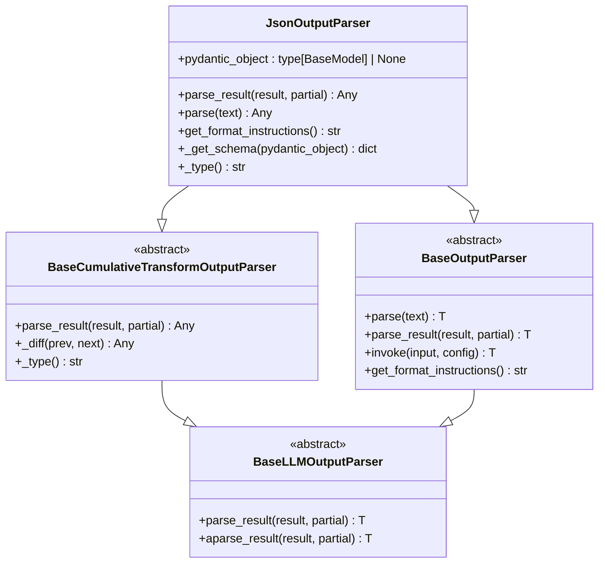

**图表来源**
- [json.py](file://libs/core/langchain_core/output_parsers/json.py#L25-L133)
- [base.py](file://libs/core/langchain_core/output_parsers/base.py#L1-L334)

**章节来源**
- [json.py](file://libs/core/langchain_core/output_parsers/json.py#L25-L133)
- [base.py](file://libs/core/langchain_core/output_parsers/base.py#L1-L334)

## JsonOutputParser类详解

### 类定义和属性

JsonOutputParser类的核心定义包含以下关键属性：

| 属性名 | 类型 | 描述 |
|--------|------|------|
| `pydantic_object` | `type[BaseModel] \| None` | 用于验证的Pydantic对象，如果为None则不进行验证 |
| `_type` | `str` | 解析器类型标识符，值为"simple_json_output_parser" |

### 核心方法

#### parse_result方法
这是JsonOutputParser的核心方法，负责解析LLM的输出结果：

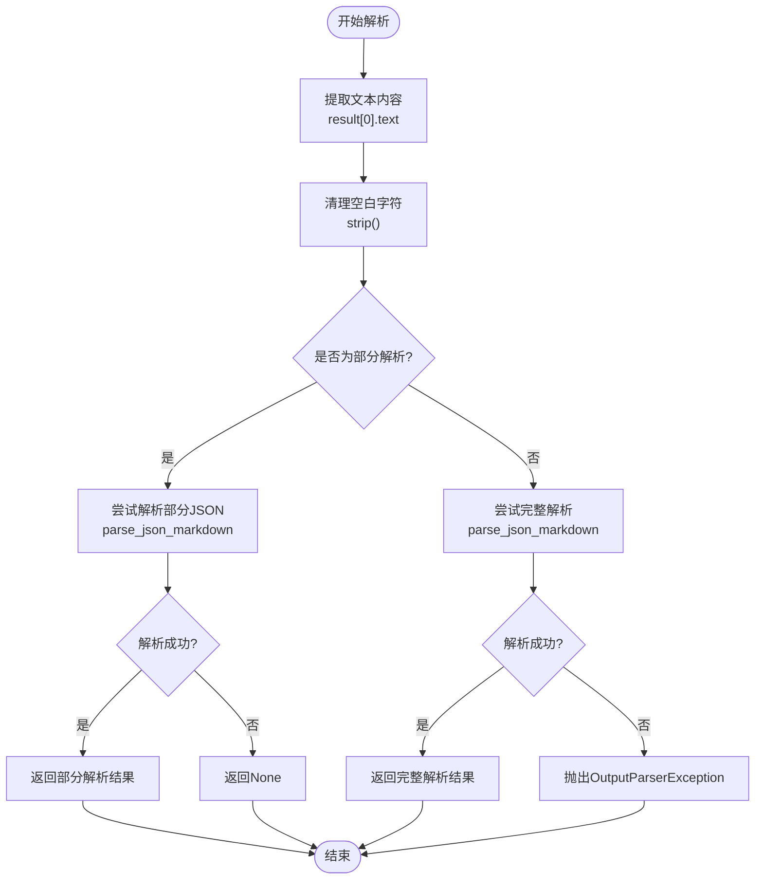

**图表来源**
- [json.py](file://libs/core/langchain_core/output_parsers/json.py#L58-L78)

#### get_format_instructions方法
该方法根据提供的Pydantic模型生成格式说明：

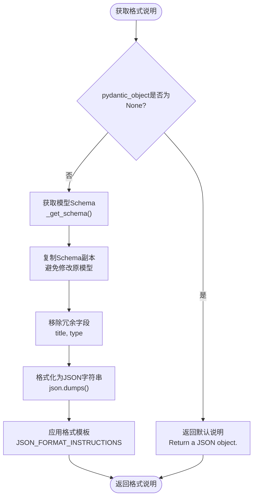

**图表来源**
- [json.py](file://libs/core/langchain_core/output_parsers/json.py#L80-L112)

**章节来源**
- [json.py](file://libs/core/langchain_core/output_parsers/json.py#L58-L112)

## 工作原理

### JSON解析流程

JsonOutputParser采用多层解析策略，确保能够处理各种格式的JSON输出：

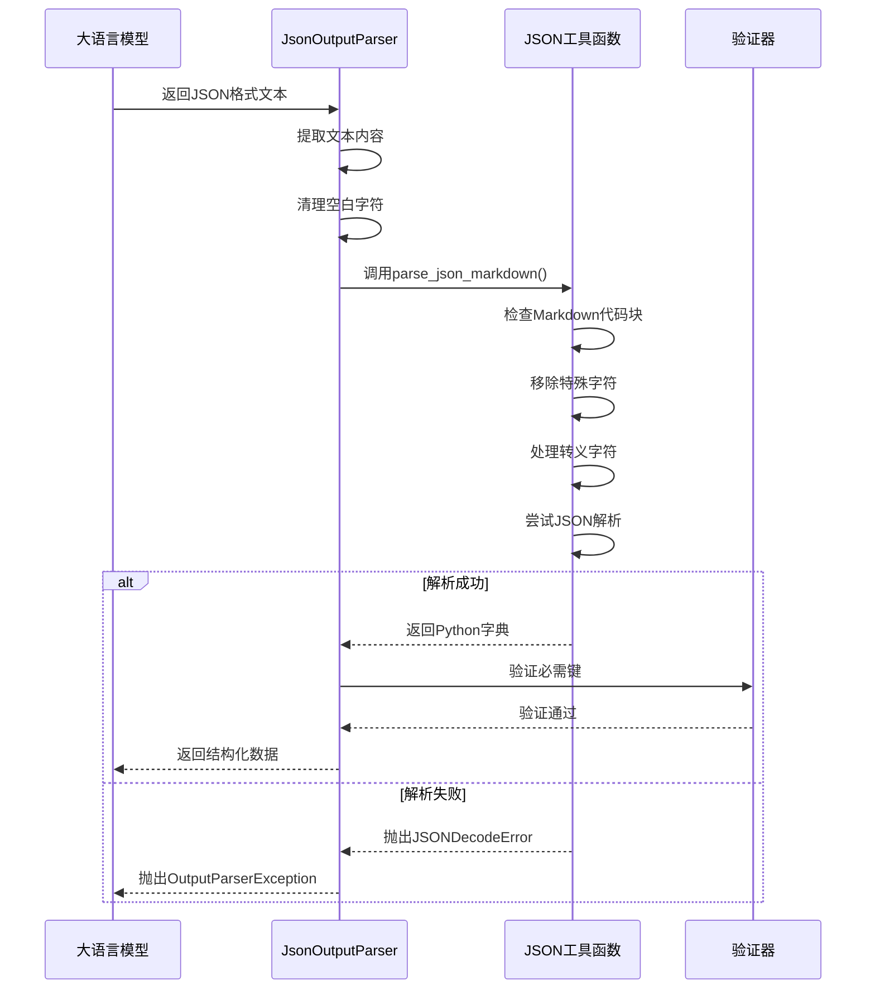

**图表来源**
- [json.py](file://libs/core/langchain_core/utils/json.py#L120-L140)
- [json.py](file://libs/core/langchain_core/utils/json.py#L181-L206)

### 流式解析机制

JsonOutputParser支持增量解析，特别适用于流式生成场景：

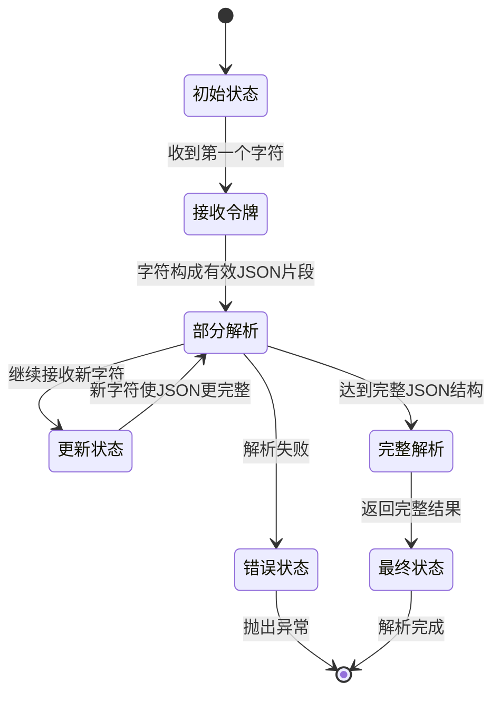

**章节来源**
- [json.py](file://libs/core/langchain_core/utils/json.py#L40-L120)
- [test_json.py](file://libs/core/tests/unit_tests/output_parsers/test_json.py#L507-L548)

## 与Prompt的协同工作

### 格式说明生成

JsonOutputParser通过`get_format_instructions()`方法生成详细的格式说明，指导LLM生成正确的JSON输出：

| 组件 | 功能 | 示例 |
|------|------|------|
| JSON_SCHEMA | 定义JSON结构 | `{"properties": {"name": {"type": "string"}}}` |
| REQUIRED_KEYS | 必需字段列表 | `["name", "age"]` |
| EXAMPLES | 正确输出示例 | `{"name": "John", "age": 30}` |
| FORMAT_TEMPLATE | 格式化模板 | `{schema}` 占位符 |

### Prompt设计最佳实践

为了提高解析成功率，建议在Prompt中包含以下元素：

1. **明确的JSON结构描述**
2. **具体的字段说明**
3. **预期的数据类型**
4. **示例输出格式**
5. **错误处理提示**

**章节来源**
- [format_instructions.py](file://libs/core/langchain_core/output_parsers/format_instructions.py#L1-L12)
- [json.py](file://libs/core/langchain_core/output_parsers/json.py#L80-L112)

## 具体使用示例

### 基础使用示例

以下是JsonOutputParser的基本使用模式：

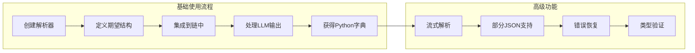

### 与Pydantic模型结合使用

JsonOutputParser可以与Pydantic模型无缝集成，实现强类型的JSON解析：

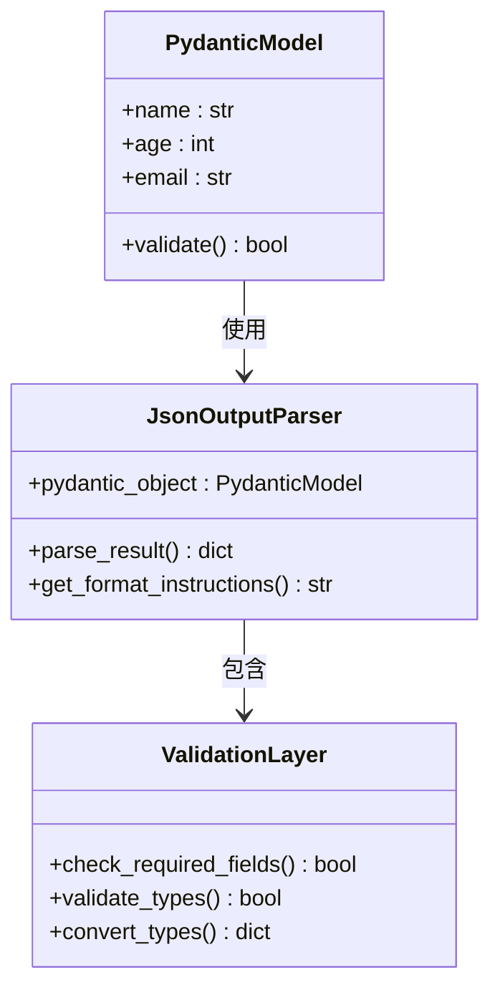

**图表来源**
- [json.py](file://libs/core/langchain_core/output_parsers/json.py#L35-L40)

### 流式解析示例

对于需要实时处理的场景，JsonOutputParser支持增量解析：

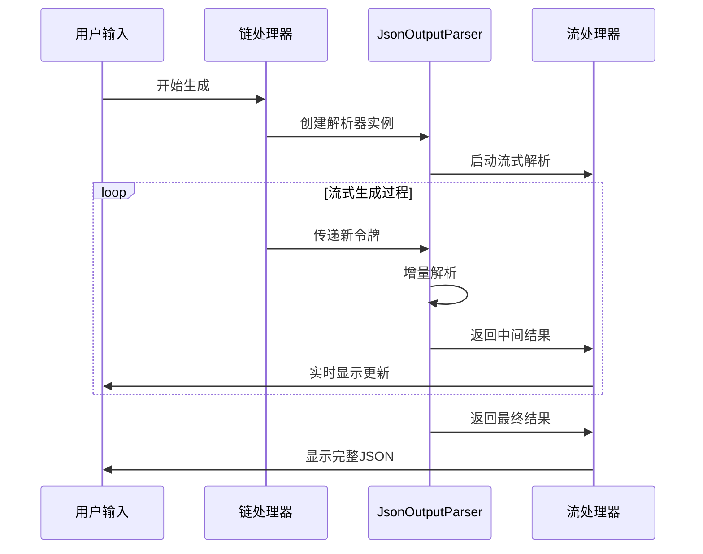

**章节来源**
- [test_json.py](file://libs/core/tests/unit_tests/output_parsers/test_json.py#L545-L608)

## 错误处理机制

### 解析错误类型

JsonOutputParser针对不同类型的错误提供相应的处理策略：

| 错误类型 | 处理方式 | 示例场景 |
|----------|----------|----------|
| JSON语法错误 | 输出详细错误信息 | 缺少引号、括号不匹配 |
| 格式错误 | 尝试修复常见问题 | Markdown代码块格式 |
| 缺少必需字段 | 验证失败并报告 | 必填字段缺失 |
| 数据类型错误 | 类型转换或拒绝 | 字符串被解析为数字 |

### 错误恢复策略

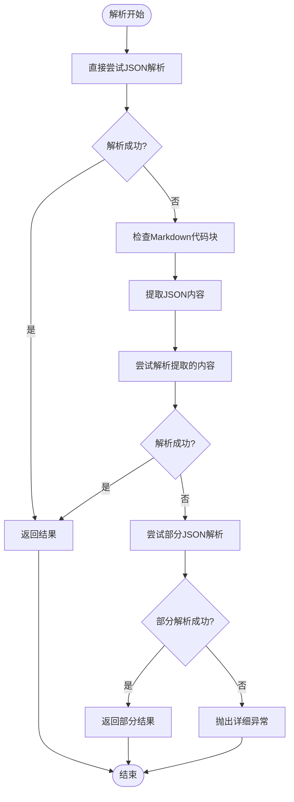

**图表来源**
- [json.py](file://libs/core/langchain_core/utils/json.py#L120-L140)

**章节来源**
- [json.py](file://libs/core/langchain_core/utils/json.py#L181-L206)
- [test_json.py](file://libs/core/tests/unit_tests/output_parsers/test_json.py#L545-L548)

## 性能特性

### 解析性能优化

JsonOutputParser在设计时考虑了多种性能优化策略：

1. **延迟加载**：仅在需要时解析Pydantic Schema
2. **缓存机制**：避免重复计算相同的Schema
3. **流式处理**：减少内存占用，提高响应速度
4. **错误快速检测**：尽早发现并报告解析错误

### 内存使用模式

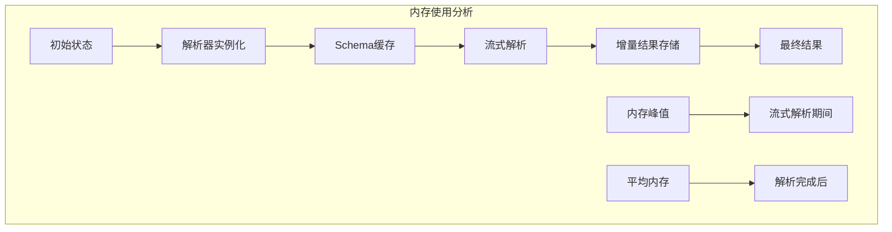

## 最佳实践

### Prompt设计指南

为了最大化JsonOutputParser的效果，建议遵循以下Prompt设计原则：

1. **明确性**：清楚地描述期望的JSON结构
2. **完整性**：包含所有必要的字段说明
3. **示例性**：提供具体的输出示例
4. **约束性**：指定数据类型和格式要求

### 错误处理策略

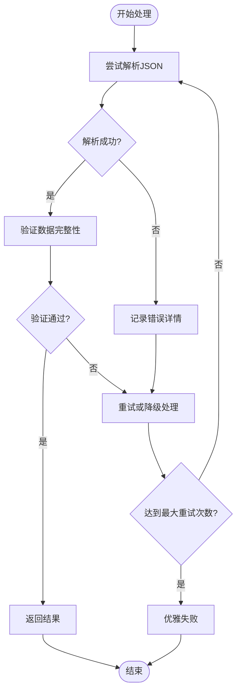

### 性能调优建议

1. **合理设置超时时间**：避免长时间等待无效解析
2. **使用适当的缓存策略**：缓存常用的Schema定义
3. **监控解析成功率**：持续优化Prompt设计
4. **实现优雅降级**：在解析失败时提供备选方案

## 故障排除指南

### 常见问题及解决方案

| 问题类型 | 症状 | 可能原因 | 解决方案 |
|----------|------|----------|----------|
| 解析失败 | OutputParserException | JSON格式错误 | 检查Prompt中的格式说明 |
| 数据类型错误 | 类型转换失败 | 字段类型不匹配 | 更新Pydantic模型定义 |
| 缺少字段 | 验证失败 | 必需字段缺失 | 修改Schema或更新Prompt |
| 性能问题 | 解析缓慢 | 复杂的嵌套结构 | 简化JSON结构或优化Prompt |

### 调试技巧

1. **启用详细日志**：记录解析过程中的每一步
2. **使用单元测试**：验证不同输入场景的处理
3. **监控资源使用**：跟踪内存和CPU消耗
4. **性能基准测试**：建立解析性能基线

**章节来源**
- [test_json.py](file://libs/core/tests/unit_tests/output_parsers/test_json.py#L1-L631)

## 总结

JsonOutputParser是LangChain生态系统中不可或缺的组件，它通过智能的JSON解析算法、强大的错误处理机制和灵活的配置选项，为开发者提供了可靠的JSON输出处理能力。

### 主要优势

1. **鲁棒性强**：能够处理各种格式的JSON输出
2. **性能优异**：支持流式解析和增量处理
3. **易于使用**：简洁的API设计和丰富的配置选项
4. **扩展性好**：与Pydantic模型完美集成

### 应用场景

- **数据提取**：从非结构化文本中提取结构化数据
- **API响应生成**：生成符合特定Schema的API响应
- **配置管理**：解析用户提供的配置参数
- **对话系统**：处理结构化的对话意图和实体

通过合理使用JsonOutputParser，开发者可以构建更加可靠和高效的AI应用程序，充分利用LLM生成的结构化数据。