# Output Parsers

<cite>
**本文档中引用的文件**
- [libs/core/langchain_core/output_parsers/__init__.py](file://libs/core/langchain_core/output_parsers/__init__.py)
- [libs/core/langchain_core/output_parsers/base.py](file://libs/core/langchain_core/output_parsers/base.py)
- [libs/core/langchain_core/output_parsers/json.py](file://libs/core/langchain_core/output_parsers/json.py)
- [libs/core/langchain_core/output_parsers/pydantic.py](file://libs/core/langchain_core/output_parsers/pydantic.py)
- [libs/core/langchain_core/output_parsers/format_instructions.py](file://libs/core/langchain_core/output_parsers/format_instructions.py)
- [libs/core/langchain_core/output_parsers/list.py](file://libs/core/langchain_core/output_parsers/list.py)
- [libs/core/langchain_core/output_parsers/string.py](file://libs/core/langchain_core/output_parsers/string.py)
- [libs/core/langchain_core/output_parsers/xml.py](file://libs/core/langchain_core/output_parsers/xml.py)
- [libs/core/langchain_core/output_parsers/transform.py](file://libs/core/langchain_core/output_parsers/transform.py)
- [libs/core/langchain_core/output_parsers/openai_tools.py](file://libs/core/langchain_core/output_parsers/openai_tools.py)
- [libs/core/tests/unit_tests/output_parsers/test_json.py](file://libs/core/tests/unit_tests/output_parsers/test_json.py)
</cite>

## 目录
1. [简介](#简介)
2. [核心架构](#核心架构)
3. [基础类层次结构](#基础类层次结构)
4. [内置输出解析器](#内置输出解析器)
5. [高级功能特性](#高级功能特性)
6. [与Prompt Engineering的协同](#与prompt-engineering的协同)
7. [自定义解析器开发](#自定义解析器开发)
8. [最佳实践](#最佳实践)
9. [故障排除指南](#故障排除指南)
10. [总结](#总结)

## 简介

LangChain Output Parsers 是一个强大的组件系统，专门负责将大型语言模型（LLM）生成的非结构化文本转换为结构化的数据格式。这些解析器确保LLM输出的可靠性和可预测性，使后续程序能够轻松处理和利用这些数据。

### 核心作用

Output Parsers 的主要作用包括：

1. **结构化数据转换**：将LLM的自由文本输出转换为JSON、Pydantic模型、列表等结构化格式
2. **错误处理**：提供robust的错误处理机制，确保解析过程的稳定性
3. **流式处理**：支持实时流式解析，提高用户体验
4. **类型验证**：通过Pydantic等框架提供强类型验证
5. **格式指导**：为LLM提供清晰的输出格式说明

## 核心架构

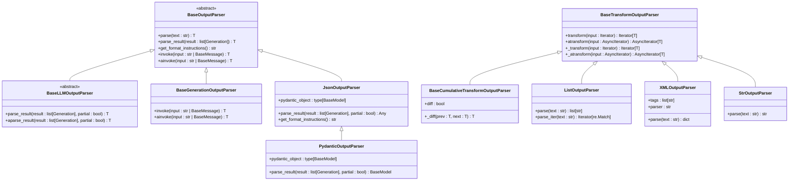

**图表来源**
- [libs/core/langchain_core/output_parsers/base.py](file://libs/core/langchain_core/output_parsers/base.py#L25-L333)
- [libs/core/langchain_core/output_parsers/json.py](file://libs/core/langchain_core/output_parsers/json.py#L25-L132)
- [libs/core/langchain_core/output_parsers/pydantic.py](file://libs/core/langchain_core/output_parsers/pydantic.py#L15-L128)
- [libs/core/langchain_core/output_parsers/list.py](file://libs/core/langchain_core/output_parsers/list.py#L45-L249)
- [libs/core/langchain_core/output_parsers/xml.py](file://libs/core/langchain_core/output_parsers/xml.py#L175-L290)
- [libs/core/langchain_core/output_parsers/string.py](file://libs/core/langchain_core/output_parsers/string.py#L8-L37)

## 基础类层次结构

### BaseOutputParser

所有输出解析器的基础抽象类，提供了核心的解析接口：

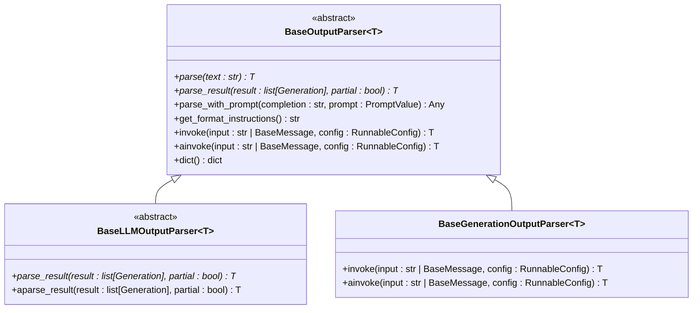

**节来源**
- [libs/core/langchain_core/output_parsers/base.py](file://libs/core/langchain_core/output_parsers/base.py#L25-L150)

### 核心方法说明

1. **parse(text: str)**: 解析单个字符串输出
2. **parse_result(result: list[Generation])**: 解析Generation对象列表
3. **get_format_instructions()**: 返回格式说明指令
4. **invoke()**: 支持链式调用的入口方法

## 内置输出解析器

### JSON解析器

#### JsonOutputParser

最常用的JSON解析器，支持完整和部分JSON解析：

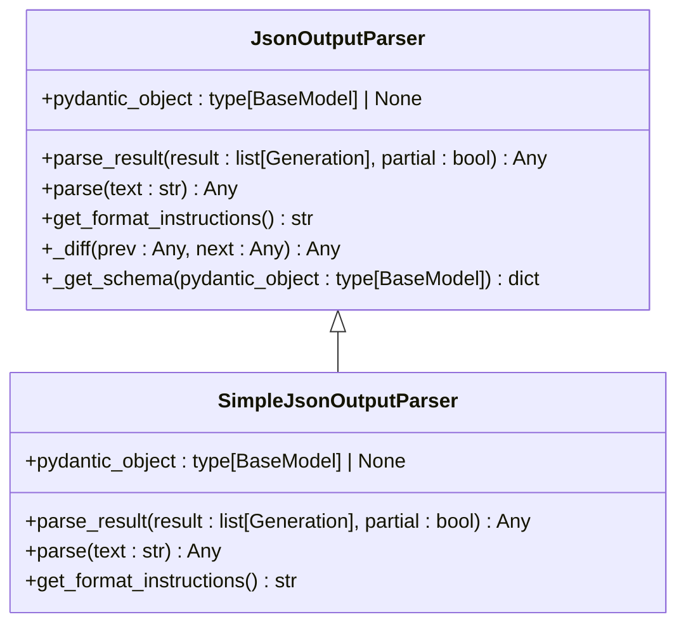

**节来源**
- [libs/core/langchain_core/output_parsers/json.py](file://libs/core/langchain_core/output_parsers/json.py#L25-L132)

#### PydanticOutputParser

基于Pydantic模型的强类型JSON解析器：

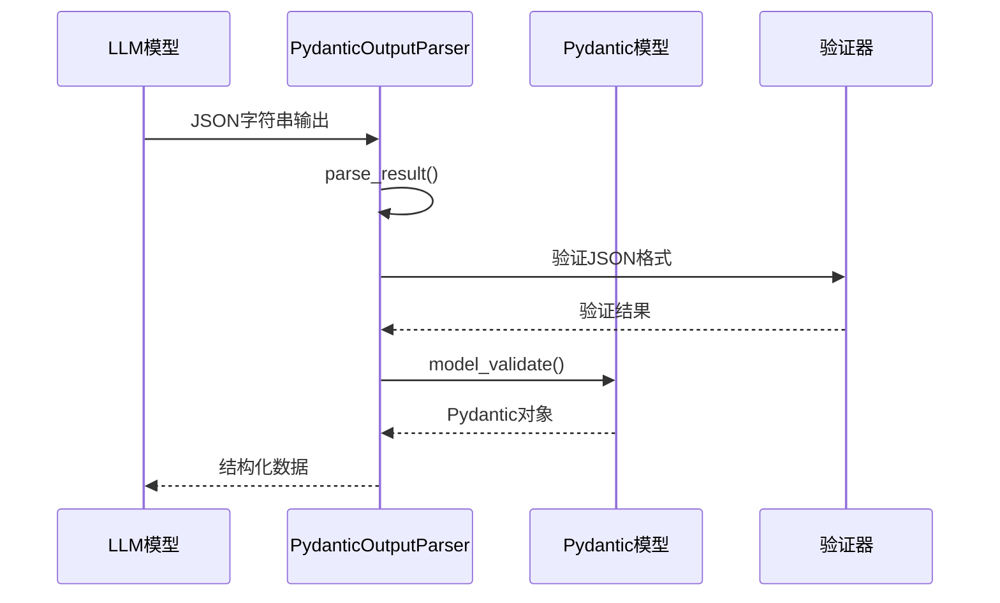

**节来源**
- [libs/core/langchain_core/output_parsers/pydantic.py](file://libs/core/langchain_core/output_parsers/pydantic.py#L15-L128)

### 列表解析器

#### ListOutputParser系列

提供多种列表格式的解析能力：

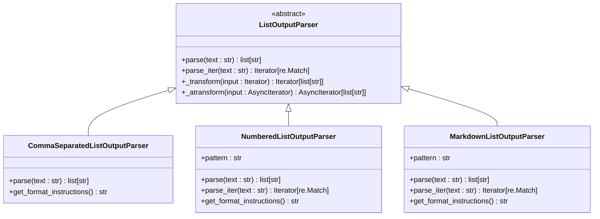

**节来源**
- [libs/core/langchain_core/output_parsers/list.py](file://libs/core/langchain_core/output_parsers/list.py#L45-L249)

### XML解析器

#### XMLOutputParser

支持XML格式解析，包含流式处理能力：

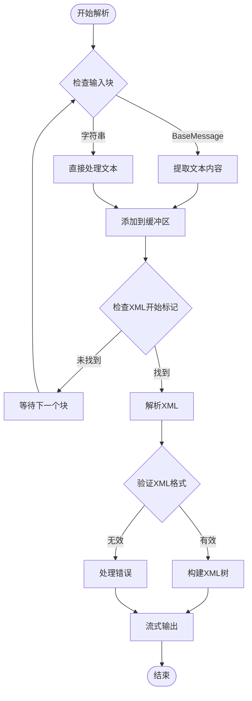

**节来源**
- [libs/core/langchain_core/output_parsers/xml.py](file://libs/core/langchain_core/output_parsers/xml.py#L175-L290)

### 字符串解析器

#### StrOutputParser

最简单的解析器，直接返回原始文本：

**节来源**
- [libs/core/langchain_core/output_parsers/string.py](file://libs/core/langchain_core/output_parsers/string.py#L8-L37)

## 高级功能特性

### 流式处理

BaseTransformOutputParser及其子类支持流式处理：

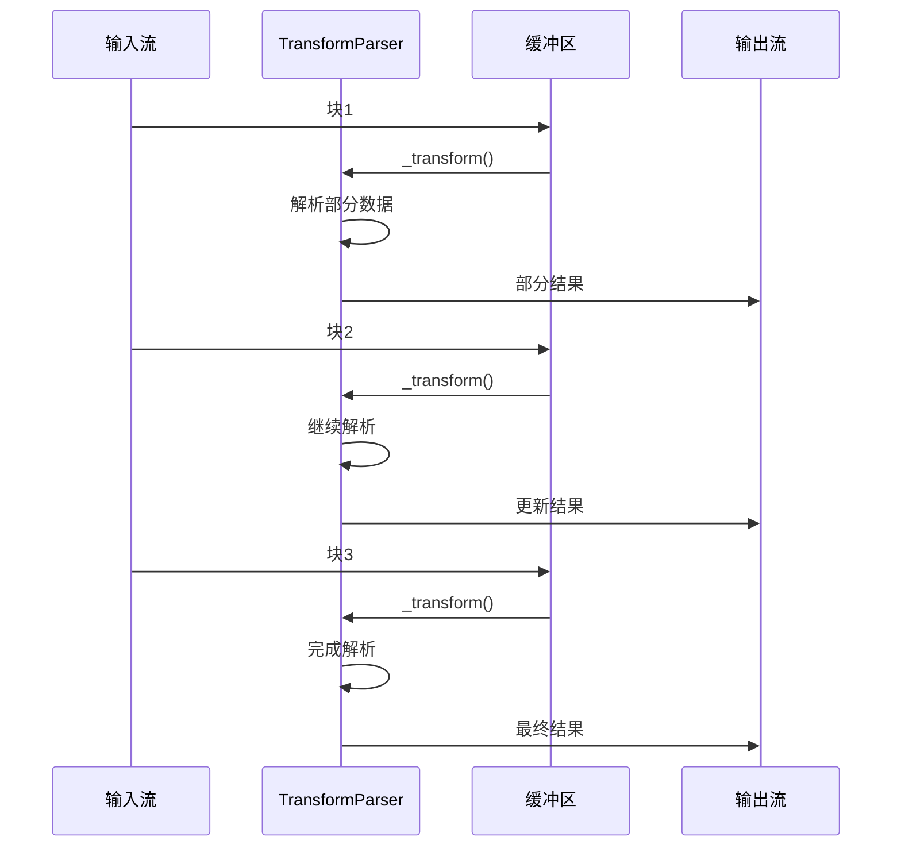

**节来源**
- [libs/core/langchain_core/output_parsers/transform.py](file://libs/core/langchain_core/output_parsers/transform.py#L20-L175)

### 累积变换解析器

BaseCumulativeTransformOutputParser提供累积解析能力：

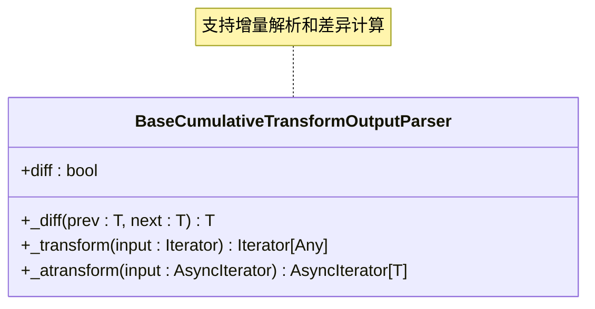

**节来源**
- [libs/core/langchain_core/output_parsers/transform.py](file://libs/core/langchain_core/output_parsers/transform.py#L85-L175)

### OpenAI工具解析器

#### JsonOutputToolsParser

解析OpenAI工具调用格式：

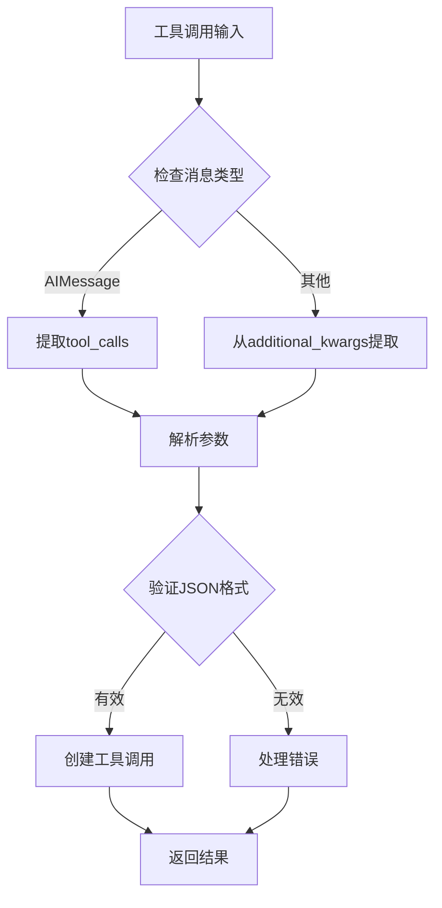

**节来源**
- [libs/core/langchain_core/output_parsers/openai_tools.py](file://libs/core/langchain_core/output_parsers/openai_tools.py#L120-L200)

## 与Prompt Engineering的协同

### 格式说明指令

每个解析器都提供格式说明指令，用于引导LLM生成正确的输出格式：

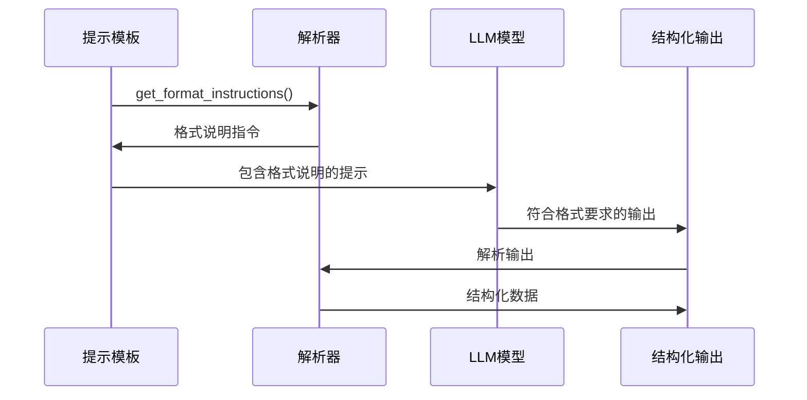

**节来源**
- [libs/core/langchain_core/output_parsers/format_instructions.py](file://libs/core/langchain_core/output_parsers/format_instructions.py#L3-L11)

### 最佳实践

1. **明确的格式要求**：在提示中明确指定期望的输出格式
2. **示例提供**：提供格式良好的示例输出
3. **约束条件**：限制可能的输出值范围
4. **错误处理**：设计合理的错误恢复策略

## 自定义解析器开发

### 开发步骤

1. **继承基础类**：选择合适的基类继承
2. **实现核心方法**：实现parse方法
3. **错误处理**：添加适当的异常处理
4. **格式说明**：实现get_format_instructions方法
5. **序列化支持**：实现_type属性

### 示例：自定义解析器

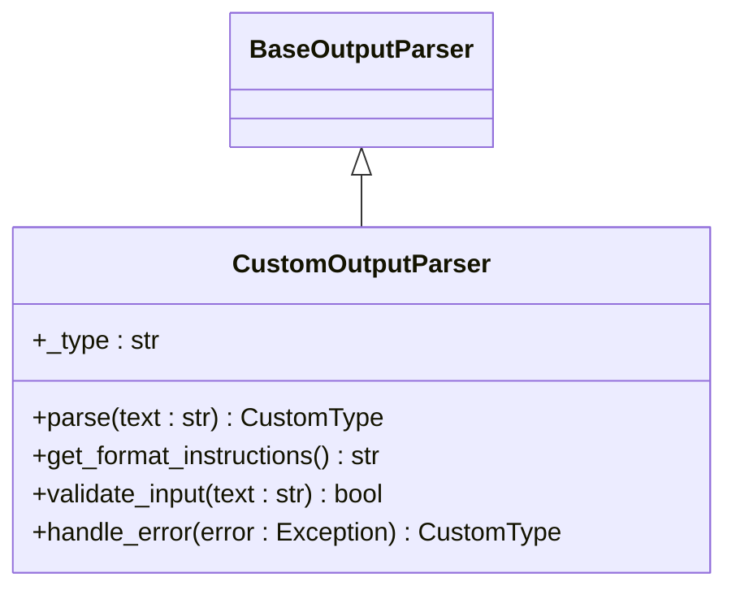

### 开发原则

1. **单一职责**：每个解析器专注于特定的输出格式
2. **健壮性**：处理各种边缘情况和错误输入
3. **性能优化**：考虑大文本和流式处理场景
4. **可扩展性**：设计易于扩展的架构

## 最佳实践

### 选择合适的解析器

| 场景 | 推荐解析器 | 原因 |
|------|------------|------|
| JSON数据 | JsonOutputParser | 标准格式，广泛支持 |
| 强类型验证 | PydanticOutputParser | 类型安全，自动验证 |
| 列表数据 | ListOutputParser系列 | 多种格式支持 |
| XML数据 | XMLOutputParser | 结构化文档解析 |
| 简单文本 | StrOutputParser | 最小开销 |

### 错误处理策略

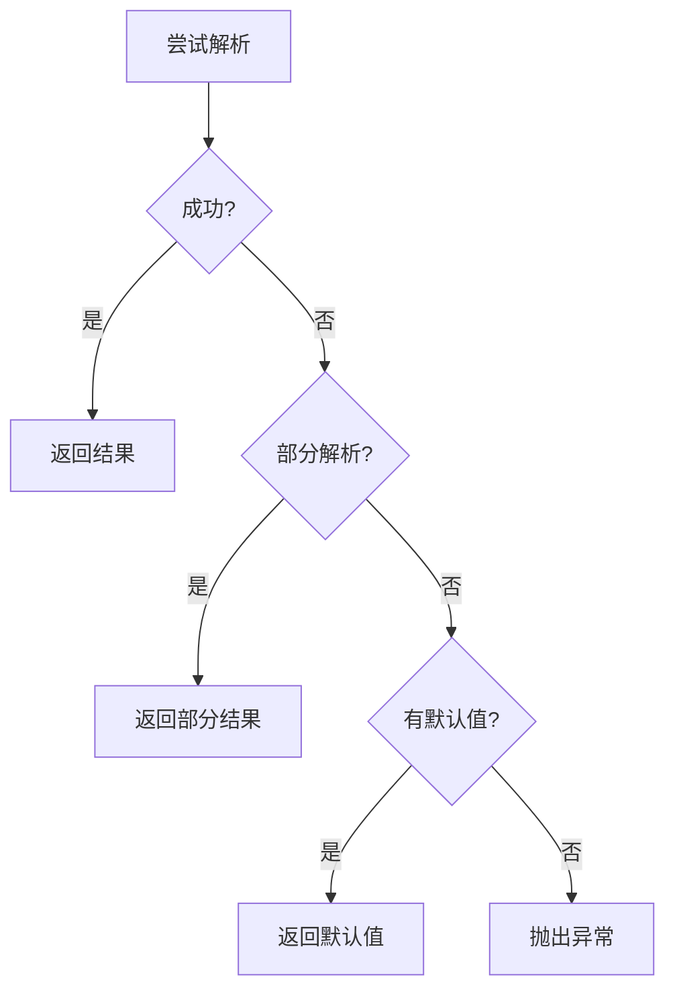

### 性能优化建议

1. **缓存机制**：缓存解析结果避免重复计算
2. **流式处理**：对于大文本使用流式解析
3. **异步支持**：充分利用异步解析能力
4. **内存管理**：及时释放不需要的资源

## 故障排除指南

### 常见问题及解决方案

| 问题 | 可能原因 | 解决方案 |
|------|----------|----------|
| JSON解析失败 | 格式不正确 | 检查格式说明，提供示例 |
| 类型验证错误 | 数据类型不符 | 调整Pydantic模型定义 |
| 流式解析中断 | 输入不完整 | 实现重试机制 |
| 性能问题 | 复杂解析逻辑 | 优化解析算法 |

### 调试技巧

1. **日志记录**：启用详细的日志记录
2. **单元测试**：编写全面的测试用例
3. **边界测试**：测试各种边界情况
4. **性能监控**：监控解析性能指标

**节来源**
- [libs/core/tests/unit_tests/output_parsers/test_json.py](file://libs/core/tests/unit_tests/output_parsers/test_json.py#L50-L100)

## 总结

LangChain Output Parsers 提供了一个强大而灵活的框架，用于将LLM的非结构化输出转换为结构化数据。通过合理选择和配置不同的解析器，可以显著提高应用程序的可靠性和用户体验。

### 关键优势

1. **多样化支持**：支持多种输出格式和数据类型
2. **流式处理**：提供实时流式解析能力
3. **类型安全**：通过Pydantic等框架确保类型安全
4. **错误恢复**：完善的错误处理和恢复机制
5. **可扩展性**：易于开发自定义解析器

### 发展方向

随着LLM技术的发展，Output Parsers将继续演进，支持更多复杂的输出格式和更智能的解析策略。开发者应该关注最新的功能更新，并根据具体需求选择最适合的解析器组合。