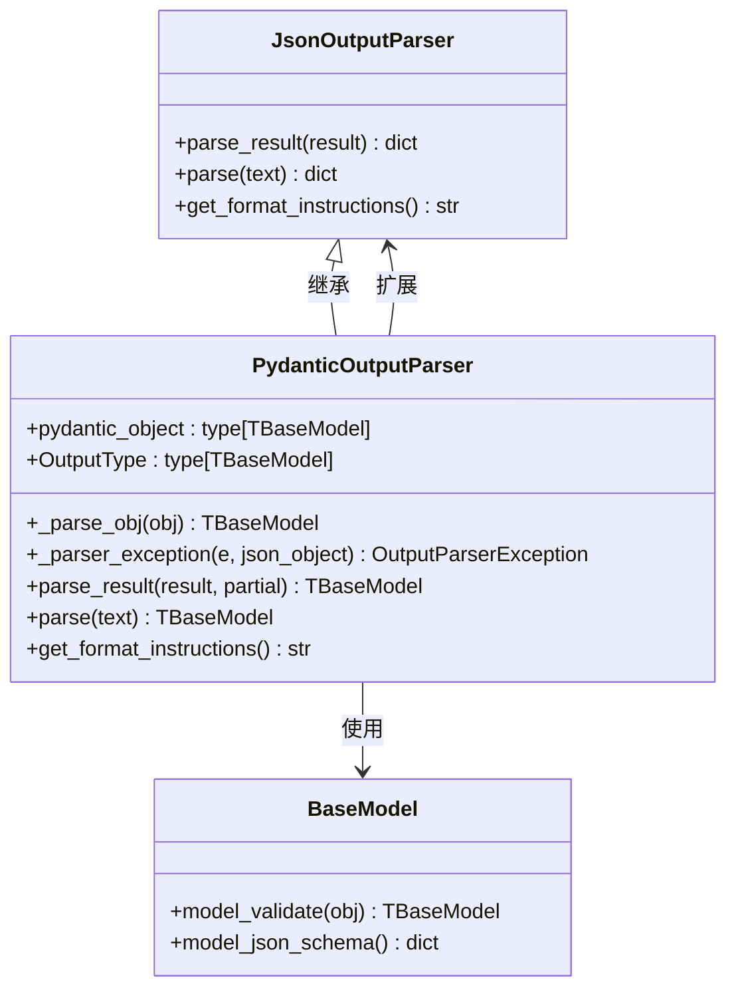
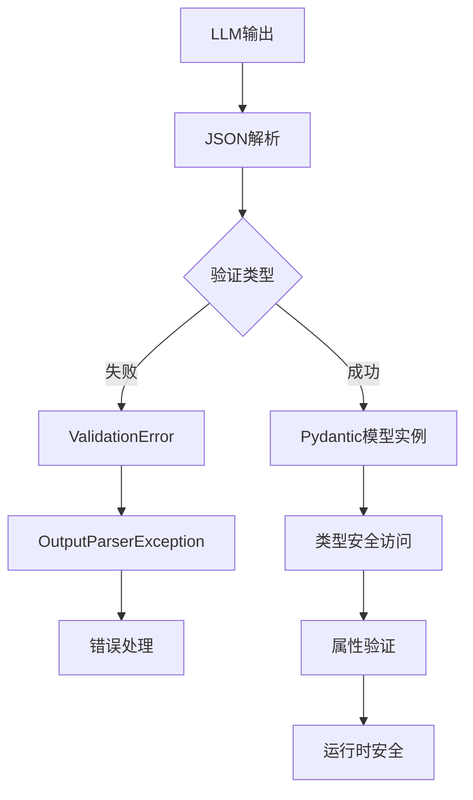
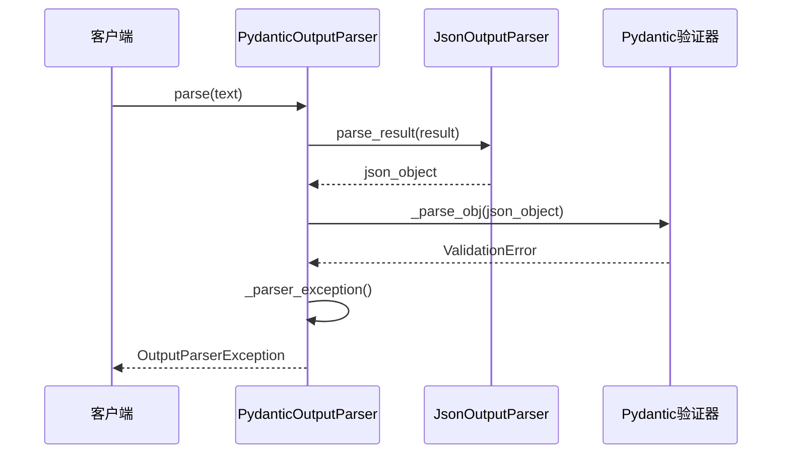
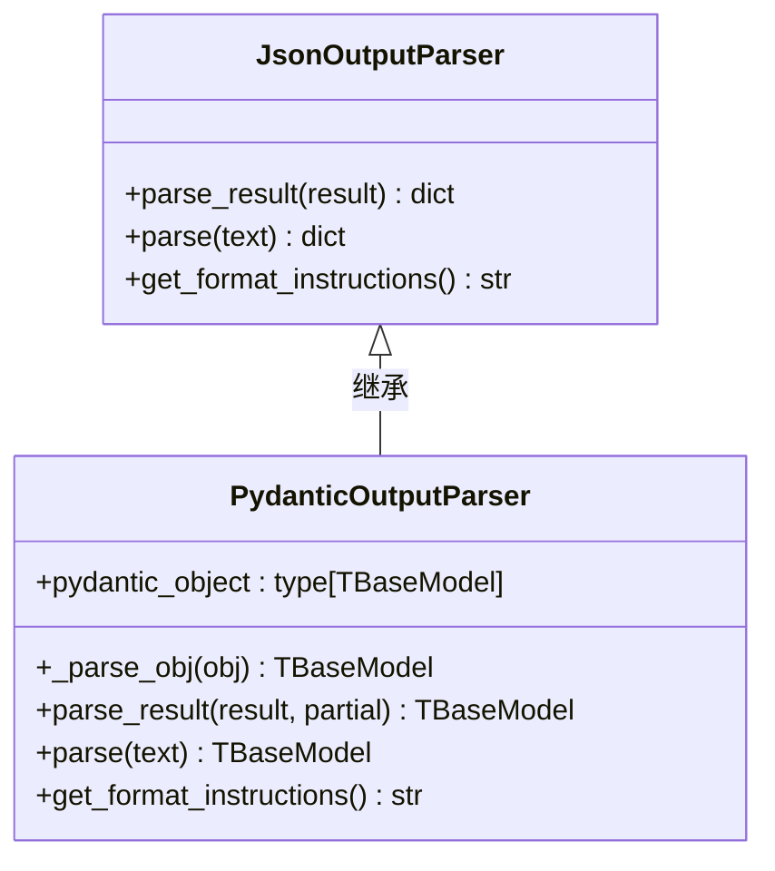

# Pydantic Output Parser

<cite>
**本文档中引用的文件**
- [pydantic.py](file://libs/core/langchain_core/output_parsers/pydantic.py)
- [pydantic.py](file://libs/core/langchain_core/utils/pydantic.py)
- [test_pydantic_parser.py](file://libs/core/tests/unit_tests/output_parsers/test_pydantic_parser.py)
- [__init__.py](file://libs/core/langchain_core/output_parsers/__init__.py)
- [format_instructions.py](file://libs/core/langchain_core/output_parsers/format_instructions.py)
</cite>

## 目录
1. [简介](#简介)
2. [核心架构](#核心架构)
3. [PydanticOutputParser类详解](#pydanticoutputparser类详解)
4. [使用示例](#使用示例)
5. [优势特性](#优势特性)
6. [错误处理机制](#错误处理机制)
7. [与JsonOutputParser的关系](#与jsonoutputparser的关系)
8. [高级用法](#高级用法)
9. [最佳实践](#最佳实践)
10. [总结](#总结)

## 简介

PydanticOutputParser是LangChain框架中的一个重要组件，专门用于将大型语言模型(LLM)的输出解析为类型安全的Python对象。它基于Pydantic库的强大功能，提供了数据验证、类型提示和自动生成文档等核心优势。

该解析器通过将LLM的JSON输出转换为预定义的Pydantic模型实例，确保了输出数据的结构完整性和类型正确性，这对于需要强类型数据结构的复杂应用场景至关重要。

## 核心架构

PydanticOutputParser的设计采用了继承和组合的模式，充分利用了现有组件的功能：



**图表来源**
- [pydantic.py](file://libs/core/langchain_core/output_parsers/pydantic.py#L17-L129)

**章节来源**
- [pydantic.py](file://libs/core/langchain_core/output_parsers/pydantic.py#L1-L129)

## PydanticOutputParser类详解

### 类定义和泛型支持

PydanticOutputParser是一个泛型类，支持类型推断和静态类型检查：

```python
class PydanticOutputParser(JsonOutputParser, Generic[TBaseModel]):
    """使用Pydantic模型解析输出。"""
    
    pydantic_object: Annotated[type[TBaseModel], SkipValidation()]
    """要解析的Pydantic模型。"""
```

### 核心方法实现

#### 对象解析方法

```python
def _parse_obj(self, obj: dict) -> TBaseModel:
    """将字典对象解析为Pydantic模型实例。"""
    try:
        if issubclass(self.pydantic_object, pydantic.BaseModel):
            return self.pydantic_object.model_validate(obj)
        if issubclass(self.pydantic_object, pydantic.v1.BaseModel):
            return self.pydantic_object.parse_obj(obj)
        msg = f"Unsupported model version for PydanticOutputParser: \
                    {self.pydantic_object.__class__}"
        raise OutputParserException(msg)
    except (pydantic.ValidationError, pydantic.v1.ValidationError) as e:
        raise self._parser_exception(e, obj) from e
```

#### 结果解析方法

```python
def parse_result(
    self, result: list[Generation], *, partial: bool = False
) -> TBaseModel | None:
    """解析LLM调用的结果为Pydantic对象。
    
    Args:
        result: LLM调用的结果
        partial: 是否解析部分JSON对象
        
    Returns:
        解析后的Pydantic对象或None（如果partial=True且解析失败）
    """
```

#### 格式说明生成

```python
def get_format_instructions(self) -> str:
    """返回JSON输出的格式说明。
    
    返回:
        JSON输出的格式说明
    """
    # 复制模式以避免修改原始Pydantic模式
    schema = dict(self.pydantic_object.model_json_schema().items())
    
    # 移除额外字段
    reduced_schema = schema
    if "title" in reduced_schema:
        del reduced_schema["title"]
    if "type" in reduced_schema:
        del reduced_schema["type"]
    
    # 确保上下文中的json具有正确的双引号
    schema_str = json.dumps(reduced_schema, ensure_ascii=False)
    
    return _PYDANTIC_FORMAT_INSTRUCTIONS.format(schema=schema_str)
```

**章节来源**
- [pydantic.py](file://libs/core/langchain_core/output_parsers/pydantic.py#L17-L129)

## 使用示例

### 基础使用示例

以下展示了如何定义Pydantic模型并使用PydanticOutputParser进行解析：

```python
# 定义Pydantic模型
class WeatherForecast(BaseModel):
    temperature: int
    condition: str
    humidity: float
    wind_speed: float

# 创建解析器实例
parser = PydanticOutputParser(pydantic_object=WeatherForecast)

# 解析LLM输出
llm_output = '{"temperature": 25, "condition": "晴朗", "humidity": 60.5, "wind_speed": 15.2}'
result = parser.parse(llm_output)
```

### 链式使用示例

```python
# 创建提示模板
prompt = PromptTemplate(
    template="""
    请根据以下天气数据生成预报：
    温度: {temperature}°C
    湿度: {humidity}%
    风速: {wind_speed} km/h
    
    输出格式要求:
    {format_instructions}
    """,
    input_variables=["temperature", "humidity", "wind_speed"],
    partial_variables={"format_instructions": parser.get_format_instructions()}
)

# 构建链
chain = prompt | model | parser

# 执行链
result = chain.invoke({
    "temperature": 22,
    "humidity": 75,
    "wind_speed": 10
})
```

### 错误处理示例

```python
try:
    # 尝试解析无效的JSON
    invalid_output = '{"temperature": "high", "condition": "rainy"}'
    result = parser.parse(invalid_output)
except OutputParserException as e:
    print(f"解析失败: {e}")
    # 可以在这里添加重试逻辑或错误恢复策略
```

**章节来源**
- [test_pydantic_parser.py](file://libs/core/tests/unit_tests/output_parsers/test_pydantic_parser.py#L150-L193)

## 优势特性

### 1. 数据验证

PydanticOutputParser提供了强大的数据验证功能：



**图表来源**
- [pydantic.py](file://libs/core/langchain_core/output_parsers/pydantic.py#L25-L35)

### 2. 类型提示支持

```python
# 静态类型检查支持
parser: PydanticOutputParser[WeatherForecast] = PydanticOutputParser(
    pydantic_object=WeatherForecast
)

# IDE智能提示
result: WeatherForecast = parser.parse(output)
temperature: int = result.temperature  # 自动类型提示
```

### 3. 自动生成文档

```python
# 获取格式说明
instructions = parser.get_format_instructions()
print(instructions)
# 输出包含JSON模式的详细格式说明
```

### 4. 向后兼容性

支持Pydantic v1和v2版本：

```python
# 自动检测Pydantic版本
if issubclass(model_class, pydantic.BaseModel):
    # Pydantic v2
    return model_class.model_validate(obj)
elif issubclass(model_class, pydantic.v1.BaseModel):
    # Pydantic v1
    return model_class.parse_obj(obj)
```

**章节来源**
- [pydantic.py](file://libs/core/langchain_core/utils/pydantic.py#L60-L85)

## 错误处理机制

### 解析异常处理

PydanticOutputParser实现了完善的错误处理机制：



**图表来源**
- [pydantic.py](file://libs/core/langchain_core/output_parsers/pydantic.py#L25-L35)

### 异常类型和消息

```python
def _parser_exception(self, e: Exception, json_object: dict) -> OutputParserException:
    """创建解析异常。
    
    Args:
        e: 原始异常
        json_object: 导致异常的JSON对象
        
    Returns:
        包含详细信息的OutputParserException
    """
    json_string = json.dumps(json_object)
    name = self.pydantic_object.__name__
    msg = f"Failed to parse {name} from completion {json_string}. Got: {e}"
    return OutputParserException(msg, llm_output=json_string)
```

### 部分解析支持

```python
# 支持部分解析，即使某些字段缺失也能返回已解析的部分
result = parser.parse_result(generations, partial=True)
if result is None:
    # 处理部分解析的情况
    print("部分解析完成")
```

**章节来源**
- [pydantic.py](file://libs/core/langchain_core/output_parsers/pydantic.py#L36-L45)

## 与JsonOutputParser的关系

PydanticOutputParser与JsonOutputParser有着密切的关系：



**图表来源**
- [pydantic.py](file://libs/core/langchain_core/output_parsers/pydantic.py#L17-L129)

### 关键区别

| 特性 | JsonOutputParser | PydanticOutputParser |
|------|------------------|---------------------|
| 输出类型 | dict | Pydantic模型实例 |
| 类型安全 | ✗ | ✓ |
| 数据验证 | 基本JSON验证 | 完整的Pydantic验证 |
| 字段约束 | 无 | 支持字段类型、默认值、必填等 |
| 错误信息 | 基本JSON错误 | 详细的字段级验证错误 |

### 使用场景对比

```python
# JsonOutputParser - 基础JSON解析
json_parser = JsonOutputParser()
json_result = json_parser.parse('{"key": "value"}')
# 返回: {'key': 'value'}

# PydanticOutputParser - 类型安全解析
class MyModel(BaseModel):
    key: str
    count: int = 0

pydantic_parser = PydanticOutputParser(pydantic_object=MyModel)
pydantic_result = pydantic_parser.parse('{"key": "value", "count": 5}')
# 返回: MyModel(key='value', count=5)
```

**章节来源**
- [test_pydantic_parser.py](file://libs/core/tests/unit_tests/output_parsers/test_pydantic_parser.py#L77-L102)

## 高级用法

### 泛型类型推断

```python
# 使用泛型支持进行类型推断
parser = PydanticOutputParser[WeatherForecast](pydantic_object=WeatherForecast)

# OutputType属性提供类型信息
assert parser.OutputType is WeatherForecast
```

### 复杂模型嵌套

```python
class Address(BaseModel):
    street: str
    city: str
    zip_code: str

class Person(BaseModel):
    name: str
    age: int
    address: Address
    phone_numbers: list[str] = []

# 使用嵌套模型
parser = PydanticOutputParser(pydantic_object=Person)
result = parser.parse("""
{
    "name": "张三",
    "age": 30,
    "address": {
        "street": "长安街1号",
        "city": "北京",
        "zip_code": "100000"
    },
    "phone_numbers": ["13800138000"]
}
""")
```

### 自定义验证规则

```python
class Temperature(BaseModel):
    value: float = Field(ge=-273.15, le=1000)  # 开尔文温度范围
    unit: Literal["C", "F", "K"] = "C"
    
    @validator('value')
    def validate_temperature(cls, v, values):
        if values.get('unit') == 'F':
            return (v - 32) * 5/9  # 转换为摄氏度
        return v

parser = PydanticOutputParser(pydantic_object=Temperature)
```

### 部分解析处理

```python
# 处理部分完成的JSON
def handle_partial_result(parser, generations):
    try:
        return parser.parse_result(generations, partial=False)
    except OutputParserException:
        # 尝试部分解析
        partial_result = parser.parse_result(generations, partial=True)
        if partial_result:
            # 处理部分结果
            return partial_result
        raise
```

## 最佳实践

### 1. 模型设计原则

```python
# 良好的模型设计
class Product(BaseModel):
    id: str = Field(pattern=r'^[A-Z]{2}-\d{6}$')  # 正则表达式验证
    name: str = Field(min_length=1, max_length=100)
    price: float = Field(gt=0, decimal_places=2)
    category: CategoryEnum
    tags: list[str] = Field(default_factory=list, min_items=0, max_items=10)
    
    @validator('price')
    def validate_price(cls, v):
        return round(v, 2)  # 保留两位小数
```

### 2. 错误处理策略

```python
def robust_parse(parser, text, max_retries=3):
    """健壮的解析函数，包含重试机制"""
    for attempt in range(max_retries):
        try:
            return parser.parse(text)
        except OutputParserException as e:
            if attempt == max_retries - 1:
                raise
            # 记录错误日志
            logger.warning(f"解析尝试 {attempt + 1} 失败: {e}")
            # 可以在这里添加修复逻辑
            text = fix_json_syntax(text)
    raise RuntimeError("达到最大重试次数")
```

### 3. 性能优化

```python
# 缓存解析器实例
@lru_cache(maxsize=10)
def get_parser_cache(model_class):
    return PydanticOutputParser(pydantic_object=model_class)

# 在链中复用解析器
def create_weather_chain():
    parser = PydanticOutputParser(pydantic_object=WeatherForecast)
    return prompt | model | parser
```

### 4. 测试策略

```python
def test_pydantic_parser():
    """全面的解析器测试"""
    parser = PydanticOutputParser(pydantic_object=TestModel)
    
    # 测试有效输入
    valid_input = '{"action": "Update", "action_input": "test"}'
    result = parser.parse(valid_input)
    assert isinstance(result, TestModel)
    
    # 测试无效输入
    invalid_input = '{"action": "invalid", "action_input": "test"}'
    with pytest.raises(OutputParserException):
        parser.parse(invalid_input)
    
    # 测试部分解析
    partial_input = '{"action": "Update"}'
    result = parser.parse_result([Generation(text=partial_input)], partial=True)
    assert result is None or isinstance(result, TestModel)
```

### 5. 文档和格式说明

```python
def generate_documentation(parser):
    """生成解析器的详细文档"""
    instructions = parser.get_format_instructions()
    schema = parser.get_output_schema().model_json_schema()
    
    doc = f"""
    # PydanticOutputParser 文档
    
    ## 格式说明
    {instructions}
    
    ## 输出模式
    ```json
    {json.dumps(schema, indent=2)}
    ```
    
    ## 使用示例
    ```python
    parser = PydanticOutputParser(pydantic_object=YourModel)
    result = parser.parse(your_input)
    ```
    """
    return doc
```

## 总结

PydanticOutputParser是LangChain框架中一个强大而灵活的组件，它将LLM的输出转换为类型安全的Python对象。其主要优势包括：

1. **类型安全**: 通过Pydantic模型确保数据的类型正确性和完整性
2. **自动验证**: 提供字段级别的验证和错误报告
3. **向后兼容**: 支持Pydantic v1和v2版本
4. **格式说明**: 自动生成详细的输出格式说明
5. **错误处理**: 完善的异常处理和错误恢复机制
6. **性能优化**: 支持部分解析和缓存机制

在需要强类型数据结构的复杂应用中，PydanticOutputParser能够显著提高代码的可靠性和可维护性。通过合理的模型设计、错误处理策略和测试实践，可以充分发挥其优势，构建高质量的AI应用系统。

对于开发者而言，掌握PydanticOutputParser的使用不仅能够提升代码质量，还能够更好地利用LLM的能力，构建更加稳定和可靠的AI应用程序。