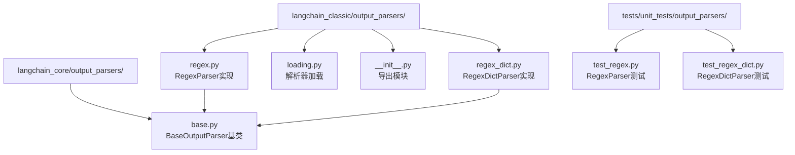
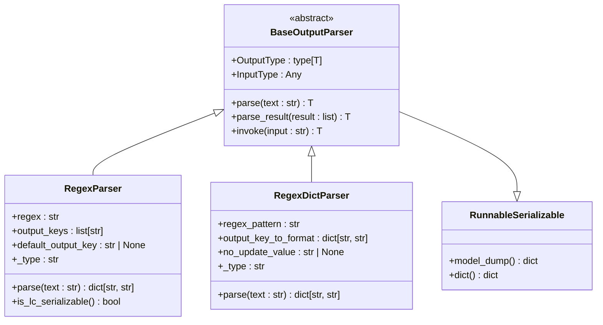
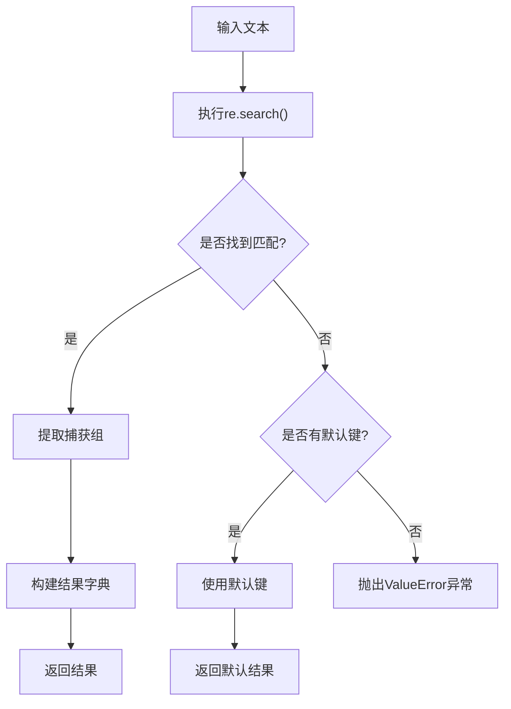
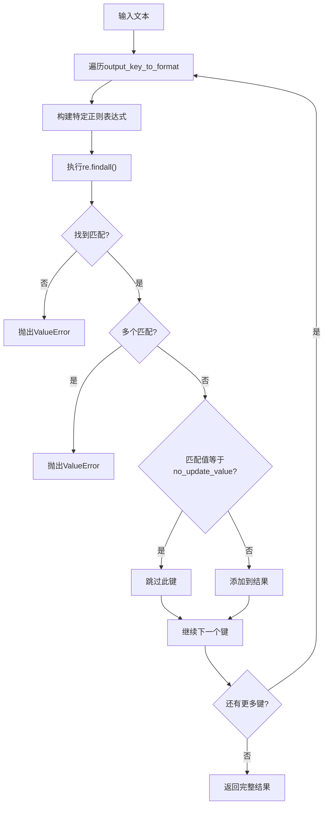
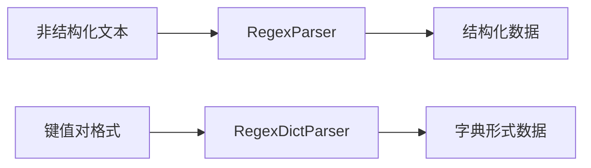
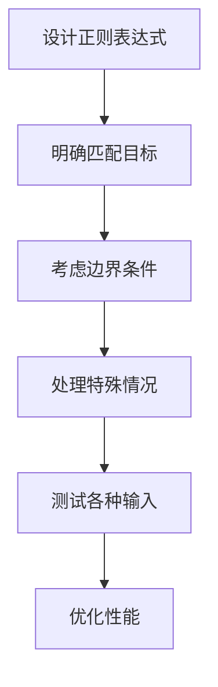
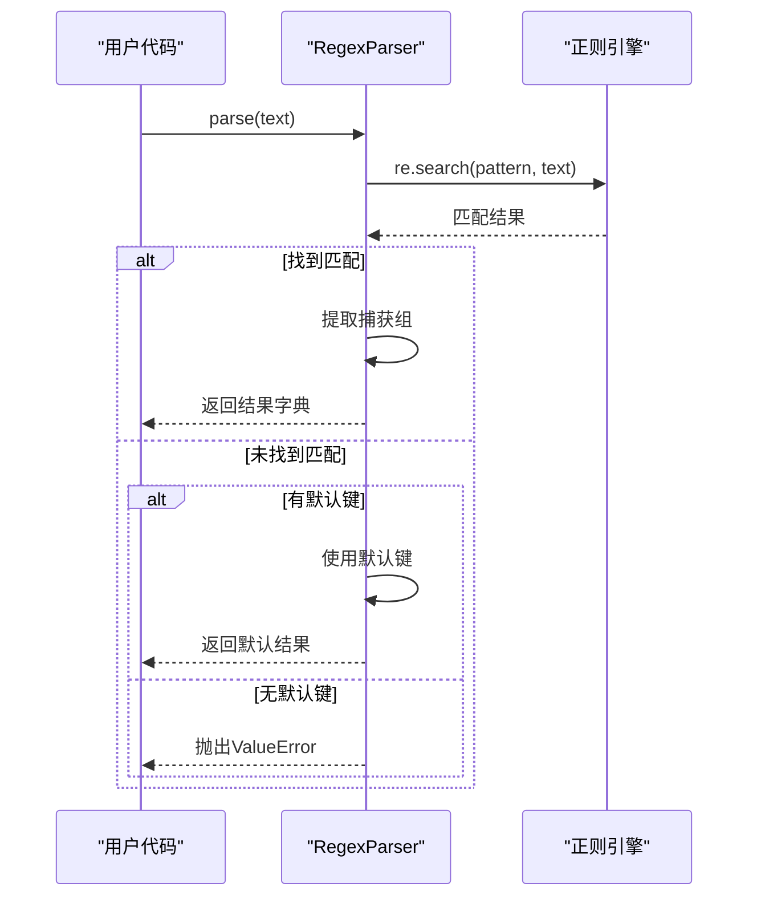
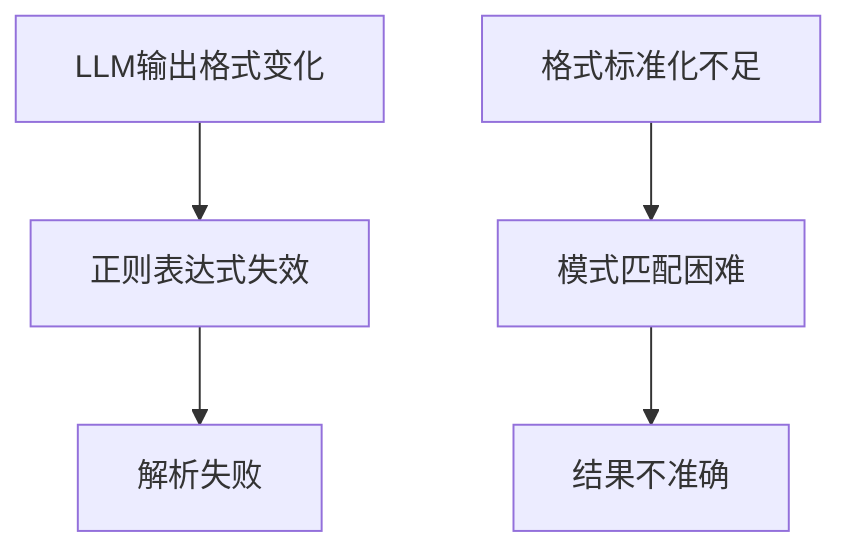
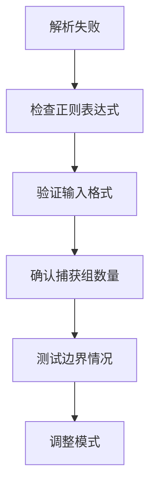

# Regex Output Parser

<cite>
**本文档中引用的文件**
- [regex.py](file://libs/langchain/langchain_classic/output_parsers/regex.py)
- [regex_dict.py](file://libs/langchain/langchain_classic/output_parsers/regex_dict.py)
- [base.py](file://libs/core/langchain_core/output_parsers/base.py)
- [test_regex.py](file://libs/langchain/tests/unit_tests/output_parsers/test_regex.py)
- [test_regex_dict.py](file://libs/langchain/tests/unit_tests/output_parsers/test_regex_dict.py)
- [map_rerank.py](file://libs/langchain/langchain_classic/chains/combine_documents/map_rerank.py)
- [loading.py](file://libs/langchain/langchain_classic/output_parsers/loading.py)
- [__init__.py](file://libs/langchain/langchain_classic/output_parsers/__init__.py)
</cite>

## 目录
1. [简介](#简介)
2. [项目结构](#项目结构)
3. [核心组件](#核心组件)
4. [架构概览](#架构概览)
5. [详细组件分析](#详细组件分析)
6. [使用场景与应用](#使用场景与应用)
7. [最佳实践](#最佳实践)
8. [局限性与注意事项](#局限性与注意事项)
9. [故障排除指南](#故障排除指南)
10. [结论](#结论)

## 简介

Regex Output Parser是LangChain框架中的一个重要组件，专门用于从大型语言模型（LLM）生成的文本中提取特定模式的数据。它提供了两种主要的解析器实现：`RegexParser`和`RegexDictParser`，每种都有其独特的用途和优势。

该组件的核心价值在于：
- **灵活的数据提取**：能够从非结构化文本中提取结构化数据
- **模式匹配能力**：支持复杂的正则表达式模式
- **错误处理机制**：提供优雅的失败处理策略
- **可扩展架构**：基于抽象基类设计，易于扩展

## 项目结构

Regex Output Parser在LangChain项目中的组织结构如下：



**图表来源**
- [regex.py](file://libs/langchain/langchain_classic/output_parsers/regex.py#L1-L41)
- [regex_dict.py](file://libs/langchain/langchain_classic/output_parsers/regex_dict.py#L1-L43)
- [base.py](file://libs/core/langchain_core/output_parsers/base.py#L1-L334)

**章节来源**
- [__init__.py](file://libs/langchain/langchain_classic/output_parsers/__init__.py#L1-L83)

## 核心组件

Regex Output Parser包含两个主要的解析器类，它们都继承自`BaseOutputParser`抽象基类：

### RegexParser
负责使用预定义的正则表达式模式从LLM输出中提取指定键值对的数据。

### RegexDictParser  
通过字典映射的方式，根据预期格式自动构建正则表达式并提取数据。

**章节来源**
- [regex.py](file://libs/langchain/langchain_classic/output_parsers/regex.py#L8-L41)
- [regex_dict.py](file://libs/langchain/langchain_classic/output_parsers/regex_dict.py#L7-L43)

## 架构概览

Regex Output Parser采用分层架构设计，确保了良好的可扩展性和维护性：



**图表来源**
- [base.py](file://libs/core/langchain_core/output_parsers/base.py#L120-L334)
- [regex.py](file://libs/langchain/langchain_classic/output_parsers/regex.py#L8-L41)
- [regex_dict.py](file://libs/langchain/langchain_classic/output_parsers/regex_dict.py#L7-L43)

## 详细组件分析

### RegexParser详细分析

#### 类结构与属性

```mermaid
classDiagram
class RegexParser {
+regex : str
+output_keys : list[str]
+default_output_key : str | None
+_type : str
+parse(text : str) dict[str, str]
+is_lc_serializable() bool
}
RegexParser : +regex : 正则表达式模式
RegexParser : +output_keys : 输出键名列表
RegexParser : +default_output_key : 默认输出键
RegexParser : +_type : "regex_parser"
```

**图表来源**
- [regex.py](file://libs/langchain/langchain_classic/output_parsers/regex.py#L8-L25)

#### 核心解析逻辑

RegexParser的解析过程遵循以下流程：



**图表来源**
- [regex.py](file://libs/langchain/langchain_classic/output_parsers/regex.py#L27-L41)

#### 使用示例

以下是RegexParser的基本使用模式：

```python
# 基本配置示例路径
# [test_regex.py](file://libs/langchain/tests/unit_tests/output_parsers/test_regex.py#L20-L30)
```

**章节来源**
- [regex.py](file://libs/langchain/langchain_classic/output_parsers/regex.py#L1-L41)
- [test_regex.py](file://libs/langchain/tests/unit_tests/output_parsers/test_regex.py#L1-L37)

### RegexDictParser详细分析

#### 类结构与属性

```mermaid
classDiagram
class RegexDictParser {
+regex_pattern : str
+output_key_to_format : dict[str, str]
+no_update_value : str | None
+_type : str
+parse(text : str) dict[str, str]
}
RegexDictParser : +regex_pattern : 标准正则模式
RegexDictParser : +output_key_to_format : 键到格式映射
RegexDictParser : +no_update_value : 忽略值
RegexDictParser : +_type : "regex_dict_parser"
```

**图表来源**
- [regex_dict.py](file://libs/langchain/langchain_classic/output_parsers/regex_dict.py#L7-L25)

#### 高级解析逻辑

RegexDictParser采用更复杂的解析策略：



**图表来源**
- [regex_dict.py](file://libs/langchain/langchain_classic/output_parsers/regex_dict.py#L27-L43)

**章节来源**
- [regex_dict.py](file://libs/langchain/langchain_classic/output_parsers/regex_dict.py#L1-L43)
- [test_regex_dict.py](file://libs/langchain/tests/unit_tests/output_parsers/test_regex_dict.py#L1-L49)

## 使用场景与应用

### 主要应用场景

Regex Output Parser在实际应用中具有广泛的用途：

#### 1. 结构化数据提取
从非结构化文本中提取特定格式的数据：



#### 2. 实际应用案例

**案例1：问答系统评分**
```python
# 来自map_rerank.py的实际应用
# [map_rerank.py](file://libs/langchain/langchain_classic/chains/combine_documents/map_rerank.py#L10-L15)
```

**案例2：动作识别**
```python
# 来自test_regex_dict.py的实际应用
# [test_regex_dict.py](file://libs/langchain/tests/unit_tests/output_parsers/test_regex_dict.py#L6-L8)
```

#### 3. 常见提取任务

| 提取类型 | 正则表达式模式 | 应用场景 |
|---------|---------------|----------|
| 日期 | `\d{4}-\d{2}-\d{2}` | 日志分析、时间戳提取 |
| 电话号码 | `\+?(\d[\d-. ]+)?(\(\d{2,3}\)|\d{2,3})[\d-. ]+\d{4}` | 联系方式提取 |
| 邮箱地址 | `[a-zA-Z0-9._%+-]+@[a-zA-Z0-9.-]+\.[a-zA-Z]{2,}` | 用户信息收集 |
| 数字 | `\d+(\.\d+)?` | 统计数据分析 |
| 关键词 | `\b(word1\|word2\|word3)\b` | 文本分类 |

**章节来源**
- [map_rerank.py](file://libs/langchain/langchain_classic/chains/combine_documents/map_rerank.py#L1-L249)
- [test_regex_dict.py](file://libs/langchain/tests/unit_tests/output_parsers/test_regex_dict.py#L1-L49)

## 最佳实践

### 编写健壮的正则表达式

#### 1. 模式设计原则



#### 2. 推荐的模式结构

**安全的日期提取模式：**
```python
# 安全的日期格式匹配
date_pattern = r'\b\d{4}-\d{2}-\d{2}\b'
```

**灵活的电话号码模式：**
```python
# 支持多种格式的电话号码
phone_pattern = r'\+?(\d[\d-. ]+)?(\(\d{2,3}\)|\d{2,3})[\d-. ]+\d{4}'
```

#### 3. 错误处理策略



**图表来源**
- [regex.py](file://libs/langchain/langchain_classic/output_parsers/regex.py#L27-L41)

### 性能优化建议

#### 1. 模式编译
对于重复使用的模式，建议预先编译：

```python
# 预编译正则表达式以提高性能
import re
compiled_pattern = re.compile(r'your_pattern_here')
```

#### 2. 复杂度控制
避免过于复杂的正则表达式，特别是在处理大量文本时。

#### 3. 内存管理
对于大规模数据处理，注意内存使用效率。

**章节来源**
- [regex.py](file://libs/langchain/langchain_classic/output_parsers/regex.py#L27-L41)

## 局限性与注意事项

### 主要限制

#### 1. 对LLM输出格式的敏感性



#### 2. 复杂嵌套结构的挑战

RegexParser更适合简单的键值对提取，对于复杂嵌套结构可能需要额外处理。

#### 3. 错误恢复能力有限

当正则表达式无法匹配时，只能依赖默认输出键，缺乏智能恢复机制。

### 使用注意事项

#### 1. 输入验证
始终验证LLM输出的格式一致性。

#### 2. 模式测试
在生产环境中部署前，充分测试各种可能的输入情况。

#### 3. 错误监控
建立适当的错误监控和日志记录机制。

**章节来源**
- [regex.py](file://libs/langchain/langchain_classic/output_parsers/regex.py#L35-L41)

## 故障排除指南

### 常见问题与解决方案

#### 1. 解析失败问题

**问题症状：**
- `ValueError: Could not parse output: ...`
- 解析结果为空或不完整

**排查步骤：**


#### 2. 匹配不准确

**问题症状：**
- 提取了意外的内容
- 忽略了正确的匹配

**解决方案：**
- 使用更精确的正则表达式
- 添加边界断言
- 考虑使用RegexDictParser

#### 3. 性能问题

**问题症状：**
- 解析速度慢
- 内存使用过高

**优化方法：**
- 预编译正则表达式
- 简化复杂模式
- 分批处理大文本

### 调试技巧

#### 1. 模式验证
使用在线正则表达式测试工具验证模式。

#### 2. 输入样本分析
准备多样化的输入样本进行测试。

#### 3. 渐进式开发
从简单模式开始，逐步增加复杂性。

**章节来源**
- [regex.py](file://libs/langchain/langchain_classic/output_parsers/regex.py#L35-L41)
- [test_regex.py](file://libs/langchain/tests/unit_tests/output_parsers/test_regex.py#L1-L37)

## 结论

Regex Output Parser是LangChain框架中一个强大而灵活的组件，为从LLM输出中提取结构化数据提供了有效解决方案。通过`RegexParser`和`RegexDictParser`两种不同的实现方式，开发者可以根据具体需求选择最适合的工具。

### 主要优势

1. **灵活性高**：支持各种复杂的正则表达式模式
2. **易于集成**：与LangChain生态系统无缝集成
3. **错误处理完善**：提供多种失败处理策略
4. **性能良好**：基于Python标准库的高效实现

### 适用场景

- 结构化数据提取
- 格式化信息识别
- 数据清洗和转换
- 自动化信息抽取

### 发展方向

随着LLM技术的发展，Regex Output Parser将继续演进，可能的发展方向包括：
- 更智能的模式匹配算法
- 自学习的模式优化
- 更好的错误恢复机制
- 与其他解析器的协同工作

通过合理的设计和使用，Regex Output Parser能够显著提升基于LLM的应用程序的数据处理能力和准确性。