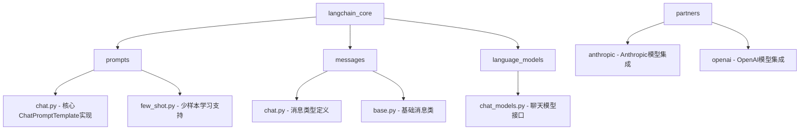
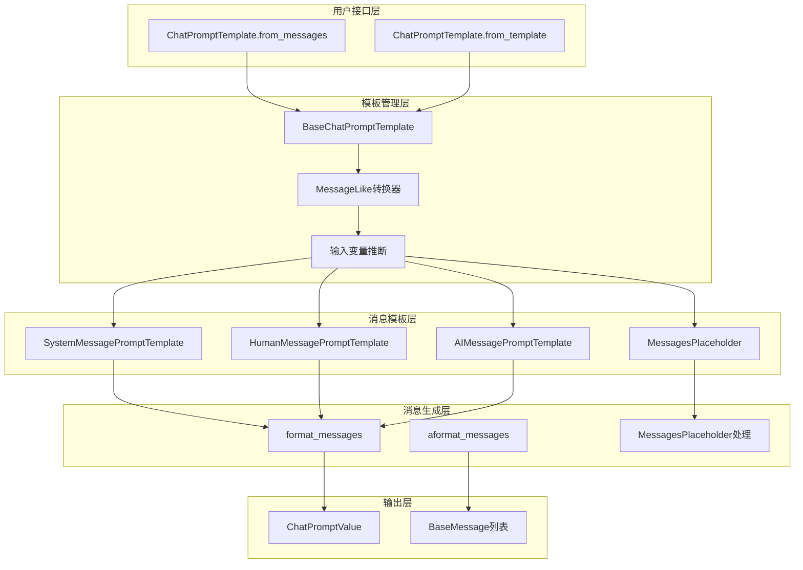
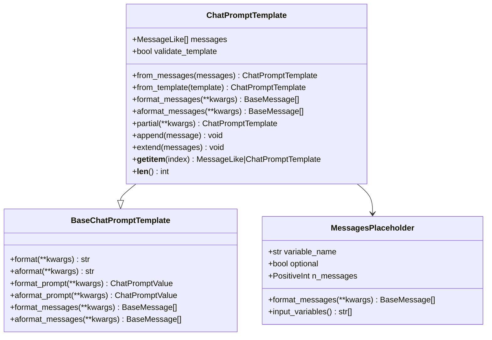
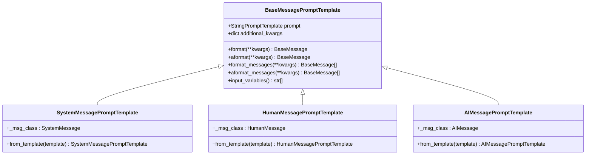
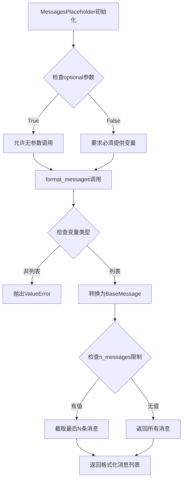
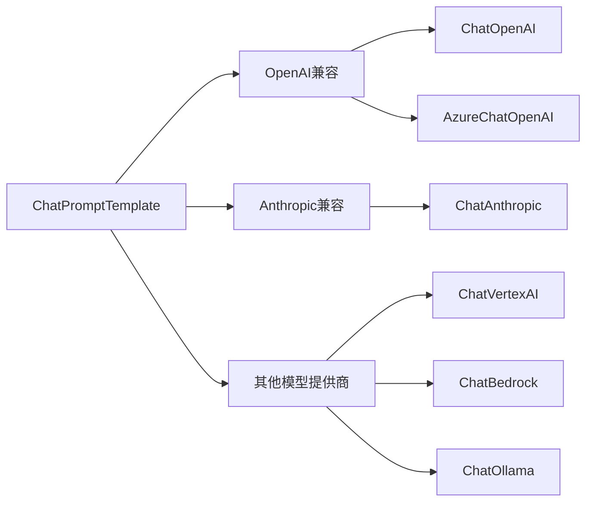
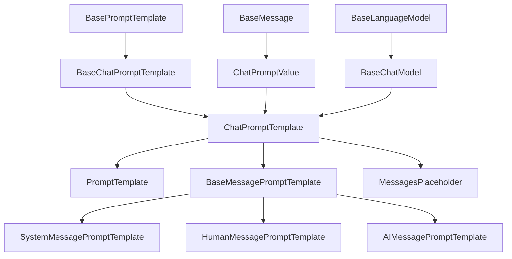

# Chat Prompts

<cite>
**本文档中引用的文件**
- [chat.py](file://libs/core/langchain_core/prompts/chat.py)
- [chat_models.py](file://libs/core/langchain_core/language_models/chat_models.py)
- [chat.py](file://libs/core/langchain_core/messages/chat.py)
- [test_chat.py](file://libs/core/tests/unit_tests/prompts/test_chat.py)
- [few_shot.py](file://libs/core/langchain_core/prompts/few_shot.py)
- [history.py](file://libs/core/langchain_core/runnables/history.py)
- [chat_models.py](file://libs/partners/anthropic/langchain_anthropic/chat_models.py)
</cite>

## 目录
1. [简介](#简介)
2. [项目结构](#项目结构)
3. [核心组件](#核心组件)
4. [架构概览](#架构概览)
5. [详细组件分析](#详细组件分析)
6. [依赖关系分析](#依赖关系分析)
7. [性能考虑](#性能考虑)
8. [故障排除指南](#故障排除指南)
9. [结论](#结论)

## 简介

Chat Prompts是LangChain框架中用于构建对话式AI应用的核心组件。它通过`ChatPromptTemplate`类提供了结构化的消息序列构建能力，能够指导聊天模型的交互行为。该系统支持多种消息类型，包括系统消息、用户消息和AI回复，并提供了灵活的模板化机制来处理聊天历史、动态上下文插入以及与不同聊天模型的兼容性。

Chat Prompts系统的设计理念是将复杂的对话逻辑分解为可重用的消息模板，使得开发者能够轻松构建具有特定行为模式的智能对话系统。通过组合不同的消息提示模板，开发者可以创建从简单的问答系统到复杂的多轮对话代理的各种应用场景。

## 项目结构

Chat Prompts相关的代码主要分布在以下模块中：

**图表来源**
- [chat.py](file://libs/core/langchain_core/prompts/chat.py#L1-L50)
- [chat_models.py](file://libs/core/langchain_core/language_models/chat_models.py#L1-L50)

**章节来源**
- [chat.py](file://libs/core/langchain_core/prompts/chat.py#L1-L100)
- [chat_models.py](file://libs/core/langchain_core/language_models/chat_models.py#L1-L100)

## 核心组件

Chat Prompts系统包含以下核心组件：

### ChatPromptTemplate
这是整个系统的核心类，负责管理消息模板的集合和格式化过程。

### 消息提示模板类型
- **SystemMessagePromptTemplate**: 系统消息模板
- **HumanMessagePromptTemplate**: 用户消息模板  
- **AIMessagePromptTemplate**: AI回复消息模板
- **ChatMessagePromptTemplate**: 自定义角色消息模板

### MessagesPlaceholder
用于处理可变长度的消息序列，支持聊天历史的动态插入。

**章节来源**
- [chat.py](file://libs/core/langchain_core/prompts/chat.py#L600-L700)
- [chat.py](file://libs/core/langchain_core/messages/chat.py#L1-L65)

## 架构概览

Chat Prompts系统采用分层架构设计，确保了灵活性和可扩展性：

**图表来源**
- [chat.py](file://libs/core/langchain_core/prompts/chat.py#L1000-L1200)
- [chat.py](file://libs/core/langchain_core/prompts/chat.py#L1300-L1436)

## 详细组件分析

### ChatPromptTemplate类分析

ChatPromptTemplate是Chat Prompts系统的核心类，提供了丰富的功能来管理消息模板：

**图表来源**
- [chat.py](file://libs/core/langchain_core/prompts/chat.py#L900-L1000)
- [chat.py](file://libs/core/langchain_core/prompts/chat.py#L50-L150)

#### 消息模板类型分析

系统支持四种主要的消息模板类型：

**图表来源**
- [chat.py](file://libs/core/langchain_core/prompts/chat.py#L600-L700)
- [chat.py](file://libs/core/langchain_core/prompts/chat.py#L700-L800)

**章节来源**
- [chat.py](file://libs/core/langchain_core/prompts/chat.py#L600-L800)

### MessagesPlaceholder组件分析

MessagesPlaceholder是处理动态消息序列的关键组件：

**图表来源**
- [chat.py](file://libs/core/langchain_core/prompts/chat.py#L50-L150)

**章节来源**
- [chat.py](file://libs/core/langchain_core/prompts/chat.py#L50-L200)

### 聊天模型兼容性分析

Chat Prompts系统与多个聊天模型提供商保持良好的兼容性：

**图表来源**
- [chat_models.py](file://libs/partners/anthropic/langchain_anthropic/chat_models.py#L1-L50)

**章节来源**
- [chat_models.py](file://libs/partners/anthropic/langchain_anthropic/chat_models.py#L1-L100)

## 依赖关系分析

Chat Prompts系统的依赖关系体现了其模块化设计：

**图表来源**
- [chat.py](file://libs/core/langchain_core/prompts/chat.py#L1-L50)
- [chat_models.py](file://libs/core/langchain_core/language_models/chat_models.py#L1-L50)

**章节来源**
- [chat.py](file://libs/core/langchain_core/prompts/chat.py#L1-L100)
- [chat_models.py](file://libs/core/langchain_core/language_models/chat_models.py#L1-L100)

## 性能考虑

在使用Chat Prompts时，需要考虑以下几个性能方面：

### 模板编译优化
- 预编译静态模板以减少运行时开销
- 缓存频繁使用的模板实例
- 使用partial方法预填充不变的变量

### 内存管理
- 合理控制MessagesPlaceholder的n_messages参数
- 及时清理不再需要的历史消息
- 使用流式处理大型对话历史

### 并发处理
- 利用异步方法处理高并发请求
- 实现连接池管理多个模型调用
- 优化消息序列的并行处理

## 故障排除指南

### 常见问题及解决方案

#### 输入变量不匹配错误
当提供的输入变量与模板期望的变量不一致时，系统会抛出验证错误。解决方法：
- 检查模板定义中的input_variables
- 确保传递正确的关键字参数
- 使用partial方法预填充部分变量

#### MessagesPlaceholder格式错误
当MessagesPlaceholder接收到非列表类型的变量时会抛出异常。解决方法：
- 确保传递给placeholder的变量是列表类型
- 使用optional=True参数处理可选的历史记录
- 在数据预处理阶段进行类型转换

#### 模板格式化失败
当模板字符串包含无效的占位符时会发生错误。解决方法：
- 验证模板字符串的语法
- 检查变量名是否正确
- 使用适当的template_format参数

**章节来源**
- [test_chat.py](file://libs/core/tests/unit_tests/prompts/test_chat.py#L1-L100)

## 结论

Chat Prompts系统为构建对话式AI应用提供了强大而灵活的基础设施。通过`ChatPromptTemplate`类及其相关组件，开发者可以轻松创建结构化的消息序列，实现复杂的对话逻辑。系统的设计充分考虑了可扩展性和兼容性，支持与多个主流聊天模型提供商的无缝集成。

该系统的主要优势包括：
- **模块化设计**: 清晰的组件分离使得系统易于理解和维护
- **类型安全**: 强类型定义确保了运行时的稳定性
- **性能优化**: 支持异步操作和缓存机制
- **广泛兼容**: 与多种聊天模型提供商的良好集成

随着对话式AI技术的不断发展，Chat Prompts系统将继续演进，为开发者提供更加丰富和强大的工具来构建下一代智能对话系统。