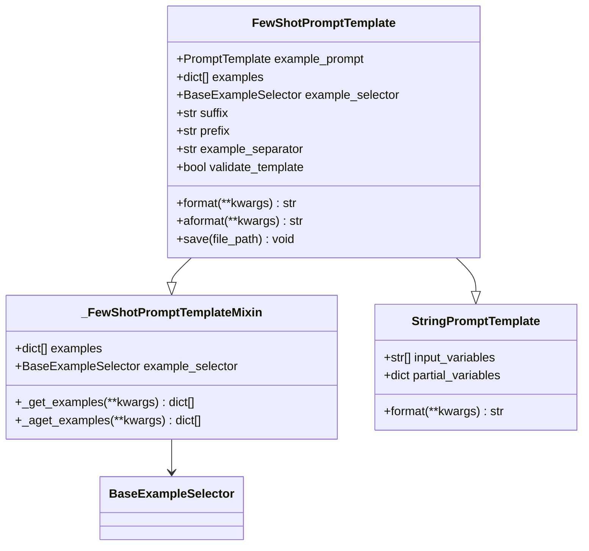
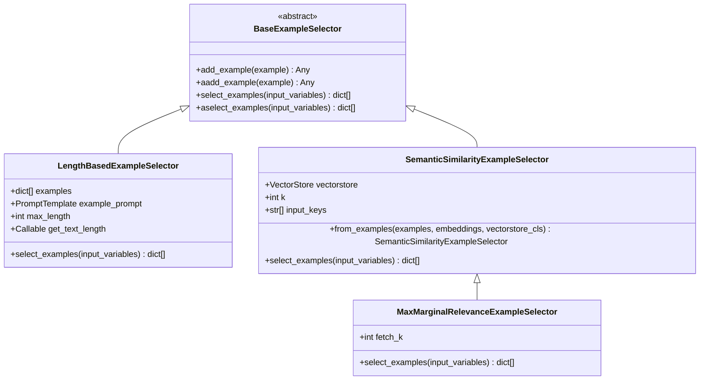
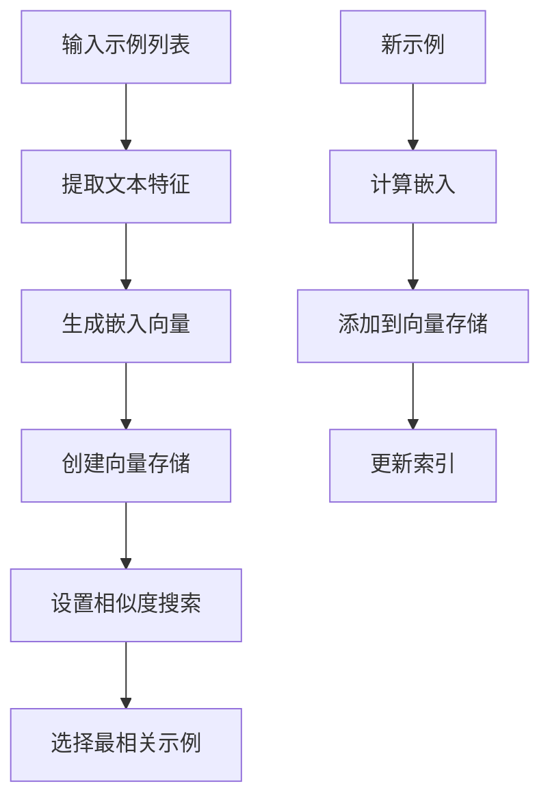
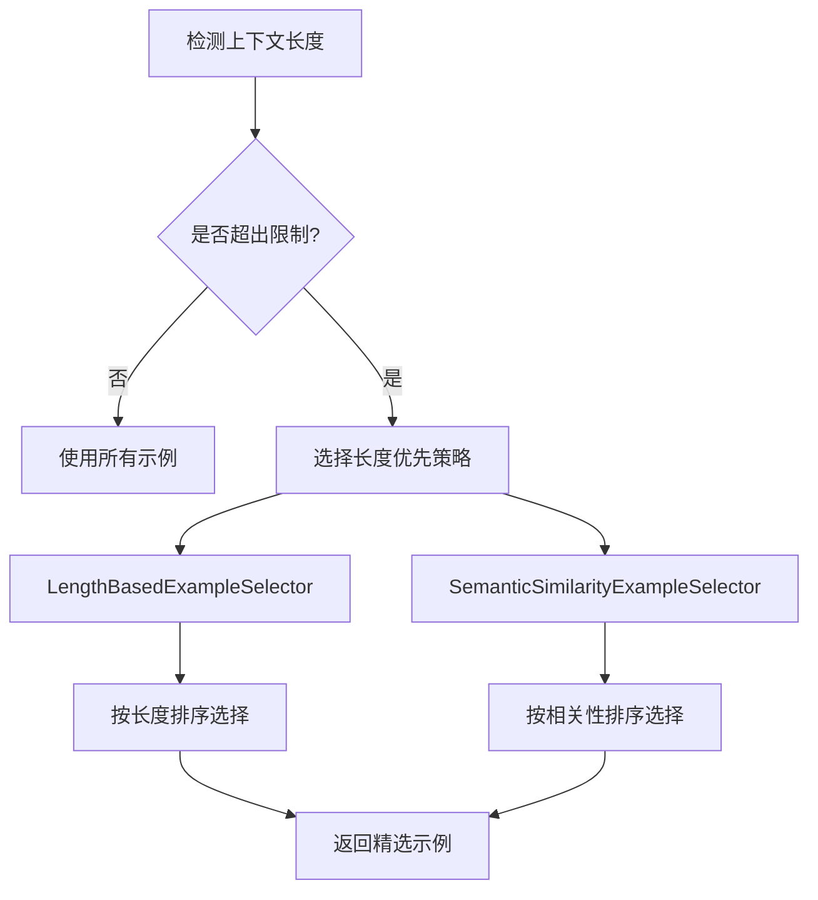
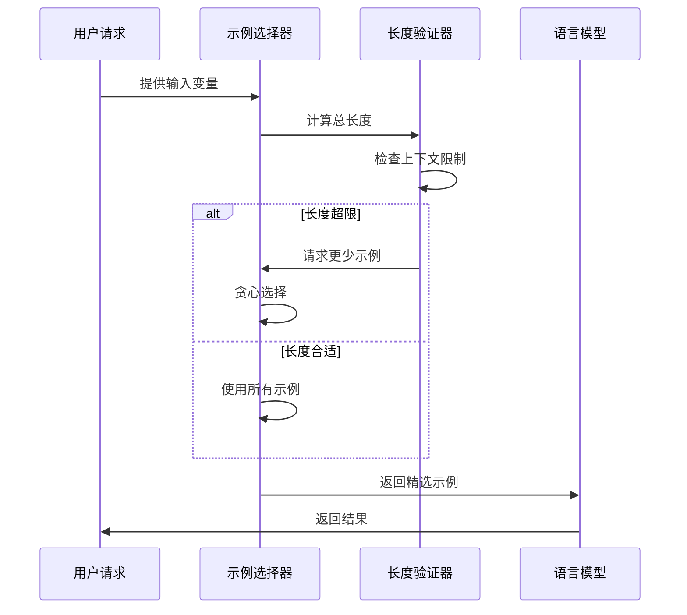

# Few-shot Learning

<cite>
**本文档中引用的文件**
- [few_shot.py](file://libs/core/langchain_core/langchain_core/prompts/few_shot.py)
- [base.py](file://libs/core/langchain_core/langchain_core/example_selectors/base.py)
- [length_based.py](file://libs/core/langchain_core/langchain_core/example_selectors/length_based.py)
- [semantic_similarity.py](file://libs/core/langchain_core/langchain_core/example_selectors/semantic_similarity.py)
- [few_shot_with_templates.py](file://libs/core/langchain_core/langchain_core/prompts/few_shot_with_templates.py)
- [test_few_shot.py](file://libs/core/tests/unit_tests/prompts/test_few_shot.py)
- [test_length_based_example_selector.py](file://libs/core/tests/unit_tests/example_selectors/test_length_based_example_selector.py)
</cite>

## 目录
1. [简介](#简介)
2. [核心概念](#核心概念)
3. [FewShotPromptTemplate详解](#fewshotprompttemplate详解)
4. [ExampleSelector系统](#exampleselector系统)
5. [实际应用示例](#实际应用示例)
6. [示例选择策略](#示例选择策略)
7. [性能优化与限制](#性能优化与限制)
8. [最佳实践](#最佳实践)
9. [总结](#总结)

## 简介

Few-shot Learning是一种强大的提示工程技术，通过在Prompt中提供少量示例（demonstrations）来引导大型语言模型（LLM）学习特定任务的模式，从而提升其在新输入上的表现。这种方法特别适用于数据稀缺或需要快速适应新任务的场景。

LangChain提供了完整的Few-shot Learning解决方案，包括灵活的`FewShotPromptTemplate`类和智能的`ExampleSelector`系统，能够根据不同的需求动态选择最相关的示例。

## 核心概念

### Few-shot Learning的基本原理

Few-shot Learning的核心思想是通过提供少量高质量的示例来指导模型理解任务模式，而不是依赖大规模的训练数据。这种方法具有以下优势：

- **快速适应**：无需重新训练即可适应新任务
- **成本效益**：减少标注数据的需求
- **灵活性**：支持多种任务类型和格式
- **可解释性**：通过具体示例展示期望的行为

### 主要组件

Few-shot Learning系统包含以下关键组件：

1. **示例模板（Example Prompt）**：定义单个示例的格式
2. **示例集合（Examples）**：包含多个任务示例的列表
3. **前缀和后缀**：定义任务描述和最终输入的位置
4. **示例选择器（Example Selector）**：智能选择相关示例的机制

## FewShotPromptTemplate详解

### 基本结构

`FewShotPromptTemplate`是LangChain中实现Few-shot Learning的核心类，它继承自`StringPromptTemplate`并提供了丰富的配置选项。



**图表来源**
- [few_shot.py](file://libs/core/langchain_core/langchain_core/prompts/few_shot.py#L114-L243)

### 核心参数说明

| 参数 | 类型 | 描述 | 必需 |
|------|------|------|------|
| `example_prompt` | `PromptTemplate` | 定义单个示例格式的模板 | 是 |
| `examples` | `list[dict]` | 静态示例列表 | 否 |
| `example_selector` | `BaseExampleSelector` | 动态示例选择器 | 否 |
| `suffix` | `str` | 任务结束后的提示文本 | 是 |
| `prefix` | `str` | 任务开始前的描述文本 | 否 |
| `example_separator` | `str` | 示例之间的分隔符 | 否 |
| `validate_template` | `bool` | 是否验证模板一致性 | 否 |

### 使用方式

#### 静态示例方式

```python
# 定义示例模板
example_prompt = PromptTemplate(
    input_variables=["input", "output"],
    template="输入: {input}\n输出: {output}"
)

# 创建Few-shot模板
few_shot_prompt = FewShotPromptTemplate(
    examples=[
        {"input": "2+2", "output": "4"},
        {"input": "2+3", "output": "5"},
    ],
    example_prompt=example_prompt,
    prefix="请解决以下数学问题：",
    suffix="问题: {input}\n答案:",
    input_variables=["input"]
)
```

#### 动态示例方式

```python
# 使用示例选择器
example_selector = LengthBasedExampleSelector(
    examples=examples,
    example_prompt=example_prompt,
    max_length=1000
)

few_shot_prompt = FewShotPromptTemplate(
    example_selector=example_selector,
    example_prompt=example_prompt,
    prefix="请解决以下数学问题：",
    suffix="问题: {input}\n答案:",
    input_variables=["input"]
)
```

**章节来源**
- [few_shot.py](file://libs/core/langchain_core/langchain_core/prompts/few_shot.py#L114-L243)

## ExampleSelector系统

### BaseExampleSelector接口

所有示例选择器都必须继承自`BaseExampleSelector`基类，该类定义了统一的选择接口：



**图表来源**
- [base.py](file://libs/core/langchain_core/langchain_core/example_selectors/base.py#L8-L57)
- [length_based.py](file://libs/core/langchain_core/langchain_core/example_selectors/length_based.py#L16-L96)
- [semantic_similarity.py](file://libs/core/langchain_core/langchain_core/example_selectors/semantic_similarity.py#L30-L93)

### LengthBasedExampleSelector

基于长度的示例选择器根据上下文长度限制动态选择示例：

#### 工作原理

1. **长度计算**：使用指定的函数计算每个示例的长度
2. **剩余空间检查**：计算输入变量占用的空间
3. **贪心选择**：按顺序添加示例直到达到最大长度限制

#### 配置参数

| 参数 | 类型 | 默认值 | 描述 |
|------|------|--------|------|
| `max_length` | `int` | 2048 | 最大允许的上下文长度 |
| `get_text_length` | `Callable` | `_get_length_based` | 文本长度计算函数 |

#### 实现细节

```python
def select_examples(self, input_variables: dict[str, str]) -> list[dict]:
    """基于长度选择示例"""
    inputs = " ".join(input_variables.values())
    remaining_length = self.max_length - self.get_text_length(inputs)
    examples = []
    
    for i in range(len(self.examples)):
        new_length = remaining_length - self.example_text_lengths[i]
        if new_length < 0:
            break
        examples.append(self.examples[i])
        remaining_length = new_length
    
    return examples
```

**章节来源**
- [length_based.py](file://libs/core/langchain_core/langchain_core/example_selectors/length_based.py#L66-L96)

### SemanticSimilarityExampleSelector

基于语义相似度的示例选择器使用向量检索技术找到最相关的示例：

#### 核心特性

1. **向量化存储**：将示例转换为向量并存储在向量数据库中
2. **相似度搜索**：使用余弦相似度等度量找到最相关示例
3. **动态更新**：支持运行时添加新示例

#### 构建流程



**图表来源**
- [semantic_similarity.py](file://libs/core/langchain_core/langchain_core/example_selectors/semantic_similarity.py#L120-L168)

#### 配置选项

| 参数 | 类型 | 描述 |
|------|------|------|
| `k` | `int` | 返回的示例数量 |
| `input_keys` | `list[str]` | 用于搜索的关键字 |
| `example_keys` | `list[str]` | 过滤示例的关键字 |
| `vectorstore_kwargs` | `dict` | 向量存储的额外参数 |

**章节来源**
- [semantic_similarity.py](file://libs/core/langchain_core/langchain_core/example_selectors/semantic_similarity.py#L96-L221)

### MaxMarginalRelevanceExampleSelector

基于最大边际相关性的示例选择器进一步优化了示例多样性：

#### 算法原理

MMR算法平衡了两个目标：
1. **相关性最大化**：选择与查询最相关的示例
2. **冗余最小化**：避免选择过于相似的示例

#### 配置参数

| 参数 | 类型 | 默认值 | 描述 |
|------|------|--------|------|
| `k` | `int` | 4 | 返回的示例数量 |
| `fetch_k` | `int` | 20 | 初始候选数量 |

**章节来源**
- [semantic_similarity.py](file://libs/core/langchain_core/langchain_core/example_selectors/semantic_similarity.py#L224-L357)

## 实际应用示例

### 分类任务示例

```python
# 情感分类示例
sentiment_examples = [
    {"text": "这部电影太棒了！", "label": "积极"},
    {"text": "服务态度很差，很失望。", "label": "消极"},
    {"text": "产品一般般，没什么特别的。", "label": "中性"},
]

sentiment_prompt = FewShotPromptTemplate(
    examples=sentiment_examples,
    example_prompt=PromptTemplate(
        input_variables=["text", "label"],
        template="文本: {text}\n情感标签: {label}"
    ),
    prefix="请判断以下评论的情感倾向：",
    suffix="评论: {text}\n情感:",
    input_variables=["text"]
)
```

### 翻译任务示例

```python
# 中英互译示例
translation_examples = [
    {"source": "你好", "target": "Hello", "language": "中到英"},
    {"source": "世界", "target": "World", "language": "中到英"},
    {"source": "Hello", "target": "你好", "language": "英到中"},
]

translation_prompt = FewShotPromptTemplate(
    examples=translation_examples,
    example_prompt=PromptTemplate(
        input_variables=["source", "target", "language"],
        template="{language}：\n源文本: {source}\n目标文本: {target}"
    ),
    prefix="请完成以下翻译任务：",
    suffix="翻译任务: {source} ({language})\n翻译结果:",
    input_variables=["source", "language"]
)
```

### 问答任务示例

```python
# 开放式问答示例
qa_examples = [
    {"question": "什么是人工智能？", "answer": "人工智能是模拟人类智能的计算机系统。"},
    {"question": "机器学习和深度学习有什么区别？", "answer": "机器学习是人工智能的一个分支，深度学习是机器学习的一种特殊形式。"},
]

qa_prompt = FewShotPromptTemplate(
    examples=qa_examples,
    example_prompt=PromptTemplate(
        input_variables=["question", "answer"],
        template="问题: {question}\n回答: {answer}"
    ),
    prefix="请回答以下问题：",
    suffix="问题: {question}\n回答:",
    input_variables=["question"]
)
```

### 对话系统示例

```python
# 聊天机器人对话示例
chat_examples = [
    {"input": "你好", "output": "你好！很高兴见到你。"},
    {"input": "今天天气怎么样？", "output": "抱歉，我没有实时天气信息。"},
    {"input": "你会唱歌吗？", "output": "我不会唱歌，但我可以帮你写歌词。"},
]

chat_prompt = FewShotChatMessagePromptTemplate(
    examples=chat_examples,
    example_prompt=ChatPromptTemplate.from_messages([
        ("human", "{input}"),
        ("ai", "{output}")
    ]),
    prefix="你是一个友好的聊天机器人。",
    suffix="{input}"
)
```

## 示例选择策略

### 静态 vs 动态选择

#### 静态选择（Examples）

**优点**：
- 简单直观
- 可预测的结果
- 易于调试和验证

**缺点**：
- 缺乏灵活性
- 无法适应新情况
- 可能包含不相关示例

#### 动态选择（ExampleSelector）

**优点**：
- 智能相关性匹配
- 自动适应新情况
- 更好的资源利用

**缺点**：
- 实现复杂度高
- 需要额外的计算资源
- 结果可能难以预测

### 示例数量的影响

#### 小数量示例（1-3个）

**适用场景**：
- 简单任务
- 清晰的模式
- 时间敏感的应用

**优势**：
- 上下文效率高
- 训练速度快
- 准确率稳定

**劣势**：
- 泛化能力有限
- 对噪声敏感

#### 中等数量示例（4-8个）

**适用场景**：
- 复杂任务
- 多样化的模式
- 平衡性能和效率

**优势**：
- 良好的泛化能力
- 兼顾效率和效果
- 适中的复杂度

#### 大数量示例（9个以上）

**适用场景**：
- 高难度任务
- 复杂的模式识别
- 对准确率要求极高的场景

**优势**：
- 强大的泛化能力
- 丰富的上下文信息
- 高准确率潜力

**劣势**：
- 上下文长度限制
- 性能开销大
- 可能引入噪声

### 上下文长度限制

#### 影响因素

1. **模型限制**：不同模型有不同的上下文长度上限
2. **输入长度**：用户输入会占用部分上下文空间
3. **示例格式**：示例本身的格式会影响长度
4. **其他文本**：前缀、后缀等也会占用空间

#### 解决策略



**章节来源**
- [test_length_based_example_selector.py](file://libs/core/tests/unit_tests/example_selectors/test_length_based_example_selector.py#L42-L58)

## 性能优化与限制

### 计算复杂度分析

#### LengthBasedExampleSelector

- **时间复杂度**：O(n)，其中n是示例数量
- **空间复杂度**：O(n)，存储示例长度
- **优化点**：预计算所有示例长度

#### SemanticSimilarityExampleSelector

- **时间复杂度**：O(d × log(k))，其中d是向量维度，k是候选数量
- **空间复杂度**：O(n × d)，存储所有向量
- **优化点**：使用高效的向量检索算法

### 内存使用优化

#### 批量处理

```python
# 批量添加示例以提高效率
async def batch_add_examples(self, examples: list[dict]):
    """批量添加示例"""
    tasks = [self.aadd_example(example) for example in examples]
    await asyncio.gather(*tasks)
```

#### 缓存策略

```python
# 实现示例缓存以避免重复计算
class CachedExampleSelector(BaseExampleSelector):
    def __init__(self, underlying_selector: BaseExampleSelector):
        self.underlying_selector = underlying_selector
        self.cache = {}
    
    def select_examples(self, input_variables: dict[str, str]) -> list[dict]:
        input_hash = hash(frozenset(input_variables.items()))
        if input_hash not in self.cache:
            self.cache[input_hash] = self.underlying_selector.select_examples(input_variables)
        return self.cache[input_hash]
```

### 上下文长度管理

#### 动态调整策略



**图表来源**
- [length_based.py](file://libs/core/langchain_core/langchain_core/example_selectors/length_based.py#L66-L96)

#### 长度计算函数

```python
def _get_length_based(text: str) -> int:
    """基于单词数的长度计算"""
    return len(re.split("\n| ", text))

def _get_token_length(text: str) -> int:
    """基于token数的长度计算（推荐）"""
    # 使用tokenizer计算token数量
    tokenizer = get_tokenizer()
    return len(tokenizer.encode(text))
```

**章节来源**
- [length_based.py](file://libs/core/langchain_core/langchain_core/example_selectors/length_based.py#L12-L15)

## 最佳实践

### 示例质量原则

#### 1. 代表性原则
- 确保示例覆盖任务的主要模式
- 包含边界情况和特殊情况
- 避免过度拟合特定示例

#### 2. 多样性原则
- 包含不同类型和风格的示例
- 考虑不同的输入格式和表达方式
- 平衡简单和复杂的示例

#### 3. 清晰性原则
- 示例格式一致且清晰
- 输出明确且无歧义
- 避免包含错误或误导性示例

### 示例数量建议

#### 根据任务复杂度选择

| 任务类型 | 推荐示例数量 | 示例选择器 |
|----------|--------------|------------|
| 简单分类 | 3-5个 | 静态选择 |
| 中等复杂度任务 | 5-10个 | LengthBased |
| 复杂推理任务 | 10-20个 | SemanticSimilarity |
| 高精度要求 | 20+个 | MaxMarginalRelevance |

#### 根据上下文长度调整

```python
def calculate_optimal_example_count(context_length: int, 
                                  input_length: int, 
                                  example_length: int) -> int:
    """计算最优示例数量"""
    available_length = context_length - input_length
    return min(available_length // example_length, MAX_EXAMPLES)
```

### 错误处理策略

#### 上下文溢出处理

```python
class RobustFewShotPrompt(FewShotPromptTemplate):
    def format(self, **kwargs: Any) -> str:
        try:
            return super().format(**kwargs)
        except ValueError as e:
            if "context length" in str(e).lower():
                # 使用长度限制选择器
                selector = LengthBasedExampleSelector(
                    examples=self.examples,
                    example_prompt=self.example_prompt,
                    max_length=self.max_context_length
                )
                self.example_selector = selector
                return super().format(**kwargs)
            raise
```

#### 示例选择失败处理

```python
async def safe_select_examples(self, input_variables: dict[str, str]) -> list[dict]:
    """安全的示例选择，包含回退机制"""
    try:
        return await self.example_selector.aselect_examples(input_variables)
    except Exception as e:
        logger.warning(f"示例选择失败: {e}")
        # 回退到默认示例
        return self.default_examples[:self.k]
```

### 测试和验证

#### 单元测试示例

```python
def test_few_shot_prompt_quality():
    """测试Few-shot提示的质量"""
    prompt = FewShotPromptTemplate(
        examples=test_examples,
        example_prompt=example_prompt,
        prefix=prefix,
        suffix=suffix,
        input_variables=["input"]
    )
    
    # 验证基本功能
    result = prompt.format(input="测试输入")
    assert isinstance(result, str)
    assert len(result) > 0
    
    # 验证示例格式
    example_lines = [line for line in result.split('\n') 
                    if ':' in line and line.strip()]
    assert len(example_lines) >= len(test_examples)
```

#### 性能基准测试

```python
def benchmark_example_selectors():
    """比较不同示例选择器的性能"""
    selectors = [
        LengthBasedExampleSelector(examples=examples, example_prompt=prompt),
        SemanticSimilarityExampleSelector.from_examples(
            examples=examples, 
            embeddings=embeddings, 
            vectorstore_cls=FAISS
        )
    ]
    
    input_vars = {"text": "测试输入"}
    
    for selector in selectors:
        start_time = time.time()
        for _ in range(100):
            selector.select_examples(input_vars)
        avg_time = (time.time() - start_time) / 100
        print(f"{selector.__class__.__name__}: {avg_time:.4f}s per selection")
```

## 总结

Few-shot Learning是现代语言模型应用中的重要技术，LangChain提供了完整而灵活的解决方案。通过合理使用`FewShotPromptTemplate`和各种`ExampleSelector`，开发者可以：

1. **提升模型性能**：通过精心设计的示例显著改善模型表现
2. **控制资源使用**：通过智能的示例选择优化上下文长度和计算成本
3. **适应多样化需求**：从简单的分类任务到复杂的推理任务都能有效应对
4. **保证系统稳定性**：通过完善的错误处理和性能优化确保生产环境的可靠性

在实际应用中，建议根据具体任务特点选择合适的示例数量和选择策略，并持续监控和优化Few-shot提示的效果。随着技术的发展，Few-shot Learning将继续在降低AI应用门槛、提高开发效率方面发挥重要作用。