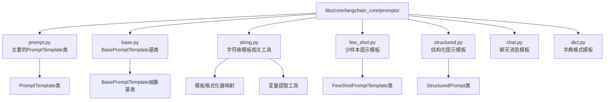
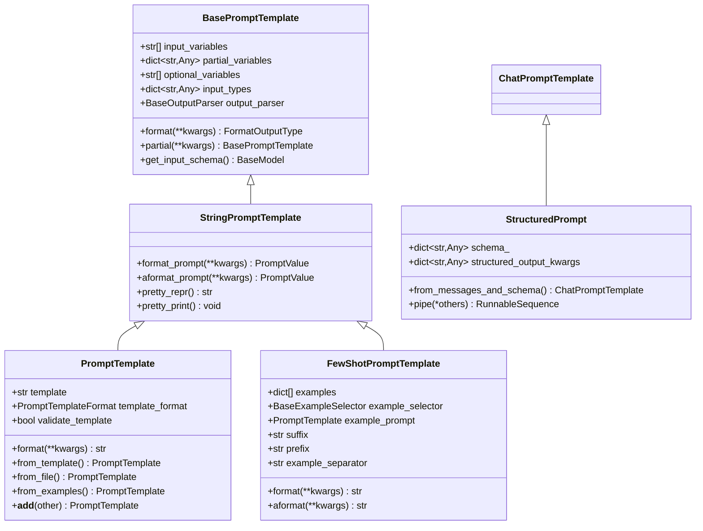
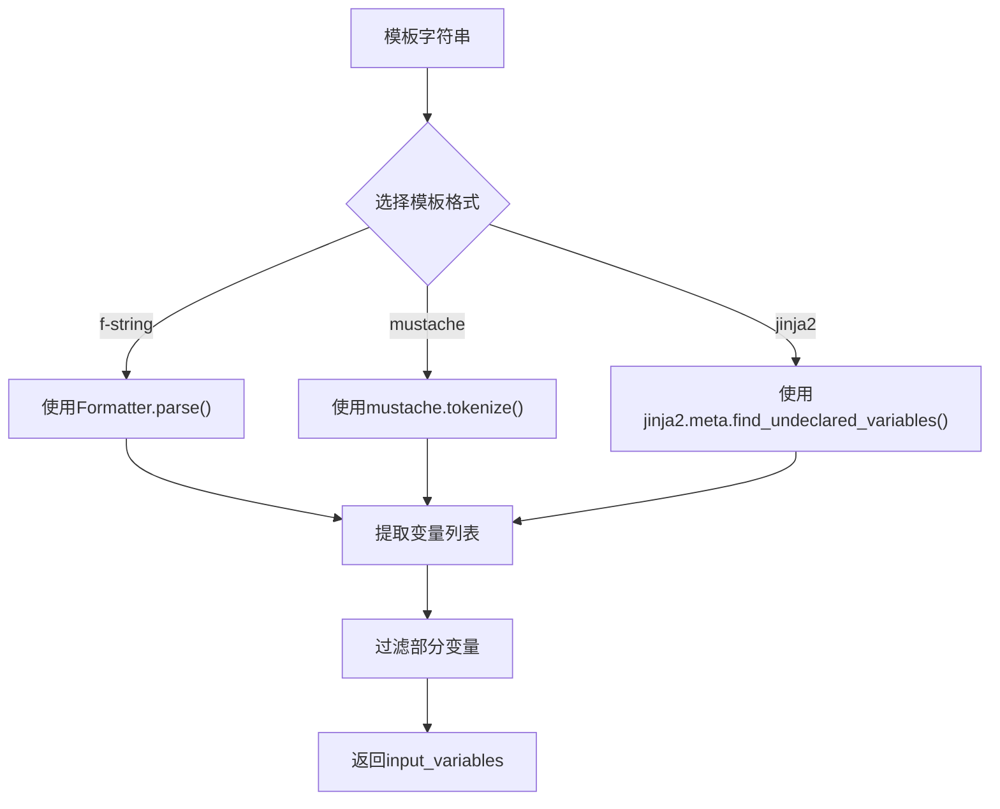
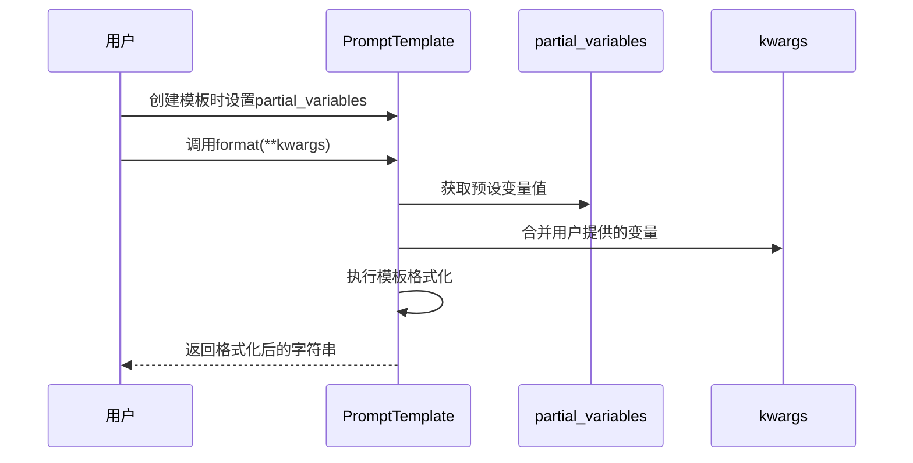
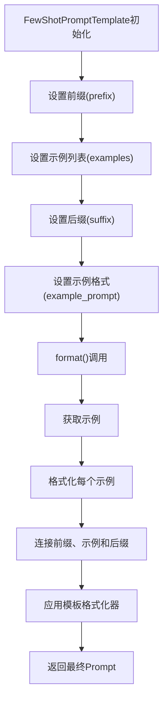
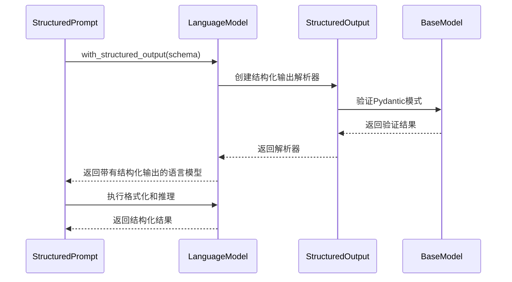
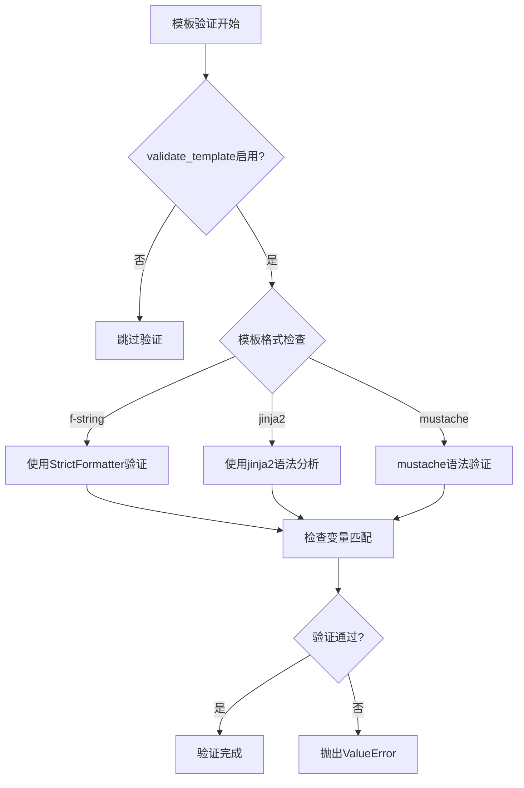
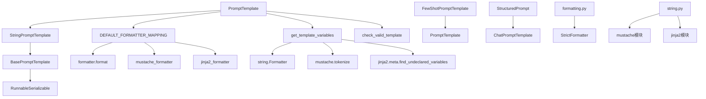

# Prompt Templates

<cite>
**本文档中引用的文件**
- [libs/core/langchain_core/prompts/prompt.py](file://libs/core/langchain_core/prompts/prompt.py)
- [libs/core/langchain_core/prompts/base.py](file://libs/core/langchain_core/prompts/base.py)
- [libs/core/langchain_core/prompts/string.py](file://libs/core/langchain_core/prompts/string.py)
- [libs/core/langchain_core/prompts/few_shot.py](file://libs/core/langchain_core/prompts/few_shot.py)
- [libs/core/langchain_core/prompts/structured.py](file://libs/core/langchain_core/prompts/structured.py)
- [libs/core/langchain_core/utils/formatting.py](file://libs/core/langchain_core/utils/formatting.py)
- [libs/core/tests/unit_tests/prompts/test_prompt.py](file://libs/core/tests/unit_tests/prompts/test_prompt.py)
</cite>

## 目录
1. [简介](#简介)
2. [项目结构](#项目结构)
3. [核心组件](#核心组件)
4. [架构概览](#架构概览)
5. [详细组件分析](#详细组件分析)
6. [依赖关系分析](#依赖关系分析)
7. [性能考虑](#性能考虑)
8. [故障排除指南](#故障排除指南)
9. [结论](#结论)

## 简介

Prompt Templates是LangChain框架中的核心组件，用于通过模板化和变量插值技术动态生成一致的Prompt。它们实现了可复用和可配置的提示工程，支持多种模板格式（f-string、mustache、jinja2），并提供了强大的变量管理和部分填充功能。

Prompt Templates的主要优势包括：
- **模板化设计**：通过占位符实现Prompt的标准化和复用
- **多格式支持**：支持f-string、mustache和jinja2三种模板语法
- **变量管理**：自动识别和验证输入变量
- **部分填充**：支持预设变量值，减少重复参数传递
- **类型安全**：提供输入验证和类型推断
- **异步支持**：完整的异步操作能力

## 项目结构

Prompt Templates在LangChain项目中的组织结构如下：

**图表来源**
- [libs/core/langchain_core/prompts/prompt.py](file://libs/core/langchain_core/prompts/prompt.py#L1-L50)
- [libs/core/langchain_core/prompts/base.py](file://libs/core/langchain_core/prompts/base.py#L1-L50)
- [libs/core/langchain_core/prompts/string.py](file://libs/core/langchain_core/prompts/string.py#L1-L50)

**章节来源**
- [libs/core/langchain_core/prompts/prompt.py](file://libs/core/langchain_core/prompts/prompt.py#L1-L304)
- [libs/core/langchain_core/prompts/base.py](file://libs/core/langchain_core/prompts/base.py#L1-L462)

## 核心组件

### PromptTemplate类

`PromptTemplate`是Prompt Templates系统的核心类，继承自`StringPromptTemplate`，提供了完整的模板化Prompt生成功能。

#### 主要属性

| 属性名 | 类型 | 描述 |
|--------|------|------|
| `template` | str | 模板字符串，包含变量占位符 |
| `template_format` | PromptTemplateFormat | 模板格式：'f-string'、'mustache'、'jinja2' |
| `input_variables` | list[str] | 需要提供的输入变量列表 |
| `partial_variables` | dict[str, Any] | 预设的变量值，可选 |
| `validate_template` | bool | 是否验证模板的有效性 |

#### 核心方法

| 方法名 | 参数 | 返回值 | 描述 |
|--------|------|--------|------|
| `format()` | **kwargs: Any | str | 格式化模板，生成最终的Prompt字符串 |
| `from_template()` | template: str, template_format: str, partial_variables: dict | PromptTemplate | 从模板字符串创建PromptTemplate实例 |
| `from_file()` | template_file: str \| Path, encoding: str | PromptTemplate | 从文件加载模板 |
| `from_examples()` | examples: list[str], suffix: str, input_variables: list[str] | PromptTemplate | 从示例列表创建模板 |
| `partial()` | **kwargs: str \| Callable | BasePromptTemplate | 创建部分填充的模板副本 |

**章节来源**
- [libs/core/langchain_core/prompts/prompt.py](file://libs/core/langchain_core/prompts/prompt.py#L25-L150)

### BasePromptTemplate基类

`BasePromptTemplate`是所有Prompt模板的基础抽象类，定义了通用的接口和行为。

#### 关键特性

- **输入验证**：自动验证输入变量的完整性和正确性
- **部分变量支持**：允许预设变量值，减少重复参数
- **异步支持**：完整的异步操作能力
- **序列化**：支持对象的保存和加载
- **元数据管理**：提供标签和元数据功能

**章节来源**
- [libs/core/langchain_core/prompts/base.py](file://libs/core/langchain_core/prompts/base.py#L40-L150)

## 架构概览

Prompt Templates系统采用分层架构设计，确保了灵活性和可扩展性：

**图表来源**
- [libs/core/langchain_core/prompts/base.py](file://libs/core/langchain_core/prompts/base.py#L40-L100)
- [libs/core/langchain_core/prompts/prompt.py](file://libs/core/langchain_core/prompts/prompt.py#L25-L80)
- [libs/core/langchain_core/prompts/few_shot.py](file://libs/core/langchain_core/prompts/few_shot.py#L80-L150)
- [libs/core/langchain_core/prompts/structured.py](file://libs/core/langchain_core/prompts/structured.py#L20-L80)

## 详细组件分析

### PromptTemplate核心功能

#### 模板变量识别

`PromptTemplate`能够自动识别模板中的变量，支持三种不同的模板格式：

**图表来源**
- [libs/core/langchain_core/prompts/string.py](file://libs/core/langchain_core/prompts/string.py#L230-L250)

#### 格式化器映射

系统提供了统一的格式化器映射，支持不同模板格式的转换：

| 格式 | 格式化器 | 安全级别 | 功能特点 |
|------|----------|----------|----------|
| f-string | `formatter.format` | 高 | 基础字符串格式化，无外部依赖 |
| mustache | `mustache_formatter` | 中 | 模板语法简单，适合文本渲染 |
| jinja2 | `jinja2_formatter` | 低 | 强大功能，但存在安全风险 |

**章节来源**
- [libs/core/langchain_core/prompts/string.py](file://libs/core/langchain_core/prompts/string.py#L203-L210)

#### 部分填充机制

部分填充允许预设变量值，减少重复参数传递：

**图表来源**
- [libs/core/langchain_core/prompts/base.py](file://libs/core/langchain_core/prompts/base.py#L270-L290)

**章节来源**
- [libs/core/langchain_core/prompts/base.py](file://libs/core/langchain_core/prompts/base.py#L250-L320)

### 少样本提示模板 (FewShotPromptTemplate)

少样本提示模板专门用于构建包含示例的Prompt，广泛应用于Few-shot Learning场景。

#### 示例处理流程

**图表来源**
- [libs/core/langchain_core/prompts/few_shot.py](file://libs/core/langchain_core/prompts/few_shot.py#L150-L200)

#### 示例选择器支持

系统支持动态示例选择，允许根据输入参数智能选择最相关的示例：

| 选择器类型 | 功能描述 | 使用场景 |
|------------|----------|----------|
| 固定示例列表 | 预定义的示例集合 | 静态Few-shot任务 |
| 语义相似度选择器 | 基于向量相似度选择 | 动态上下文相关示例 |
| 长度选择器 | 基于示例长度选择 | 控制上下文长度 |
| 自定义选择器 | 用户定义的选择逻辑 | 特殊业务需求 |

**章节来源**
- [libs/core/langchain_core/prompts/few_shot.py](file://libs/core/langchain_core/prompts/few_shot.py#L50-L120)

### 结构化提示模板 (StructuredPrompt)

结构化提示模板专为需要严格输出格式的任务设计，支持与语言模型的结构化输出集成。

#### 结构化输出管道

**图表来源**
- [libs/core/langchain_core/prompts/structured.py](file://libs/core/langchain_core/prompts/structured.py#L140-L168)

**章节来源**
- [libs/core/langchain_core/prompts/structured.py](file://libs/core/langchain_core/prompts/structured.py#L20-L120)

### 模板验证和错误处理

#### 验证机制

系统提供了多层次的模板验证机制：

**图表来源**
- [libs/core/langchain_core/prompts/string.py](file://libs/core/langchain_core/prompts/string.py#L215-L248)

#### 错误处理策略

| 错误类型 | 处理方式 | 示例场景 |
|----------|----------|----------|
| 变量不匹配 | 抛出ValueError | 模板中缺少输入变量 |
| 格式错误 | 提供警告信息 | Jinja2语法错误 |
| 安全问题 | 禁用危险格式 | Jinja2模板来自不可信源 |
| 编码问题 | 提供编码选项 | 文件读取编码不匹配 |

**章节来源**
- [libs/core/langchain_core/prompts/string.py](file://libs/core/langchain_core/prompts/string.py#L70-L120)

## 依赖关系分析

Prompt Templates系统的依赖关系展现了清晰的层次结构：

**图表来源**
- [libs/core/langchain_core/prompts/prompt.py](file://libs/core/langchain_core/prompts/prompt.py#L1-L30)
- [libs/core/langchain_core/prompts/string.py](file://libs/core/langchain_core/prompts/string.py#L1-L30)

### 外部依赖

| 依赖项 | 版本要求 | 用途 | 可选性 |
|--------|----------|------|--------|
| `pydantic` | >= 1.0 | 数据验证和序列化 | 必需 |
| `jinja2` | >= 3.0 | Jinja2模板支持 | 可选 |
| `chevron` | >= 0.13 | Mustache模板支持 | 可选 |
| `typing_extensions` | >= 4.0 | 类型注解增强 | 必需 |

**章节来源**
- [libs/core/langchain_core/prompts/string.py](file://libs/core/langchain_core/prompts/string.py#L15-L30)

## 性能考虑

### 模板编译缓存

为了提高性能，系统对模板进行了智能缓存：

- **变量提取缓存**：模板变量列表只在初始化时计算一次
- **格式化器缓存**：格式化器映射在模块级别缓存
- **验证结果缓存**：模板验证结果在运行时缓存

### 内存优化

- **延迟加载**：示例选择器支持延迟加载大量示例
- **流式处理**：支持大数据集的流式处理
- **弱引用**：避免循环引用导致的内存泄漏

### 并发处理

- **异步支持**：完整的异步操作支持
- **线程安全**：模板对象设计为线程安全
- **连接池**：支持连接池以提高并发性能

## 故障排除指南

### 常见问题及解决方案

#### 模板格式问题

**问题**：Jinja2模板执行失败
**原因**：模板来自不可信源或语法错误
**解决方案**：
- 使用沙箱环境运行Jinja2模板
- 启用模板验证模式
- 检查模板语法正确性

#### 变量缺失问题

**问题**：运行时出现变量未定义错误
**原因**：输入变量未提供或拼写错误
**解决方案**：
- 使用`validate_template=True`进行编译时验证
- 检查变量名称拼写
- 提供默认值或部分变量

#### 性能问题

**问题**：模板格式化速度慢
**原因**：复杂模板或大量变量
**解决方案**：
- 使用f-string格式替代Jinja2
- 减少嵌套层级
- 实现模板缓存机制

**章节来源**
- [libs/core/langchain_core/prompts/string.py](file://libs/core/langchain_core/prompts/string.py#L25-L50)

### 调试技巧

1. **使用`pretty_repr()`方法**：查看模板的可视化表示
2. **启用详细日志**：监控模板处理过程
3. **单元测试验证**：编写测试确保模板行为正确
4. **性能分析**：使用性能分析工具识别瓶颈

## 结论

Prompt Templates是LangChain框架中不可或缺的核心组件，它通过模板化和变量插值技术实现了Prompt的标准化、复用和配置化。系统的设计充分考虑了安全性、性能和易用性，支持多种模板格式和高级功能。

### 主要优势

- **灵活性**：支持多种模板格式和自定义扩展
- **安全性**：内置安全检查和沙箱机制
- **性能**：优化的缓存和并发处理
- **易用性**：简洁的API和丰富的工具函数

### 最佳实践建议

1. **选择合适的模板格式**：根据需求平衡功能和安全性
2. **合理使用部分变量**：减少重复参数传递
3. **启用模板验证**：在生产环境中启用验证
4. **监控性能指标**：定期评估模板性能
5. **保持模板简洁**：避免过度复杂的模板结构

通过深入理解和正确使用Prompt Templates，开发者可以构建更加高效、可靠和可维护的AI应用系统。