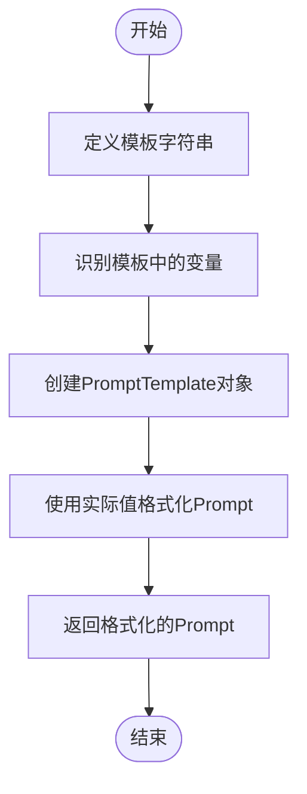
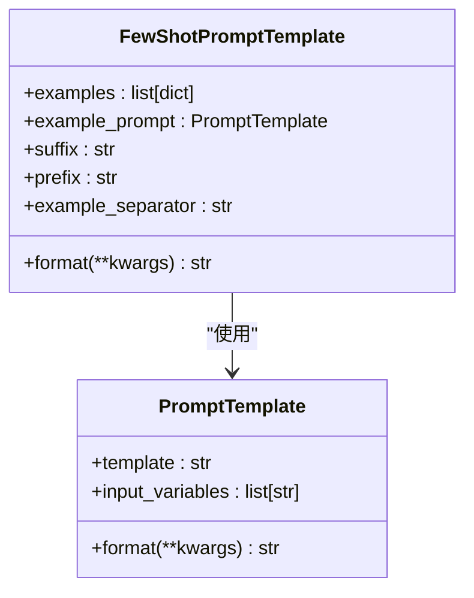
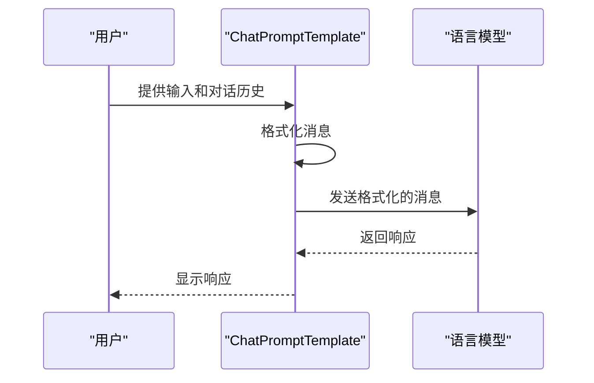

# Prompts

<cite>
**本文档中引用的文件**   
- [base.py](file://libs/core/langchain_core/prompts/base.py)
- [prompt.py](file://libs/core/langchain_core/prompts/prompt.py)
- [chat.py](file://libs/core/langchain_core/prompts/chat.py)
- [few_shot.py](file://libs/core/langchain_core/prompts/few_shot.py)
- [string.py](file://libs/core/langchain_core/prompts/string.py)
- [message.py](file://libs/core/langchain_core/prompts/message.py)
- [dict.py](file://libs/core/langchain_core/prompts/dict.py)
- [image.py](file://libs/core/langchain_core/prompts/image.py)
- [structured.py](file://libs/core/langchain_core/prompts/structured.py)
- [loading.py](file://libs/core/langchain_core/prompts/loading.py)
</cite>

## 目录
1. [简介](#简介)
2. [核心组件](#核心组件)
3. [Prompt Templates](#prompt-templates)
4. [Few-shot Learning](#few-shot-learning)
5. [聊天提示模板](#聊天提示模板)
6. [高级功能](#高级功能)
7. [安全性](#安全性)
8. [最佳实践](#最佳实践)

## 简介

Prompts是LangChain框架中与大型语言模型（LLM）交互的核心机制。它们作为指令和上下文，指导LLM生成期望的输出。通过精心设计的Prompts，开发者可以显著提高LLM的准确性和可靠性。本文档将深入探讨Prompts的各个方面，包括其核心组件、模板系统、Few-shot Learning技术以及高级功能。

**Section sources**
- [base.py](file://libs/core/langchain_core/prompts/base.py#L1-L50)
- [prompt.py](file://libs/core/langchain_core/prompts/prompt.py#L1-L20)

## 核心组件

Prompts的核心组件包括系统提示、用户输入、示例和输出格式说明。这些组件共同构成了与LLM交互的完整指令集。

### 系统提示

系统提示用于设置LLM的角色和行为准则。它通常在对话开始时提供，为后续的交互奠定基础。例如，系统提示可以指定LLM作为AI助手的身份，并要求其以友好和帮助性的方式回应。

### 用户输入

用户输入是用户向LLM提出的具体问题或请求。它是Prompts中动态变化的部分，需要与静态的系统提示和示例相结合，形成完整的上下文。

### 示例

示例（Few-shot Learning）是Prompts中用于指导LLM行为的重要组成部分。通过提供输入-输出对的示例，开发者可以有效地引导LLM学习特定的响应模式。这种方法特别适用于需要特定格式或风格的输出场景。

### 输出格式说明

输出格式说明明确指定了期望的输出结构。这可以是简单的文本格式要求，也可以是复杂的JSON或XML结构。通过清晰的格式说明，可以确保LLM生成的输出符合下游应用的需求。

**Section sources**
- [few_shot.py](file://libs/core/langchain_core/prompts/few_shot.py#L1-L50)
- [prompt.py](file://libs/core/langchain_core/prompts/prompt.py#L1-L100)

## Prompt Templates

Prompt Templates是动态生成一致Prompt的强大工具。它们通过变量插值和条件逻辑，实现了Prompts的灵活性和可重用性。

### 变量插值

变量插值允许在模板中定义占位符，这些占位符在运行时被实际值替换。LangChain支持多种模板格式，包括f-string、mustache和jinja2。其中，f-string是推荐的默认格式，因为它既安全又高效。

**Diagram sources **
- [prompt.py](file://libs/core/langchain_core/prompts/prompt.py#L100-L150)
- [string.py](file://libs/core/langchain_core/prompts/string.py#L100-L150)

### 条件逻辑

虽然基本的Prompt Templates主要依赖变量插值，但通过结合其他LangChain组件，可以实现更复杂的条件逻辑。例如，可以根据输入内容选择不同的模板或调整提示策略。

### 模板验证

LangChain提供了模板验证功能，可以在运行时检查模板和输入变量的一致性。这有助于在开发阶段发现潜在的问题，提高应用的稳定性。

**Section sources**
- [prompt.py](file://libs/core/langchain_core/prompts/prompt.py#L150-L300)
- [string.py](file://libs/core/langchain_core/prompts/string.py#L200-L300)

## Few-shot Learning

Few-shot Learning是通过提供少量示例来指导LLM行为的技术。在LangChain中，这主要通过`FewShotPromptTemplate`和`FewShotChatMessagePromptTemplate`实现。

### 固定示例

固定示例是最简单的Few-shot Learning形式。开发者预先定义一组输入-输出对，这些示例在每次调用时都会被包含在Prompt中。

**Diagram sources **
- [few_shot.py](file://libs/core/langchain_core/prompts/few_shot.py#L100-L200)
- [prompt.py](file://libs/core/langchain_core/prompts/prompt.py#L50-L100)

### 动态示例选择

动态示例选择通过`BaseExampleSelector`实现，可以根据输入内容智能地选择最相关的示例。这种方法特别适用于大规模示例库的场景，能够显著提高LLM的响应质量。

**Section sources**
- [few_shot.py](file://libs/core/langchain_core/prompts/few_shot.py#L200-L400)
- [example_selectors.py](file://libs/core/langchain_core/example_selectors/base.py#L1-L50)

## 聊天提示模板

聊天提示模板（ChatPromptTemplate）是专门为聊天模型设计的Prompt系统。它支持多轮对话和复杂的消息结构。

### 消息类型

聊天提示模板支持多种消息类型，包括系统消息、人类消息、AI消息和通用聊天消息。每种消息类型都有其特定的用途和格式要求。

### 消息占位符

消息占位符（MessagesPlaceholder）允许将整个消息列表作为变量插入到Prompt中。这对于实现对话历史记忆功能至关重要。

**Diagram sources **
- [chat.py](file://libs/core/langchain_core/prompts/chat.py#L100-L200)
- [message.py](file://libs/core/langchain_core/prompts/message.py#L1-L50)

### 模板组合

聊天提示模板支持通过`+`操作符进行组合，这使得构建复杂的对话流程变得简单直观。开发者可以轻松地将多个模板片段组合成一个完整的对话策略。

**Section sources**
- [chat.py](file://libs/core/langchain_core/prompts/chat.py#L200-L800)
- [message.py](file://libs/core/langchain_core/prompts/message.py#L50-L100)

## 高级功能

### 结构化提示

结构化提示（StructuredPrompt）允许开发者定义输出的JSON Schema，确保LLM生成的输出符合预定义的结构。这对于需要严格数据格式的应用场景非常有用。

### 多模态提示

多模态提示支持文本和图像的混合输入。通过`ImagePromptTemplate`，开发者可以构建能够处理视觉信息的复杂应用。

### 提示加载

LangChain提供了从文件加载Prompt的功能，支持JSON和YAML格式。这使得Prompt的管理和版本控制变得更加容易。

**Section sources**
- [structured.py](file://libs/core/langchain_core/prompts/structured.py#L1-L100)
- [image.py](file://libs/core/langchain_core/prompts/image.py#L1-L100)
- [loading.py](file://libs/core/langchain_core/prompts/loading.py#L1-L100)

## 安全性

### 模板注入防护

模板注入是使用动态模板时需要特别注意的安全问题。LangChain通过多种机制来防范此类攻击，包括使用安全的模板格式和输入验证。

### Jinja2沙箱

当使用Jinja2模板格式时，LangChain默认使用SandboxedEnvironment来限制代码执行。尽管如此，仍建议避免从不受信任的来源接受Jinja2模板。

**Section sources**
- [prompt.py](file://libs/core/langchain_core/prompts/prompt.py#L50-L100)
- [string.py](file://libs/core/langchain_core/prompts/string.py#L50-L100)

## 最佳实践

### 清晰的指令

确保系统提示和用户输入中的指令清晰明确。模糊的指令可能导致LLM产生不可预测的输出。

### 具体的示例

提供具体且相关的示例，这有助于LLM更好地理解期望的响应模式。示例应该覆盖各种可能的输入情况。

### 明确的格式要求

在Prompt中明确指定输出格式要求。这可以是简单的文本格式说明，也可以是复杂的JSON Schema定义。

### 版本控制和A/B测试

对Prompt进行版本控制，并定期进行A/B测试，以评估不同Prompt策略的效果。这有助于持续优化LLM的性能。

**Section sources**
- [base.py](file://libs/core/langchain_core/prompts/base.py#L400-L450)
- [prompt.py](file://libs/core/langchain_core/prompts/prompt.py#L250-L300)