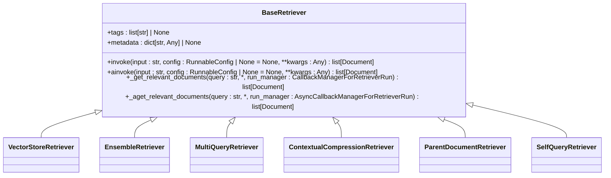
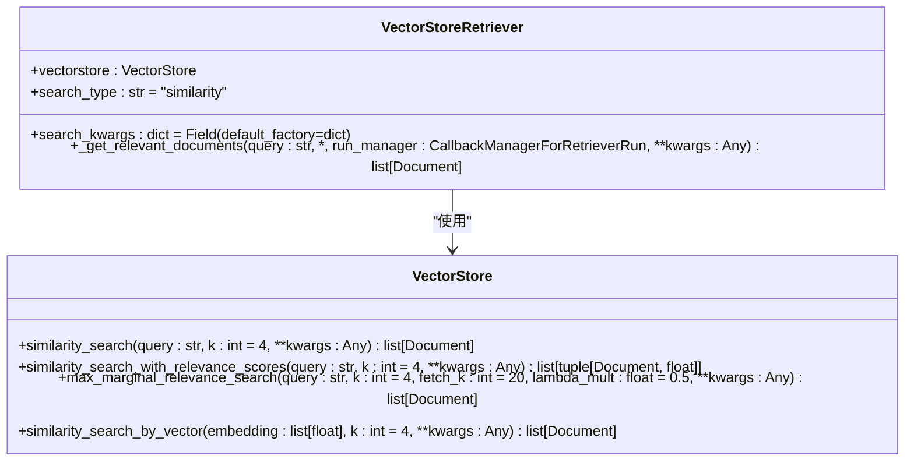
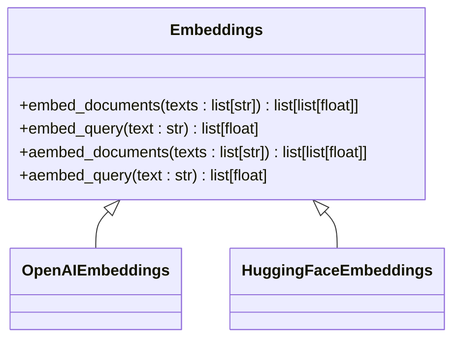
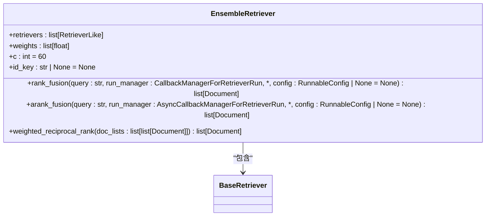
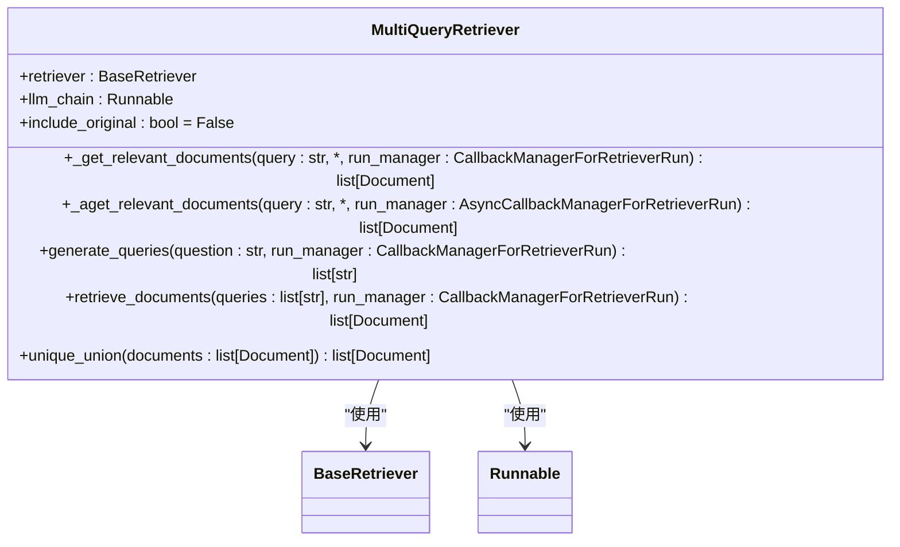
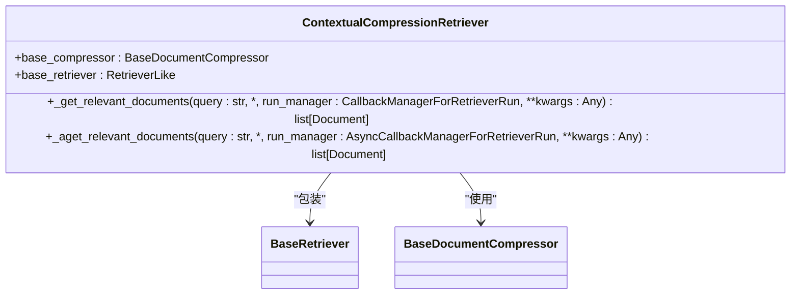
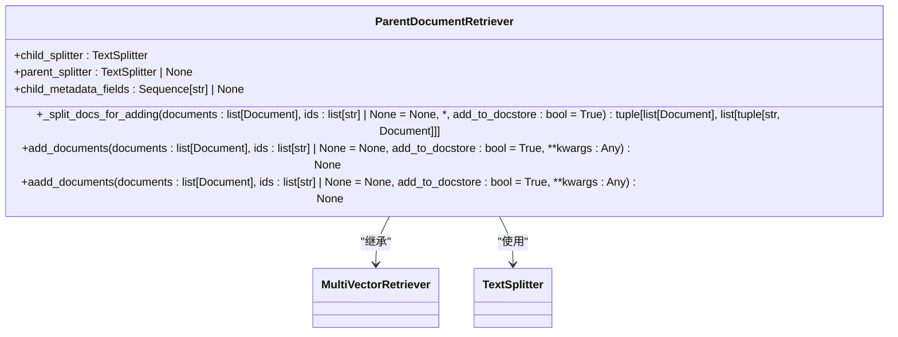
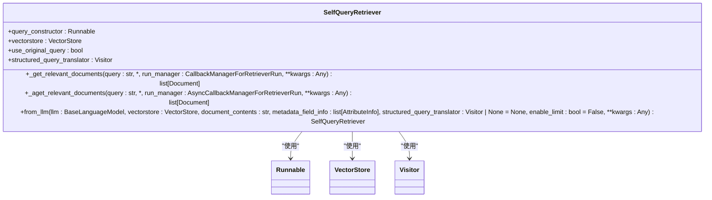

# Retriever

<cite>
**本文档中引用的文件**   
- [retrievers.py](file://libs/core/langchain_core/retrievers.py)
- [base.py](file://libs/core/langchain_core/vectorstores/base.py)
- [embeddings.py](file://libs/core/langchain_core/embeddings/embeddings.py)
- [ensemble.py](file://libs/langchain/langchain_classic/retrievers/ensemble.py)
- [multi_query.py](file://libs/langchain/langchain_classic/retrievers/multi_query.py)
- [contextual_compression.py](file://libs/langchain/langchain_classic/retrievers/contextual_compression.py)
- [parent_document_retriever.py](file://libs/langchain/langchain_classic/retrievers/parent_document_retriever.py)
- [bm25.py](file://libs/langchain/langchain_classic/retrievers/bm25.py)
- [self_query/base.py](file://libs/langchain/langchain_classic/retrievers/self_query/base.py)
</cite>

## 目录
1. [引言](#引言)
2. [Retriever核心概念](#retriever核心概念)
3. [向量检索器](#向量检索器)
4. [BM25检索器](#bm25检索器)
5. [混合检索器](#混合检索器)
6. [多查询检索器](#多查询检索器)
7. [上下文压缩检索器](#上下文压缩检索器)
8. [父文档检索器](#父文档检索器)
9. [自查询检索器](#自查询检索器)
10. [性能优化与评估](#性能优化与评估)
11. [结论](#结论)

## 引言

Retriever是LangChain框架中的核心组件，负责从大规模文档集合中检索与用户查询最相关的信息。在检索增强生成（RAG，Retrieval-Augmented Generation）架构中，Retriever扮演着至关重要的角色，它为大型语言模型（LLM）提供外部知识，从而增强LLM的响应能力和准确性。通过将外部知识库与LLM相结合，RAG架构能够生成更加准确、可靠和信息丰富的回答，克服了LLM在知识更新和特定领域知识方面的局限性。

Retriever的设计比向量存储更加通用，它不需要具备存储文档的能力，只需要能够返回（或检索）相关文档即可。向量存储可以作为Retriever的基础，但还有其他类型的Retriever。LangChain提供了多种Retriever实现，包括基于相似度搜索的向量检索器、基于关键词匹配的BM25检索器以及结合多种方法的混合检索器。

**Section sources**
- [retrievers.py](file://libs/core/langchain_core/retrievers.py#L1-L30)

## Retriever核心概念

Retriever的核心是`BaseRetriever`抽象基类，它定义了文档检索系统的基本接口。任何自定义的Retriever实现都必须继承这个类并实现`_get_relevant_documents`方法来定义检索逻辑。Retriever遵循标准的Runnable接口，可以通过`invoke`、`ainvoke`、`batch`、`abatch`等方法进行调用。



**Diagram sources **
- [retrievers.py](file://libs/core/langchain_core/retrievers.py#L100-L300)

**Section sources**
- [retrievers.py](file://libs/core/langchain_core/retrievers.py#L100-L300)

## 向量检索器

向量检索器是基于嵌入模型的相似度搜索实现。它将文档和查询转换为高维向量空间中的点，然后通过计算向量之间的相似度来检索最相关的文档。向量检索器的核心是`VectorStoreRetriever`类，它包装了一个向量存储实例，并提供了多种搜索类型。



**Diagram sources **
- [base.py](file://libs/core/langchain_core/vectorstores/base.py#L926-L1040)
- [base.py](file://libs/core/langchain_core/vectorstores/base.py#L606-L637)

**Section sources**
- [base.py](file://libs/core/langchain_core/vectorstores/base.py#L926-L1040)

### 搜索类型

向量检索器支持多种搜索类型，以满足不同的检索需求：

- **相似度搜索 (similarity)**：返回与查询最相似的k个文档。
- **相似度阈值搜索 (similarity_score_threshold)**：只返回相似度分数高于指定阈值的文档。
- **最大边际相关性搜索 (mmr)**：在相关性和多样性之间取得平衡，避免返回内容重复的文档。

### 嵌入模型

嵌入模型负责将文本转换为向量。LangChain通过`Embeddings`接口抽象了嵌入模型的实现，支持多种嵌入模型，如OpenAI、Hugging Face等。



**Diagram sources **
- [embeddings.py](file://libs/core/langchain_core/embeddings/embeddings.py#L1-L78)

## BM25检索器

BM25检索器是一种基于关键词匹配的传统信息检索方法。它不依赖于嵌入模型，而是直接在文档的原始文本上进行关键词匹配。BM25算法考虑了词频、逆文档频率和文档长度等因素，能够有效地处理关键词搜索。

```mermaid
classDiagram
class BM25Retriever {
+_get_relevant_documents(query : str, *, run_manager : CallbackManagerForRetrieverRun) list[Document]
+_aget_relevant_documents(query : str, *, run_manager : AsyncCallbackManagerForRetrieverRun) list[Document]
}
BM25Retriever --> "sklearn.feature_extraction.text" : "使用"
BM25Retriever --> "sklearn.metrics.pairwise" : "使用"
```

**Diagram sources **
- [bm25.py](file://libs/langchain/langchain_classic/retrievers/bm25.py#L1-L28)

**Section sources**
- [bm25.py](file://libs/langchain/langchain_classic/retrievers/bm25.py#L1-L28)

## 混合检索器

混合检索器（EnsembleRetriever）通过结合多个检索器的结果来提高检索的准确性和鲁棒性。它使用加权倒数排名融合（Weighted Reciprocal Rank Fusion, RRF）算法对多个检索器的结果进行融合。



**Diagram sources **
- [ensemble.py](file://libs/langchain/langchain_classic/retrievers/ensemble.py#L100-L300)

**Section sources**
- [ensemble.py](file://libs/langchain/langchain_classic/retrievers/ensemble.py#L100-L300)

### 加权倒数排名融合

加权倒数排名融合算法为每个文档分配一个RRF分数，该分数基于文档在各个检索器结果中的排名。排名越靠前，分数越高。最终结果按RRF分数降序排列。

```python
def weighted_reciprocal_rank(doc_lists: list[list[Document]], weights: list[float], c: int = 60) -> list[Document]:
    rrf_score: dict[str, float] = defaultdict(float)
    for doc_list, weight in zip(doc_lists, weights):
        for rank, doc in enumerate(doc_list, start=1):
            rrf_score[doc.page_content] += weight / (rank + c)
    return sorted(unique_by_key(all_docs), reverse=True, key=lambda doc: rrf_score[doc.page_content])
```

## 多查询检索器

多查询检索器（MultiQueryRetriever）利用大型语言模型（LLM）生成与原始查询语义相似的多个查询，然后对每个查询执行检索，最后返回所有检索结果的唯一并集。这种方法可以克服基于距离的相似性搜索的局限性，通过生成用户查询的多个视角来提高检索效果。



**Diagram sources **
- [multi_query.py](file://libs/langchain/langchain_classic/retrievers/multi_query.py#L100-L200)

**Section sources**
- [multi_query.py](file://libs/langchain/langchain_classic/retrievers/multi_query.py#L100-L200)

## 上下文压缩检索器

上下文压缩检索器（ContextualCompressionRetriever）包装一个基础检索器和一个文档压缩器。它首先使用基础检索器检索相关文档，然后使用文档压缩器对检索到的文档进行压缩，以提高检索结果的质量和相关性。



**Diagram sources **
- [contextual_compression.py](file://libs/langchain/langchain_classic/retrievers/contextual_compression.py#L1-L67)

**Section sources**
- [contextual_compression.py](file://libs/langchain/langchain_classic/retrievers/contextual_compression.py#L1-L67)

## 父文档检索器

父文档检索器（ParentDocumentRetriever）在检索时平衡了文档的准确性和上下文完整性。它将文档分割成小块进行存储和检索，但在检索时首先获取小块，然后查找这些小块的父ID并返回更大的父文档。这种方法既保证了嵌入的准确性，又保留了足够的上下文。



**Diagram sources **
- [parent_document_retriever.py](file://libs/langchain/langchain_classic/retrievers/parent_document_retriever.py#L1-L100)

**Section sources**
- [parent_document_retriever.py](file://libs/langchain/langchain_classic/retrievers/parent_document_retriever.py#L1-L100)

## 自查询检索器

自查询检索器（SelfQueryRetriever）能够根据查询内容自动生成结构化查询，然后在向量存储上执行该查询。它使用一个LLM来解析用户查询并提取过滤条件和查询内容，从而实现更精确的检索。



**Diagram sources **
- [self_query/base.py](file://libs/langchain/langchain_classic/retrievers/self_query/base.py#L1-L100)

**Section sources**
- [self_query/base.py](file://libs/langchain/langchain_classic/retrievers/self_query/base.py#L1-L100)

## 性能优化与评估

为了优化Retriever的性能和准确性，可以采取以下策略：

1. **嵌入模型选择**：选择适合任务和领域的嵌入模型，如OpenAI、Hugging Face等。
2. **相似度度量**：根据需求选择合适的相似度度量方法，如余弦相似度、欧几里得距离等。
3. **重排序策略**：在初步检索后使用重排序模型对结果进行重新排序，以提高相关性。
4. **混合检索**：结合多种检索方法（如向量检索和BM25检索）以提高检索的鲁棒性。
5. **查询扩展**：使用多查询检索器等技术生成多个查询以提高召回率。
6. **参数调优**：调整检索参数，如k值、相似度阈值等，以平衡准确率和召回率。

评估Retriever的性能通常使用准确率、召回率、F1分数等指标。可以通过构建测试集并人工标注相关文档来进行评估。

**Section sources**
- [retrievers.py](file://libs/core/langchain_core/retrievers.py#L1-L30)
- [base.py](file://libs/core/langchain_core/vectorstores/base.py#L926-L1040)

## 结论

LangChain的Retriever组件为构建高效的检索增强生成系统提供了强大的支持。通过理解不同类型的Retriever及其工作原理，开发者可以根据具体需求选择合适的检索策略，从而显著提升LLM的应用效果。从简单的向量检索到复杂的混合检索和自查询检索，LangChain提供了丰富的工具和灵活的接口，使得构建高质量的RAG系统变得更加容易。