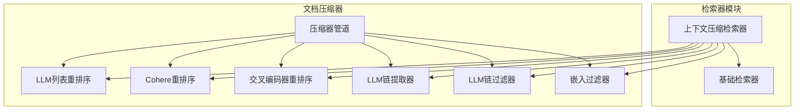
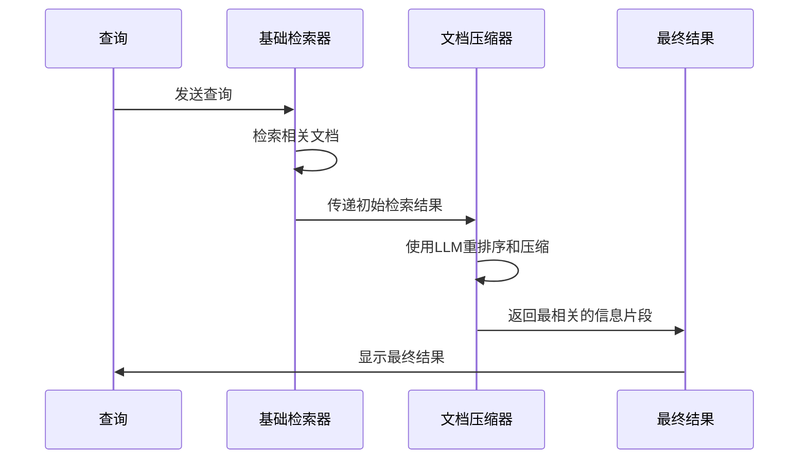
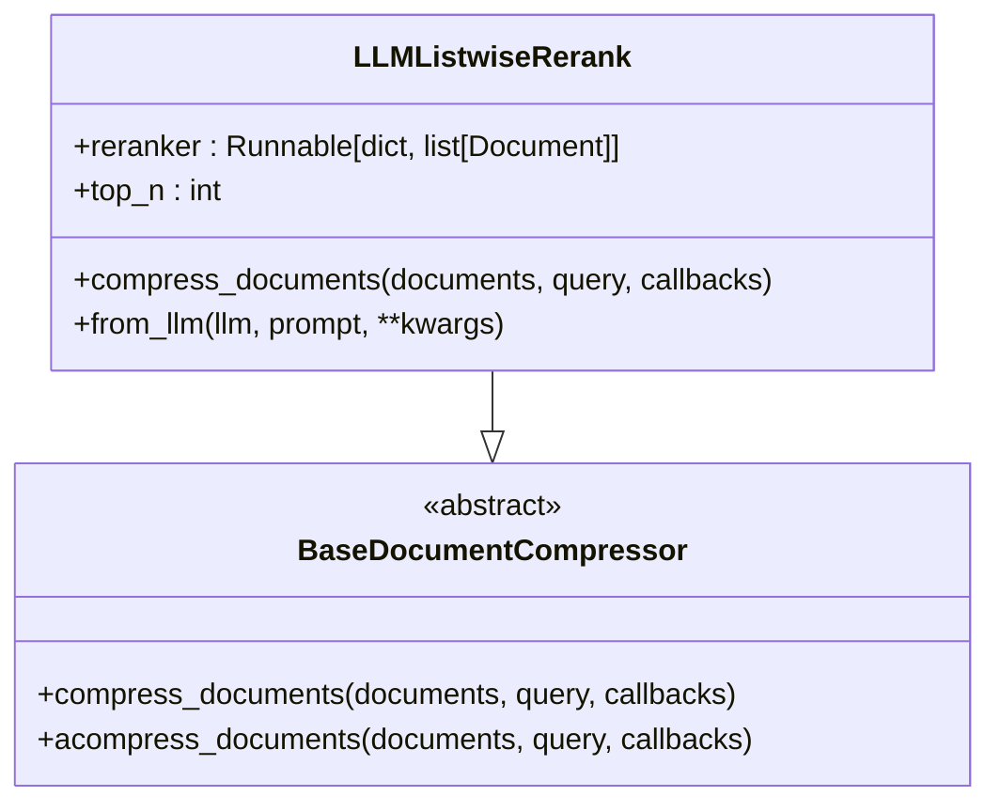
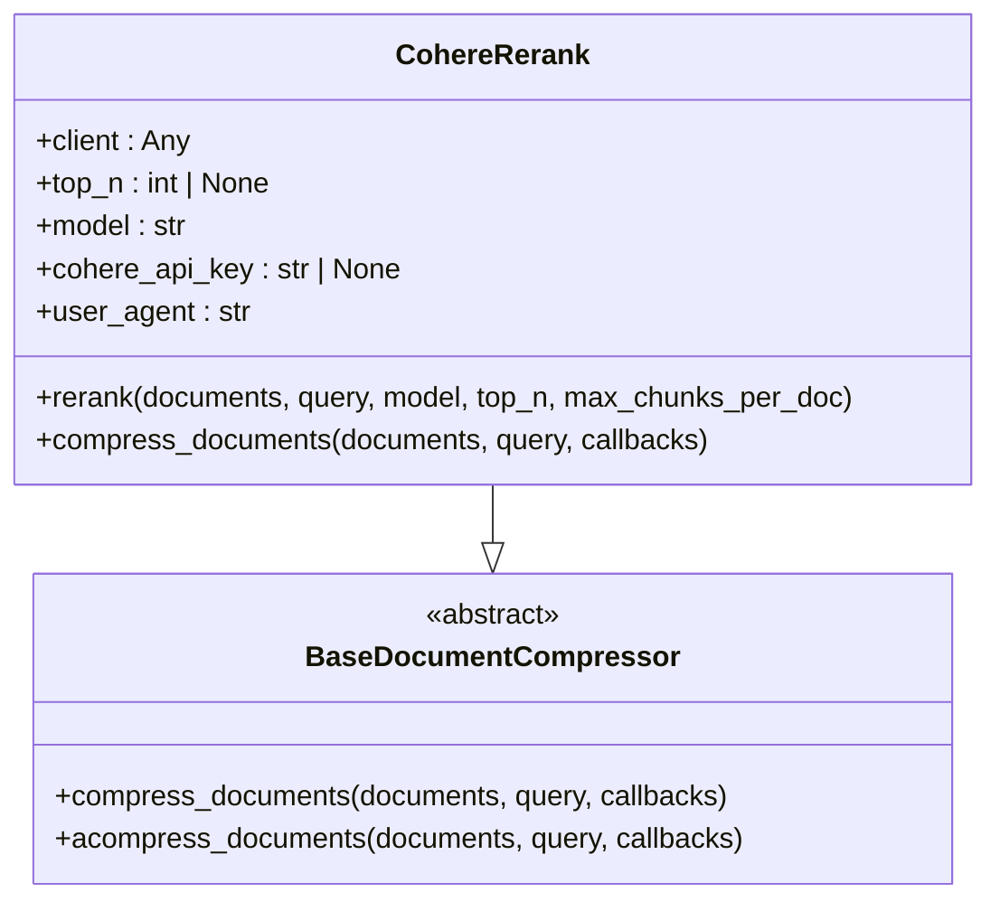
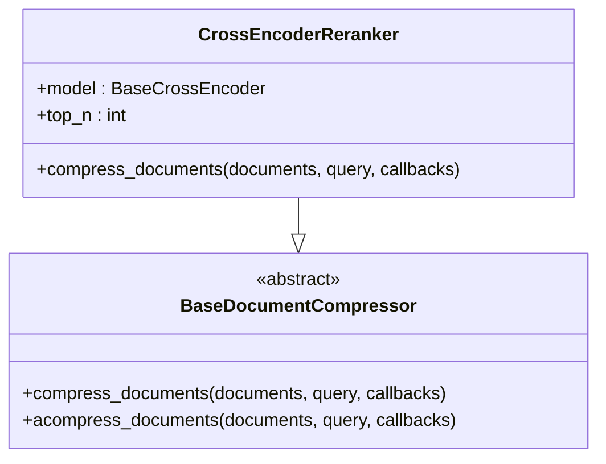
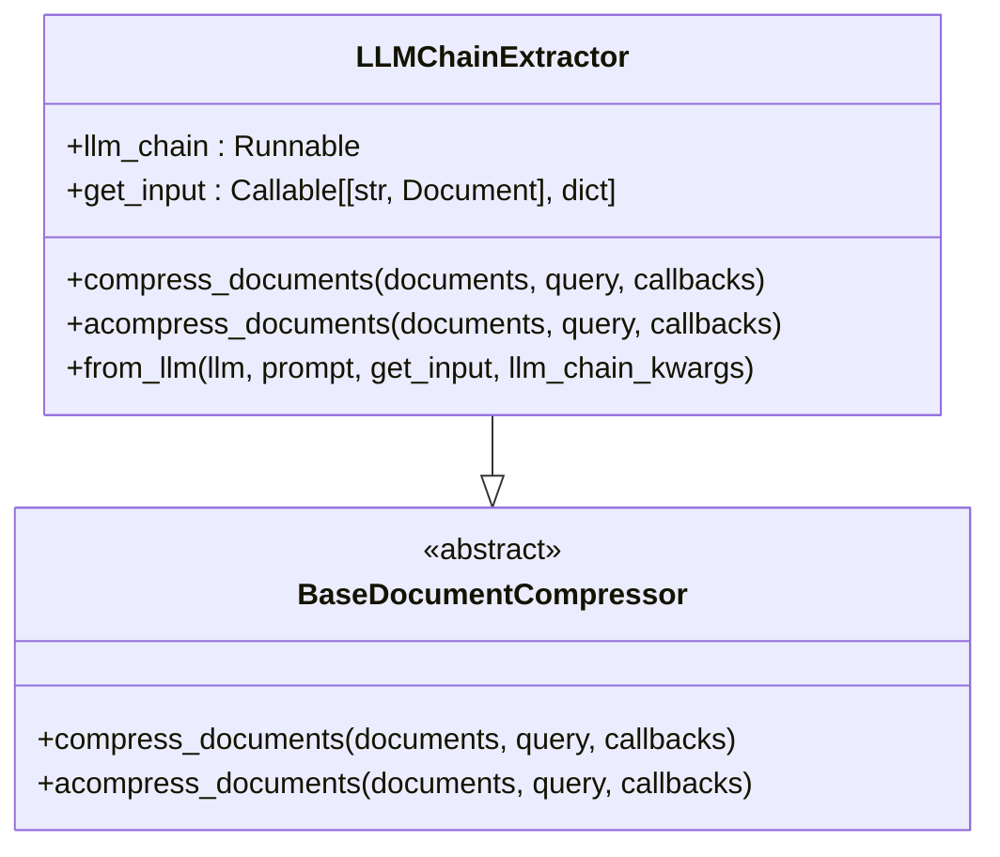
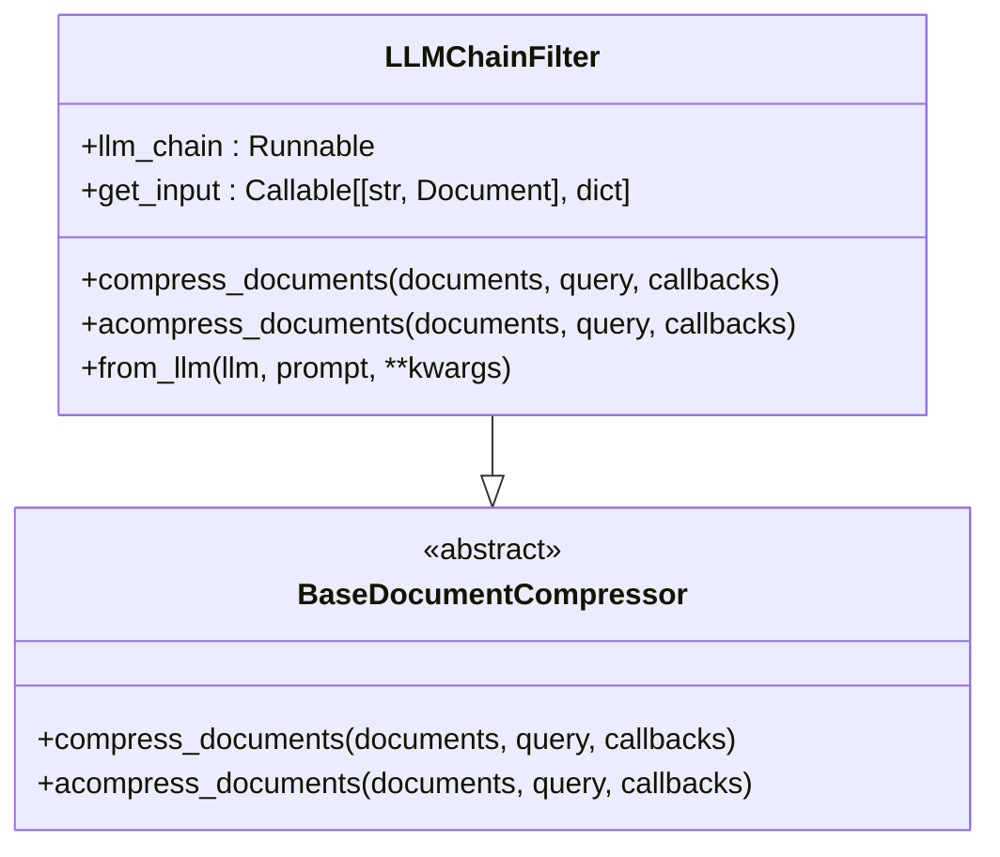
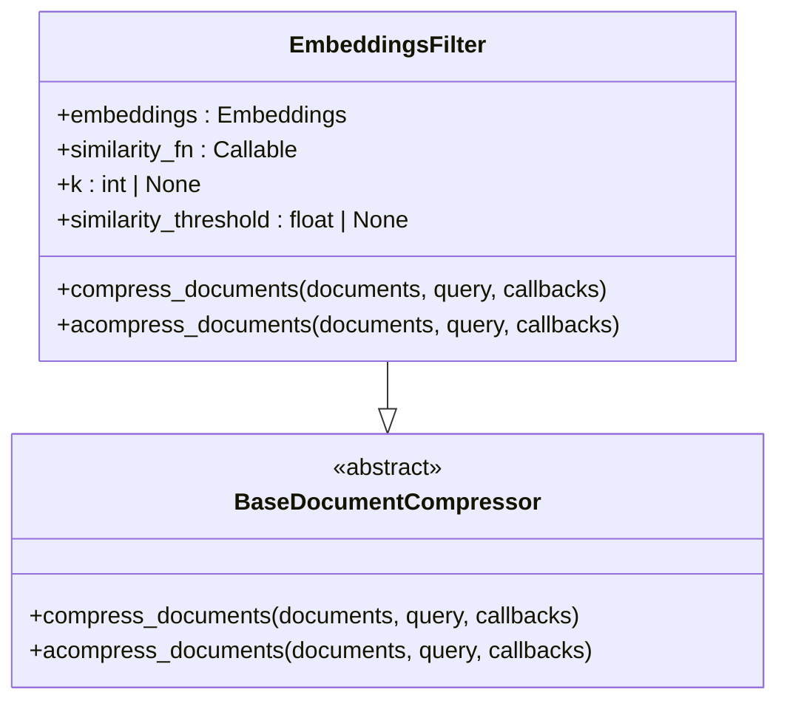
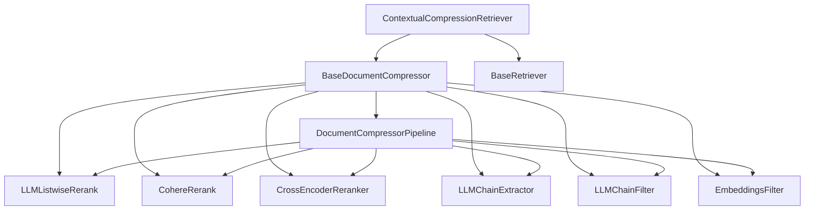

# 上下文压缩检索器

<cite>
**本文档中引用的文件**  
- [contextual_compression.py](file://libs/langchain/langchain_classic/retrievers/contextual_compression.py)
- [listwise_rerank.py](file://libs/langchain/langchain_classic/retrievers/document_compressors/listwise_rerank.py)
- [base.py](file://libs/langchain/langchain_classic/retrievers/document_compressors/base.py)
- [cohere_rerank.py](file://libs/langchain/langchain_classic/retrievers/document_compressors/cohere_rerank.py)
- [cross_encoder_rerank.py](file://libs/langchain/langchain_classic/retrievers/document_compressors/cross_encoder_rerank.py)
- [chain_extract.py](file://libs/langchain/langchain_classic/retrievers/document_compressors/chain_extract.py)
- [chain_filter.py](file://libs/langchain/langchain_classic/retrievers/document_compressors/chain_filter.py)
- [embeddings_filter.py](file://libs/langchain/langchain_classic/retrievers/document_compressors/embeddings_filter.py)
- [compressor.py](file://libs/core/langchain_core/documents/compressor.py)
</cite>

## 目录
1. [简介](#简介)
2. [项目结构](#项目结构)
3. [核心组件](#核心组件)
4. [架构概述](#架构概述)
5. [详细组件分析](#详细组件分析)
6. [依赖关系分析](#依赖关系分析)
7. [性能考虑](#性能考虑)
8. [故障排除指南](#故障排除指南)
9. [结论](#结论)

## 简介
上下文压缩检索器是一种先进的信息检索技术，它通过大语言模型对初始检索结果进行重排序和压缩，以提取最相关的信息片段。这种技术在处理长文档和复杂查询时具有显著优势，能够有效提高检索质量和效率。

## 项目结构
上下文压缩检索器的实现主要分布在LangChain库的retrievers模块中，特别是document_compressors子模块。该结构允许灵活地组合不同的压缩策略和检索器。

**图表来源**
- [contextual_compression.py](file://libs/langchain/langchain_classic/retrievers/contextual_compression.py)
- [listwise_rerank.py](file://libs/langchain/langchain_classic/retrievers/document_compressors/listwise_rerank.py)
- [cohere_rerank.py](file://libs/langchain/langchain_classic/retrievers/document_compressors/cohere_rerank.py)
- [cross_encoder_rerank.py](file://libs/langchain/langchain_classic/retrievers/document_compressors/cross_encoder_rerank.py)
- [chain_extract.py](file://libs/langchain/langchain_classic/retrievers/document_compressors/chain_extract.py)
- [chain_filter.py](file://libs/langchain/langchain_classic/retrievers/document_compressors/chain_filter.py)
- [embeddings_filter.py](file://libs/langchain/langchain_classic/retrievers/document_compressors/embeddings_filter.py)

**章节来源**
- [contextual_compression.py](file://libs/langchain/langchain_classic/retrievers/contextual_compression.py)
- [listwise_rerank.py](file://libs/langchain/langchain_classic/retrievers/document_compressors/listwise_rerank.py)

## 核心组件
上下文压缩检索器的核心组件包括基础检索器、文档压缩器和各种具体的压缩策略。这些组件协同工作，实现高效的文档检索和压缩。

**章节来源**
- [contextual_compression.py](file://libs/langchain/langchain_classic/retrievers/contextual_compression.py#L1-L68)
- [compressor.py](file://libs/core/langchain_core/documents/compressor.py#L1-L74)

## 架构概述
上下文压缩检索器的架构基于一个两阶段的检索过程：首先使用基础检索器获取相关文档，然后使用文档压缩器对这些文档进行重排序和压缩。

**图表来源**
- [contextual_compression.py](file://libs/langchain/langchain_classic/retrievers/contextual_compression.py#L1-L68)

## 详细组件分析
### LLM列表重排序分析
LLM列表重排序是上下文压缩检索器中最先进的压缩策略之一，它使用大语言模型对文档列表进行零样本重排序。

**图表来源**
- [listwise_rerank.py](file://libs/langchain/langchain_classic/retrievers/document_compressors/listwise_rerank.py#L1-L146)

### Cohere重排序分析
Cohere重排序使用Cohere API对文档进行重排序，适用于需要外部服务支持的场景。

**图表来源**
- [cohere_rerank.py](file://libs/langchain/langchain_classic/retrievers/document_compressors/cohere_rerank.py#L1-L124)

### 交叉编码器重排序分析
交叉编码器重排序使用交叉编码器模型对文档和查询之间的相似性进行评分，然后根据评分对文档进行重排序。

**图表来源**
- [cross_encoder_rerank.py](file://libs/langchain/langchain_classic/retrievers/document_compressors/cross_encoder_rerank.py#L1-L50)

### LLM链提取器分析
LLM链提取器使用LLM链从文档中提取与查询相关的内容片段。

**图表来源**
- [chain_extract.py](file://libs/langchain/langchain_classic/retrievers/document_compressors/chain_extract.py#L1-L126)

### LLM链过滤器分析
LLM链过滤器使用LLM链判断文档是否与查询相关，从而过滤掉不相关的文档。

**图表来源**
- [chain_filter.py](file://libs/langchain/langchain_classic/retrievers/document_compressors/chain_filter.py#L1-L135)

### 嵌入过滤器分析
嵌入过滤器使用嵌入向量计算文档与查询之间的相似性，然后根据相似性阈值或数量限制过滤文档。

**图表来源**
- [embeddings_filter.py](file://libs/langchain/langchain_classic/retrievers/document_compressors/embeddings_filter.py#L1-L116)

**章节来源**
- [listwise_rerank.py](file://libs/langchain/langchain_classic/retrievers/document_compressors/listwise_rerank.py#L1-L146)
- [cohere_rerank.py](file://libs/langchain/langchain_classic/retrievers/document_compressors/cohere_rerank.py#L1-L124)
- [cross_encoder_rerank.py](file://libs/langchain/langchain_classic/retrievers/document_compressors/cross_encoder_rerank.py#L1-L50)
- [chain_extract.py](file://libs/langchain/langchain_classic/retrievers/document_compressors/chain_extract.py#L1-L126)
- [chain_filter.py](file://libs/langchain/langchain_classic/retrievers/document_compressors/chain_filter.py#L1-L135)
- [embeddings_filter.py](file://libs/langchain/langchain_classic/retrievers/document_compressors/embeddings_filter.py#L1-L116)

## 依赖关系分析
上下文压缩检索器的各个组件之间存在复杂的依赖关系，这些关系确保了系统的灵活性和可扩展性。

**图表来源**
- [contextual_compression.py](file://libs/langchain/langchain_classic/retrievers/contextual_compression.py#L1-L68)
- [base.py](file://libs/langchain/langchain_classic/retrievers/document_compressors/base.py#L1-L81)
- [compressor.py](file://libs/core/langchain_core/documents/compressor.py#L1-L74)

**章节来源**
- [contextual_compression.py](file://libs/langchain/langchain_classic/retrievers/contextual_compression.py#L1-L68)
- [base.py](file://libs/langchain/langchain_classic/retrievers/document_compressors/base.py#L1-L81)
- [compressor.py](file://libs/core/langchain_core/documents/compressor.py#L1-L74)

## 性能考虑
上下文压缩检索器在处理长文档和复杂查询时具有显著优势，但同时也需要考虑计算成本和检索质量之间的平衡。选择合适的重排序模型和调整压缩参数是优化性能的关键。

## 故障排除指南
在使用上下文压缩检索器时，可能会遇到一些常见问题，如模型不支持`with_structured_output`方法、API密钥缺失等。确保正确配置模型和参数可以有效避免这些问题。

**章节来源**
- [listwise_rerank.py](file://libs/langchain/langchain_classic/retrievers/document_compressors/listwise_rerank.py#L116-L145)
- [cohere_rerank.py](file://libs/langchain/langchain_classic/retrievers/document_compressors/cohere_rerank.py#L1-L124)

## 结论
上下文压缩检索器通过大语言模型对初始检索结果进行重排序和压缩，有效提高了信息检索的质量和效率。通过灵活组合不同的压缩策略和检索器，可以满足各种复杂场景的需求。