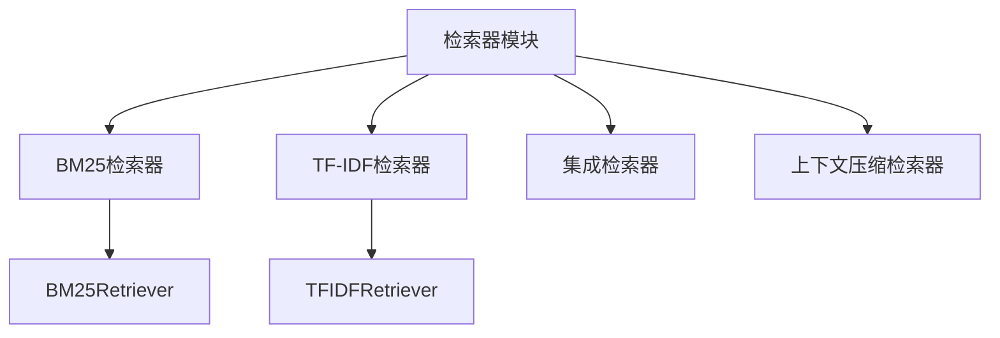
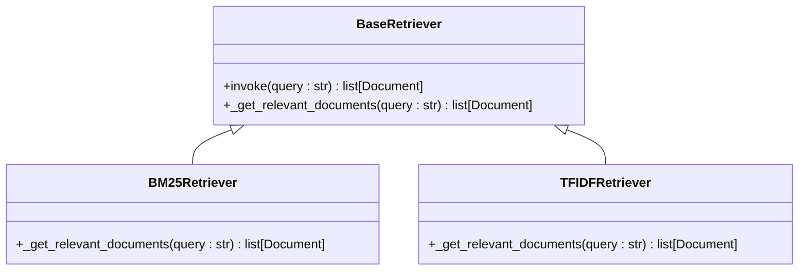
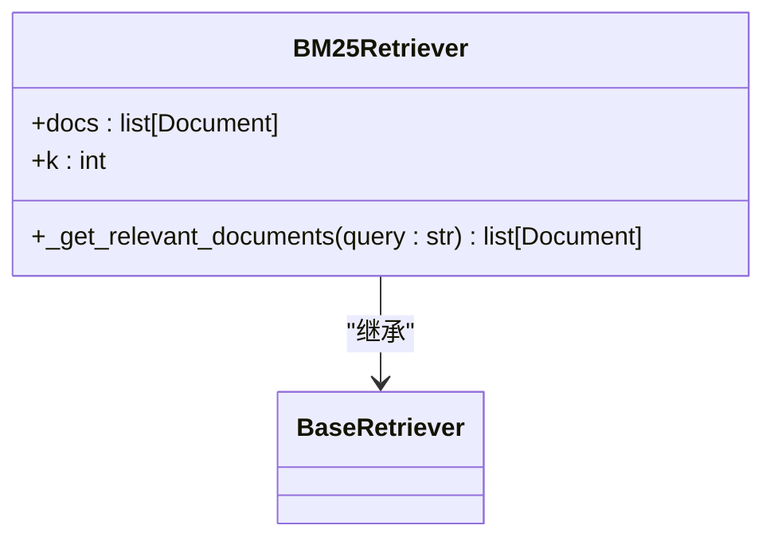
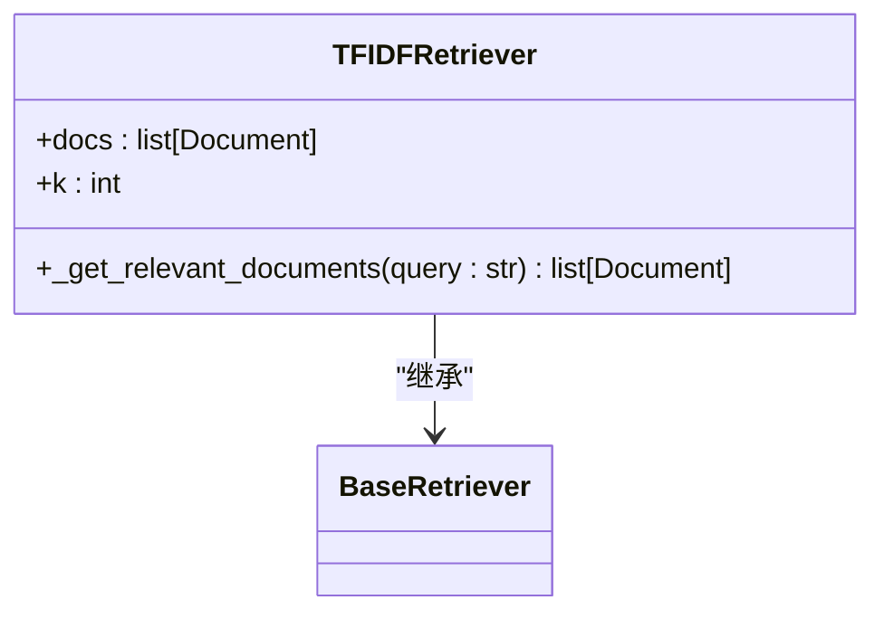
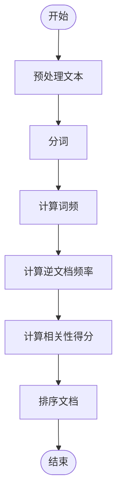
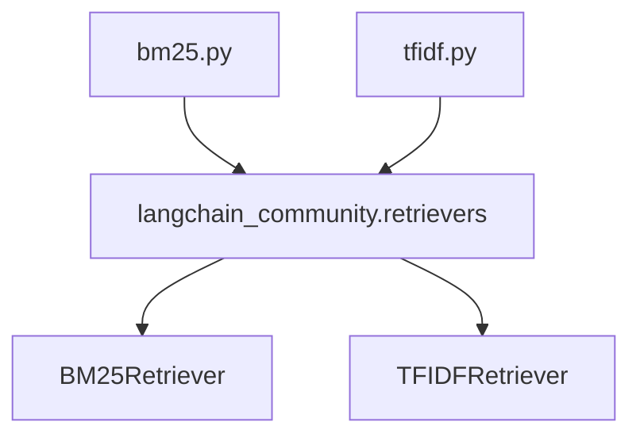

# 关键词检索器

<cite>
**本文档引用的文件**
- [bm25.py](file://libs/langchain/langchain_classic/retrievers/bm25.py)
- [__init__.py](file://libs/langchain/langchain_classic/retrievers/__init__.py)
- [retrievers.py](file://libs/core/langchain_core/retrievers.py)
- [tfidf.py](file://libs/langchain/langchain_classic/retrievers/tfidf.py)
</cite>

## 目录
1. [引言](#引言)
2. [项目结构](#项目结构)
3. [核心组件](#核心组件)
4. [架构概述](#架构概述)
5. [详细组件分析](#详细组件分析)
6. [依赖分析](#依赖分析)
7. [性能考虑](#性能考虑)
8. [故障排除指南](#故障排除指南)
9. [结论](#结论)
10. [附录](#附录)（如有必要）

## 引言
关键词检索器是信息检索系统中的核心组件，它基于传统信息检索算法如BM25和TF-IDF来评估文档与查询的相关性。这些算法通过词频和逆文档频率等统计特征来衡量文档的重要性，特别适用于精确匹配和关键词搜索场景。在处理专业术语和特定实体时，关键词检索器表现出色，因为它能够准确识别和匹配关键术语。本文档将深入探讨关键词检索器的工作原理，包括其配置和使用方法，并对比其与向量检索器在不同应用场景下的性能和适用性。

## 项目结构
关键词检索器的实现位于LangChain库的`retrievers`模块中，主要包含BM25和TF-IDF两种算法的实现。这些实现通过动态导入机制从`langchain_community.retrievers`包中加载，确保了代码的模块化和可扩展性。项目结构清晰地划分了不同的检索器类型，使得开发者可以轻松地选择和集成适合其应用场景的检索器。

**图表来源**
- [bm25.py](file://libs/langchain/langchain_classic/retrievers/bm25.py)
- [tfidf.py](file://libs/langchain/langchain_classic/retrievers/tfidf.py)

**章节来源**
- [__init__.py](file://libs/langchain/langchain_classic/retrievers/__init__.py)

## 核心组件
关键词检索器的核心组件包括BM25Retriever和TFIDFRetriever，它们分别实现了BM25和TF-IDF算法。这些组件通过计算词频和逆文档频率来评估文档的相关性，从而返回最相关的文档列表。此外，LangChain还提供了多种高级检索器，如集成检索器和上下文压缩检索器，以满足不同的应用需求。

**章节来源**
- [bm25.py](file://libs/langchain/langchain_classic/retrievers/bm25.py)
- [tfidf.py](file://libs/langchain/langchain_classic/retrievers/tfidf.py)

## 架构概述
关键词检索器的架构设计遵循模块化原则，允许开发者根据需要选择合适的检索算法。BM25和TF-IDF算法通过独立的类实现，每个类都继承自`BaseRetriever`基类，确保了接口的一致性和可扩展性。此外，LangChain还提供了动态导入机制，使得第三方实现可以无缝集成到系统中。

**图表来源**
- [retrievers.py](file://libs/core/langchain_core/retrievers.py)
- [bm25.py](file://libs/langchain/langchain_classic/retrievers/bm25.py)
- [tfidf.py](file://libs/langchain/langchain_classic/retrievers/tfidf.py)

## 详细组件分析

### BM25检索器分析
BM25检索器基于BM25算法，该算法通过结合词频和逆文档频率来评估文档的相关性。BM25算法考虑了文档长度对相关性的影响，从而提高了检索的准确性。在实现上，BM25Retriever类通过调用`langchain_community.retrievers`包中的实际实现来完成文档检索。

#### 对象导向组件：

**图表来源**
- [bm25.py](file://libs/langchain/langchain_classic/retrievers/bm25.py)

### TF-IDF检索器分析
TF-IDF检索器基于TF-IDF算法，该算法通过计算词频和逆文档频率来评估文档的重要性。TF-IDF算法在处理关键词搜索时表现出色，特别是在需要精确匹配的场景下。TFIDFRetriever类同样通过调用`langchain_community.retrievers`包中的实际实现来完成文档检索。

#### 对象导向组件：

**图表来源**
- [tfidf.py](file://libs/langchain/langchain_classic/retrievers/tfidf.py)

### 概念概述
关键词检索器通过统计方法评估文档与查询的相关性，特别适用于精确匹配和关键词搜索场景。BM25和TF-IDF算法通过不同的方式计算文档的重要性，其中BM25算法考虑了文档长度的影响，而TF-IDF算法则侧重于词频和逆文档频率的平衡。

## 依赖分析
关键词检索器的实现依赖于`langchain_community.retrievers`包中的具体实现，通过动态导入机制加载。这种设计使得核心库保持轻量级，同时允许第三方开发者贡献新的检索算法。此外，检索器还依赖于`BaseRetriever`基类，确保了接口的一致性和可扩展性。

**图表来源**
- [bm25.py](file://libs/langchain/langchain_classic/retrievers/bm25.py)
- [tfidf.py](file://libs/langchain/langchain_classic/retrievers/tfidf.py)

**章节来源**
- [__init__.py](file://libs/langchain/langchain_classic/retrievers/__init__.py)

## 性能考虑
关键词检索器在处理大规模文档集合时表现出良好的性能，特别是在需要精确匹配和关键词搜索的场景下。BM25算法通过考虑文档长度的影响，进一步提高了检索的准确性。然而，在处理高维稀疏数据时，TF-IDF算法可能会遇到性能瓶颈，因此在选择检索算法时需要权衡准确性和效率。

## 故障排除指南
在使用关键词检索器时，常见的问题包括文档预处理不当、分词错误和相关性得分计算不准确。为了解决这些问题，建议仔细检查文本预处理流程，确保分词器正确配置，并验证相关性得分的计算逻辑。此外，可以通过调整BM25算法的参数（如k1和b）来优化检索效果。

**章节来源**
- [bm25.py](file://libs/langchain/langchain_classic/retrievers/bm25.py)
- [tfidf.py](file://libs/langchain/langchain_classic/retrievers/tfidf.py)

## 结论
关键词检索器是信息检索系统中的重要组成部分，它通过BM25和TF-IDF等传统算法评估文档的相关性。这些算法在处理精确匹配和关键词搜索场景时表现出色，特别适用于需要高准确性的应用。通过合理配置和优化，关键词检索器可以在各种应用场景中提供高效且准确的检索服务。

## 附录
### BM25算法公式
BM25算法的相关性得分计算公式如下：
$$
\text{score}(D, Q) = \sum_{i=1}^{n} \text{IDF}(q_i) \cdot \frac{f(q_i, D) \cdot (k_1 + 1)}{f(q_i, D) + k_1 \cdot (1 - b + b \cdot \frac{|D|}{\text{avgdl}})}
$$
其中：
- $ f(q_i, D) $ 是词项 $ q_i $ 在文档 $ D $ 中的频率
- $ |D| $ 是文档 $ D $ 的长度
- $ \text{avgdl} $ 是文档集合的平均长度
- $ k_1 $ 和 $ b $ 是可调参数

### TF-IDF算法公式
TF-IDF算法的相关性得分计算公式如下：
$$
\text{TF-IDF}(t, d) = \text{TF}(t, d) \cdot \text{IDF}(t)
$$
其中：
- $ \text{TF}(t, d) $ 是词项 $ t $ 在文档 $ d $ 中的频率
- $ \text{IDF}(t) = \log \frac{N}{|\{d \in D : t \in d\}|} $，$ N $ 是文档总数，$ |\{d \in D : t \in d\}| $ 是包含词项 $ t $ 的文档数