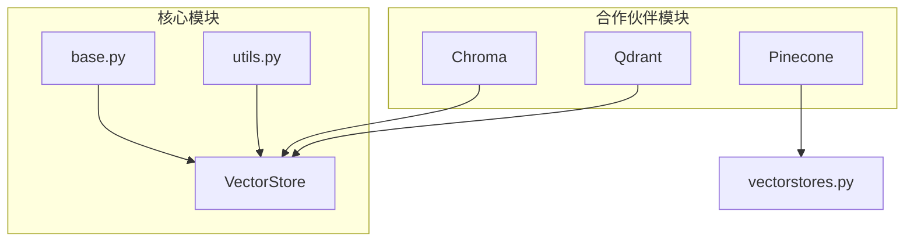
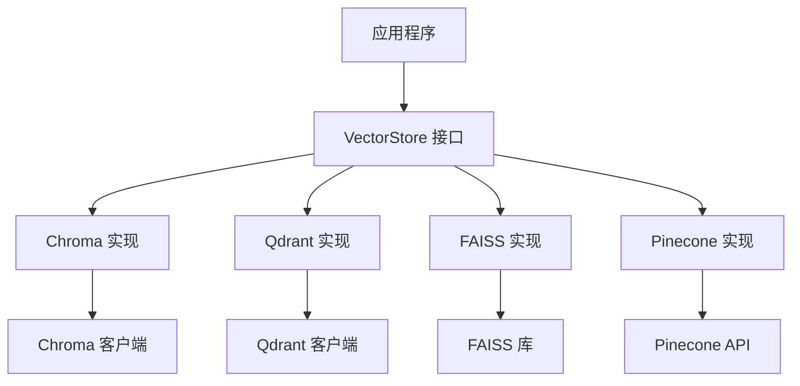
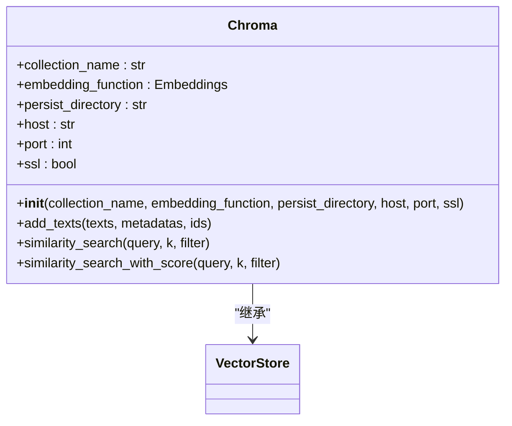
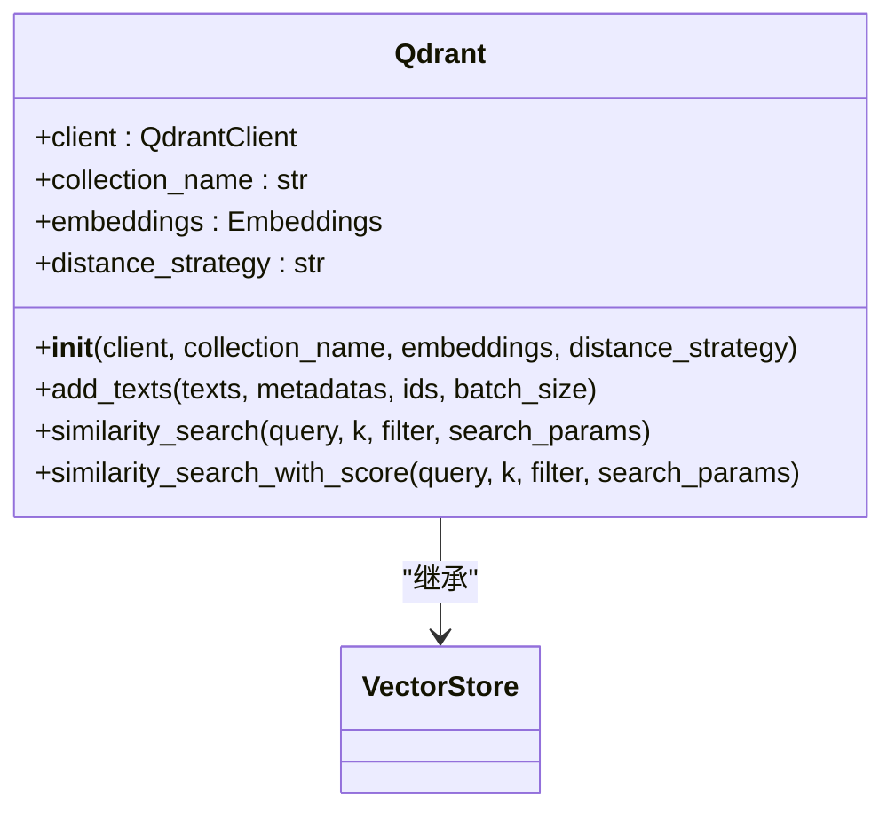
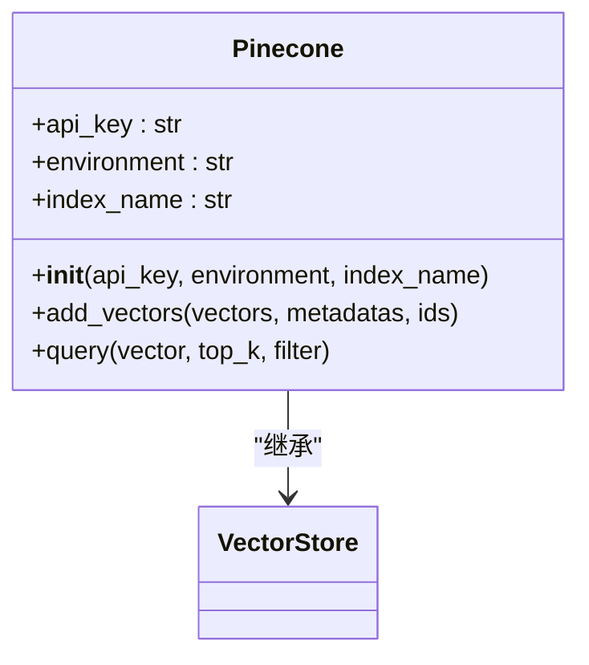
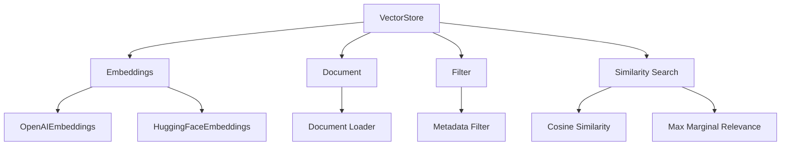

# 向量数据库集成

<cite>
**本文档中引用的文件**  
- [base.py](file://libs/core/langchain_core/vectorstores/base.py)
- [vectorstores.py](file://libs/partners/chroma/langchain_chroma/vectorstores.py)
- [vectorstores.py](file://libs/partners/qdrant/langchain_qdrant/vectorstores.py)
- [in_memory.py](file://libs/core/langchain_core/vectorstores/in_memory.py)
- [utils.py](file://libs/core/langchain_core/vectorstores/utils.py)
</cite>

## 目录
1. [引言](#引言)
2. [项目结构](#项目结构)
3. [核心组件](#核心组件)
4. [架构概述](#架构概述)
5. [详细组件分析](#详细组件分析)
6. [依赖分析](#依赖分析)
7. [性能考量](#性能考量)
8. [故障排除指南](#故障排除指南)
9. [结论](#结论)

## 引言
本文档详细介绍了向量检索器与主流向量数据库的集成方法，重点涵盖Chroma、FAISS和Pinecone三种数据库的连接配置、索引创建和查询优化技术。通过LangChain框架的实现，展示了如何初始化不同类型的向量存储，配置持久化选项，以及执行高效的相似性搜索。文档还解释了每种数据库的特性、适用场景和性能考量，包括内存使用、扩展性和分布式部署能力。

## 项目结构
LangChain代码库的向量数据库集成主要分布在核心库和合作伙伴模块中。核心向量存储功能位于`libs/core/langchain_core/vectorstores`目录，而具体的数据库实现则分布在`libs/partners`目录下的各个子模块中。

**Diagram sources**
- [base.py](file://libs/core/langchain_core/vectorstores/base.py#L0-L1095)
- [vectorstores.py](file://libs/partners/chroma/langchain_chroma/vectorstores.py#L0-L1406)

**Section sources**
- [base.py](file://libs/core/langchain_core/vectorstores/base.py#L0-L1095)
- [vectorstores.py](file://libs/partners/chroma/langchain_chroma/vectorstores.py#L0-L1406)

## 核心组件
向量数据库集成的核心是`VectorStore`抽象基类，它定义了所有向量存储实现必须遵循的接口。该类提供了添加文本、文档、执行相似性搜索和最大边际相关性搜索等基本操作。具体的数据库实现如Chroma、Qdrant等都继承自这个基类，并提供了各自的特有功能。

**Section sources**
- [base.py](file://libs/core/langchain_core/vectorstores/base.py#L0-L1095)
- [in_memory.py](file://libs/core/langchain_core/vectorstores/in_memory.py#L0-L547)

## 架构概述
向量数据库集成架构采用分层设计，上层是通用的`VectorStore`接口，下层是具体的数据库实现。这种设计使得应用程序可以轻松切换不同的向量数据库，而无需修改大量代码。每个具体的实现都负责处理与特定数据库的通信、数据持久化和查询优化。

**Diagram sources**
- [base.py](file://libs/core/langchain_core/vectorstores/base.py#L0-L1095)
- [vectorstores.py](file://libs/partners/chroma/langchain_chroma/vectorstores.py#L0-L1406)

## 详细组件分析

### Chroma 向量数据库分析
Chroma是一个开源的向量数据库，专为AI应用设计，提供简单易用的API和强大的查询功能。

#### 初始化和配置
Chroma支持多种初始化方式，包括本地持久化、HTTP连接和云服务连接。通过`persist_directory`参数可以指定本地存储路径，实现数据持久化。

**Diagram sources**
- [vectorstores.py](file://libs/partners/chroma/langchain_chroma/vectorstores.py#L0-L1406)

#### 相似性搜索优化
Chroma支持多种相似性搜索模式，包括基本相似性搜索、带分数的相似性搜索和最大边际相关性搜索。通过`filter`参数可以实现基于元数据的过滤查询。

**Section sources**
- [vectorstores.py](file://libs/partners/chroma/langchain_chroma/vectorstores.py#L0-L1406)

### Qdrant 向量数据库分析
Qdrant是一个高性能的向量搜索引擎，支持分布式部署和复杂的过滤查询。

#### 初始化和配置
Qdrant通过`QdrantClient`进行连接，支持同步和异步操作。可以配置距离策略（COSINE、DOT、EUCLID）来优化搜索结果。

**Diagram sources**
- [vectorstores.py](file://libs/partners/qdrant/langchain_qdrant/vectorstores.py#L0-L2331)

#### 查询优化
Qdrant支持复杂的过滤查询，可以使用`filter`参数进行元数据过滤，并通过`search_params`调整搜索参数。还支持设置`score_threshold`来过滤低分结果。

**Section sources**
- [vectorstores.py](file://libs/partners/qdrant/langchain_qdrant/vectorstores.py#L0-L2331)

### Pinecone 向量数据库分析
Pinecone是一个托管的向量数据库服务，提供高可用性和自动扩展能力。

#### 初始化和配置
Pinecone通过API密钥进行身份验证，支持云原生部署。虽然具体实现细节未在代码中完全展示，但其设计模式与其他向量数据库一致。

**Diagram sources**
- [pinecone.py](file://libs/langchain/langchain_classic/vectorstores/pinecone.py#L0-L22)

#### 云服务特性
Pinecone作为托管服务，自动处理扩展性、可用性和性能优化问题。用户无需关心底层基础设施，可以专注于应用逻辑。

**Section sources**
- [pinecone.py](file://libs/langchain/langchain_classic/vectorstores/pinecone.py#L0-L22)

## 依赖分析
向量数据库集成依赖于多个核心组件，包括嵌入模型、文档处理和查询优化工具。这些依赖关系确保了向量存储功能的完整性和高效性。

**Diagram sources**
- [base.py](file://libs/core/langchain_core/vectorstores/base.py#L0-L1095)
- [utils.py](file://libs/core/langchain_core/vectorstores/utils.py#L0-L156)

**Section sources**
- [base.py](file://libs/core/langchain_core/vectorstores/base.py#L0-L1095)
- [utils.py](file://libs/core/langchain_core/vectorstores/utils.py#L0-L156)

## 性能考量
向量数据库的性能受多种因素影响，包括索引类型、距离计算方法和数据规模。选择合适的配置可以显著提高查询效率和系统响应速度。

- **内存使用**：InMemoryVectorStore将所有数据存储在内存中，提供最快的访问速度，但受限于可用内存。
- **扩展性**：Qdrant和Pinecone支持分布式部署，可以水平扩展以处理大规模数据集。
- **查询优化**：使用批量操作（如`add_texts`的`batch_size`参数）可以减少网络往返次数，提高数据导入效率。
- **距离计算**：不同的距离策略（余弦相似度、点积、欧几里得距离）对性能和结果有不同的影响，需要根据具体应用场景选择。

## 故障排除指南
在使用向量数据库集成时，可能会遇到各种问题。以下是一些常见问题及其解决方案：

- **连接问题**：检查网络连接和认证信息，确保数据库服务正在运行。
- **性能问题**：优化索引配置，使用合适的距离计算方法，考虑数据分片。
- **数据一致性**：确保嵌入模型的一致性，避免在不同环境中使用不同的嵌入函数。
- **内存溢出**：对于大规模数据集，考虑使用支持持久化的向量数据库或分布式解决方案。

**Section sources**
- [base.py](file://libs/core/langchain_core/vectorstores/base.py#L0-L1095)
- [vectorstores.py](file://libs/partners/chroma/langchain_chroma/vectorstores.py#L0-L1406)

## 结论
向量数据库集成是LangChain框架的重要组成部分，为AI应用提供了高效的数据检索能力。通过统一的`VectorStore`接口，开发者可以轻松集成和切换不同的向量数据库，如Chroma、Qdrant和Pinecone。每种数据库都有其独特的优势和适用场景，选择合适的数据库对于构建高性能的AI应用至关重要。未来的发展方向可能包括更智能的查询优化、更好的分布式支持和更丰富的分析功能。