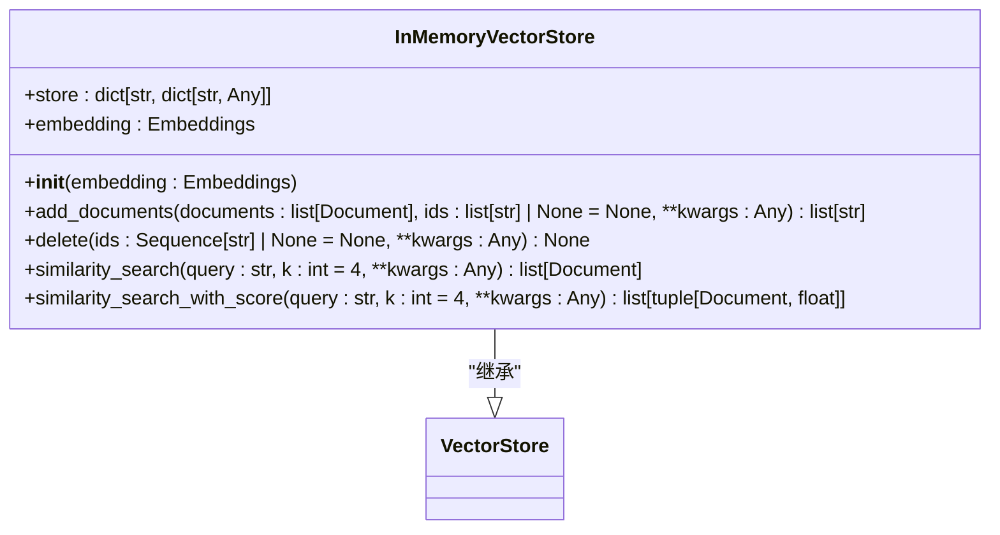
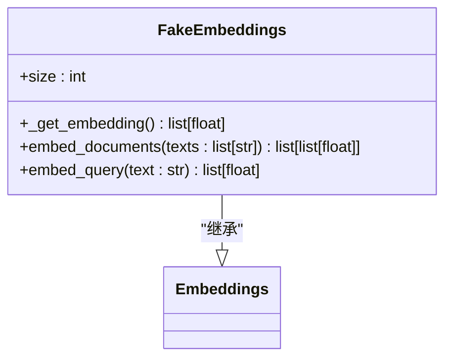
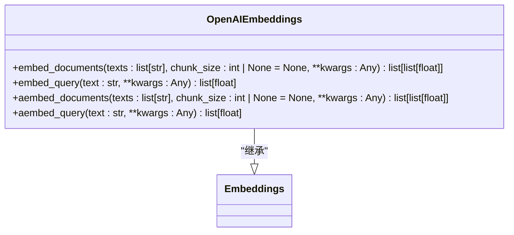
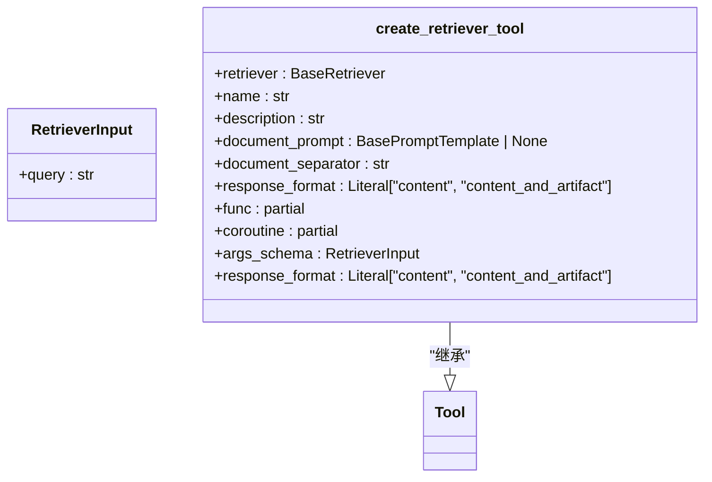

# 向量检索器

<cite>
**本文档中引用的文件**  
- [base.py](file://libs/core/langchain_core/vectorstores/base.py)
- [embeddings.py](file://libs/core/langchain_core/embeddings/embeddings.py)
- [in_memory.py](file://libs/core/langchain_core/vectorstores/in_memory.py)
- [fake.py](file://libs/core/langchain_core/embeddings/fake.py)
- [retrievers.py](file://libs/core/langchain_core/retrievers.py)
- [utils.py](file://libs/core/langchain_core/vectorstores/utils.py)
- [vectorstores.py](file://libs/partners/chroma/langchain_chroma/vectorstores.py)
- [base.py](file://libs/partners/openai/langchain_openai/embeddings/base.py)
</cite>

## 目录
1. [简介](#简介)
2. [核心原理](#核心原理)
3. [向量存储实现](#向量存储实现)
4. [嵌入模型](#嵌入模型)
5. [相似度搜索机制](#相似度搜索机制)
6. [与向量数据库的集成](#与向量数据库的集成)
7. [检索器工具](#检索器工具)
8. [性能优化](#性能优化)
9. [语义搜索的优势与局限性](#语义搜索的优势与局限性)
10. [结论](#结论)

## 简介
向量检索器是一种基于向量嵌入和相似度搜索的核心技术，用于在大规模非结构化数据中进行高效的语义搜索。通过将文本转换为高维向量，并在向量空间中进行最近邻搜索，向量检索器能够找到与查询最相似的文档。本文档详细介绍了向量检索器的核心原理、实现方式、与不同向量数据库的集成方法，以及如何使用不同的嵌入模型进行配置和优化。

## 核心原理
向量检索器的核心原理是将文本数据转换为高维向量，并通过相似度度量（如余弦相似度）在向量空间中进行搜索。这一过程包括以下几个步骤：
1. **文本嵌入**：使用嵌入模型将文本转换为固定长度的向量。
2. **向量存储**：将生成的向量存储在向量数据库中。
3. **相似度搜索**：根据查询文本的向量，在向量数据库中搜索最相似的向量。

**Section sources**
- [base.py](file://libs/core/langchain_core/vectorstores/base.py#L0-L1095)
- [embeddings.py](file://libs/core/langchain_core/embeddings/embeddings.py#L0-L79)

## 向量存储实现
向量存储是向量检索器的基础，负责存储和管理嵌入向量。`VectorStore` 类是所有向量存储实现的基类，定义了添加、删除和搜索向量的基本接口。

### InMemoryVectorStore
`InMemoryVectorStore` 是一个内存中的向量存储实现，使用字典来存储向量，并通过余弦相似度进行搜索。它适用于小规模数据集的快速原型开发。



**Diagram sources**
- [in_memory.py](file://libs/core/langchain_core/vectorstores/in_memory.py#L0-L547)

**Section sources**
- [in_memory.py](file://libs/core/langchain_core/vectorstores/in_memory.py#L0-L547)

## 嵌入模型
嵌入模型负责将文本转换为向量。`Embeddings` 类是所有嵌入模型的基类，定义了嵌入文档和查询文本的接口。

### FakeEmbeddings
`FakeEmbeddings` 是一个用于测试的假嵌入模型，通过从正态分布中采样生成向量。它不适用于实际应用，但非常适合单元测试。



**Diagram sources**
- [fake.py](file://libs/core/langchain_core/embeddings/fake.py#L0-L130)

**Section sources**
- [fake.py](file://libs/core/langchain_core/embeddings/fake.py#L0-L130)

### OpenAIEmbeddings
`OpenAIEmbeddings` 使用 OpenAI 的 API 将文本转换为向量。它支持异步操作，可以高效处理大量文本。



**Diagram sources**
- [base.py](file://libs/partners/openai/langchain_openai/embeddings/base.py#L400-L686)

**Section sources**
- [base.py](file://libs/partners/openai/langchain_openai/embeddings/base.py#L400-L686)

## 相似度搜索机制
相似度搜索是向量检索器的关键功能，通过计算查询向量与存储向量之间的相似度来找到最相关的文档。常见的相似度度量包括余弦相似度、欧几里得距离和点积。

### 余弦相似度
余弦相似度是最常用的相似度度量，计算两个向量之间的夹角余弦值。值越接近 1，表示向量越相似。

```python
def _cosine_similarity(x: Matrix, y: Matrix) -> np.ndarray:
    if not _HAS_NUMPY:
        msg = "cosine_similarity requires numpy to be installed. Please install numpy with `pip install numpy`."
        raise ImportError(msg)

    if len(x) == 0 or len(y) == 0:
        return np.array([[]])

    x = np.array(x)
    y = np.array(y)

    if x.shape[1] != y.shape[1]:
        msg = f"Number of columns in X and Y must be the same. X has shape {x.shape} and Y has shape {y.shape}."
        raise ValueError(msg)

    if not _HAS_SIMSIMD:
        logger.debug("Unable to import simsimd, defaulting to NumPy implementation. If you want to use simsimd please install with `pip install simsimd`.")
        x_norm = np.linalg.norm(x, axis=1)
        y_norm = np.linalg.norm(y, axis=1)
        with np.errstate(divide="ignore", invalid="ignore"):
            similarity = np.dot(x, y.T) / np.outer(x_norm, y_norm)
        if np.isnan(similarity).all():
            msg = "NaN values found, please remove the NaN values and try again"
            raise ValueError(msg) from None
        similarity[np.isnan(similarity) | np.isinf(similarity)] = 0.0
        return similarity

    x = np.array(x, dtype=np.float32)
    y = np.array(y, dtype=np.float32)
    return 1 - np.array(simd.cdist(x, y, metric="cosine"))
```

**Section sources**
- [utils.py](file://libs/core/langchain_core/vectorstores/utils.py#L0-L155)

## 与向量数据库的集成
向量检索器可以与多种向量数据库集成，如 Chroma、FAISS 和 Pinecone。这些数据库提供了高效的向量存储和搜索功能。

### Chroma
Chroma 是一个流行的向量数据库，支持持久化存储和分布式部署。`Chroma` 类提供了与 Chroma 数据库的集成。

```mermaid
classDiagram
class Chroma {
+collection_name : str
+embedding_function : Embeddings | None
+persist_directory : str | None
+host : str | None
+port : int | None
+headers : dict[str, str] | None
+chroma_cloud_api_key : str | None
+tenant : str | None
+database : str | None
+client_settings : chromadb.config.Settings | None
+collection_metadata : dict | None
+collection_configuration : CreateCollectionConfiguration | None
+client : chromadb.ClientAPI | None
+relevance_score_fn : Callable[[float], float] | None
+create_collection_if_not_exists : bool | None
+ssl : bool
+__init__(collection_name : str = _LANGCHAIN_DEFAULT_COLLECTION_NAME, embedding_function : Embeddings | None = None, persist_directory : str | None = None, host : str | None = None, port : int | None = None, headers : dict[str, str] | None = None, chroma_cloud_api_key : str | None = None, tenant : str | None = None, database : str | None = None, client_settings : chromadb.config.Settings | None = None, collection_metadata : dict | None = None, collection_configuration : CreateCollectionConfiguration | None = None, client : chromadb.ClientAPI | None = None, relevance_score_fn : Callable[[float], float] | None = None, create_collection_if_not_exists : bool | None = True, ssl : bool = False)
+from_texts(texts : list[str], embedding : Embeddings | None = None, metadatas : list[dict] | None = None, ids : list[str] | None = None, collection_name : str = _LANGCHAIN_DEFAULT_COLLECTION_NAME, persist_directory : str | None = None, host : str | None = None, port : int | None = None, headers : dict[str, str] | None = None, chroma_cloud_api_key : str | None = None, tenant : str | None = None, database : str | None = None, client_settings : chromadb.config.Settings | None = None, client : chromadb.ClientAPI | None = None, collection_metadata : dict | None = None, collection_configuration : CreateCollectionConfiguration | None = None, ssl : bool = False, **kwargs : Any) Chroma
+from_documents(documents : list[Document], embedding : Embeddings, ids : list[str] | None = None, collection_name : str = _LANGCHAIN_DEFAULT_COLLECTION_NAME, persist_directory : str | None = None, host : str | None = None, port : int | None = None, headers : dict[str, str] | None = None, chroma_cloud_api_key : str | None = None, tenant : str | None = None, database : str | None = None, client_settings : chromadb.config.Settings | None = None, client : chromadb.ClientAPI | None = None, collection_metadata : dict | None = None, collection_configuration : CreateCollectionConfiguration | None = None, ssl : bool = False, **kwargs : Any) Chroma
+add_texts(texts : Iterable[str], metadatas : list[dict] | None = None, ids : list[str] | None = None, **kwargs : Any) list[str]
+add_documents(documents : list[Document], **kwargs : Any) list[str]
+delete(ids : list[str] | None = None, **kwargs : Any) None
+similarity_search(query : str, k : int = 4, **kwargs : Any) list[Document]
+similarity_search_with_score(query : str, k : int = 4, **kwargs : Any) list[tuple[Document, float]]
}
Chroma --|> VectorStore : "继承"
```



**Diagram sources**
- [vectorstores.py](file://libs/partners/chroma/langchain_chroma/vectorstores.py#L0-L1404)

**Section sources**
- [vectorstores.py](file://libs/partners/chroma/langchain_chroma/vectorstores.py#L0-L1404)

## 检索器工具
检索器工具允许将向量检索器集成到更复杂的系统中，如代理和工作流。`create_retriever_tool` 函数可以创建一个工具，用于执行文档检索。



**Diagram sources**
- [retriever.py](file://libs/core/langchain_core/tools/retriever.py#L0-L117)

**Section sources**
- [retriever.py](file://libs/core/langchain_core/tools/retriever.py#L0-L117)

## 性能优化
为了提高向量检索器的性能，可以采取以下几种优化措施：
1. **批量处理**：将多个查询合并为一个批次，减少网络延迟。
2. **索引优化**：使用高效的索引结构，如 HNSW（Hierarchical Navigable Small World），加速最近邻搜索。
3. **缓存**：对频繁查询的结果进行缓存，减少重复计算。

## 语义搜索的优势与局限性
### 优势
- **语义理解**：向量检索器能够理解文本的语义，而不仅仅是关键词匹配。
- **灵活性**：支持多种相似度度量和搜索策略，适应不同的应用场景。
- **可扩展性**：可以轻松集成到现有的系统中，支持大规模数据集。

### 局限性
- **计算成本**：生成和存储向量需要较高的计算资源。
- **精度问题**：嵌入模型的质量直接影响搜索结果的准确性。
- **更新困难**：当数据集发生变化时，需要重新生成向量并更新索引。

## 结论
向量检索器是一种强大的工具，能够在大规模非结构化数据中进行高效的语义搜索。通过将文本转换为高维向量，并利用相似度度量进行搜索，向量检索器能够找到与查询最相关的文档。本文档详细介绍了向量检索器的核心原理、实现方式、与不同向量数据库的集成方法，以及如何使用不同的嵌入模型进行配置和优化。希望这些信息能帮助开发者更好地理解和应用向量检索技术。