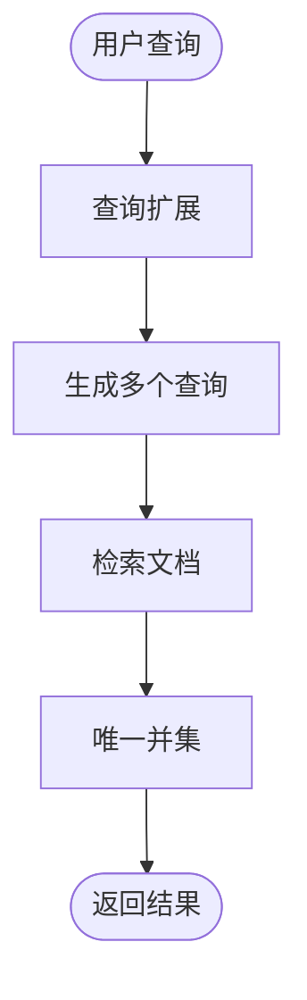

# 多查询检索器

<cite>
**本文档中引用的文件**  
- [multi_query.py](file://libs/langchain/langchain_classic/retrievers/multi_query.py)
- [test_multi_query.py](file://libs/langchain/tests/unit_tests/retrievers/test_multi_query.py)
- [retrievers.py](file://libs/core/langchain_core/retrievers.py)
</cite>

## 目录
1. [简介](#简介)
2. [核心组件](#核心组件)
3. [工作原理](#工作原理)
4. [配置与使用](#配置与使用)
5. [优势与应用场景](#优势与应用场景)
6. [避免无关或冗余查询](#避免无关或冗余查询)
7. [结论](#结论)

## 简介
多查询检索器是一种增强信息检索系统召回率的高级技术。它通过利用大语言模型（LLM）生成原始查询的多个相关变体，从而克服基于距离的相似性搜索的局限性。该检索器首先生成多个视角下的查询，然后对每个生成的查询执行检索操作，最后返回所有检索结果的唯一并集。这种方法特别适用于模糊查询和信息探索场景，能够显著提高检索系统的性能和准确性。

**Section sources**
- [multi_query.py](file://libs/langchain/langchain_classic/retrievers/multi_query.py#L31-L60)

## 核心组件

多查询检索器的核心组件包括检索器、LLM链和输出解析器。检索器负责从向量数据库中检索相关文档，LLM链用于生成多个查询变体，而输出解析器则负责解析LLM的输出，将其转换为可用的查询列表。这些组件协同工作，确保生成的查询既多样化又相关，从而提高检索的召回率。

**Section sources**
- [multi_query.py](file://libs/langchain/langchain_classic/retrievers/multi_query.py#L31-L60)

## 工作原理

### 查询扩展
多查询检索器的工作原理始于查询扩展。当接收到用户查询时，系统会使用预定义的提示模板和LLM生成多个不同的查询版本。默认提示模板指示LLM生成三个不同版本的用户问题，以帮助克服基于距离的相似性搜索的局限性。生成的查询通过换行符分隔，确保每个查询都是独立且清晰的。



**Diagram sources**
- [multi_query.py](file://libs/langchain/langchain_classic/retrievers/multi_query.py#L31-L60)

### 多样化生成
生成的查询旨在提供用户问题的多种视角，从而增加检索到相关文档的机会。LLM通过理解用户查询的语义，生成具有不同表达方式但意义相近的查询。这种多样化生成策略有助于覆盖更广泛的文档集合，提高检索的全面性和准确性。

### 结果合并
在生成多个查询后，系统会对每个查询执行检索操作，收集所有相关的文档。为了确保结果的唯一性，系统会使用`_unique_documents`函数去除重复的文档。最终返回的是所有检索结果的唯一并集，确保用户获得最全面且无重复的信息。

**Section sources**
- [multi_query.py](file://libs/langchain/langchain_classic/retrievers/multi_query.py#L145-L193)
- [test_multi_query.py](file://libs/langchain/tests/unit_tests/retrievers/test_multi_query.py#L0-L53)

## 配置与使用

### 配置生成查询的数量
多查询检索器允许用户通过配置提示模板来控制生成查询的数量。默认情况下，系统生成三个查询变体，但用户可以根据需要调整提示模板中的数字，以生成更多或更少的查询。例如，将提示模板中的“3”更改为“5”，即可生成五个查询变体。

### 控制查询的多样性
为了控制生成查询的多样性，用户可以调整提示模板的内容，引导LLM生成更具差异性的查询。此外，还可以通过设置`include_original`参数来决定是否将原始查询包含在生成的查询列表中。如果设置为`True`，则原始查询将被包含在内，进一步增加检索的覆盖范围。

```python
from langchain.retrievers.multi_query import MultiQueryRetriever
from langchain.llms import OpenAI

retriever = MultiQueryRetriever.from_llm(
    retriever=vector_store.as_retriever(),
    llm=OpenAI(temperature=0),
    include_original=True
)
```

**Section sources**
- [multi_query.py](file://libs/langchain/langchain_classic/retrievers/multi_query.py#L70-L84)

## 优势与应用场景

### 模糊查询
多查询检索器在处理模糊查询时表现出色。由于用户可能使用不同的表达方式描述同一问题，传统的基于关键词的检索方法往往难以捕捉到所有相关文档。多查询检索器通过生成多个查询变体，能够更好地理解用户的意图，提高检索的准确性和召回率。

### 信息探索
在信息探索场景中，用户通常希望获取尽可能多的相关信息。多查询检索器通过生成多样化的查询，能够覆盖更广泛的文档集合，帮助用户发现更多潜在的相关信息。这对于研究、数据分析和知识发现等任务尤为重要。

**Section sources**
- [multi_query.py](file://libs/langchain/langchain_classic/retrievers/multi_query.py#L31-L60)

## 避免无关或冗余查询

为了避免生成无关或冗余的查询，多查询检索器采用了多种策略。首先，通过精心设计的提示模板，引导LLM生成与原始查询高度相关的变体。其次，系统使用`_unique_documents`函数去除重复的文档，确保最终结果的唯一性。此外，用户还可以通过调整提示模板和参数设置，进一步优化生成查询的质量和相关性。

**Section sources**
- [multi_query.py](file://libs/langchain/langchain_classic/retrievers/multi_query.py#L145-L193)
- [test_multi_query.py](file://libs/langchain/tests/unit_tests/retrievers/test_multi_query.py#L0-L53)

## 结论
多查询检索器是一种强大的信息检索技术，通过生成多个相关查询来扩展原始查询，显著提高了检索的召回率。其工作原理包括查询扩展、多样化生成和结果合并，适用于模糊查询和信息探索等多种场景。通过合理配置和使用，用户可以有效避免生成无关或冗余的查询，获得更全面且准确的检索结果。