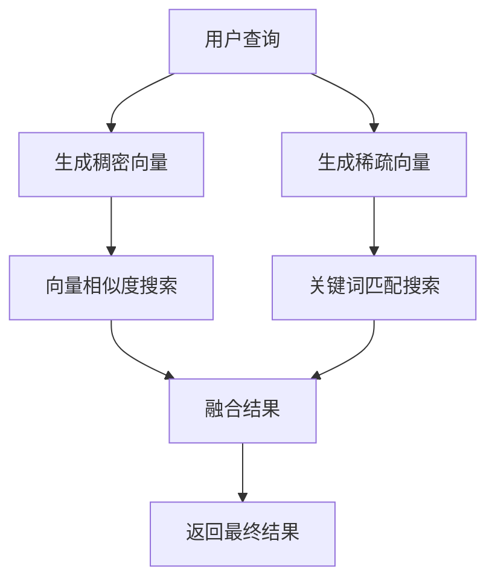
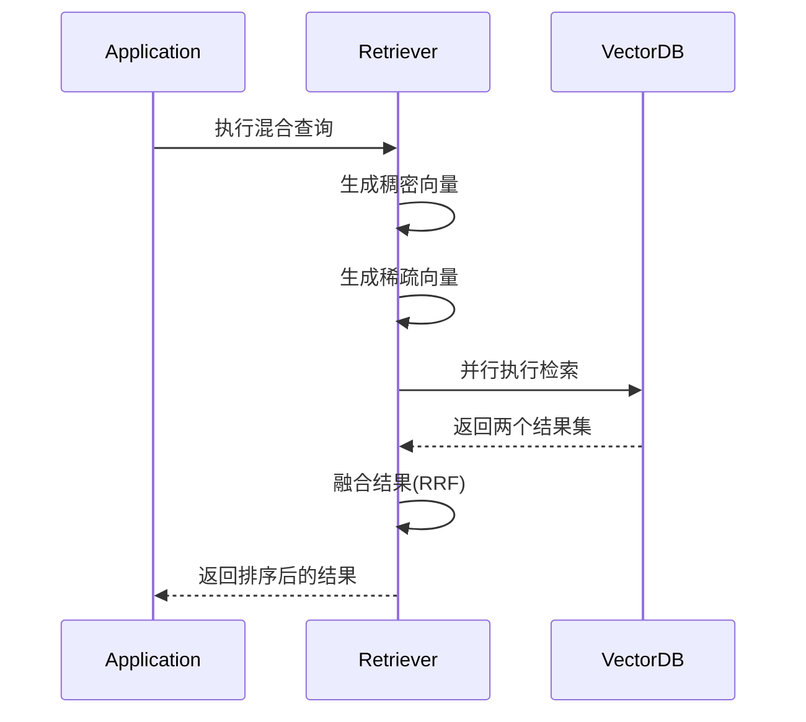

# Pinecone 混合搜索

<cite>
**本文档中引用的文件**  
- [pinecone_hybrid_search.py](file://libs/langchain/langchain_classic/retrievers/pinecone_hybrid_search.py)
- [pinecone.py](file://libs/langchain/langchain_classic/vectorstores/pinecone.py)
- [bm25.py](file://libs/langchain/langchain_classic/retrievers/bm25.py)
- [qdrant.py](file://libs/partners/qdrant/langchain_qdrant/qdrant.py)
</cite>

## 目录
1. [简介](#简介)
2. [Pinecone混合搜索机制](#pinecone混合搜索机制)
3. [索引配置](#索引配置)
4. [执行混合查询](#执行混合查询)
5. [性能优化策略](#性能优化策略)
6. [大规模数据集上的表现](#大规模数据集上的表现)
7. [常见问题与解决方案](#常见问题与解决方案)
8. [结论](#结论)

## 简介
Pinecone混合搜索是一种结合了向量相似度搜索和关键词搜索（如BM25）的高级检索技术。该方法通过融合稠密向量表示和稀疏关键词匹配的优势，显著提升了信息检索的准确性和相关性。在LangChain框架中，这种混合检索能力通过`PineconeHybridSearchRetriever`实现，允许开发者在大规模语义搜索应用中同时利用语义理解和关键词匹配的优势。

**Section sources**
- [pinecone_hybrid_search.py](file://libs/langchain/langchain_classic/retrievers/pinecone_hybrid_search.py#L1-L24)

## Pinecone混合搜索机制
Pinecone混合搜索的核心在于将两种不同的检索模式相结合：基于嵌入的向量搜索（稠密检索）和基于关键词的稀疏检索（如BM25）。系统首先为查询生成稠密向量表示（用于捕捉语义相似性）和稀疏向量表示（用于捕捉关键词匹配）。然后，系统并行执行两种检索，并使用融合策略（如RRF - Reciprocal Rank Fusion）将结果合并。

在实现层面，混合搜索流程包括：
1. 使用嵌入模型生成查询的稠密向量
2. 使用稀疏编码器（如SPLADE）生成查询的稀疏向量
3. 并行执行向量搜索和关键词搜索
4. 使用融合算法合并两个结果集

这种机制特别适用于需要同时考虑语义相似性和精确关键词匹配的场景。

**Diagram sources**
- [qdrant.py](file://libs/partners/qdrant/langchain_qdrant/qdrant.py#L589-L626)

**Section sources**
- [qdrant.py](file://libs/partners/qdrant/langchain_qdrant/qdrant.py#L589-L626)
- [bm25.py](file://libs/langchain/langchain_classic/retrievers/bm25.py#L1-L29)

## 索引配置
要启用Pinecone混合搜索，必须在索引创建时配置支持稠密和稀疏向量的混合模式。这需要在创建集合时定义两种向量配置：一个用于稠密向量（通常基于嵌入模型），另一个用于稀疏向量（用于关键词匹配）。

配置要点包括：
- 指定稠密向量的维度和距离度量方式
- 配置稀疏向量的编码器（如SPLADE）
- 设置混合检索模式
- 定义适当的元数据过滤器

虽然具体实现细节在社区包中，但配置模式遵循标准的向量数据库混合索引原则。

**Section sources**
- [qdrant.py](file://libs/partners/qdrant/langchain_qdrant/qdrant.py#L959-L981)

## 执行混合查询
执行混合查询涉及使用`PineconeHybridSearchRetriever`接口，该接口封装了底层的混合检索逻辑。查询执行时，系统会自动处理向量生成、并行检索和结果融合。

关键参数包括：
- 查询文本
- 返回结果数量（k）
- 可选的元数据过滤器
- 融合策略（默认为RRF）

查询流程透明地处理了稠密和稀疏向量的生成与检索，为开发者提供了统一的接口。

**Diagram sources**
- [qdrant.py](file://libs/partners/qdrant/langchain_qdrant/qdrant.py#L589-L626)

**Section sources**
- [pinecone_hybrid_search.py](file://libs/langchain/langchain_classic/retrievers/pinecone_hybrid_search.py#L1-L24)
- [qdrant.py](file://libs/partners/qdrant/langchain_qdrant/qdrant.py#L504-L548)

## 性能优化策略
为了优化Pinecone混合搜索的性能，建议采用以下策略：

1. **向量维度优化**：选择适当的嵌入模型维度，在精度和性能间取得平衡
2. **缓存机制**：缓存频繁查询的向量表示
3. **批量处理**：对批量查询进行优化处理
4. **索引分区**：根据数据特征进行合理分区
5. **融合算法调优**：调整RRF等融合算法的参数

此外，监控查询延迟和资源使用情况对于持续优化至关重要。

**Section sources**
- [qdrant.py](file://libs/partners/qdrant/langchain_qdrant/qdrant.py#L589-L626)

## 大规模数据集上的表现
在大规模数据集上，Pinecone混合搜索展现出显著优势：

- **准确性提升**：相比纯向量搜索，混合搜索在多个基准测试中表现出更高的相关性
- **召回率改善**：能够捕捉到仅靠语义或关键词单独无法发现的相关文档
- **鲁棒性增强**：对查询措辞变化更具容忍度

然而，随着数据规模增长，也需要关注：
- 查询延迟的增加
- 资源消耗的上升
- 索引维护的复杂性

适当的分片和缓存策略可以有效缓解这些挑战。

**Section sources**
- [qdrant.py](file://libs/partners/qdrant/langchain_qdrant/qdrant.py#L589-L626)

## 常见问题与解决方案
### 问题1：混合搜索性能下降
**解决方案**：检查向量维度是否过高，考虑使用更高效的嵌入模型或增加计算资源。

### 问题2：结果相关性不理想
**解决方案**：调整融合算法的权重参数，或优化稀疏编码器的配置。

### 问题3：索引创建失败
**解决方案**：确保正确配置了稠密和稀疏向量的参数，检查向量维度的一致性。

### 问题4：内存使用过高
**解决方案**：实施查询结果的分页处理，优化缓存策略。

**Section sources**
- [qdrant.py](file://libs/partners/qdrant/langchain_qdrant/qdrant.py#L589-L626)
- [pinecone.py](file://libs/langchain/langchain_classic/vectorstores/pinecone.py#L1-L24)

## 结论
Pinecone混合搜索为现代检索系统提供了一种强大的解决方案，通过结合向量搜索和关键词搜索的优势，显著提升了搜索结果的质量。在LangChain框架中，这一功能通过清晰的接口和灵活的配置得以实现，使开发者能够构建更加智能和准确的搜索应用。随着数据规模的增长，合理配置和持续优化将成为确保系统性能的关键。