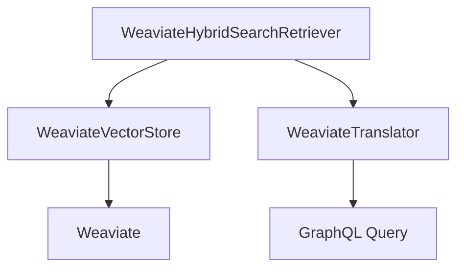

# Weaviate 混合搜索

<cite>
**本文档中引用的文件**  
- [weaviate.py](file://libs/langchain/langchain_classic/vectorstores/weaviate.py)
- [weaviate_hybrid_search.py](file://libs/langchain/langchain_classic/retrievers/weaviate_hybrid_search.py)
- [weaviate.py](file://libs/langchain/langchain_classic/retrievers/self_query/weaviate.py)
</cite>

## 目录
1. [简介](#简介)
2. [Weaviate混合搜索概述](#weaviate混合搜索概述)
3. [核心组件分析](#核心组件分析)
4. [混合搜索实现机制](#混合搜索实现机制)
5. [GraphQL查询语法与hybrid字段](#graphql查询语法与hybrid字段)
6. [Alpha参数调节与权重平衡](#alpha参数调节与权重平衡)
7. [检索结果相关性优化](#检索结果相关性优化)
8. [集成与使用示例](#集成与使用示例)
9. [结论](#结论)

## 简介
Weaviate是一个开源的向量数据库，支持语义搜索和关键词搜索的混合模式。本文档详细阐述Weaviate如何在LangChain框架中实现混合搜索功能，重点介绍其原生支持语义与关键词融合的机制、GraphQL查询语法中hybrid字段的使用方法，并通过实际代码示例展示如何构建混合查询、调节alpha参数以平衡语义与关键词权重，从而优化检索结果的相关性。

## Weaviate混合搜索概述
Weaviate的混合搜索功能结合了密集向量（dense vector）和稀疏向量（sparse vector）的优势，能够在一次查询中同时执行语义搜索和关键词搜索。这种融合方式能够有效提升检索结果的准确性和相关性，特别是在处理复杂查询或需要兼顾语义理解与精确匹配的场景下表现出色。

混合搜索的核心思想是将两种不同类型的嵌入向量进行融合：一种是通过深度学习模型生成的密集向量，用于捕捉文本的语义信息；另一种是基于传统信息检索技术（如BM25）生成的稀疏向量，用于捕捉关键词的精确匹配。Weaviate通过特定的融合策略（如RRF - Reciprocal Rank Fusion）将这两种搜索结果进行加权合并，最终返回综合评分最高的文档。

**Section sources**
- [weaviate_hybrid_search.py](file://libs/langchain/langchain_classic/retrievers/weaviate_hybrid_search.py#L1-L24)

## 核心组件分析
在LangChain框架中，Weaviate混合搜索功能主要由以下几个核心组件构成：

- **WeaviateVectorStore**：作为向量存储的核心类，负责管理Weaviate中的数据集合，提供文档的添加、删除和检索接口。
- **WeaviateHybridSearchRetriever**：专门用于执行混合搜索的检索器，封装了混合查询的构建逻辑和参数配置。
- **WeaviateTranslator**：查询构造器，负责将高级别的查询条件转换为Weaviate可识别的GraphQL查询语句。

这些组件共同协作，实现了从高层应用逻辑到底层数据库查询的无缝衔接。



**Diagram sources**
- [weaviate.py](file://libs/langchain/langchain_classic/vectorstores/weaviate.py#L1-L24)
- [weaviate_hybrid_search.py](file://libs/langchain/langchain_classic/retrievers/weaviate_hybrid_search.py#L1-L24)
- [weaviate.py](file://libs/langchain/langchain_classic/retrievers/self_query/weaviate.py#L1-L24)

**Section sources**
- [weaviate.py](file://libs/langchain/langchain_classic/vectorstores/weaviate.py#L1-L24)
- [weaviate_hybrid_search.py](file://libs/langchain/langchain_classic/retrievers/weaviate_hybrid_search.py#L1-L24)
- [weaviate.py](file://libs/langchain/langchain_classic/retrievers/self_query/weaviate.py#L1-L24)

## 混合搜索实现机制
Weaviate的混合搜索实现机制基于对密集向量和稀疏向量的并行查询与结果融合。具体流程如下：

1. **查询向量化**：输入的查询文本首先被分别转换为密集向量和稀疏向量。密集向量通常由预训练的语言模型（如BERT）生成，而稀疏向量则由传统的信息检索算法（如BM25）生成。
2. **并行检索**：Weaviate同时在密集向量索引和稀疏向量索引上执行相似性搜索，分别得到两组候选文档及其相关性得分。
3. **结果融合**：采用融合策略（如RRF）对两组结果进行加权合并。RRF算法通过计算每个文档在两个列表中的排名位置，生成一个综合得分，排名越靠前的文档得分越高。
4. **结果排序**：根据综合得分对所有候选文档进行重新排序，返回最终的检索结果。

该机制确保了既能捕捉到语义层面的相关文档，又能保留关键词匹配的精确性。

**Section sources**
- [weaviate_hybrid_search.py](file://libs/langchain/langchain_classic/retrievers/weaviate_hybrid_search.py#L1-L24)

## GraphQL查询语法与hybrid字段
Weaviate使用GraphQL作为其查询语言，混合搜索通过`hybrid`字段实现。`hybrid`字段允许用户在一个查询中同时指定语义搜索和关键词搜索的参数。

基本语法结构如下：
```graphql
{
  Get {
    <ClassName>(
      hybrid: {
        query: "<search term>",
        alpha: <value>,
        vector: <vector>
      }
    ) {
      <properties>
    }
  }
}
```

其中：
- `query`：指定要搜索的文本内容，将同时用于语义和关键词搜索。
- `alpha`：控制语义搜索与关键词搜索之间的权重分配，取值范围为0到1。当alpha=1时，仅使用语义搜索；当alpha=0时，仅使用关键词搜索。
- `vector`：可选参数，允许提供自定义的向量用于搜索。

通过灵活配置这些参数，用户可以根据具体需求调整搜索行为。

**Section sources**
- [weaviate_hybrid_search.py](file://libs/langchain/langchain_classic/retrievers/weaviate_hybrid_search.py#L1-L24)

## Alpha参数调节与权重平衡
Alpha参数是混合搜索中的关键调节因子，用于平衡语义搜索和关键词搜索的相对重要性。合理设置alpha值对于获得高质量的检索结果至关重要。

- **高Alpha值（接近1）**：强调语义相似性，适合需要理解上下文和同义词的场景，例如开放域问答或概念性搜索。
- **低Alpha值（接近0）**：强调关键词匹配，适合需要精确匹配特定术语或实体的场景，例如法律文档检索或技术规范查询。
- **中等Alpha值（0.5左右）**：在语义和关键词之间取得平衡，适用于大多数通用搜索场景。

在实际应用中，建议通过A/B测试或交叉验证的方式确定最优的alpha值，以最大化检索效果。

**Section sources**
- [weaviate_hybrid_search.py](file://libs/langchain/langchain_classic/retrievers/weaviate_hybrid_search.py#L1-L24)

## 检索结果相关性优化
为了进一步优化混合搜索的检索结果相关性，可以采取以下策略：

1. **多模态融合**：除了文本数据外，还可以引入图像、音频等多模态数据的嵌入向量，丰富搜索的维度。
2. **上下文感知**：结合用户的搜索历史、偏好设置等上下文信息，动态调整搜索参数和排序策略。
3. **反馈学习**：利用用户对搜索结果的点击、停留时间等行为数据，训练模型自动优化alpha参数和其他搜索配置。
4. **过滤与约束**：通过添加元数据过滤条件，缩小搜索范围，提高结果的针对性。

这些优化手段可以显著提升用户体验和搜索系统的整体性能。

**Section sources**
- [weaviate_hybrid_search.py](file://libs/langchain/langchain_classic/retrievers/weaviate_hybrid_search.py#L1-L24)

## 集成与使用示例
在LangChain中集成Weaviate混合搜索非常简单。以下是一个典型的使用示例：

```python
from langchain.retrievers import WeaviateHybridSearchRetriever

# 初始化混合搜索检索器
retriever = WeaviateHybridSearchRetriever(
    weaviate_url="http://localhost:8080",
    index_name="MyIndex",
    text_key="content",
    alpha=0.75  # 偏向语义搜索
)

# 执行混合搜索
results = retriever.get_relevant_documents("人工智能的发展趋势")

# 处理结果
for doc in results:
    print(doc.page_content)
```

此示例展示了如何创建一个混合搜索检索器，并通过简单的API调用执行搜索。

**Section sources**
- [weaviate_hybrid_search.py](file://libs/langchain/langchain_classic/retrievers/weaviate_hybrid_search.py#L1-L24)

## 结论
Weaviate的混合搜索功能为现代信息检索系统提供了强大的支持。通过融合语义搜索和关键词搜索的优势，它能够在保持高召回率的同时提高检索精度。在LangChain框架中，这一功能被封装得简洁易用，开发者可以通过简单的配置实现复杂的搜索逻辑。未来，随着多模态数据和深度学习技术的不断发展，混合搜索将在更多领域发挥重要作用。