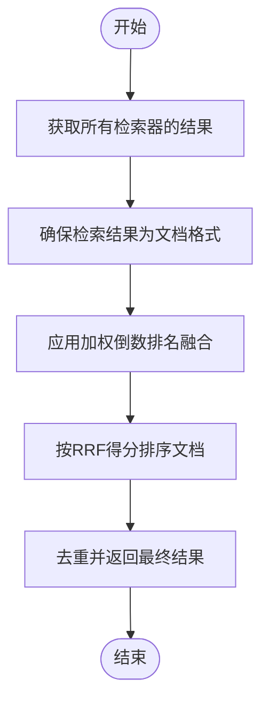

# 混合检索器

<cite>
**本文档中引用的文件**  
- [ensemble.py](file://libs/langchain/langchain_classic/retrievers/ensemble.py)
- [merger_retriever.py](file://libs/langchain/langchain_classic/retrievers/merger_retriever.py)
- [multi_query.py](file://libs/langchain/langchain_classic/retrievers/multi_query.py)
- [qdrant.py](file://libs/partners/qdrant/langchain_qdrant/qdrant.py)
</cite>

## 目录
1. [简介](#简介)
2. [混合检索器的核心优势](#混合检索器的核心优势)
3. [融合方法详解](#融合方法详解)
4. [代码配置与使用示例](#代码配置与使用示例)
5. [在复杂查询和多样化数据集上的表现](#在复杂查询和多样化数据集上的表现)
6. [调优策略](#调优策略)
7. [总结](#总结)

## 简介
混合检索器是一种结合了向量检索和关键词检索优势的检索系统。通过融合多种检索策略，混合检索器能够显著提高检索结果的准确性和召回率。在LangChain框架中，混合检索器通过集成不同的检索器组件，实现了高效的文档检索和排序。

**Section sources**
- [ensemble.py](file://libs/langchain/langchain_classic/retrievers/ensemble.py#L1-L337)

## 混合检索器的核心优势
混合检索器通过结合向量检索和关键词检索，克服了单一检索方法的局限性。向量检索能够捕捉语义相似性，而关键词检索则能精确匹配特定术语。通过融合这两种方法，混合检索器能够在保持高召回率的同时，提高检索结果的相关性。

**Section sources**
- [ensemble.py](file://libs/langchain/langchain_classic/retrievers/ensemble.py#L1-L337)

## 融合方法详解
### 加权倒数排名融合（RRF）
加权倒数排名融合（RRF）是一种常用的融合方法，它通过计算每个文档在不同检索器中的排名得分，然后进行加权融合。具体公式如下：



**Diagram sources**
- [ensemble.py](file://libs/langchain/langchain_classic/retrievers/ensemble.py#L260-L297)

### 加权评分
加权评分方法通过为每个检索器分配权重，然后根据权重对检索结果进行加权评分。这种方法允许用户根据具体需求调整不同检索器的重要性。

**Section sources**
- [ensemble.py](file://libs/langchain/langchain_classic/retrievers/ensemble.py#L296-L335)

## 代码配置与使用示例
### 配置混合检索器
以下代码示例展示了如何配置和使用混合检索器：

```python
from langchain_classic.retrievers.ensemble import EnsembleRetriever
from langchain_core.retrievers import BaseRetriever

# 定义多个检索器
retriever1 = BaseRetriever()
retriever2 = BaseRetriever()

# 创建混合检索器
ensemble_retriever = EnsembleRetriever(
    retrievers=[retriever1, retriever2],
    weights=[0.5, 0.5],
    id_key="id"
)

# 执行检索
ranked_documents = ensemble_retriever.invoke("查询")
```

**Section sources**
- [ensemble.py](file://libs/langchain/langchain_classic/retrievers/ensemble.py#L133-L175)

### 平衡权重和参数
通过调整`weights`参数，可以平衡不同检索器的权重。`id_key`参数用于指定文档的唯一标识符，确保在融合过程中正确处理重复文档。

**Section sources**
- [ensemble.py](file://libs/langchain/langchain_classic/retrievers/ensemble.py#L218-L258)

## 在复杂查询和多样化数据集上的表现
混合检索器在处理复杂查询和多样化数据集时表现出色。通过融合多种检索策略，混合检索器能够有效应对查询的多样性和数据的复杂性，提供更准确和全面的检索结果。

**Section sources**
- [qdrant.py](file://libs/partners/qdrant/langchain_qdrant/qdrant.py#L589-L626)

## 调优策略
### 参数调优
通过调整`c`参数，可以控制排名融合的平衡。较大的`c`值会降低低排名文档的权重，而较小的`c`值则会给予低排名文档更多的考虑。

### 检索器选择
根据具体应用场景选择合适的检索器组合。例如，在需要高召回率的场景中，可以增加关键词检索器的权重；在需要高准确率的场景中，可以增加向量检索器的权重。

**Section sources**
- [ensemble.py](file://libs/langchain/langchain_classic/retrievers/ensemble.py#L173-L216)

## 总结
混合检索器通过融合向量检索和关键词检索，显著提高了检索结果的准确性和召回率。通过合理配置和调优，混合检索器能够在复杂查询和多样化数据集上表现出色，为用户提供更高质量的检索服务。

**Section sources**
- [ensemble.py](file://libs/langchain/langchain_classic/retrievers/ensemble.py#L1-L337)