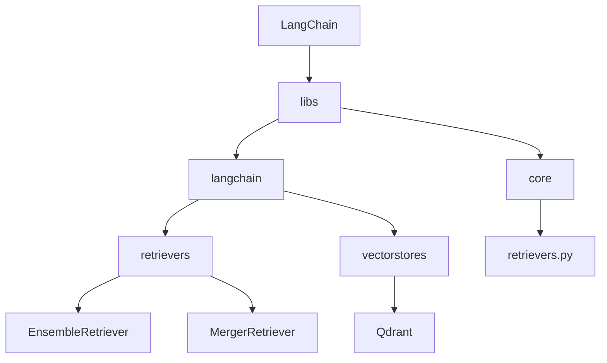
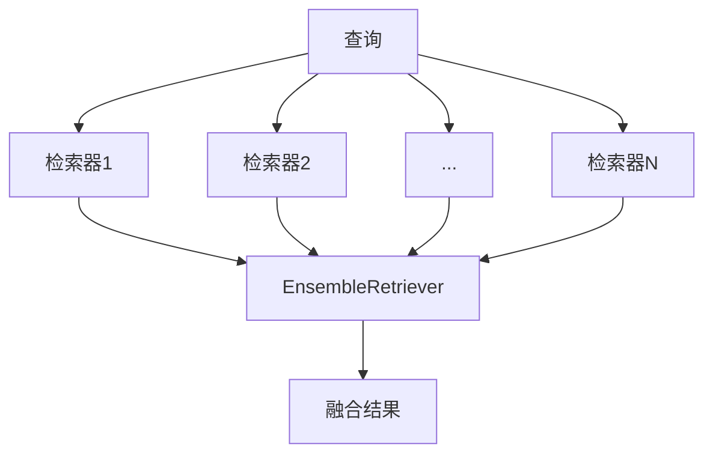
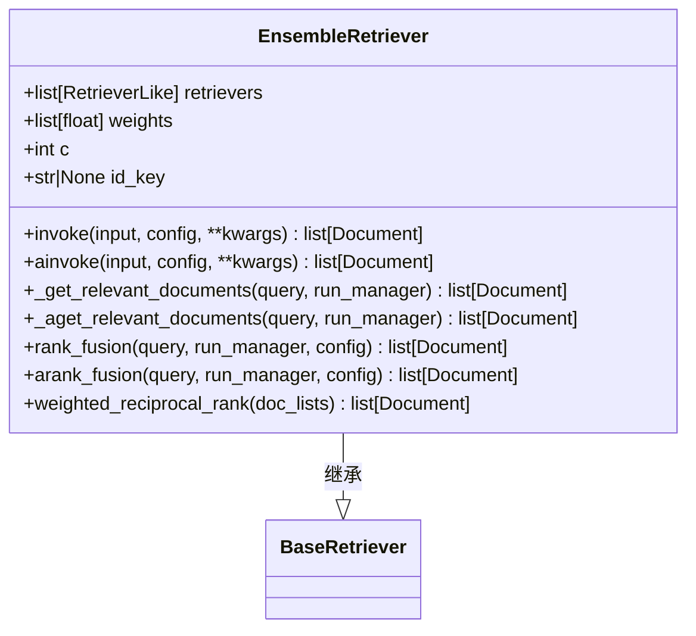
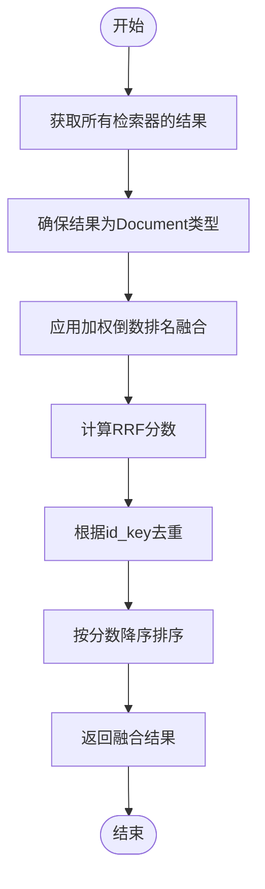
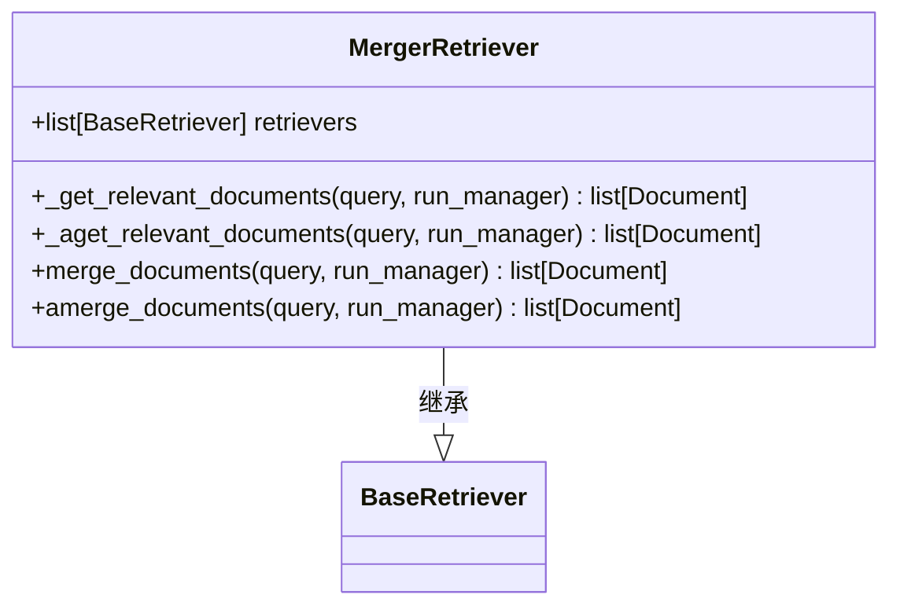
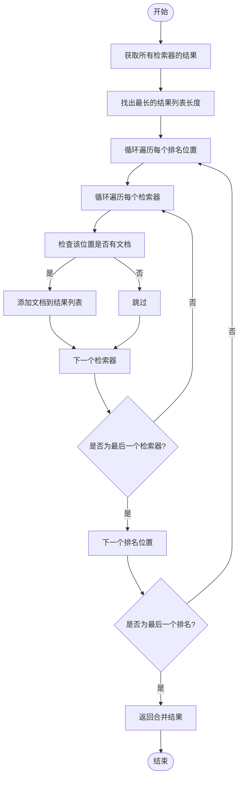
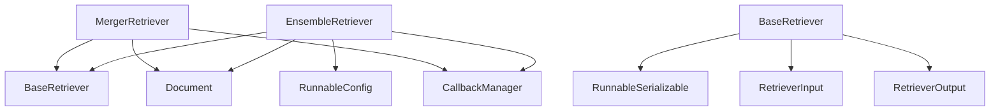

# 融合策略

<cite>
**本文档中引用的文件**  
- [ensemble.py](file://libs/langchain/langchain_classic/retrievers/ensemble.py)
- [merger_retriever.py](file://libs/langchain/langchain_classic/retrievers/merger_retriever.py)
- [retrievers.py](file://libs/core/langchain_core/retrievers.py)
- [qdrant.py](file://libs/partners/qdrant/langchain_qdrant/qdrant.py)
- [test_ensemble.py](file://libs/langchain/tests/unit_tests/retrievers/test_ensemble.py)
</cite>

## 目录
1. [引言](#引言)
2. [项目结构](#项目结构)
3. [核心组件](#核心组件)
4. [架构概述](#架构概述)
5. [详细组件分析](#详细组件分析)
6. [依赖分析](#依赖分析)
7. [性能考虑](#性能考虑)
8. [故障排除指南](#故障排除指南)
9. [结论](#结论)

## 引言
本文档深入探讨LangChain中混合检索器的融合策略，重点分析RRF（倒数排名融合）和加权评分等不同融合方法的实现原理与适用场景。通过代码示例展示如何配置融合权重、调整排名算法以及处理不同检索器返回结果的归一化问题。同时讨论各种融合策略在准确性、召回率和性能之间的权衡，并提供实际应用中的调优建议。

## 项目结构
LangChain的项目结构采用模块化设计，核心检索功能主要分布在`libs/langchain/langchain_classic/retrievers`目录下。该结构支持多种检索器的集成与融合，包括基于向量的检索、关键词检索以及混合检索模式。

**图示来源**  
- [ensemble.py](file://libs/langchain/langchain_classic/retrievers/ensemble.py)
- [merger_retriever.py](file://libs/langchain/langchain_classic/retrievers/merger_retriever.py)

**章节来源**  
- [ensemble.py](file://libs/langchain/langchain_classic/retrievers/ensemble.py)
- [merger_retriever.py](file://libs/langchain/langchain_classic/retrievers/merger_retriever.py)

## 核心组件
LangChain中的融合策略主要由`EnsembleRetriever`和`MergerRetriever`两个核心组件实现。`EnsembleRetriever`使用加权倒数排名融合（RRF）算法对多个检索器的结果进行融合排序，而`MergerRetriever`则采用简单的结果合并策略。

**章节来源**  
- [ensemble.py](file://libs/langchain/langchain_classic/retrievers/ensemble.py#L52-L85)
- [merger_retriever.py](file://libs/langchain/langchain_classic/retrievers/merger_retriever.py#L1-L10)

## 架构概述
LangChain的混合检索架构允许将多个不同类型的检索器组合在一起，通过融合策略生成最终的检索结果。这种架构设计提高了检索系统的灵活性和准确性。

**图示来源**  
- [ensemble.py](file://libs/langchain/langchain_classic/retrievers/ensemble.py)
- [retrievers.py](file://libs/core/langchain_core/retrievers.py)

## 详细组件分析

### EnsembleRetriever 分析
`EnsembleRetriever`是LangChain中实现高级融合策略的核心组件，它通过加权倒数排名融合算法对多个检索器的结果进行智能融合。

#### 类图

**图示来源**  
- [ensemble.py](file://libs/langchain/langchain_classic/retrievers/ensemble.py#L52-L85)

#### RRF 融合算法流程

**图示来源**  
- [ensemble.py](file://libs/langchain/langchain_classic/retrievers/ensemble.py#L296-L335)

**章节来源**  
- [ensemble.py](file://libs/langchain/langchain_classic/retrievers/ensemble.py#L52-L335)

### MergerRetriever 分析
`MergerRetriever`提供了一种简单的结果合并策略，它按顺序交替从各个检索器的结果中选取文档。

#### 类图

**图示来源**  
- [merger_retriever.py](file://libs/langchain/langchain_classic/retrievers/merger_retriever.py#L1-L10)

#### 合并算法流程

**图示来源**  
- [merger_retriever.py](file://libs/langchain/langchain_classic/retrievers/merger_retriever.py#L52-L94)

**章节来源**  
- [merger_retriever.py](file://libs/langchain/langchain_classic/retrievers/merger_retriever.py#L1-L119)

## 依赖分析
融合策略的实现依赖于LangChain的核心检索器接口和文档模型，形成了清晰的依赖关系。

**图示来源**  
- [ensemble.py](file://libs/langchain/langchain_classic/retrievers/ensemble.py)
- [merger_retriever.py](file://libs/langchain/langchain_classic/retrievers/merger_retriever.py)
- [retrievers.py](file://libs/core/langchain_core/retrievers.py)

**章节来源**  
- [ensemble.py](file://libs/langchain/langchain_classic/retrievers/ensemble.py)
- [merger_retriever.py](file://libs/langchain/langchain_classic/retrievers/merger_retriever.py)
- [retrievers.py](file://libs/core/langchain_core/retrievers.py)

## 性能考虑
RRF融合策略的时间复杂度主要取决于检索器数量和结果集大小。权重配置和c参数的选择对性能有显著影响。建议在实际应用中根据具体场景进行调优。

## 故障排除指南
当融合策略未产生预期结果时，应检查以下方面：
1. 确认各检索器是否正常工作
2. 验证权重配置是否合理
3. 检查id_key设置是否正确
4. 确认c参数是否适合当前应用场景

**章节来源**  
- [test_ensemble.py](file://libs/langchain/tests/unit_tests/retrievers/test_ensemble.py)

## 结论
LangChain通过`EnsembleRetriever`和`MergerRetriever`提供了灵活的融合策略实现，其中RRF算法在提高检索准确性方面表现出色。通过合理配置权重和参数，可以有效平衡不同检索器的优势，提升整体检索性能。