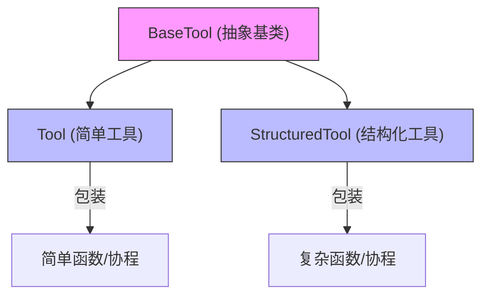
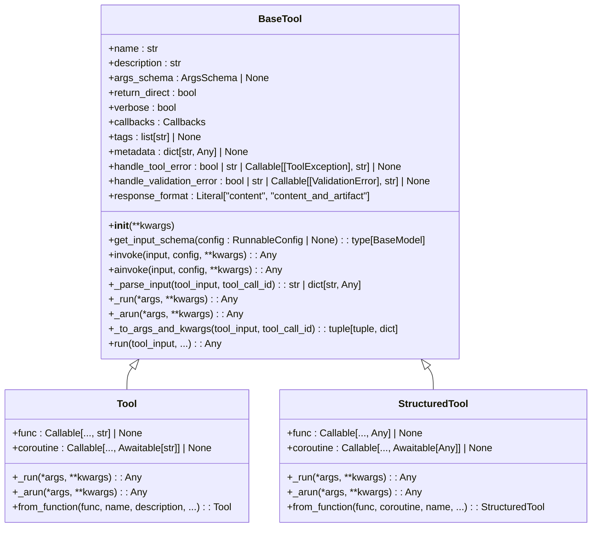
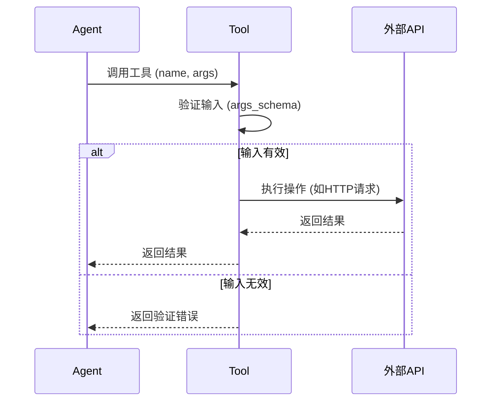
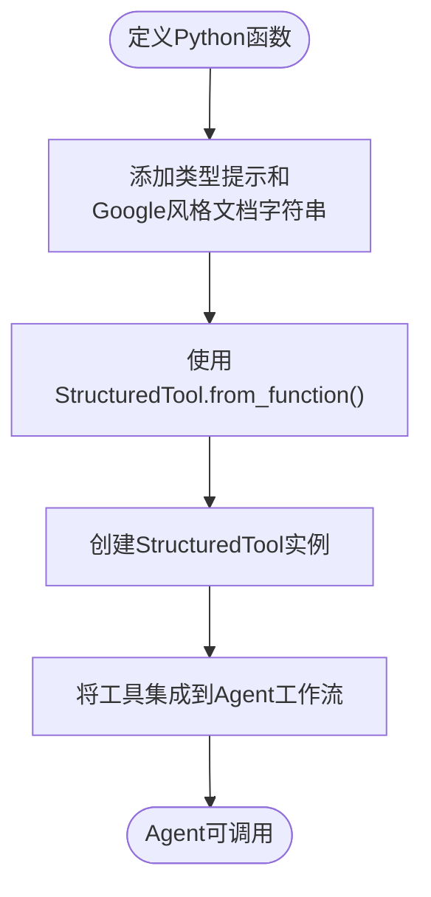
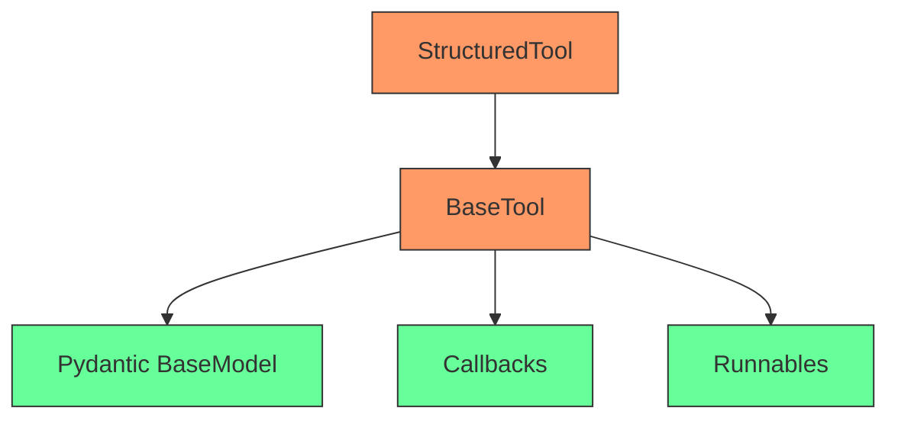

# Tools

<cite>
**本文档中引用的文件**  
- [base.py](file://libs/core/langchain_core/tools/base.py)
- [simple.py](file://libs/core/langchain_core/tools/simple.py)
- [structured.py](file://libs/core/langchain_core/tools/structured.py)
- [tool.py](file://libs/langchain/langchain_classic/tools/requests/tool.py)
- [python/__init__.py](file://libs/langchain/langchain_classic/tools/python/__init__.py)
- [requests/__init__.py](file://libs/langchain/langchain_classic/tools/requests/__init__.py)
</cite>

## 目录
1. [引言](#引言)
2. [核心组件](#核心组件)
3. [架构概述](#架构概述)
4. [详细组件分析](#详细组件分析)
5. [依赖分析](#依赖分析)
6. [性能考量](#性能考量)
7. [故障排除指南](#故障排除指南)
8. [结论](#结论)

## 引言
LangChain中的Tools是Agents执行外部操作的核心接口，允许模型与外部世界进行交互。这些操作包括调用API、执行代码或访问文件系统等。Tools作为桥梁，使语言模型能够超越其静态知识库，动态获取信息、执行计算或修改环境。本文档深入探讨了Tools的设计原理、内置工具的使用方法、自定义工具的创建以及相关的安全和错误处理机制。

## 核心组件
LangChain的Tools系统由几个核心组件构成，包括`BaseTool`抽象基类、`Tool`和`StructuredTool`具体实现，以及用于创建工具的工厂方法。这些组件共同定义了工具的行为、输入验证和执行流程。

**核心组件**
- [base.py](file://libs/core/langchain_core/tools/base.py#L0-L1422)
- [simple.py](file://libs/core/langchain_core/tools/simple.py#L0-L202)
- [structured.py](file://libs/core/langchain_core/tools/structured.py#L0-L249)

## 架构概述
LangChain的Tools架构基于可扩展的抽象基类`BaseTool`，它继承自`RunnableSerializable`，确保了工具可以被序列化和异步调用。具体的工具实现如`Tool`和`StructuredTool`则提供了不同的功能层次，以满足从简单函数包装到复杂结构化输入的各种需求。

**架构来源**
- [base.py](file://libs/core/langchain_core/tools/base.py#L0-L1422)

## 详细组件分析

### 工具核心设计分析
`BaseTool`是所有LangChain工具的基类，定义了工具的基本属性和行为。其核心设计包括名称（name）、描述（description）、参数模式（args_schema）和执行函数（_run）。名称和描述用于让Agent理解工具的用途，而`args_schema`则利用Pydantic模型或JSON模式来严格定义和验证输入参数。

**图表来源**
- [base.py](file://libs/core/langchain_core/tools/base.py#L0-L1422)
- [simple.py](file://libs/core/langchain_core/tools/simple.py#L0-L202)
- [structured.py](file://libs/core/langchain_core/tools/structured.py#L0-L249)

**章节来源**
- [base.py](file://libs/core/langchain_core/tools/base.py#L0-L1422)

### 内置工具使用方法分析
LangChain提供了多种内置工具，如Python REPL、Requests工具和文件管理工具。然而，根据代码库的现状，许多经典工具（如`PythonREPLTool`）已被移至`langchain-experimental`包中，以强调其潜在的安全风险。Requests工具（如`RequestsGetTool`）通过`BaseRequestsTool`提供对HTTP API的访问，允许Agent执行GET、POST等请求。

**图表来源**
- [tool.py](file://libs/langchain/langchain_classic/tools/requests/tool.py#L0-L43)
- [python/__init__.py](file://libs/langchain/langchain_classic/tools/python/__init__.py#L0-L14)

**章节来源**
- [tool.py](file://libs/langchain/langchain_classic/tools/requests/tool.py#L0-L43)
- [python/__init__.py](file://libs/langchain/langchain_classic/tools/python/__init__.py#L0-L14)

### 自定义工具创建与集成分析
创建自定义工具最常用的方法是使用`StructuredTool.from_function`类方法。开发者可以定义一个带有类型提示和文档字符串的普通Python函数，该方法会自动为其生成一个`args_schema`，并将其包装成一个可由Agent调用的`StructuredTool`实例。这极大地简化了集成过程，使开发者能够快速将任何Python功能暴露给Agent。

**图表来源**
- [structured.py](file://libs/core/langchain_core/tools/structured.py#L0-L249)

**章节来源**
- [structured.py](file://libs/core/langchain_core/tools/structured.py#L0-L249)

## 依赖分析
LangChain的Tools系统深度依赖于Pydantic进行输入验证和模式生成，依赖于`Runnable`接口实现异步执行和回调管理。`BaseTool`与`langchain_core.callbacks`和`langchain_core.runnables`模块紧密耦合，确保了工具执行过程中的可观察性和可配置性。

**图表来源**
- [base.py](file://libs/core/langchain_core/tools/base.py#L0-L1422)
- [structured.py](file://libs/core/langchain_core/tools/structured.py#L0-L249)

**章节来源**
- [base.py](file://libs/core/langchain_core/tools/base.py#L0-L1422)

## 性能考量
在性能方面，同步工具的执行会阻塞事件循环，而异步工具（通过`_arun`实现）则能更好地利用异步I/O，提高整体吞吐量。对于计算密集型任务，即使工具本身是异步的，LangChain也会在后台线程中运行其同步版本（`_run`），以避免阻塞主线程。因此，为长时间运行的操作实现`_arun`是最佳实践。

## 故障排除指南
Tools系统内置了强大的错误处理机制。`handle_tool_error`和`handle_validation_error`参数允许开发者自定义对执行错误和输入验证错误的响应。例如，可以设置一个字符串作为错误提示，或提供一个可调用对象来生成更复杂的错误消息。这使得Agent在遇到问题时能够获得有意义的反馈，而不是简单地失败。

**章节来源**
- [base.py](file://libs/core/langchain_core/tools/base.py#L966-L1048)

## 结论
LangChain的Tools是构建强大、交互式Agent应用的基石。通过`BaseTool`及其子类，开发者可以创建从简单到复杂的各种工具。尽管内置的Python REPL等工具因安全原因被移出核心库，但其设计模式——强调输入验证、错误处理和清晰的接口定义——为构建安全、可靠的自定义工具提供了最佳实践范本。通过合理利用`StructuredTool.from_function`等便捷方法，可以高效地将外部功能集成到Agent工作流中。