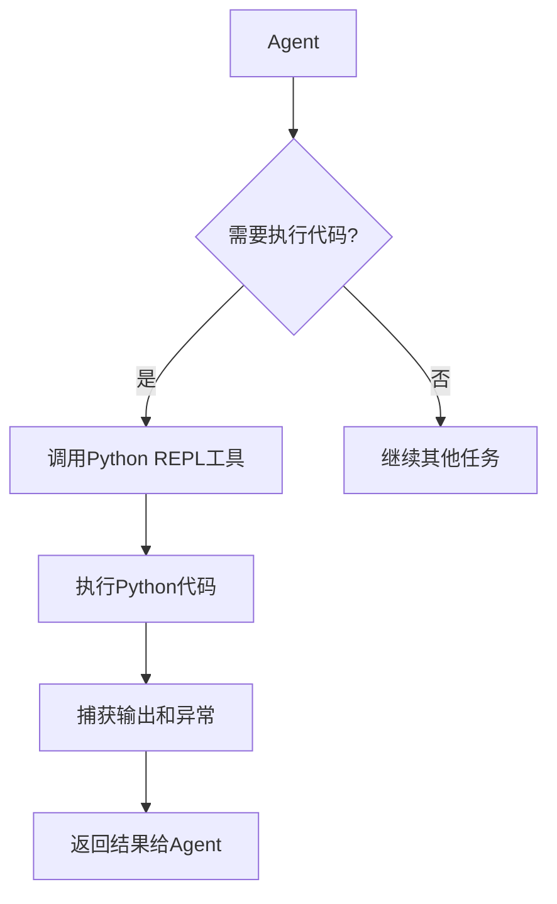

# Python REPL工具

<cite>
**本文档中引用的文件**   
- [python.py](file://libs/langchain/langchain_classic/tools/python/__init__.py)
- [tools/__init__.py](file://libs/langchain/langchain_classic/tools/__init__.py)
- [SECURITY.md](file://SECURITY.md)
</cite>

## 目录
1. [简介](#简介)
2. [核心功能与架构](#核心功能与架构)
3. [安全沙箱机制](#安全沙箱机制)
4. [在Agent链中的集成方式](#在agent链中的集成方式)
5. [代码示例](#代码示例)
6. [最佳实践与生产环境限制](#最佳实践与生产环境限制)
7. [性能瓶颈与错误处理](#性能瓶颈与错误处理)
8. [结论](#结论)

## 简介
Python REPL工具是LangChain框架中一个强大的功能组件，允许Agent执行Python代码并返回结果。该工具为Agent提供了动态计算、数据处理和复杂逻辑执行的能力。然而，由于其能够执行任意Python代码，存在潜在的安全风险，因此需要通过沙箱机制进行严格限制。本文档将深入探讨Python REPL工具的实现原理、安全机制、集成方法以及在实际应用中的最佳实践。

**Section sources**
- [python.py](file://libs/langchain/langchain_classic/tools/python/__init__.py#L0-L12)
- [tools/__init__.py](file://libs/langchain/langchain_classic/tools/__init__.py#L39-L71)

## 核心功能与架构
Python REPL工具的核心功能是允许Agent在运行时执行Python代码片段，并将执行结果返回给Agent以进行后续决策。该工具通过调用Python解释器来执行代码，并捕获标准输出和异常信息。工具的设计目标是为Agent提供一种灵活的计算能力，使其能够处理数学计算、数据转换、条件判断等复杂任务。

该工具的架构基于模块化设计，通过`tool`装饰器注册到Agent的工作流中。当Agent决定使用该工具时，会将代码片段作为输入传递给工具，工具执行代码后返回结果。这种设计使得Python REPL工具可以无缝集成到各种Agent链中，为Agent提供动态执行能力。

**Diagram sources **
- [python.py](file://libs/langchain/langch