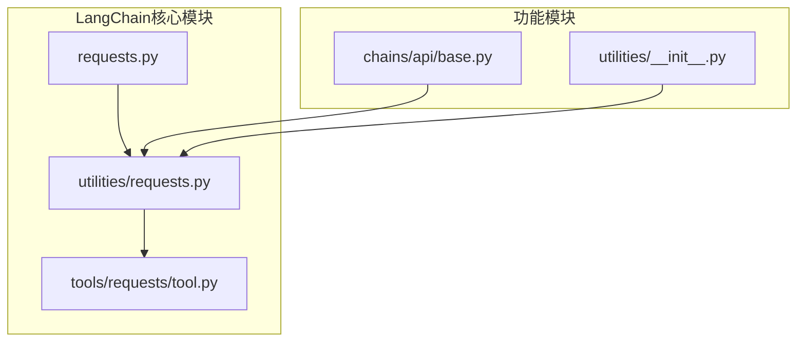
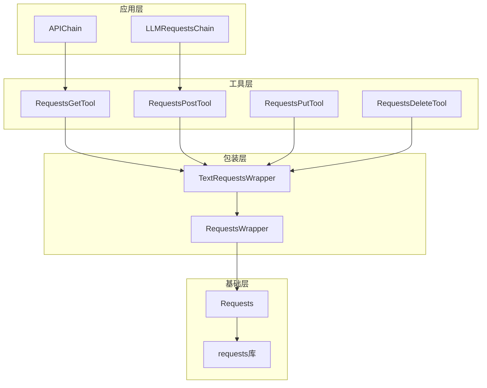
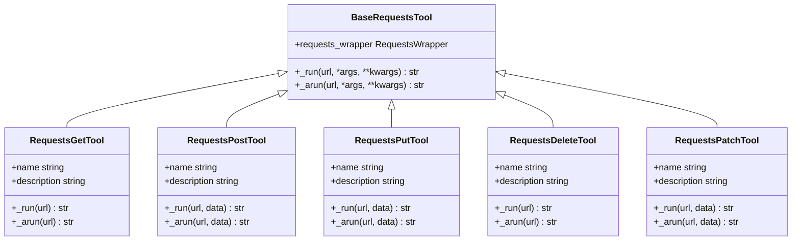
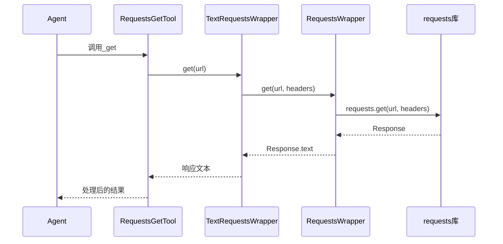
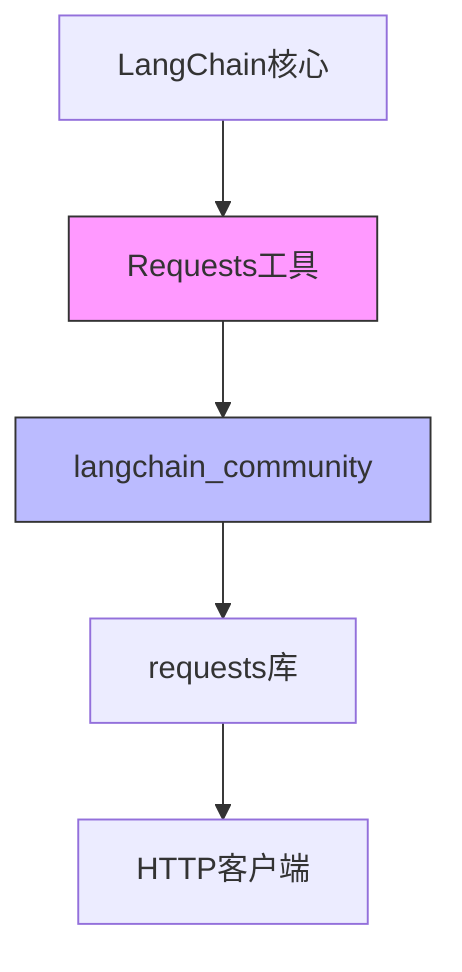

# Requests工具

<cite>
**本文档中引用的文件**  
- [requests.py](file://libs/langchain/langchain_classic/requests.py)
- [utilities/requests.py](file://libs/langchain/langchain_classic/utilities/requests.py)
- [tools/requests/tool.py](file://libs/langchain/langchain_classic/tools/requests/tool.py)
- [chains/api/base.py](file://libs/langchain/langchain_classic/chains/api/base.py)
- [utilities/__init__.py](file://libs/langchain/langchain_classic/utilities/__init__.py)
</cite>

## 目录
1. [引言](#引言)
2. [项目结构](#项目结构)
3. [核心组件](#核心组件)
4. [架构概述](#架构概述)
5. [详细组件分析](#详细组件分析)
6. [依赖分析](#依赖分析)
7. [性能考虑](#性能考虑)
8. [故障排除指南](#故障排除指南)
9. [结论](#结论)

## 引言
Requests工具是LangChain框架中的关键组件，它使Agent能够向外部API发起HTTP请求。该工具封装了底层的requests库，提供了GET、POST、PUT、DELETE等HTTP方法的便捷调用方式，并支持多种认证机制如API Key和OAuth。本文档将深入分析该工具的实现机制、使用方法和最佳实践。

## 项目结构
Requests工具在LangChain中的组织结构体现了模块化和向后兼容的设计理念。核心功能分布在多个模块中，通过导入器模式实现版本迁移的平滑过渡。

**图示来源**
- [requests.py](file://libs/langchain/langchain_classic/requests.py)
- [utilities/requests.py](file://libs/langchain/langchain_classic/utilities/requests.py)

**节来源**
- [requests.py](file://libs/langchain/langchain_classic/requests.py#L1-L35)
- [utilities/requests.py](file://libs/langchain/langchain_classic/utilities/requests.py#L1-L27)

## 核心组件
Requests工具的核心组件包括请求包装器(RequestsWrapper)、文本请求包装器(TextRequestsWrapper)和各种HTTP方法工具。这些组件共同构成了一个完整的API调用解决方案，支持安全的域限制和灵活的认证处理。

**节来源**
- [utilities/requests.py](file://libs/langchain/langchain_classic/utilities/requests.py#L1-L27)
- [tools/requests/tool.py](file://libs/langchain/langchain_classic/tools/requests/tool.py#L1-L42)

## 架构概述
Requests工具的架构设计遵循了分层原则，将底层HTTP请求处理与高层API调用逻辑分离。通过导入器模式，实现了从旧版本到新版本(langchain_community)的平滑迁移，同时保持了向后兼容性。

**图示来源**
- [chains/api/base.py](file://libs/langchain/langchain_classic/chains/api/base.py#L43-L77)
- [tools/requests/tool.py](file://libs/langchain/langchain_classic/tools/requests/tool.py#L1-L42)

## 详细组件分析

### 请求工具分析
Requests工具提供了一组完整的HTTP方法工具，每个工具都继承自BaseRequestsTool，实现了特定的HTTP操作。这些工具通过动态导入机制从langchain_community包中获取实际实现。

**图示来源**
- [tools/requests/tool.py](file://libs/langchain/langchain_classic/tools/requests/tool.py#L1-L42)

**节来源**
- [tools/requests/tool.py](file://libs/langchain/langchain_classic/tools/requests/tool.py#L1-L42)

### 请求包装器分析
请求包装器层提供了对requests库的高级封装，处理认证、头信息和错误处理等通用功能。TextRequestsWrapper专门用于处理文本响应，而RequestsWrapper提供更通用的功能。

**图示来源**
- [utilities/requests.py](file://libs/langchain/langchain_classic/utilities/requests.py#L1-L27)
- [requests.py](file://libs/langchain/langchain_classic/requests.py#L1-L35)

## 依赖分析
Requests工具的依赖关系体现了其作为桥梁组件的角色，连接了LangChain核心框架和外部HTTP库。

**图示来源**
- [requests.py](file://libs/langchain/langchain_classic/requests.py#L1-L35)
- [utilities/requests.py](file://libs/langchain/langchain_classic/utilities/requests.py#L1-L27)

**节来源**
- [requests.py](file://libs/langchain/langchain_classic/requests.py#L1-L35)
- [utilities/requests.py](file://libs/langchain/langchain_classic/utilities/requests.py#L1-L27)

## 性能考虑
在使用Requests工具时，需要考虑超时设置、重试机制和并发处理等性能因素。通过合理配置请求包装器的参数，可以优化API调用的性能和可靠性。

## 故障排除指南
当使用Requests工具遇到问题时，应首先检查域限制设置、认证信息和网络连接。APIChain中的安全警告提示了潜在的安全风险，需要特别注意。

**节来源**
- [chains/api/base.py](file://libs/langchain/langchain_classic/chains/api/base.py#L43-L77)
- [chains/api/base.py](file://libs/langchain/langchain_classic/chains/api/base.py#L197-L231)

## 结论
Requests工具为LangChain Agent提供了强大的外部API调用能力。通过分层架构和动态导入机制，它实现了功能完整性、安全性和向后兼容性的平衡。开发者可以基于此工具构建各种需要外部数据交互的智能应用。