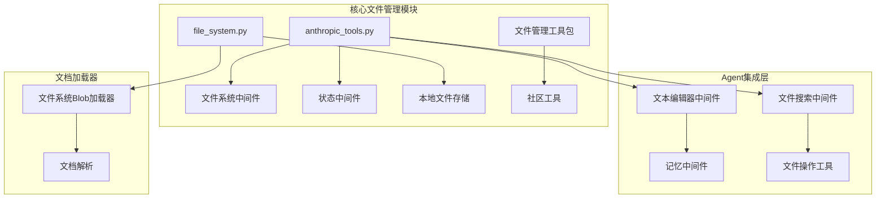
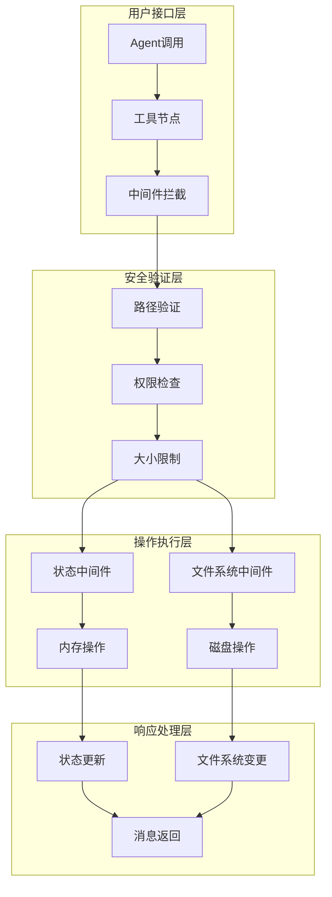
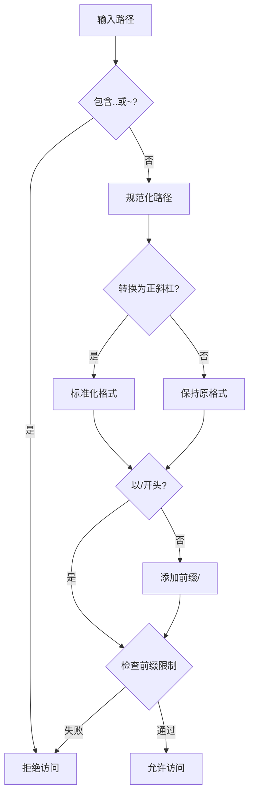
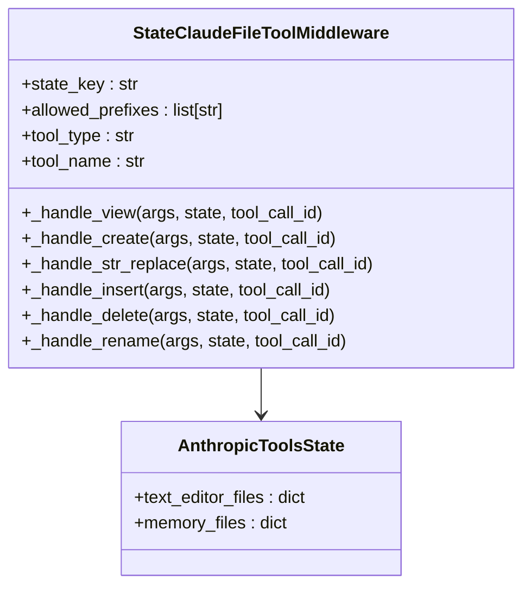
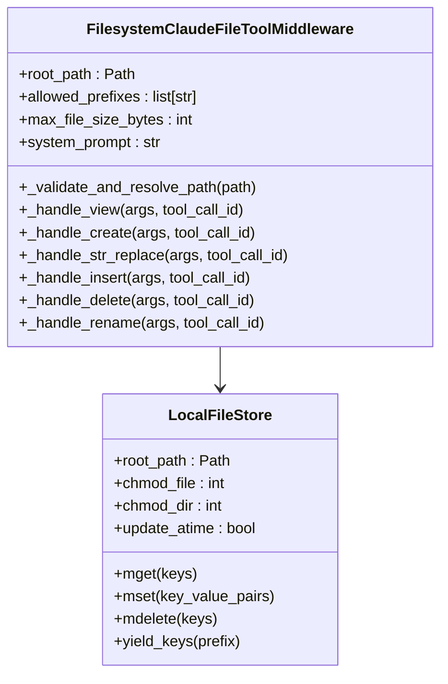
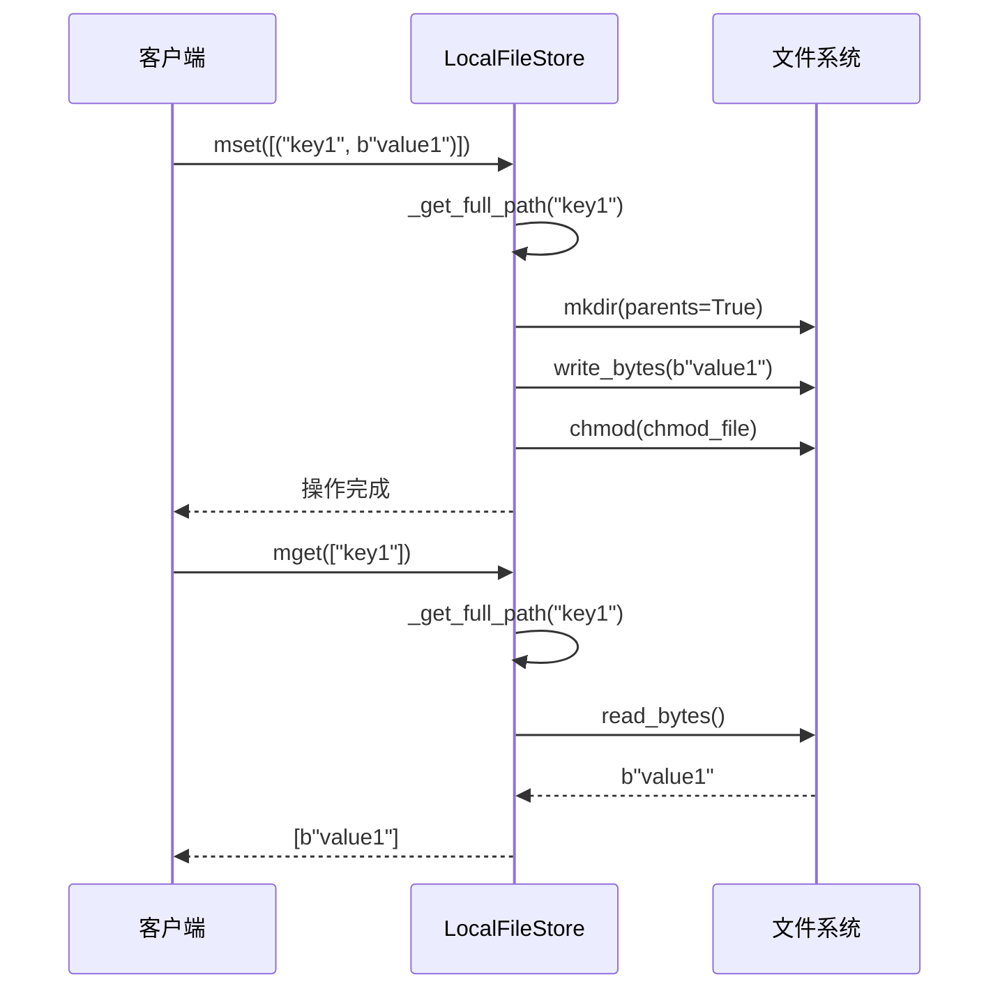
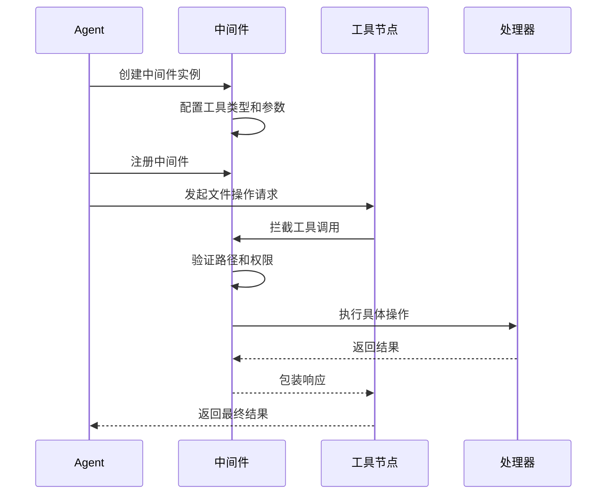
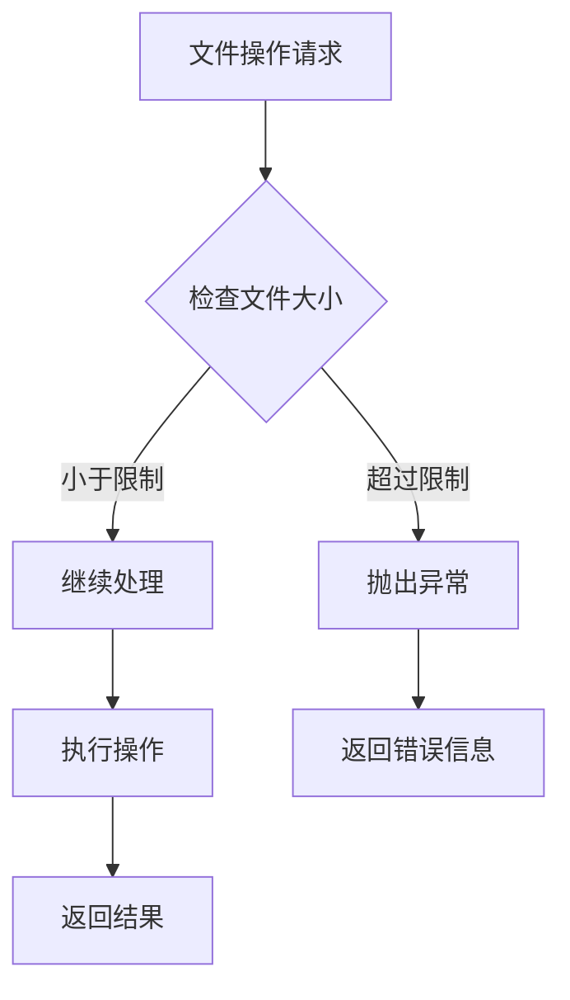
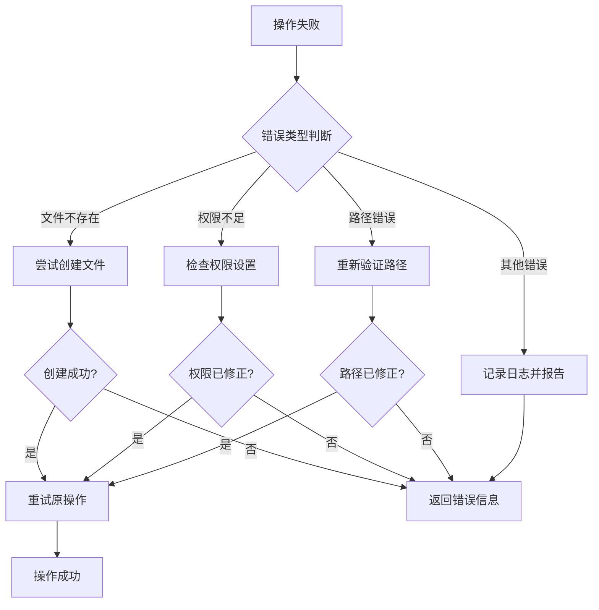

# 文件管理工具

<cite>
**本文档中引用的文件**
- [anthropic_tools.py](file://libs/partners/anthropic/langchain_anthropic/middleware/anthropic_tools.py)
- [file_system.py](file://libs/langchain/langchain_classic/storage/file_system.py)
- [test_anthropic_tools.py](file://libs/partners/anthropic/tests/unit_tests/middleware/test_anthropic_tools.py)
- [file_management.py](file://libs/langchain/langchain_classic/tools/file_management/__init__.py)
- [file_system.py](file://libs/langchain/langchain_classic/document_loaders/blob_loaders/file_system.py)
- [file_search.py](file://libs/langchain_v1/langchain/agents/middleware/file_search.py)
</cite>

## 目录
1. [简介](#简介)
2. [项目结构](#项目结构)
3. [核心组件](#核心组件)
4. [架构概览](#架构概览)
5. [详细组件分析](#详细组件分析)
6. [Agent链集成](#agent链集成)
7. [使用示例](#使用示例)
8. [最佳实践](#最佳实践)
9. [性能考虑](#性能考虑)
10. [错误处理策略](#错误处理策略)
11. [安全注意事项](#安全注意事项)
12. [故障排除指南](#故障排除指南)
13. [结论](#结论)

## 简介

LangChain中的文件管理工具提供了一套完整的文件操作功能，支持读取文件内容、写入文件、列出目录、创建和删除文件等操作。这些工具被设计为可扩展的架构，能够与各种AI代理（Agent）无缝集成，特别是在需要文件系统交互的场景中。

文件管理工具的核心特性包括：
- 安全的路径验证和访问控制
- 支持状态存储和文件系统两种模式
- 丰富的文件操作命令集
- 异步和同步操作支持
- 完善的错误处理机制

## 项目结构

LangChain的文件管理工具分布在多个模块中，形成了层次化的架构：



**图表来源**
- [anthropic_tools.py](file://libs/partners/anthropic/langchain_anthropic/middleware/anthropic_tools.py#L1-L50)
- [file_system.py](file://libs/langchain/langchain_classic/storage/file_system.py#L1-L30)

## 核心组件

LangChain的文件管理工具包含以下核心组件：

### 1. 路径验证系统
提供安全的路径解析和验证机制，防止路径遍历攻击。

### 2. 文件操作中间件
分为状态中间件和文件系统中间件，分别处理内存存储和持久化存储。

### 3. 文件存储接口
实现了`ByteStore`接口，提供键值对式的文件存储能力。

### 4. 文档加载器
支持从文件系统加载文档内容，支持多种格式。

**章节来源**
- [anthropic_tools.py](file://libs/partners/anthropic/langchain_anthropic/middleware/anthropic_tools.py#L100-L150)
- [file_system.py](file://libs/langchain/langchain_classic/storage/file_system.py#L15-L60)

## 架构概览

文件管理工具采用分层架构设计，确保了灵活性和安全性：



**图表来源**
- [anthropic_tools.py](file://libs/partners/anthropic/langchain_anthropic/middleware/anthropic_tools.py#L250-L350)
- [file_system.py](file://libs/langchain/langchain_classic/storage/file_system.py#L100-L165)

## 详细组件分析

### 路径验证系统

路径验证是文件管理工具安全性的核心保障：



**图表来源**
- [anthropic_tools.py](file://libs/partners/anthropic/langchain_anthropic/middleware/anthropic_tools.py#L100-L137)

#### 安全特性
- 防止路径遍历攻击
- 支持虚拟路径前缀限制
- 统一路径格式处理
- 自动规范化路径

**章节来源**
- [anthropic_tools.py](file://libs/partners/anthropic/langchain_anthropic/middleware/anthropic_tools.py#L100-L137)

### 文件操作中间件

#### 状态中间件（StateClaudeFileToolMiddleware）

状态中间件将文件操作存储在Agent的状态中，适合对话上下文中的临时文件操作：



**图表来源**
- [anthropic_tools.py](file://libs/partners/anthropic/langchain_anthropic/middleware/anthropic_tools.py#L171-L250)

#### 文件系统中间件（FilesystemClaudeFileToolMiddleware）

文件系统中间件直接操作本地文件系统，提供持久化的文件管理能力：



**图表来源**
- [anthropic_tools.py](file://libs/partners/anthropic/langchain_anthropic/middleware/anthropic_tools.py#L674-L750)
- [file_system.py](file://libs/langchain/langchain_classic/storage/file_system.py#L15-L80)

**章节来源**
- [anthropic_tools.py](file://libs/partners/anthropic/langchain_anthropic/middleware/anthropic_tools.py#L171-L400)
- [file_system.py](file://libs/langchain/langchain_classic/storage/file_system.py#L15-L165)

### 文件存储接口

LocalFileStore实现了`ByteStore`接口，提供了键值对式的文件存储能力：



**图表来源**
- [file_system.py](file://libs/langchain/langchain_classic/storage/file_system.py#L103-L140)

**章节来源**
- [file_system.py](file://libs/langchain/langchain_classic/storage/file_system.py#L103-L165)

## Agent链集成

文件管理工具通过中间件模式与LangChain的Agent链深度集成：

### 中间件注册流程



**图表来源**
- [anthropic_tools.py](file://libs/partners/anthropic/langchain_anthropic/middleware/anthropic_tools.py#L250-L350)

### 参数控制机制

文件管理工具支持通过参数精确控制文件路径和操作类型：

| 参数名称 | 类型 | 描述 | 示例 |
|---------|------|------|------|
| `path` | str | 目标文件路径 | `/workspace/file.txt` |
| `file_text` | str | 文件内容 | `"Hello World"` |
| `old_str` | str | 要替换的字符串 | `"world"` |
| `new_str` | str | 替换后的字符串 | `"universe"` |
| `insert_line` | int | 插入位置行号 | `0` |
| `command` | str | 操作命令类型 | `"view"`, `"create"`, `"str_replace"` |

**章节来源**
- [anthropic_tools.py](file://libs/partners/anthropic/langchain_anthropic/middleware/anthropic_tools.py#L293-L328)

## 使用示例

### 基础文件操作示例

#### 1. 文本编辑器中间件使用

```python
from langchain.agents import create_agent
from langchain.agents.middleware import StateClaudeTextEditorMiddleware

# 创建Agent并集成文本编辑器中间件
agent = create_agent(
    model=model,
    tools=[],
    middleware=[StateClaudeTextEditorMiddleware()]
)

# 使用文件操作命令
result = agent.invoke({
    "input": "在/workspace目录下创建一个名为hello.txt的文件，内容为'Hello, World!'"
})
```

#### 2. 文件系统中间件使用

```python
from langchain.agents.middleware import FilesystemTextEditorToolMiddleware

# 创建文件系统中间件
middleware = FilesystemTextEditorToolMiddleware(
    root_path="/workspace",
    allowed_prefixes=["/workspace"],
    max_file_size_mb=10
)

# 注册到Agent
agent = create_agent(
    model=model,
    tools=[],
    middleware=[middleware]
)
```

#### 3. 状态中间件使用

```python
from langchain.agents.middleware import StateClaudeMemoryMiddleware

# 创建记忆中间件
memory_middleware = StateClaudeMemoryMiddleware(
    allowed_path_prefixes=["/memories"],
    system_prompt="记住重要的信息，用于后续对话参考"
)

# 在对话中使用
agent = create_agent(
    model=model,
    tools=[],
    middleware=[memory_middleware]
)
```

### 日志分析场景示例

```python
# 日志文件分析Agent
log_analyzer = create_agent(
    model=model,
    tools=[],
    middleware=[
        FilesystemTextEditorToolMiddleware(
            root_path="/logs",
            max_file_size_mb=50
        )
    ]
)

# 分析日志文件
analysis_result = log_analyzer.invoke({
    "input": "分析/var/log/application.log文件，找出所有ERROR级别的日志条目"
})
```

### 配置文件读写场景示例

```python
# 配置管理Agent
config_manager = create_agent(
    model=model,
    tools=[],
    middleware=[
        StateClaudeTextEditorMiddleware(
            allowed_path_prefixes=["/config"]
        )
    ]
)

# 更新配置文件
config_manager.invoke({
    "input": "修改/config/app.yaml文件，将数据库连接超时时间从30秒改为60秒"
})
```

**章节来源**
- [anthropic_tools.py](file://libs/partners/anthropic/langchain_anthropic/middleware/anthropic_tools.py#L1080-L1111)

## 最佳实践

### 1. 路径安全最佳实践

- 始终使用路径前缀限制来约束文件操作范围
- 对于敏感操作，设置严格的路径白名单
- 定期审计文件操作日志

### 2. 性能优化最佳实践

- 合理设置文件大小限制，避免处理过大的文件
- 使用异步操作处理大量文件操作
- 实现文件缓存机制减少重复读取

### 3. 错误处理最佳实践

- 实现多层次的错误捕获和处理
- 提供有意义的错误信息给用户
- 记录详细的错误日志用于调试

### 4. 权限管理最佳实践

- 最小权限原则：只授予必要的文件系统权限
- 使用环境变量配置敏感路径
- 定期审查和更新权限设置

## 性能考虑

### 文件大小限制

文件管理工具内置了文件大小限制机制，防止处理过大的文件：



**图表来源**
- [anthropic_tools.py](file://libs/partners/anthropic/langchain_anthropic/middleware/anthropic_tools.py#L870-L895)

### 缓存策略

对于频繁访问的文件，建议实现缓存机制：

- 内存缓存：将常用文件内容缓存在内存中
- 文件系统缓存：利用操作系统的文件系统缓存
- 智能预加载：预测可能需要的文件提前加载

### 并发处理

文件管理工具支持并发操作，但需要注意：

- 文件锁机制：防止并发修改同一文件
- 事务性操作：确保文件操作的原子性
- 资源池管理：合理分配系统资源

**章节来源**
- [anthropic_tools.py](file://libs/partners/anthropic/langchain_anthropic/middleware/anthropic_tools.py#L870-L895)

## 错误处理策略

### 常见错误类型

| 错误类型 | 描述 | 处理策略 |
|---------|------|----------|
| `FileNotFoundError` | 文件不存在 | 提供文件列表或创建新文件 |
| `PermissionError` | 权限不足 | 检查文件权限或提升权限 |
| `ValueError` | 路径无效 | 验证路径格式和安全性 |
| `UnicodeDecodeError` | 编码错误 | 尝试不同的编码或二进制模式 |
| `OSError` | 系统级错误 | 检查磁盘空间和系统状态 |

### 错误恢复机制



**图表来源**
- [anthropic_tools.py](file://libs/partners/anthropic/langchain_anthropic/middleware/anthropic_tools.py#L310-L328)

### 错误日志记录

建议实现结构化的错误日志记录：

```python
# 错误日志示例结构
{
    "timestamp": "2024-01-01T00:00:00Z",
    "operation": "file_read",
    "path": "/unsafe/path",
    "error_type": "ValueError",
    "error_message": "Path traversal not allowed",
    "user_id": "agent_123",
    "session_id": "session_456"
}
```

**章节来源**
- [anthropic_tools.py](file://libs/partners/anthropic/langchain_anthropic/middleware/anthropic_tools.py#L310-L328)

## 安全注意事项

### 1. 路径遍历防护

文件管理工具实现了多层路径遍历防护：

- 禁止`..`和`~`字符的使用
- 规范化路径处理
- 虚拟路径前缀验证

### 2. 权限控制

- 文件系统权限检查
- 用户身份验证
- 操作审计日志

### 3. 数据保护

- 敏感文件加密存储
- 访问控制列表（ACL）
- 数据备份和恢复机制

### 4. 网络安全

- HTTPS传输加密
- API密钥认证
- 请求频率限制

**章节来源**
- [anthropic_tools.py](file://libs/partners/anthropic/langchain_anthropic/middleware/anthropic_tools.py#L100-L137)

## 故障排除指南

### 常见问题及解决方案

#### 1. 文件不存在错误

**症状**：尝试读取不存在的文件时出现`FileNotFoundError`

**解决方案**：
- 检查文件路径是否正确
- 验证文件是否存在
- 确认文件权限设置

#### 2. 权限不足错误

**症状**：文件操作时出现`PermissionError`

**解决方案**：
- 检查文件系统权限
- 确认运行用户权限
- 修改文件所有权或权限

#### 3. 路径验证失败

**症状**：路径被拒绝访问，提示路径遍历攻击

**解决方案**：
- 使用相对路径而非绝对路径
- 避免使用特殊字符
- 检查路径前缀配置

#### 4. 文件过大错误

**症状**：文件大小超过限制，抛出异常

**解决方案**：
- 增加文件大小限制
- 分割大文件处理
- 使用流式处理技术

### 调试技巧

1. **启用详细日志**：设置适当的日志级别查看详细信息
2. **路径验证**：使用路径验证函数检查路径安全性
3. **权限检查**：确认文件和目录的权限设置
4. **资源监控**：监控系统资源使用情况

**章节来源**
- [test_anthropic_tools.py](file://libs/partners/anthropic/tests/unit_tests/middleware/test_anthropic_tools.py#L15-L50)

## 结论

LangChain的文件管理工具提供了一套完整、安全、高效的文件操作系统。通过分层架构设计，它能够满足从简单的文件读写到复杂的Agent集成的各种需求。

### 主要优势

1. **安全性**：完善的路径验证和权限控制机制
2. **灵活性**：支持状态存储和文件系统两种模式
3. **易用性**：简洁的API设计和丰富的使用示例
4. **可扩展性**：模块化架构便于功能扩展

### 应用场景

- 日志分析和处理
- 配置文件管理
- 文档内容编辑
- 代码生成和修改
- 数据文件处理

### 未来发展方向

- 更智能的文件推荐系统
- 自动化的文件分类和标签
- 增强的协作功能
- 更好的性能优化

通过合理使用这些文件管理工具，开发者可以构建更加智能和高效的AI应用系统。