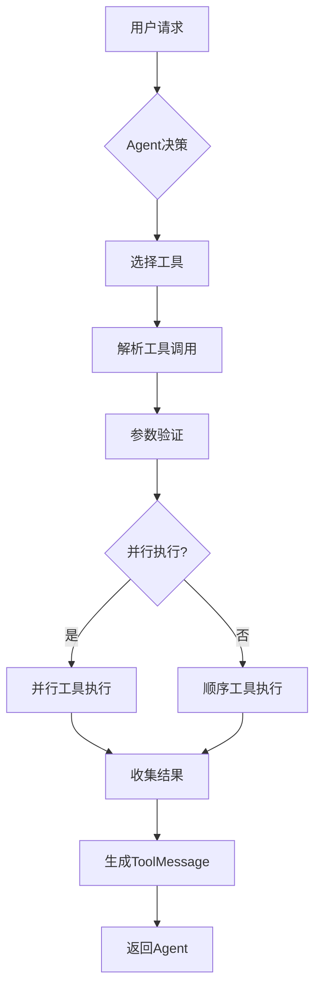

# 工具集成

<cite>
**本文档中引用的文件**  
- [base.py](file://libs/core/langchain_core/tools/base.py)
- [simple.py](file://libs/core/langchain_core/tools/simple.py)
- [structured.py](file://libs/core/langchain_core/tools/structured.py)
- [function_calling.py](file://libs/core/langchain_core/utils/function_calling.py)
- [tool_node.py](file://libs/langchain_v1/langchain/tools/tool_node.py)
- [__init__.py](file://libs/core/langchain_core/tools/__init__.py)
</cite>

## 目录
1. [简介](#简介)
2. [工具定义与创建](#工具定义与创建)
3. [工具注入与执行机制](#工具注入与执行机制)
4. [工具调用API与OpenAI集成](#工具调用api与openai集成)
5. [端到端示例流程](#端到端示例流程)
6. [性能与错误处理](#性能与错误处理)

## 简介
LangChain框架提供了一套完整的工具集成系统，允许开发者将各种功能模块作为工具注入到Agent中。该系统支持同步和异步工具执行，能够根据用户请求选择并执行合适的工具。工具调度机制能够解析LLM生成的工具调用指令，并将其映射到具体的工具执行函数。本文档详细说明了工具集成的各个方面，包括工具定义、Agent初始化、工具执行和结果返回的完整流程。

## 工具定义与创建

LangChain提供了多种方式来定义和创建工具。核心工具类包括`BaseTool`、`Tool`和`StructuredTool`，它们都继承自`RunnableSerializable`接口，支持可运行的序列化操作。

`BaseTool`是所有工具的基类，定义了工具的基本属性和方法。它包含名称、描述、参数模式等核心属性，并提供了同步和异步执行接口。`Tool`类适用于简单的函数工具，而`StructuredTool`则支持更复杂的结构化输入。

工具可以通过`from_function`类方法从普通Python函数创建，系统会自动从函数签名和文档字符串中推断参数模式和描述信息。对于需要复杂输入结构的工具，可以使用Pydantic模型作为参数模式，确保输入数据的类型安全和验证。

**Section sources**
- [base.py](file://libs/core/langchain_core/tools/base.py#L0-L799)
- [simple.py](file://libs/core/langchain_core/tools/simple.py#L0-L201)
- [structured.py](file://libs/core/langchain_core/tools/structured.py#L0-L248)

## 工具注入与执行机制

工具注入机制允许将单个工具或工具集合注入到Agent中。当Agent接收到用户请求时，会根据工具的描述信息选择合适的工具进行执行。工具调度器负责解析LLM生成的工具调用指令，并将其映射到具体的工具执行函数。

工具执行过程中，系统会自动处理参数解析和验证。对于包含注入参数（如`InjectedToolCallId`）的工具，执行器会自动注入相应的运行时信息。工具节点（`_ToolNode`）作为执行的核心组件，管理着工具的调用、状态注入和错误处理。

工具调用支持并行执行模式，多个工具可以同时运行以提高效率。执行结果以`ToolMessage`的形式返回，包含执行内容、工具调用ID和附加元数据。对于需要控制流变更的工具（如转移对话），可以返回`Command`对象来指示后续操作。

**Diagram sources**
- [tool_node.py](file://libs/langchain_v1/langchain/tools/tool_node.py#L514-L545)
- [base.py](file://libs/core/langchain_core/tools/base.py#L0-L799)

## 工具调用API与OpenAI集成

LangChain提供了`convert_to_openai_function`和`convert_to_openai_tool`等实用函数，用于将工具转换为OpenAI兼容的函数调用格式。这些函数能够将Pydantic模型、类型化字典或普通Python函数转换为OpenAI API所需的JSON模式。

对于支持原生工具调用的模型（如OpenAI），系统会自动将工具集合转换为正确的工具规范格式。`ToolDescription`类型定义了工具在OpenAI API中的表示形式，包含类型标识和函数描述。转换过程会处理标题移除、类型映射和文档字符串解析等细节，确保生成的模式符合API要求。

工具调用的序列化和反序列化过程保持了类型安全，支持复杂的嵌套结构和联合类型。系统还提供了`tool_example_to_messages`辅助函数，用于将工具调用示例转换为消息序列，便于训练和测试。

**Section sources**
- [function_calling.py](file://libs/core/langchain_core/utils/function_calling.py#L0-L762)
- [base.py](file://libs/core/langchain_core/tools/base.py#L0-L799)

## 端到端示例流程

一个完整的工具集成流程包括以下步骤：首先定义工具函数并创建工具实例，然后将工具注入到Agent配置中，接着初始化Agent执行器，最后处理用户请求并返回结果。

在初始化阶段，系统会收集所有可用工具，将其转换为LLM可识别的格式，并设置相应的执行上下文。当收到用户请求时，Agent会生成包含工具调用的AI消息，工具节点负责执行这些调用并返回结果。整个过程通过回调系统进行监控和日志记录。

对于异步工具，系统提供了相应的异步执行接口，确保非阻塞的操作模式。执行结果会被格式化为标准的消息格式，包含工具调用ID、执行内容和元数据，便于后续处理和显示。

**Section sources**
- [tool_node.py](file://libs/langchain_v1/langchain/tools/tool_node.py#L514-L545)
- [structured.py](file://libs/core/langchain_core/tools/structured.py#L0-L248)

## 性能与错误处理

工具调用的性能受多个因素影响，包括网络延迟、计算复杂度和序列化开销。系统提供了回调机制来监控执行时间和资源消耗，帮助识别性能瓶颈。对于高延迟操作，建议使用异步工具或实现缓存机制。

错误处理方面，工具可以抛出`ToolException`来指示执行错误，这些错误会被捕获并作为观察结果返回给Agent。系统支持自定义错误处理策略，包括重试机制、降级方案和备用工具选择。`handle_tool_error`配置项允许指定错误处理方式，可以是布尔值、字符串或自定义处理函数。

成本控制主要通过限制工具调用频率、设置超时和实现智能选择策略来实现。系统还支持工具调用的审计和计费功能，便于监控和优化资源使用。

**Section sources**
- [base.py](file://libs/core/langchain_core/tools/base.py#L0-L799)
- [tool_node.py](file://libs/langchain_v1/langchain/tools/tool_node.py#L514-L545)