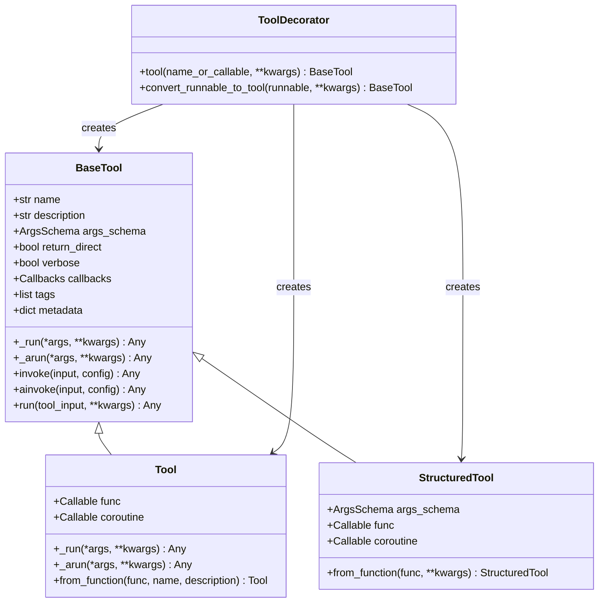
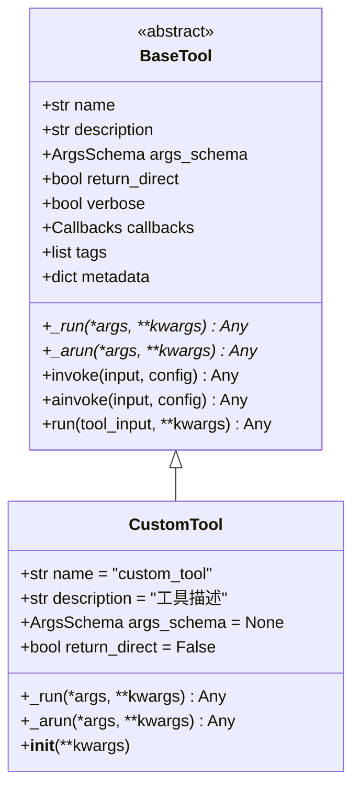
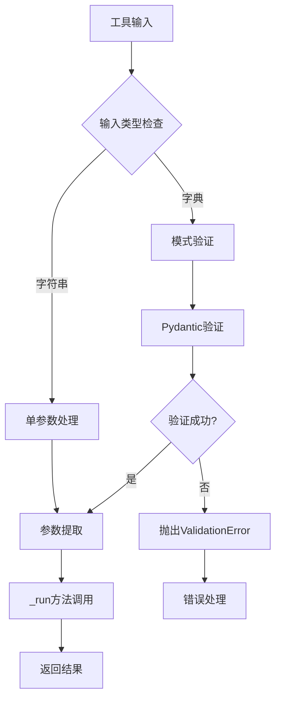
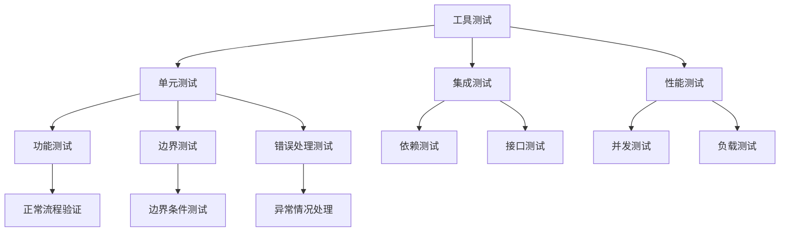

# 自定义工具

<cite>
**本文档中引用的文件**
- [libs/core/langchain_core/tools/base.py](file://libs/core/langchain_core/tools/base.py)
- [libs/core/langchain_core/tools/convert.py](file://libs/core/langchain_core/tools/convert.py)
- [libs/core/langchain_core/tools/simple.py](file://libs/core/langchain_core/tools/simple.py)
- [libs/core/langchain_core/tools/structured.py](file://libs/core/langchain_core/tools/structured.py)
- [libs/core/langchain_core/tools/__init__.py](file://libs/core/langchain_core/tools/__init__.py)
- [libs/core/tests/unit_tests/test_tools.py](file://libs/core/tests/unit_tests/test_tools.py)
- [libs/langchain/langchain_classic/tools/base.py](file://libs/langchain/langchain_classic/tools/base.py)
</cite>

## 目录
1. [简介](#简介)
2. [工具架构概览](#工具架构概览)
3. [基础工具类继承](#基础工具类继承)
4. [装饰器工具创建](#装饰器工具创建)
5. [工具输入参数定义](#工具输入参数定义)
6. [实际应用案例](#实际应用案例)
7. [工具单元测试](#工具单元测试)
8. [最佳实践与规范](#最佳实践与规范)
9. [总结](#总结)

## 简介

LangChain提供了强大而灵活的工具系统，允许开发者创建自定义工具来扩展Agent的功能。工具是LangChain中与外部世界交互的核心组件，每个工具都有明确的描述，Agent通过描述选择合适的工具执行任务。

LangChain的工具系统支持两种主要的创建方式：
- **继承BaseTool类**：从零开始构建复杂的自定义工具
- **使用@tool装饰器**：快速将Python函数转换为LangChain工具

## 工具架构概览

LangChain工具系统采用分层架构设计，包含以下核心组件：



**图表来源**
- [libs/core/langchain_core/tools/base.py](file://libs/core/langchain_core/tools/base.py#L300-L400)
- [libs/core/langchain_core/tools/simple.py](file://libs/core/langchain_core/tools/simple.py#L25-L50)
- [libs/core/langchain_core/tools/structured.py](file://libs/core/langchain_core/tools/structured.py#L30-L60)

**章节来源**
- [libs/core/langchain_core/tools/base.py](file://libs/core/langchain_core/tools/base.py#L300-L400)
- [libs/core/langchain_core/tools/simple.py](file://libs/core/langchain_core/tools/simple.py#L25-L50)
- [libs/core/langchain_core/tools/structured.py](file://libs/core/langchain_core/tools/structured.py#L30-L60)

## 基础工具类继承

### 继承BaseTool类

创建自定义工具最直接的方式是从BaseTool类继承，需要实现三个核心方法：

#### 1. _name属性
工具的唯一标识符，应清晰表达工具用途：

```python
class WeatherTool(BaseTool):
    name: str = "weather_lookup"
```

#### 2. _description属性
详细的工具描述，帮助Agent理解何时以及如何使用该工具：

```python
class WeatherTool(BaseTool):
    description: str = """
    获取指定位置的当前天气状况。
    输入参数：location（字符串），表示城市名称或地理位置。
    返回：天气状况描述，包括温度、天气状态等信息。
    示例：{"location": "北京"}
    """
```

#### 3. _run方法
工具的核心执行逻辑，处理输入并返回结果：

```python
class WeatherTool(BaseTool):
    def _run(self, location: str) -> str:
        """获取天气信息的实现逻辑"""
        # 实际的API调用或数据查询逻辑
        weather_data = self._fetch_weather(location)
        return f"当前位置：{location}，天气：{weather_data}"
    
    async def _arun(self, location: str) -> str:
        """异步版本的工具执行"""
        # 异步实现
        weather_data = await self._fetch_weather_async(location)
        return f"当前位置：{location}，天气：{weather_data}"
```

### 工具类的完整结构



**图表来源**
- [libs/core/langchain_core/tools/base.py](file://libs/core/langchain_core/tools/base.py#L300-L500)

**章节来源**
- [libs/core/langchain_core/tools/base.py](file://libs/core/langchain_core/tools/base.py#L300-L600)

## 装饰器工具创建

### 使用@tool装饰器

LangChain提供了强大的@tool装饰器，可以快速将Python函数转换为工具：

#### 基本用法

```python
from langchain_core.tools import tool

@tool
def search_api(query: str) -> str:
    """搜索API获取相关信息。
    
    Args:
        query: 搜索关键词
        
    Returns:
        搜索结果的文本描述
    """
    # 实现搜索逻辑
    return f"搜索结果：{query}"
```

#### 命名工具

```python
@tool("weather_lookup")
def get_weather(location: str) -> str:
    """获取指定地点的天气信息。
    
    Args:
        location: 地点名称
        
    Returns:
        天气状况描述
    """
    return f"{location}的天气很好"
```

#### 高级配置选项

```python
@tool(
    return_direct=True,
    parse_docstring=True,
    response_format="content_and_artifact"
)
def advanced_tool(data: dict) -> tuple[str, dict]:
    """高级工具示例。
    
    Args:
        data: 包含处理数据的字典
        
    Returns:
        (处理结果, 元数据)
    """
    return "处理完成", {"timestamp": "2024-01-01"}
```

### 装饰器参数详解

| 参数 | 类型 | 默认值 | 描述 |
|------|------|--------|------|
| description | str | None | 工具描述，优先级高于函数docstring |
| return_direct | bool | False | 是否直接返回结果而不继续Agent循环 |
| args_schema | ArgsSchema | None | 自定义参数模式 |
| infer_schema | bool | True | 是否根据函数签名推断参数模式 |
| response_format | str | "content" | 响应格式："content"或"content_and_artifact" |
| parse_docstring | bool | False | 是否解析Google风格docstring |
| error_on_invalid_docstring | bool | True | docstring无效时是否抛出错误 |

**章节来源**
- [libs/core/langchain_core/tools/convert.py](file://libs/core/langchain_core/tools/convert.py#L100-L200)
- [libs/core/tests/unit_tests/test_tools.py](file://libs/core/tests/unit_tests/test_tools.py#L629-L669)

## 工具输入参数定义

### 类型验证和默认值

LangChain支持多种参数定义方式：

#### 1. 基本类型参数

```python
@tool
def basic_tool(name: str, age: int, active: bool = True) -> str:
    """基本类型参数示例。
    
    Args:
        name: 用户姓名
        age: 年龄
        active: 是否活跃，默认为True
    """
    return f"用户：{name}，年龄：{age}，活跃：{active}"
```

#### 2. 复杂类型参数

```python
from pydantic import BaseModel
from typing import List, Dict

class UserData(BaseModel):
    """用户数据模型"""
    name: str
    preferences: Dict[str, str]
    tags: List[str]

@tool
def user_tool(user_data: UserData) -> str:
    """处理复杂用户数据。
    
    Args:
        user_data: 包含用户信息的数据模型
    """
    return f"处理用户：{user_data.name}"
```

#### 3. JSON Schema参数

```python
user_schema = {
    "type": "object",
    "properties": {
        "name": {"type": "string", "description": "用户名"},
        "age": {"type": "integer", "description": "年龄"},
        "preferences": {
            "type": "object",
            "description": "偏好设置",
            "additionalProperties": {"type": "string"}
        }
    },
    "required": ["name", "age"]
}

@tool(args_schema=user_schema)
def json_schema_tool(data: dict) -> str:
    """使用JSON Schema的工具。
    
    Args:
        data: 符合schema的数据
    """
    return f"处理数据：{data['name']}"
```

### 参数验证机制



**图表来源**
- [libs/core/langchain_core/tools/base.py](file://libs/core/langchain_core/tools/base.py#L600-L700)

**章节来源**
- [libs/core/langchain_core/tools/base.py](file://libs/core/langchain_core/tools/base.py#L600-L800)
- [libs/core/langchain_core/tools/convert.py](file://libs/core/langchain_core/tools/convert.py#L200-L300)

## 实际应用案例

### 案例1：天气查询工具

```python
from langchain_core.tools import BaseTool
from typing import Optional
import requests

class WeatherTool(BaseTool):
    name: str = "weather_lookup"
    description: str = """
    获取指定位置的当前天气状况。
    
    输入参数：
    - location: 字符串，表示城市名称或地理位置
    - unit: 可选，温度单位（'celsius'或'fahrenheit'）
    
    返回：天气状况描述，包括温度、天气状态等信息
    """
    
    def _run(self, location: str, unit: Optional[str] = None) -> str:
        """获取天气信息的实现逻辑"""
        try:
            # 实际的API调用
            url = f"https://api.weather.com/v1/current?location={location}"
            if unit:
                url += f"&unit={unit}"
            
            response = requests.get(url, timeout=10)
            data = response.json()
            
            temp = data.get('temperature', '未知')
            condition = data.get('condition', '未知')
            
            return f"当前位置：{location}，温度：{temp}°C，天气：{condition}"
        except Exception as e:
            return f"获取天气信息失败：{str(e)}"
    
    async def _arun(self, location: str, unit: Optional[str] = None) -> str:
        """异步版本的天气查询"""
        # 异步实现
        import aiohttp
        async with aiohttp.ClientSession() as session:
            url = f"https://api.weather.com/v1/current?location={location}"
            if unit:
                url += f"&unit={unit}"
            
            async with session.get(url) as response:
                data = await response.json()
                temp = data.get('temperature', '未知')
                condition = data.get('condition', '未知')
                return f"当前位置：{location}，温度：{temp}°C，天气：{condition}"
```

### 案例2：数据库查询工具

```python
from langchain_core.tools import BaseTool
from sqlalchemy import create_engine, text
from typing import List, Dict, Any

class DatabaseTool(BaseTool):
    name: str = "database_query"
    description: str = """
    执行SQL查询以获取数据库信息。
    
    输入参数：
    - query: 字符串，有效的SQL查询语句
    - params: 可选，查询参数字典
    
    返回：查询结果的JSON格式字符串
    """
    
    def __init__(self, db_url: str):
        super().__init__()
        self.engine = create_engine(db_url)
    
    def _run(self, query: str, params: Dict[str, Any] = None) -> str:
        """执行数据库查询"""
        try:
            with self.engine.connect() as conn:
                if params:
                    result = conn.execute(text(query), params)
                else:
                    result = conn.execute(text(query))
                
                rows = [dict(row) for row in result]
                return str(rows)
        except Exception as e:
            return f"数据库查询失败：{str(e)}"
    
    async def _arun(self, query: str, params: Dict[str, Any] = None) -> str:
        """异步数据库查询"""
        import asyncpg
        import asyncio
        
        async def execute_query():
            conn = await asyncpg.connect(str(self.engine.url))
            try:
                if params:
                    result = await conn.fetch(query, *[params[p] for p in params])
                else:
                    result = await conn.fetch(query)
                
                return str([dict(r) for r in result])
            finally:
                await conn.close()
        
        return await asyncio.get_event_loop().run_until_complete(execute_query())
```

### 案例3：内部服务调用工具

```python
from langchain_core.tools import BaseTool
import httpx
from typing import Dict, Any

class InternalServiceTool(BaseTool):
    name: str = "internal_service_call"
    description: str = """
    调用内部微服务API获取业务数据。
    
    输入参数：
    - service_name: 字符串，服务名称
    - endpoint: 字符串，API端点路径
    - data: 可选，请求数据字典
    
    返回：服务响应的JSON格式字符串
    """
    
    def __init__(self, base_url: str):
        super().__init__()
        self.base_url = base_url
    
    def _run(self, service_name: str, endpoint: str, data: Dict[str, Any] = None) -> str:
        """调用内部服务"""
        try:
            url = f"{self.base_url}/{service_name}{endpoint}"
            headers = {'Content-Type': 'application/json'}
            
            if data:
                response = httpx.post(url, json=data, headers=headers, timeout=30)
            else:
                response = httpx.get(url, headers=headers, timeout=30)
            
            if response.status_code == 200:
                return response.text
            else:
                return f"服务调用失败，状态码：{response.status_code}"
        except Exception as e:
            return f"服务调用异常：{str(e)}"
    
    async def _arun(self, service_name: str, endpoint: str, data: Dict[str, Any] = None) -> str:
        """异步服务调用"""
        async with httpx.AsyncClient() as client:
            try:
                url = f"{self.base_url}/{service_name}{endpoint}"
                headers = {'Content-Type': 'application/json'}
                
                if data:
                    response = await client.post(url, json=data, headers=headers, timeout=30)
                else:
                    response = await client.get(url, headers=headers, timeout=30)
                
                if response.status_code == 200:
                    return response.text
                else:
                    return f"服务调用失败，状态码：{response.status_code}"
            except Exception as e:
                return f"服务调用异常：{str(e)}"
```

**章节来源**
- [libs/core/tests/unit_tests/test_tools.py](file://libs/core/tests/unit_tests/test_tools.py#L100-L200)

## 工具单元测试

### 测试框架和策略

LangChain提供了完整的工具测试基础设施，支持多种测试场景：

#### 1. 基础功能测试

```python
import pytest
from langchain_core.tools import tool
from tests.unit_tests.tools import ToolsUnitTests

class TestWeatherTool(ToolsUnitTests):
    @property
    def tool_constructor(self):
        from my_tools import WeatherTool
        return WeatherTool
    
    @property
    def tool_invoke_params_example(self):
        return {"location": "北京", "unit": "celsius"}
    
    def test_basic_functionality(self):
        """测试基本功能"""
        tool = self.tool_constructor()
        result = tool.run({"location": "上海"})
        assert isinstance(result, str)
        assert "上海" in result
    
    def test_error_handling(self):
        """测试错误处理"""
        tool = self.tool_constructor()
        result = tool.run({"location": "不存在的城市"})
        assert "失败" in result or "异常" in result
```

#### 2. 装饰器工具测试

```python
def test_tool_decorator_basic():
    """测试基础装饰器功能"""
    
    @tool
    def simple_tool(input_str: str) -> str:
        """简单工具测试"""
        return f"处理：{input_str}"
    
    assert isinstance(simple_tool, BaseTool)
    assert simple_tool.name == "simple_tool"
    assert "简单工具测试" in simple_tool.description
    
    result = simple_tool.run({"input_str": "测试"})
    assert result == "处理：测试"

def test_tool_decorator_advanced():
    """测试高级装饰器配置"""
    
    @tool(
        return_direct=True,
        parse_docstring=True,
        response_format="content_and_artifact"
    )
    def advanced_tool(data: dict) -> tuple[str, dict]:
        """高级工具测试
        
        Args:
            data: 测试数据
            
        Returns:
            (结果, 元数据)
        """
        return "测试完成", {"test": True}
    
    assert advanced_tool.return_direct == True
    assert "data" in advanced_tool.args
```

#### 3. 异步工具测试

```python
import asyncio

def test_async_tool():
    """测试异步工具"""
    
    @tool
    async def async_tool(value: str) -> str:
        """异步工具测试"""
        await asyncio.sleep(0.1)  # 模拟异步操作
        return f"异步处理：{value}"
    
    # 同步调用
    result = async_tool.run({"value": "测试"})
    assert result == "异步处理：测试"
    
    # 异步调用
    async def test_async():
        return await async_tool.arun({"value": "测试"})
    
    result = asyncio.run(test_async())
    assert result == "异步处理：测试"
```

### 测试最佳实践



**图表来源**
- [libs/cli/langchain_cli/package_template/tests/__init__.py](file://libs/cli/langchain_cli/package_template/tests/__init__.py#L0-L26)

**章节来源**
- [libs/core/tests/unit_tests/test_tools.py](file://libs/core/tests/unit_tests/test_tools.py#L1-L100)

## 最佳实践与规范

### 工具命名规范

#### 1. 命名约定
- 使用小写字母和下划线
- 清晰表达工具功能
- 避免过于宽泛的名称

```python
# 推荐
@tool("weather_forecast")
def get_weather_forecast(location: str) -> str:
    pass

@tool("database_query_execute")
def execute_query(query: str) -> str:
    pass

# 不推荐
@tool("weather")
def get_weather(location: str) -> str:
    pass

@tool("tool123")
def process_data(data: dict) -> str:
    pass
```

#### 2. 描述清晰度要求

```python
class WellDocumentedTool(BaseTool):
    name: str = "well_documented_tool"
    
    description: str = """
    执行精确的文档搜索查询。
    
    此工具专门用于在企业知识库中查找技术文档和指南。
    
    输入参数：
    - query: 必需，搜索关键词或短语
    - max_results: 可选，最大返回结果数量，默认为10
    - include_snippets: 可选，是否包含内容片段，默认为False
    
    返回：JSON格式的搜索结果列表，包含标题、URL、摘要和匹配度分数
    
    使用场景：
    - 技术问题解答
    - 文档查找
    - 知识管理
    
    注意事项：
    - 查询应尽量具体以获得准确结果
    - 结果按相关性排序
    - 对于模糊查询可能返回不相关结果
    """
    
    def _run(self, query: str, max_results: int = 10, include_snippets: bool = False) -> str:
        # 实现逻辑
        pass
```

### 工具设计原则

#### 1. 单一职责原则
每个工具应该只负责一个特定的功能：

```python
# 推荐：单一职责
@tool("email_send")
def send_email(recipient: str, subject: str, body: str) -> str:
    """发送电子邮件"""
    pass

# 不推荐：职责过多
@tool("email_operations")
def email_operations(operation: str, **kwargs) -> str:
    """执行各种邮件操作"""
    if operation == "send":
        # 发送逻辑
        pass
    elif operation == "delete":
        # 删除逻辑
        pass
    # 更多操作...
```

#### 2. 参数最小化原则
只暴露必要的参数：

```python
# 推荐：最小化参数
@tool("weather_current")
def get_current_weather(location: str) -> str:
    """获取当前天气"""
    pass

# 不推荐：参数过多
@tool("weather_detailed")
def get_detailed_weather(
    location: str,
    latitude: float = None,
    longitude: float = None,
    units: str = "metric",
    forecast_days: int = 1,
    include_details: bool = False
) -> str:
    """获取详细天气信息"""
    pass
```

#### 3. 错误处理策略

```python
class RobustTool(BaseTool):
    def _run(self, *args, **kwargs) -> str:
        try:
            # 主要逻辑
            result = self._execute_operation(*args, **kwargs)
            return result
        except ConnectionError as e:
            return f"连接失败：{str(e)}"
        except TimeoutError as e:
            return f"请求超时：{str(e)}"
        except ValueError as e:
            return f"参数错误：{str(e)}"
        except Exception as e:
            # 记录日志
            logger.error(f"工具执行异常：{str(e)}")
            return f"操作失败：{str(e)}"
```

### 性能优化建议

#### 1. 缓存策略
```python
from functools import lru_cache
from typing import Dict

class CachedTool(BaseTool):
    @lru_cache(maxsize=100)
    def _cached_operation(self, key: str) -> str:
        """缓存的操作"""
        # 实现逻辑
        pass
    
    def _run(self, operation: str, params: Dict) -> str:
        key = f"{operation}:{','.join(sorted(params.items()))}"
        return self._cached_operation(key)
```

#### 2. 异步优化
```python
class AsyncOptimizedTool(BaseTool):
    async def _run(self, *args, **kwargs) -> str:
        # 如果有IO密集操作，使用异步版本
        if self._has_io_operation():
            return await self._async_operation(*args, **kwargs)
        else:
            return self._sync_operation(*args, **kwargs)
```

### 安全考虑

#### 1. 输入验证
```python
from pydantic import BaseModel, validator

class SecureTool(BaseTool):
    class InputModel(BaseModel):
        query: str
        max_length: int = 1000
        
        @validator('query')
        def validate_query(cls, v):
            if len(v) > 1000:
                raise ValueError('查询长度超过限制')
            if not v.strip():
                raise ValueError('查询不能为空')
            return v
    
    def _run(self, query: str, max_length: int = 1000) -> str:
        try:
            input_data = self.InputModel(query=query, max_length=max_length)
            # 安全处理逻辑
            return self._process_securely(input_data.query)
        except Exception as e:
            return f"输入验证失败：{str(e)}"
```

#### 2. 权限控制
```python
class PermissionControlledTool(BaseTool):
    def __init__(self, user_role: str):
        super().__init__()
        self.user_role = user_role
    
    def _run(self, *args, **kwargs) -> str:
        if not self._has_permission():
            return "权限不足，无法执行此操作"
        return self._execute_with_permissions(*args, **kwargs)
    
    def _has_permission(self) -> bool:
        # 实现权限检查逻辑
        return self.user_role in ['admin', 'manager']
```

**章节来源**
- [libs/core/tests/unit_tests/test_tools.py](file://libs/core/tests/unit_tests/test_tools.py#L600-L800)

## 总结

LangChain的自定义工具系统提供了强大而灵活的扩展能力，支持从简单的函数装饰到复杂的面向对象工具开发。通过合理的设计和实现，可以创建出功能丰富、易于维护的工具组件。

### 关键要点

1. **架构选择**：根据需求选择继承BaseTool或使用@tool装饰器
2. **参数设计**：遵循类型安全和验证原则
3. **测试覆盖**：建立完善的测试体系确保工具可靠性
4. **最佳实践**：遵循命名规范、单一职责等设计原则
5. **性能优化**：考虑缓存、异步等优化策略
6. **安全考虑**：实施输入验证和权限控制

### 发展方向

随着LangChain生态的发展，工具系统将继续演进，可能的方向包括：
- 更智能的参数推断和验证
- 更丰富的异步支持
- 更好的错误处理和恢复机制
- 更强的安全性和权限控制
- 更便捷的调试和监控工具

通过掌握这些核心概念和实践技巧，开发者可以充分发挥LangChain工具系统的潜力，构建出功能强大且可靠的AI应用。