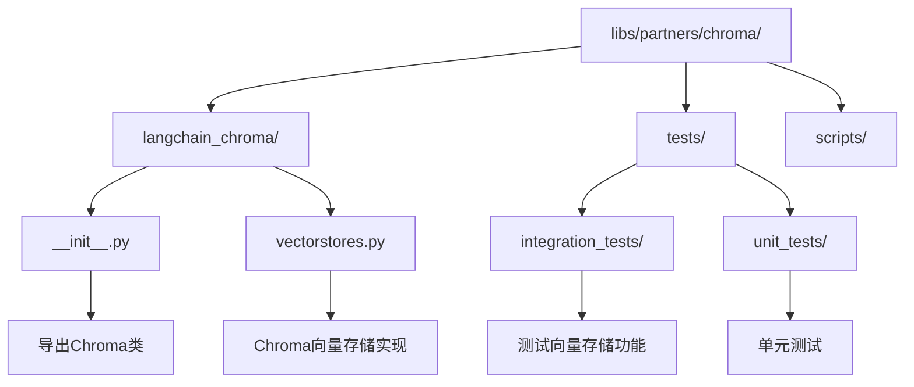
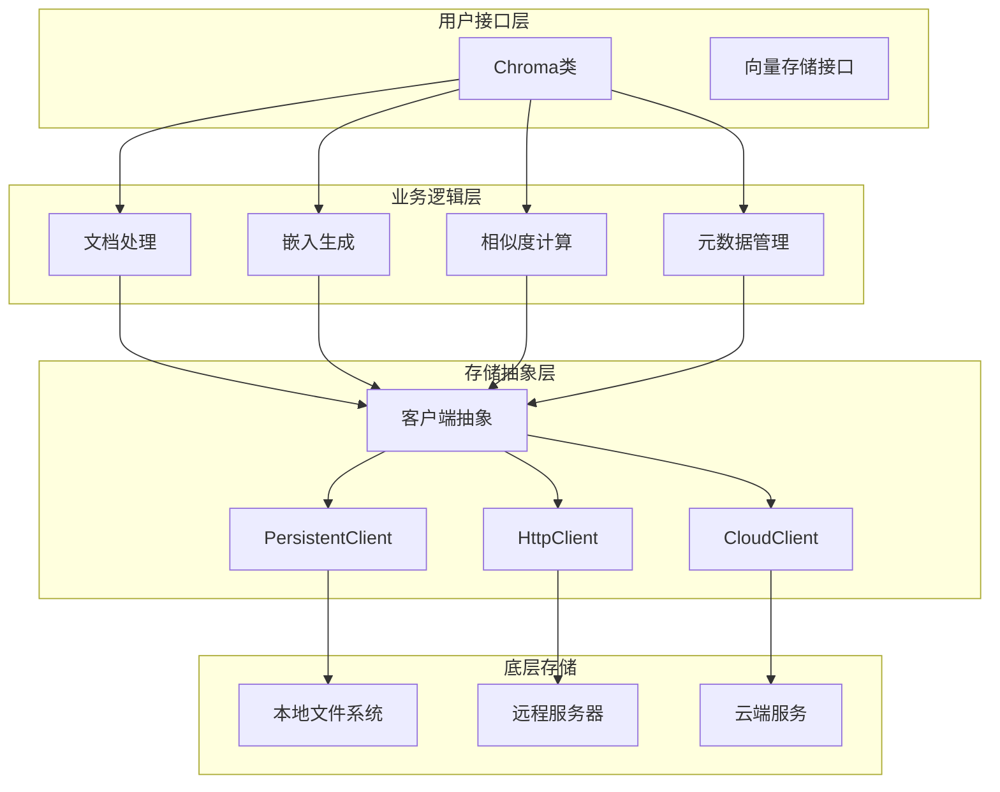
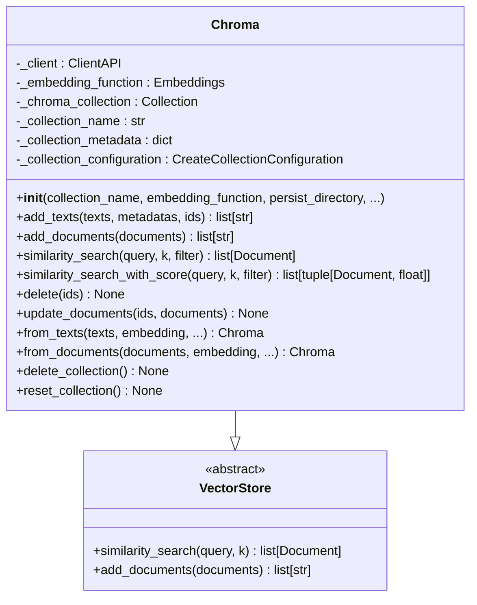
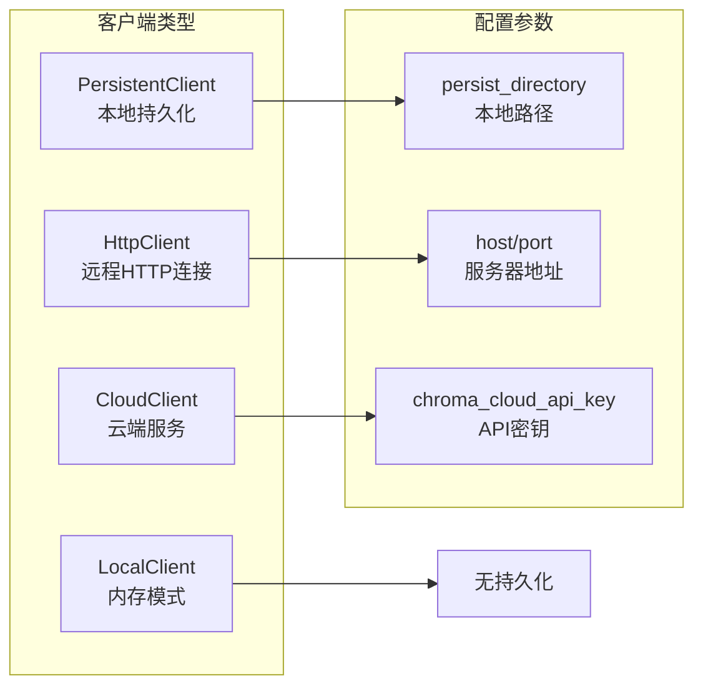
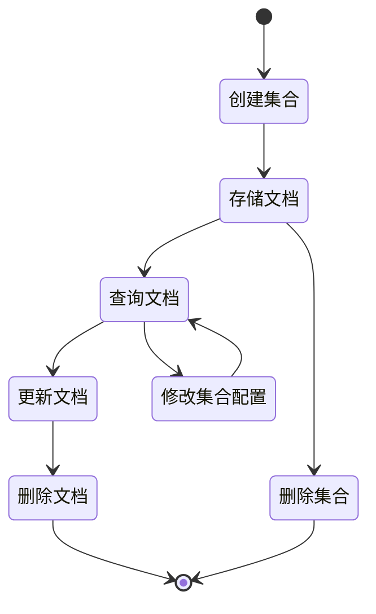
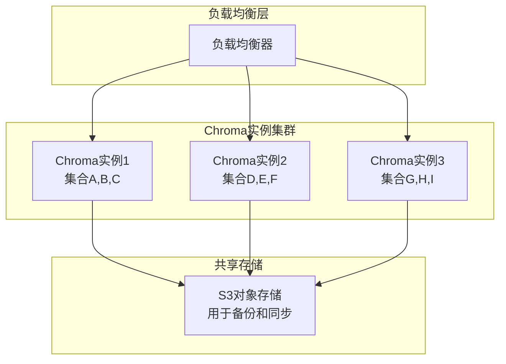

# LangChain与Chroma向量数据库集成详细指南

<cite>
**本文档中引用的文件**
- [libs/partners/chroma/langchain_chroma/__init__.py](file://libs/partners/chroma/langchain_chroma/__init__.py)
- [libs/partners/chroma/langchain_chroma/vectorstores.py](file://libs/partners/chroma/langchain_chroma/vectorstores.py)
- [libs/partners/chroma/README.md](file://libs/partners/chroma/README.md)
- [libs/partners/chroma/pyproject.toml](file://libs/partners/chroma/pyproject.toml)
- [libs/partners/chroma/tests/integration_tests/test_vectorstores.py](file://libs/partners/chroma/tests/integration_tests/test_vectorstores.py)
</cite>

## 目录
1. [简介](#简介)
2. [项目结构](#项目结构)
3. [Chroma架构设计](#chroma架构设计)
4. [核心组件分析](#核心组件分析)
5. [初始化与配置](#初始化与配置)
6. [向量操作详解](#向量操作详解)
7. [元数据过滤功能](#元数据过滤功能)
8. [集合管理策略](#集合管理策略)
9. [最佳实践](#最佳实践)
10. [生产环境限制](#生产环境限制)
11. [故障排除指南](#故障排除指南)
12. [总结](#总结)

## 简介

Chroma是LangChain生态系统中的重要向量数据库集成组件，作为轻量级、本地优先的向量存储解决方案，为LangChain应用提供了高效的向量检索能力。本文档深入阐述了Chroma的架构设计、核心优势以及与LangChain的深度集成方式。

Chroma的主要特点包括：
- **轻量级设计**：专注于向量存储和检索，避免了传统数据库的复杂性
- **本地优先**：支持本地部署，确保数据隐私和性能
- **易于集成**：与LangChain无缝对接，提供简洁的API接口
- **灵活配置**：支持多种部署模式和配置选项

## 项目结构



**图表来源**
- [libs/partners/chroma/langchain_chroma/__init__.py](file://libs/partners/chroma/langchain_chroma/__init__.py#L1-L8)
- [libs/partners/chroma/langchain_chroma/vectorstores.py](file://libs/partners/chroma/langchain_chroma/vectorstores.py#L1-L50)

**章节来源**
- [libs/partners/chroma/langchain_chroma/__init__.py](file://libs/partners/chroma/langchain_chroma/__init__.py#L1-L8)
- [libs/partners/chroma/README.md](file://libs/partners/chroma/README.md#L1-L23)

## Chroma架构设计

### 核心架构概览

Chroma采用分层架构设计，确保了模块化和可扩展性：



**图表来源**
- [libs/partners/chroma/langchain_chroma/vectorstores.py](file://libs/partners/chroma/langchain_chroma/vectorstores.py#L314-L400)

### 核心优势分析

1. **轻量级设计**：专注于向量存储，避免了传统数据库的复杂性
2. **本地优先**：支持本地部署，确保数据隐私和性能
3. **高性能检索**：优化的索引结构和相似度计算算法
4. **灵活部署**：支持多种部署模式和配置选项

**章节来源**
- [libs/partners/chroma/langchain_chroma/vectorstores.py](file://libs/partners/chroma/langchain_chroma/vectorstores.py#L147-L274)

## 核心组件分析

### Chroma类设计

Chroma类是整个集成的核心，继承自LangChain的VectorStore基类：



**图表来源**
- [libs/partners/chroma/langchain_chroma/vectorstores.py](file://libs/partners/chroma/langchain_chroma/vectorstores.py#L147-L400)

### 客户端类型支持

Chroma支持三种主要的客户端类型：



**图表来源**
- [libs/partners/chroma/langchain_chroma/vectorstores.py](file://libs/partners/chroma/langchain_chroma/vectorstores.py#L364-L400)

**章节来源**
- [libs/partners/chroma/langchain_chroma/vectorstores.py](file://libs/partners/chroma/langchain_chroma/vectorstores.py#L147-L400)

## 初始化与配置

### 基础初始化

Chroma支持多种初始化方式，适应不同的部署需求：

#### 本地持久化初始化

```python
# 基础本地持久化配置
vector_store = Chroma(
    collection_name="my_collection",
    embedding_function=embeddings,
    persist_directory="./chroma_db"
)
```

#### 远程服务器连接

```python
# 远程服务器连接配置
vector_store = Chroma(
    host="localhost",
    port=8000,
    collection_name="my_collection",
    embedding_function=embeddings
)
```

#### 云端服务配置

```python
# Chroma Cloud配置
vector_store = Chroma(
    chroma_cloud_api_key="your-api-key",
    tenant="your-tenant-id",
    database="your-database-name",
    collection_name="my_collection",
    embedding_function=embeddings
)
```

### 高级配置选项

| 参数名称 | 类型 | 描述 | 默认值 |
|---------|------|------|--------|
| collection_name | str | 集合名称 | "langchain" |
| embedding_function | Embeddings | 嵌入函数 | None |
| persist_directory | str | 持久化目录 | None |
| host | str | 服务器主机名 | None |
| port | int | 服务器端口 | 8000 |
| ssl | bool | 是否启用SSL | False |
| tenant | str | 租户标识 | "default_tenant" |
| database | str | 数据库名称 | "default_database" |
| create_collection_if_not_exists | bool | 自动创建集合 | True |

**章节来源**
- [libs/partners/chroma/langchain_chroma/vectorstores.py](file://libs/partners/chroma/langchain_chroma/vectorstores.py#L314-L400)

## 向量操作详解

### 文本添加操作

Chroma提供了多种文本添加方式，支持批量操作和元数据管理：

#### 单次添加

```python
# 添加单个文档
document = Document(page_content="这是一个测试文档", metadata={"source": "test"})
vector_store.add_documents([document])
```

#### 批量添加

```python
# 批量添加多个文档
documents = [
    Document(page_content="文档1", metadata={"category": "A"}),
    Document(page_content="文档2", metadata={"category": "B"}),
    Document(page_content="文档3", metadata={"category": "A"})
]
vector_store.add_documents(documents)
```

### 向量检索操作

#### 基础相似度搜索

```python
# 基础相似度搜索
results = vector_store.similarity_search(
    query="搜索关键词",
    k=5  # 返回前5个结果
)

# 结果包含文档内容和元数据
for doc in results:
    print(f"内容: {doc.page_content}")
    print(f"元数据: {doc.metadata}")
```

#### 带分数的相似度搜索

```python
# 包含相似度分数的搜索
results_with_scores = vector_store.similarity_search_with_score(
    query="搜索关键词",
    k=5
)

# 结果格式: [(Document, score), ...]
for doc, score in results_with_scores:
    print(f"相似度: {score:.4f}")
    print(f"内容: {doc.page_content}")
```

### 高级检索功能

#### 向量直接搜索

```python
# 使用预计算的向量进行搜索
embedding = embeddings.embed_query("查询文本")
results = vector_store.similarity_search_by_vector(
    embedding=embedding,
    k=3
)
```

#### 向量和分数搜索

```python
# 向量搜索并返回分数
results = vector_store.similarity_search_by_vector_with_relevance_scores(
    embedding=embedding,
    k=3
)
```

**章节来源**
- [libs/partners/chroma/langchain_chroma/vectorstores.py](file://libs/partners/chroma/langchain_chroma/vectorstores.py#L676-L800)

## 元数据过滤功能

### 基础元数据过滤

Chroma支持强大的元数据过滤功能，允许基于文档属性进行精确检索：

#### 简单条件过滤

```python
# 基于单个属性过滤
filtered_results = vector_store.similarity_search(
    query="搜索内容",
    k=5,
    filter={"category": "A"}
)

# 基于多个属性过滤（AND条件）
filtered_results = vector_store.similarity_search(
    query="搜索内容",
    k=5,
    filter={
        "category": "A",
        "source": "web"
    }
)
```

#### 复杂条件过滤

```python
# 使用文档内容过滤
where_document = {"$contains": "特定关键词"}

results = vector_store.similarity_search(
    query="搜索内容",
    k=5,
    where_document=where_document
)
```

### 过滤器语法

| 运算符 | 语法 | 示例 | 描述 |
|--------|------|------|------|
| 等于 | `{"key": "value"}` | `{"category": "news"}` | 键等于指定值 |
| 不等于 | `{"key": {"$ne": "value"}}` | `{"status": {"$ne": "draft"}}` | 键不等于指定值 |
| 包含 | `{"key": {"$contains": "text"}}` | `{"tags": {"$contains": "ai"}}` | 键包含指定文本 |
| 大于 | `{"key": {"$gt": value}}` | `{"date": {"$gt": "2024-01-01"}}` | 键大于指定值 |
| 小于 | `{"key": {"$lt": value}}` | `{"score": {"$lt": 0.8}}` | 键小于指定值 |
| 范围 | `{"key": {"$gte": min, "$lte": max}}` | `{"count": {"$gte": 10, "$lte": 100}}` | 键在指定范围内 |

**章节来源**
- [libs/partners/chroma/langchain_chroma/vectorstores.py](file://libs/partners/chroma/langchain_chroma/vectorstores.py#L676-L750)

## 集合管理策略

### 集合生命周期管理



### 集合操作方法

#### 创建新集合

```python
# 从头开始创建新集合
new_vector_store = Chroma.from_texts(
    texts=["文档内容"],
    embedding=embeddings,
    collection_name="new_collection"
)
```

#### 获取现有集合

```python
# 获取已存在的集合
existing_store = Chroma(
    collection_name="existing_collection",
    embedding_function=embeddings
)
```

#### 集合重置

```python
# 删除现有集合并重新创建
vector_store.reset_collection()
```

#### 集合删除

```python
# 完全删除集合
vector_store.delete_collection()
```

### 集合配置管理

#### 元数据配置

```python
# 设置集合元数据
collection_metadata = {
    "description": "新闻文章集合",
    "language": "zh-CN",
    "version": "1.0"
}

vector_store = Chroma(
    collection_name="news_collection",
    embedding_function=embeddings,
    collection_metadata=collection_metadata
)
```

#### 索引配置

```python
# 高级索引配置
collection_configuration = {
    "hnsw": {
        "space": "cosine",
        "ef_construction": 200,
        "m": 16
    }
}

vector_store = Chroma(
    collection_name="custom_collection",
    embedding_function=embeddings,
    collection_configuration=collection_configuration
)
```

**章节来源**
- [libs/partners/chroma/langchain_chroma/vectorstores.py](file://libs/partners/chroma/langchain_chroma/vectorstores.py#L1092-L1150)

## 最佳实践

### 单机部署最佳实践

#### 性能优化配置

```python
# 生产环境推荐配置
vector_store = Chroma(
    collection_name="production_collection",
    embedding_function=embeddings,
    persist_directory="/data/chroma_db",
    client_settings=chromadb.config.Settings(
        anonymized_telemetry=False,
        allow_reset=True
    ),
    collection_metadata={
        "hnsw:space": "cosine",
        "hnsw:construction_ef": 200,
        "hnsw:M": 16
    }
)
```

#### 批量操作优化

```python
# 大规模数据批量导入
def bulk_import_documents(vector_store, documents):
    batch_size = 1000
    for i in range(0, len(documents), batch_size):
        batch = documents[i:i + batch_size]
        vector_store.add_documents(batch)
        print(f"已导入 {min(i + batch_size, len(documents))}/{len(documents)} 条文档")
```

#### 内存管理

```python
# 内存友好的查询策略
def efficient_search(vector_store, query, max_results=100):
    # 分页查询避免内存溢出
    chunk_size = 20
    all_results = []
    
    while len(all_results) < max_results:
        remaining = max_results - len(all_results)
        current_chunk = min(chunk_size, remaining)
        
        chunk_results = vector_store.similarity_search(
            query=query,
            k=current_chunk
        )
        
        if not chunk_results:
            break
            
        all_results.extend(chunk_results)
    
    return all_results[:max_results]
```

### 轻量级部署策略

#### 最小化配置

```python
# 资源受限环境配置
vector_store = Chroma(
    collection_name="minimal_collection",
    embedding_function=embeddings,
    # 不使用持久化以节省磁盘空间
    # 或使用内存模式
)
```

#### 缓存策略

```python
# 查询结果缓存
from functools import lru_cache

@lru_cache(maxsize=1000)
def cached_similarity_search(query, k=5):
    return vector_store.similarity_search(query, k)

# 使用缓存查询
results = cached_similarity_search("常见问题")
```

### 开发环境配置

#### 快速原型开发

```python
# 开发环境快速配置
vector_store = Chroma(
    collection_name="dev_collection",
    embedding_function=embeddings,
    # 使用内存模式便于快速迭代
)
```

#### 测试环境配置

```python
# 测试环境配置
import tempfile

with tempfile.TemporaryDirectory() as temp_dir:
    test_store = Chroma(
        collection_name="test_collection",
        embedding_function=embeddings,
        persist_directory=temp_dir
    )
    
    # 执行测试
    test_store.add_documents(test_documents)
    
    # 清理测试数据
    test_store.delete_collection()
```

## 生产环境限制

### 规模限制

#### 单机部署限制

| 组件 | 限制 | 建议 |
|------|------|------|
| 文档数量 | ~10M条 | 超过此数量建议分布式部署 |
| 并发查询 | ~100 QPS | 需要负载均衡或水平扩展 |
| 内存使用 | 取决于向量维度和索引大小 | 建议预留2-4倍数据大小的内存 |
| 磁盘空间 | 数据大小的2-3倍 | SSD存储提升性能 |

#### 向量维度影响

```python
# 不同维度对性能的影响评估
dimension_configs = {
    "small": {"dim": 128, "recommended": "所有场景"},
    "medium": {"dim": 512, "recommended": "一般应用"},
    "large": {"dim": 1024, "recommended": "高精度要求"},
    "very_large": {"dim": 2048+, "recommended": "特殊需求"}
}

# 性能监控
def monitor_performance(vector_store):
    collection = vector_store._collection
    stats = collection.count()
    
    print(f"当前文档数量: {stats}")
    print(f"平均查询时间: {measure_query_time()}ms")
    print(f"内存使用率: {memory_usage_percentage()}%")
```

### 可扩展性考虑

#### 水平扩展方案



#### 数据分区策略

```python
# 基于时间的数据分区
def partition_documents_by_date(documents):
    partitions = {}
    
    for doc in documents:
        date = doc.metadata.get("created_at", "").split("T")[0]
        if date not in partitions:
            partitions[date] = []
        partitions[date].append(doc)
    
    return partitions

# 分别导入到不同集合
for date, docs in partition_documents_by_date(all_documents).items():
    vector_store = Chroma(
        collection_name=f"documents_{date}",
        embedding_function=embeddings
    )
    vector_store.add_documents(docs)
```

### 监控和维护

#### 关键指标监控

```python
# 性能监控脚本
def monitor_chroma_health(vector_store):
    collection = vector_store._collection
    
    metrics = {
        "document_count": collection.count(),
        "average_vector_length": calculate_average_vector_length(),
        "index_size_mb": get_index_size(),
        "query_latency_ms": measure_query_latency(),
        "memory_usage_mb": get_memory_usage()
    }
    
    return metrics

def alert_on_issues(metrics):
    alerts = []
    
    if metrics["query_latency_ms"] > 1000:
        alerts.append("查询延迟过高")
    
    if metrics["memory_usage_mb"] > 8000:
        alerts.append("内存使用率过高")
    
    if metrics["index_size_mb"] > 10000:
        alerts.append("索引过大，需要清理")
    
    return alerts
```

#### 定期维护任务

```python
# 定期维护脚本
def scheduled_maintenance(vector_store):
    # 1. 清理过期文档
    vector_store.delete(where={"expired": True})
    
    # 2. 重建索引（如果需要）
    if should_rebuild_index():
        vector_store.reset_collection()
        # 重新导入数据
    
    # 3. 压缩存储
    vector_store._client.persist()
    
    # 4. 清理临时文件
    cleanup_temp_files()
```

## 故障排除指南

### 常见问题诊断

#### 连接问题

```python
# 连接问题诊断
def diagnose_connection_issues(host, port):
    import socket
    
    try:
        # 检查网络连通性
        sock = socket.socket(socket.AF_INET, socket.SOCK_STREAM)
        sock.settimeout(5)
        result = sock.connect_ex((host, port))
        sock.close()
        
        if result == 0:
            print(f"端口 {port} 可访问")
        else:
            print(f"端口 {port} 不可访问")
            
    except Exception as e:
        print(f"连接检查失败: {e}")

# 使用示例
diagnose_connection_issues("localhost", 8000)
```

#### 性能问题排查

```python
# 性能问题诊断
def diagnose_performance_issues(vector_store):
    import time
    
    # 测试基础查询性能
    test_queries = ["测试查询1", "测试查询2", "测试查询3"]
    
    for query in test_queries:
        start_time = time.time()
        vector_store.similarity_search(query, k=5)
        elapsed = (time.time() - start_time) * 1000
        
        print(f"查询 '{query}' 耗时: {elapsed:.2f}ms")
        
        if elapsed > 1000:
            print(f"⚠️  查询 '{query}' 耗时过长")
```

#### 内存问题诊断

```python
# 内存使用情况检查
def check_memory_usage():
    import psutil
    import os
    
    process = psutil.Process(os.getpid())
    memory_info = process.memory_info()
    
    print(f"内存使用: {memory_info.rss / 1024 / 1024:.2f} MB")
    print(f"虚拟内存: {memory_info.vms / 1024 / 1024:.2f} MB")
    
    # 检查向量存储占用
    if hasattr(vector_store, '_collection'):
        index_size = get_index_size()
        print(f"向量索引大小: {index_size / 1024 / 1024:.2f} MB")
```

### 错误处理最佳实践

#### 异常捕获和恢复

```python
# 健壮的错误处理
def robust_vector_operation(vector_store, operation_func, *args, **kwargs):
    max_retries = 3
    retry_delay = 1
    
    for attempt in range(max_retries):
        try:
            return operation_func(*args, **kwargs)
            
        except chromadb.errors.TimeoutError as e:
            print(f"超时错误，重试 {attempt + 1}/{max_retries}: {e}")
            if attempt < max_retries - 1:
                time.sleep(retry_delay * (2 ** attempt))
                
        except chromadb.errors.UnauthorizedError as e:
            print(f"认证错误: {e}")
            # 尝试重新认证或使用备用客户端
            
        except Exception as e:
            print(f"未知错误: {e}")
            if attempt == max_retries - 1:
                raise
```

#### 数据完整性检查

```python
# 数据完整性验证
def verify_data_integrity(vector_store):
    try:
        # 检查集合是否存在
        collection = vector_store._collection
        total_docs = collection.count()
        
        # 验证向量维度一致性
        if total_docs > 0:
            sample = collection.get(limit=1)
            if sample['embeddings']:
                expected_dim = len(sample['embeddings'][0])
                print(f"预期向量维度: {expected_dim}")
        
        print(f"数据完整性检查通过，共 {total_docs} 条文档")
        return True
        
    except Exception as e:
        print(f"数据完整性检查失败: {e}")
        return False
```

**章节来源**
- [libs/partners/chroma/tests/integration_tests/test_vectorstores.py](file://libs/partners/chroma/tests/integration_tests/test_vectorstores.py#L1-L100)

## 总结

LangChain与Chroma的集成提供了强大而灵活的向量数据库解决方案。通过本文档的详细分析，我们可以看到：

### 核心优势总结

1. **架构简洁性**：Chroma专注于向量存储，避免了传统数据库的复杂性
2. **部署灵活性**：支持本地、远程和云端多种部署模式
3. **性能优化**：内置高效的索引结构和相似度计算算法
4. **易用性**：与LangChain无缝集成，提供简洁的API接口

### 应用场景建议

- **小型项目**：适合个人项目、原型开发和学习用途
- **企业内部**：适合对数据隐私要求高的企业内部应用
- **边缘计算**：适合资源受限的边缘设备部署

### 发展方向

随着LangChain生态系统的不断发展，Chroma将继续在以下方面演进：
- 更好的分布式支持
- 更强的实时更新能力
- 更丰富的元数据过滤功能
- 更优的性能表现

通过合理配置和最佳实践的应用，Chroma能够为各种规模的LangChain应用提供可靠的向量存储服务。