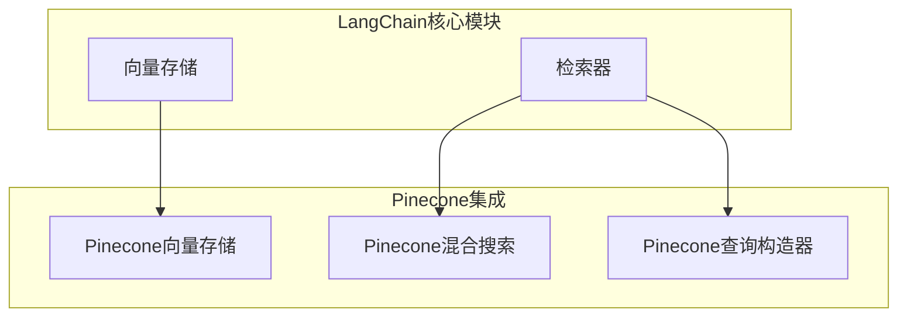
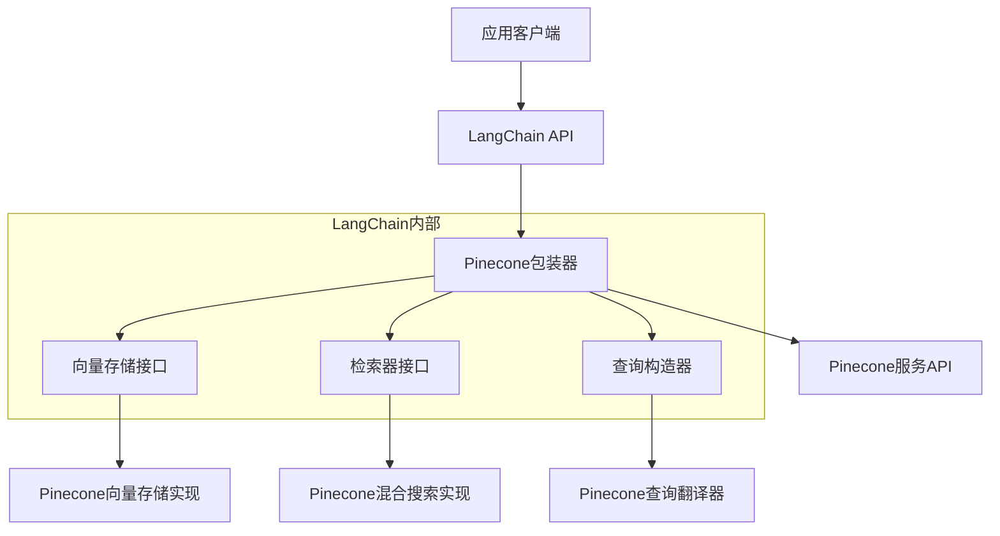
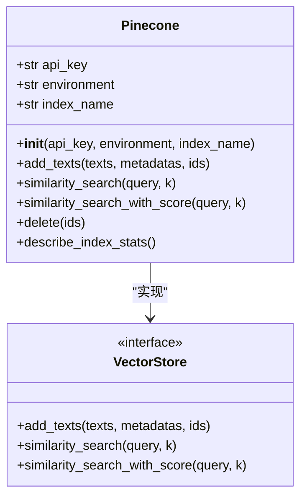
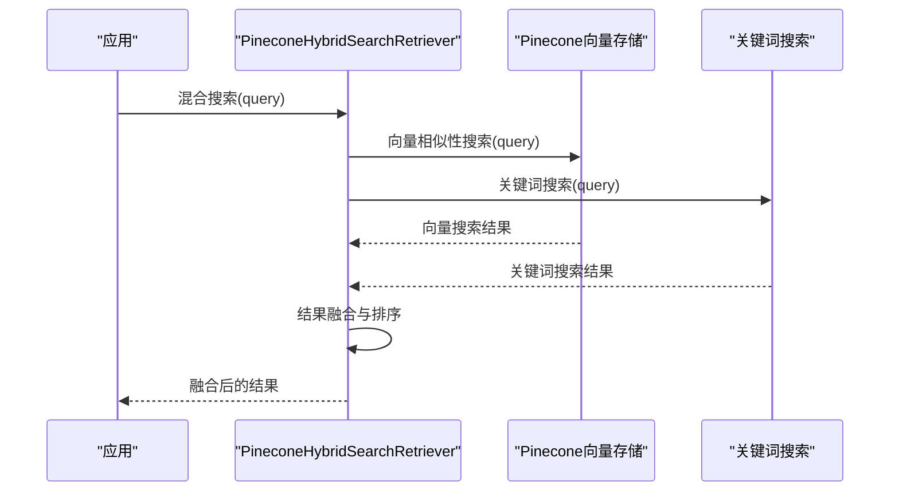
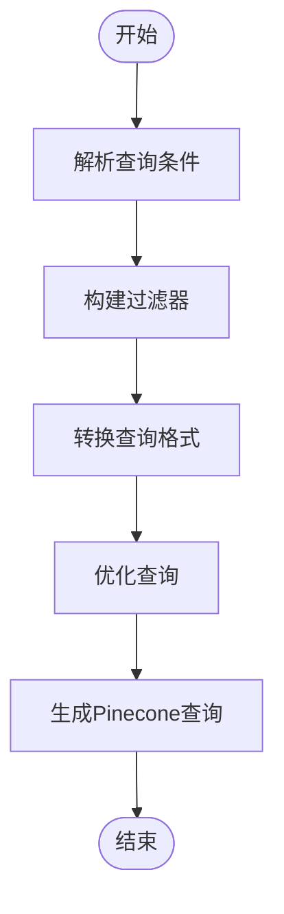
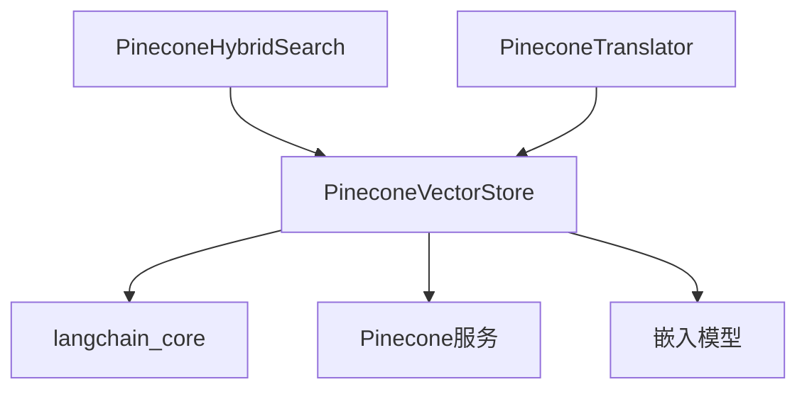

# Pinecone集成

<cite>
**本文档中引用的文件**  
- [pinecone.py](file://libs/langchain/langchain_classic/vectorstores/pinecone.py)
- [pinecone_hybrid_search.py](file://libs/langchain/langchain_classic/retrievers/pinecone_hybrid_search.py)
- [self_query/pinecone.py](file://libs/langchain/langchain_classic/retrievers/self_query/pinecone.py)
- [vectorstores/__init__.py](file://libs/langchain/langchain_classic/vectorstores/__init__.py)
</cite>

## 目录
1. [简介](#简介)
2. [项目结构](#项目结构)
3. [核心组件](#核心组件)
4. [架构概述](#架构概述)
5. [详细组件分析](#详细组件分析)
6. [依赖分析](#依赖分析)
7. [性能考虑](#性能考虑)
8. [故障排除指南](#故障排除指南)
9. [结论](#结论)

## 简介
本文档全面介绍了LangChain与Pinecone向量数据库的集成。Pinecone作为一个全托管、高性能的向量数据库服务，提供了自动扩展、低延迟查询和强大的元数据过滤能力。文档详细说明了如何配置API密钥和环境，使用LangChain的Pinecone类连接到远程实例，管理索引（创建、删除、描述），以及执行向量的上载和相似性搜索。此外，还涵盖了性能调优建议、成本控制策略以及在高并发生产环境中的部署考量。

## 项目结构
LangChain项目中的Pinecone集成主要分布在`vectorstores`和`retrievers`模块中。`vectorstores`模块负责向量存储的基本操作，而`retrievers`模块则提供了更高级的检索功能。

**Diagram sources**
- [pinecone.py](file://libs/langchain/langchain_classic/vectorstores/pinecone.py)
- [pinecone_hybrid_search.py](file://libs/langchain/langchain_classic/retrievers/pinecone_hybrid_search.py)
- [self_query/pinecone.py](file://libs/langchain/langchain_classic/retrievers/self_query/pinecone.py)

**Section sources**
- [vectorstores/__init__.py](file://libs/langchain/langchain_classic/vectorstores/__init__.py#L50-L248)

## 核心组件
Pinecone集成的核心组件包括Pinecone向量存储、混合搜索检索器和查询构造器。这些组件共同提供了完整的向量数据库功能。

**Section sources**
- [pinecone.py](file://libs/langchain/langchain_classic/vectorstores/pinecone.py)
- [pinecone_hybrid_search.py](file://libs/langchain/langchain_classic/retrievers/pinecone_hybrid_search.py)

## 架构概述
Pinecone集成的架构设计遵循了LangChain的模块化原则，通过清晰的接口分离了不同的功能层次。

**Diagram sources**
- [pinecone.py](file://libs/langchain/langchain_classic/vectorstores/pinecone.py)
- [pinecone_hybrid_search.py](file://libs/langchain/langchain_classic/retrievers/pinecone_hybrid_search.py)
- [self_query/pinecone.py](file://libs/langchain/langchain_classic/retrievers/self_query/pinecone.py)

## 详细组件分析
### Pinecone向量存储分析
Pinecone向量存储组件提供了基本的向量操作功能，包括向量的添加、删除和相似性搜索。

#### 类图

**Diagram sources**
- [pinecone.py](file://libs/langchain/langchain_classic/vectorstores/pinecone.py)

**Section sources**
- [pinecone.py](file://libs/langchain/langchain_classic/vectorstores/pinecone.py)

### Pinecone混合搜索分析
Pinecone混合搜索组件结合了向量搜索和关键词搜索的优势，提供了更精确的检索结果。

#### 序列图

**Diagram sources**
- [pinecone_hybrid_search.py](file://libs/langchain/langchain_classic/retrievers/pinecone_hybrid_search.py)

**Section sources**
- [pinecone_hybrid_search.py](file://libs/langchain/langchain_classic/retrievers/pinecone_hybrid_search.py)

### Pinecone查询构造器分析
Pinecone查询构造器负责将高级查询条件转换为Pinecone服务可以理解的底层查询格式。

#### 流程图

**Diagram sources**
- [self_query/pinecone.py](file://libs/langchain/langchain_classic/retrievers/self_query/pinecone.py)

**Section sources**
- [self_query/pinecone.py](file://libs/langchain/langchain_classic/retrievers/self_query/pinecone.py)

## 依赖分析
Pinecone集成依赖于LangChain的核心模块和Pinecone的服务API。

**Diagram sources**
- [pinecone.py](file://libs/langchain/langchain_classic/vectorstores/pinecone.py)
- [pinecone_hybrid_search.py](file://libs/langchain/langchain_classic/retrievers/pinecone_hybrid_search.py)
- [self_query/pinecone.py](file://libs/langchain/langchain_classic/retrievers/self_query/pinecone.py)

**Section sources**
- [vectorstores/__init__.py](file://libs/langchain/langchain_classic/vectorstores/__init__.py)

## 性能考虑
在使用Pinecone集成时，需要考虑以下几个性能方面：
- 向量维度的选择会影响搜索性能和存储成本
- 批量操作比单个操作更高效
- 合理设置相似性搜索的k值可以平衡性能和准确性
- 元数据过滤可以显著减少搜索空间

## 故障排除指南
### 常见问题
- API密钥无效：检查环境变量或配置文件中的密钥是否正确
- 索引不存在：确保索引已正确创建
- 搜索结果不准确：检查嵌入模型和查询是否匹配

**Section sources**
- [pinecone.py](file://libs/langchain/langchain_classic/vectorstores/pinecone.py)
- [pinecone_hybrid_search.py](file://libs/langchain/langchain_classic/retrievers/pinecone_hybrid_search.py)

## 结论
Pinecone与LangChain的集成提供了一个强大而灵活的向量数据库解决方案。通过本文档的介绍，开发者可以快速掌握Pinecone的基本使用方法，并在实际项目中应用这些功能。未来的工作可以进一步优化查询性能，扩展更多的高级功能。