# Vectorstores

<cite>
**本文档中引用的文件**
- [libs/core/langchain_core/vectorstores/__init__.py](file://libs/core/langchain_core/vectorstores/__init__.py)
- [libs/core/langchain_core/vectorstores/base.py](file://libs/core/langchain_core/vectorstores/base.py)
- [libs/core/langchain_core/vectorstores/in_memory.py](file://libs/core/langchain_core/vectorstores/in_memory.py)
- [libs/core/langchain_core/vectorstores/utils.py](file://libs/core/langchain_core/vectorstores/utils.py)
- [libs/partners/chroma/langchain_chroma/vectorstores.py](file://libs/partners/chroma/langchain_chroma/vectorstores.py)
- [libs/partners/qdrant/langchain_qdrant/vectorstores.py](file://libs/partners/qdrant/langchain_qdrant/vectorstores.py)
- [libs/core/tests/unit_tests/vectorstores/test_vectorstore.py](file://libs/core/tests/unit_tests/vectorstores/test_vectorstore.py)
- [libs/core/tests/unit_tests/vectorstores/test_in_memory.py](file://libs/core/tests/unit_tests/vectorstores/test_in_memory.py)
</cite>

## 目录
1. [简介](#简介)
2. [项目结构](#项目结构)
3. [核心组件](#核心组件)
4. [架构概览](#架构概览)
5. [详细组件分析](#详细组件分析)
6. [向量数据库集成](#向量数据库集成)
7. [性能优化与部署](#性能优化与部署)
8. [安全与生产环境](#安全与生产环境)
9. [故障排除指南](#故障排除指南)
10. [结论](#结论)

## 简介

LangChain Vectorstores是一个强大的向量存储系统，专门设计用于存储和检索由Embeddings生成的向量，支持高效的相似度搜索。该系统提供了统一的接口来处理各种向量数据库，包括Chroma、Pinecone、Weaviate和Qdrant等主流解决方案。

Vectorstores的核心功能包括：
- 向量的添加、删除、搜索和元数据过滤
- 支持多种搜索策略（相似度搜索、最大边际相关性搜索）
- 与各种向量数据库的无缝集成
- 异步操作支持
- 数据持久化和集群部署能力

## 项目结构

LangChain Vectorstores采用模块化架构，主要分为以下几个部分：

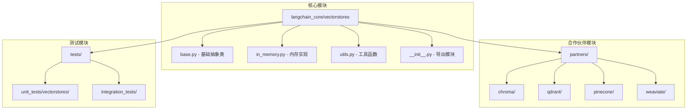

**图表来源**
- [libs/core/langchain_core/vectorstores/__init__.py](file://libs/core/langchain_core/vectorstores/__init__.py#L1-L35)
- [libs/partners/chroma/langchain_chroma/vectorstores.py](file://libs/partners/chroma/langchain_chroma/vectorstores.py#L1-L50)

**章节来源**
- [libs/core/langchain_core/vectorstores/__init__.py](file://libs/core/langchain_core/vectorstores/__init__.py#L1-L35)
- [libs/core/langchain_core/vectorstores/base.py](file://libs/core/langchain_core/vectorstores/base.py#L1-L50)

## 核心组件

### VectorStore抽象基类

VectorStore是所有向量存储实现的基础抽象类，定义了统一的接口规范：

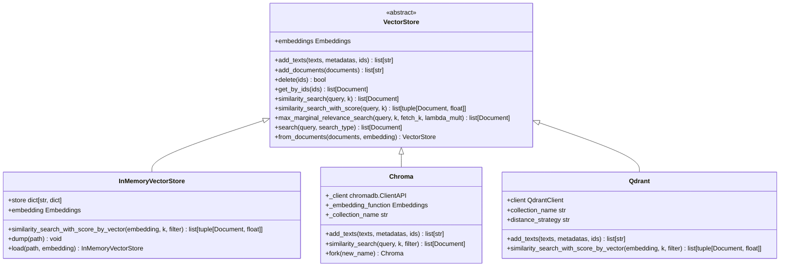

**图表来源**
- [libs/core/langchain_core/vectorstores/base.py](file://libs/core/langchain_core/vectorstores/base.py#L43-L100)
- [libs/core/langchain_core/vectorstores/in_memory.py](file://libs/core/langchain_core/vectorstores/in_memory.py#L34-L80)
- [libs/partners/chroma/langchain_chroma/vectorstores.py](file://libs/partners/chroma/langchain_chroma/vectorstores.py#L150-L200)

### 核心功能特性

VectorStore提供了以下核心功能：

1. **文本和文档管理**
   - `add_texts()`: 添加纯文本到向量存储
   - `add_documents()`: 添加带元数据的文档
   - `delete()`: 删除指定ID的文档
   - `get_by_ids()`: 按ID获取文档

2. **相似度搜索**
   - `similarity_search()`: 基于查询文本的相似度搜索
   - `similarity_search_with_score()`: 带分数的相似度搜索
   - `similarity_search_by_vector()`: 基于预计算向量的搜索

3. **高级搜索算法**
   - `max_marginal_relevance_search()`: 最大边际相关性搜索
   - 支持自定义过滤器和搜索参数

**章节来源**
- [libs/core/langchain_core/vectorstores/base.py](file://libs/core/langchain_core/vectorstores/base.py#L43-L400)

## 架构概览

LangChain Vectorstores采用分层架构设计，确保了良好的可扩展性和维护性：

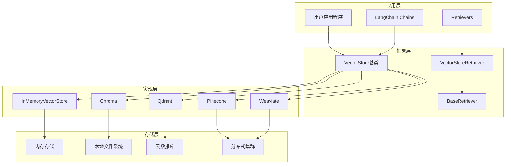

**图表来源**
- [libs/core/langchain_core/vectorstores/base.py](file://libs/core/langchain_core/vectorstores/base.py#L43-L100)
- [libs/core/langchain_core/vectorstores/__init__.py](file://libs/core/langchain_core/vectorstores/__init__.py#L15-L30)

## 详细组件分析

### 内存向量存储 (InMemoryVectorStore)

InMemoryVectorStore是最基础的向量存储实现，适用于开发和测试场景：

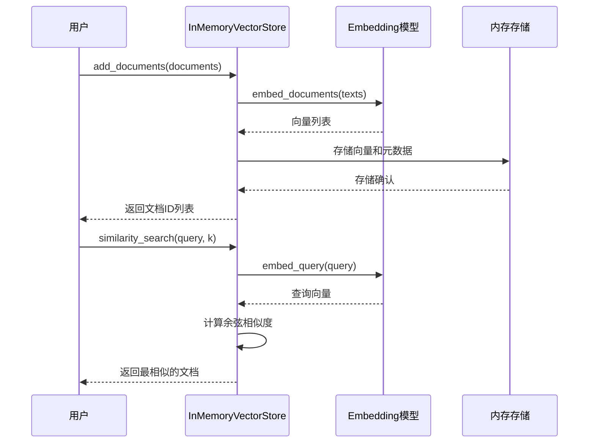

**图表来源**
- [libs/core/langchain_core/vectorstores/in_memory.py](file://libs/core/langchain_core/vectorstores/in_memory.py#L150-L200)

#### 主要特性

1. **高性能**: 完全基于内存的操作，无I/O延迟
2. **简单易用**: 无需外部依赖，开箱即用
3. **异步支持**: 提供完整的异步操作接口
4. **数据持久化**: 支持序列化和反序列化

**章节来源**
- [libs/core/langchain_core/vectorstores/in_memory.py](file://libs/core/langchain_core/vectorstores/in_memory.py#L34-L150)

### Chroma集成

Chroma是一个专门为AI应用设计的向量数据库，提供了丰富的功能和灵活的配置选项：

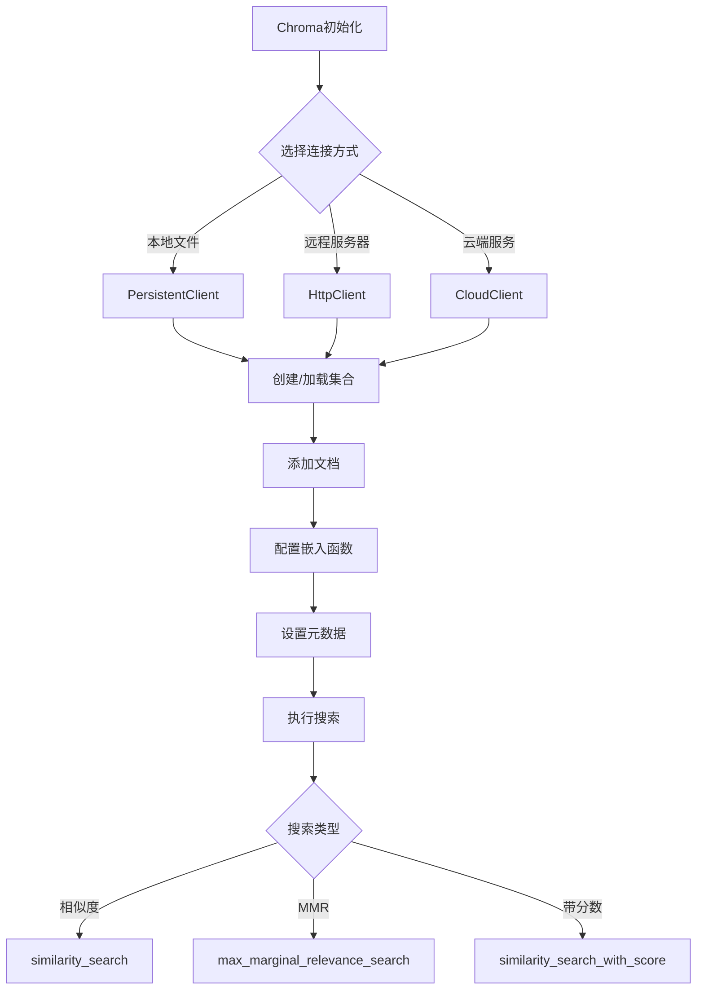

**图表来源**
- [libs/partners/chroma/langchain_chroma/vectorstores.py](file://libs/partners/chroma/langchain_chroma/vectorstores.py#L300-L400)

#### 配置选项

Chroma支持多种配置选项以满足不同的部署需求：

| 配置项 | 描述 | 默认值 |
|--------|------|--------|
| collection_name | 集合名称 | "langchain" |
| persist_directory | 持久化目录 | None |
| host | 远程服务器主机名 | None |
| port | 连接端口 | 8000 |
| ssl | 是否使用SSL连接 | False |
| tenant | 租户ID | "default_tenant" |
| database | 数据库名称 | "default_database" |

**章节来源**
- [libs/partners/chroma/langchain_chroma/vectorstores.py](file://libs/partners/chroma/langchain_chroma/vectorstores.py#L300-L500)

### Qdrant集成

Qdrant是一个高性能的向量搜索引擎，专为大规模AI应用设计：

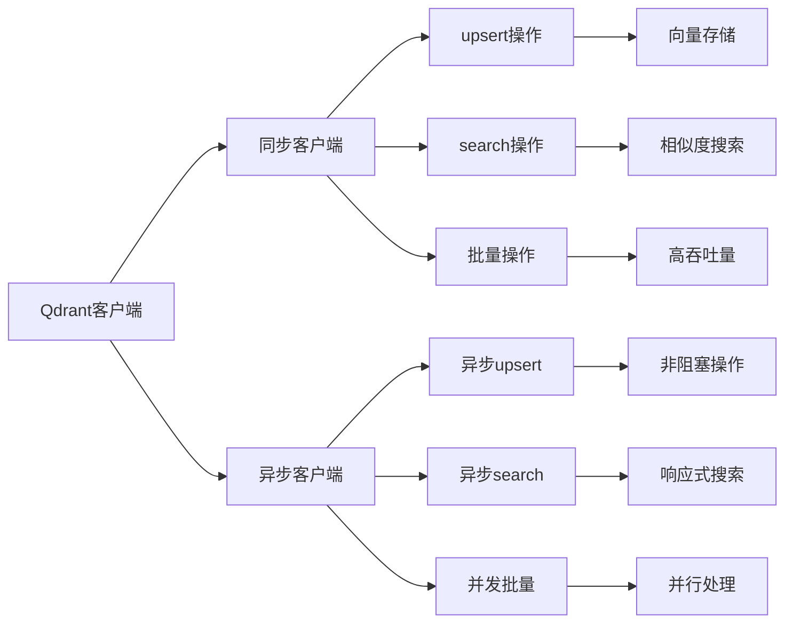

**图表来源**
- [libs/partners/qdrant/langchain_qdrant/vectorstores.py](file://libs/partners/qdrant/langchain_qdrant/vectorstores.py#L150-L250)

#### 性能特性

1. **高吞吐量**: 支持批量操作和并发处理
2. **低延迟**: 优化的索引结构和搜索算法
3. **可扩展性**: 支持水平扩展和分片
4. **可靠性**: 提供多种一致性级别

**章节来源**
- [libs/partners/qdrant/langchain_qdrant/vectorstores.py](file://libs/partners/qdrant/langchain_qdrant/vectorstores.py#L150-L300)

## 向量数据库集成

### 支持的向量数据库

LangChain支持多种主流向量数据库，每种都有其独特的优势：

| 数据库 | 类型 | 优势 | 适用场景 |
|--------|------|------|----------|
| Chroma | 本地/云端 | 易用性强，Python原生 | 开发测试，小规模应用 |
| Qdrant | 分布式 | 高性能，可扩展 | 大规模生产环境 |
| Pinecone | 云端托管 | 完全托管，易于管理 | 快速部署，企业级 |
| Weaviate | GraphQL | 结构化查询，语义搜索 | 复杂查询需求 |
| FAISS | 本地 | 高性能，内存优化 | 离线处理，快速原型 |

### 集成模式

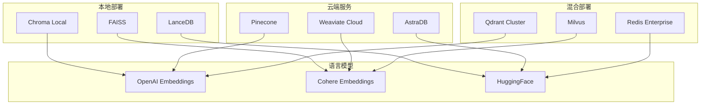

**章节来源**
- [libs/langchain/langchain_classic/vectorstores/__init__.py](file://libs/langchain/langchain_classic/vectorstores/__init__.py#L174-L247)

## 性能优化与部署

### 性能调优策略

#### 1. 向量维度优化

不同向量维度对性能的影响：

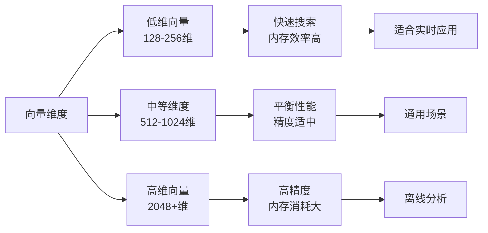

#### 2. 索引策略

| 索引类型 | 搜索速度 | 内存占用 | 适用场景 |
|----------|----------|----------|----------|
| HNSW | 快速 | 中等 | 实时搜索 |
| IVF | 中等 | 低 | 大规模数据 |
| LSH | 很快 | 很低 | 近似搜索 |
| Flat | 最慢 | 最低 | 小数据集 |

### 部署架构

#### 单机部署

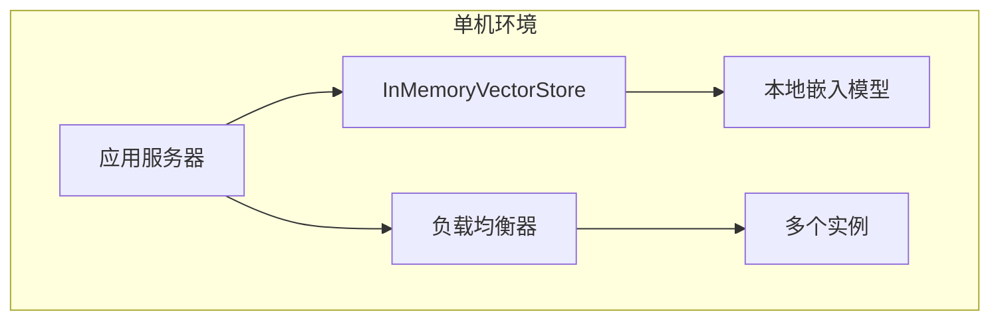

#### 分布式部署

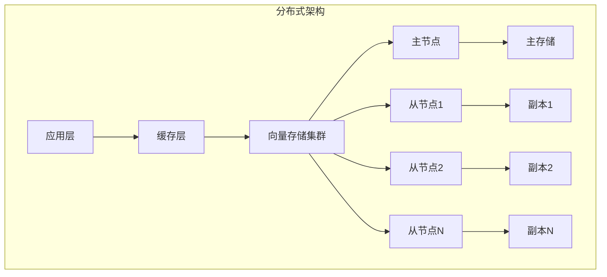

### 成本效益分析

#### 成本对比

| 部署方案 | 初始成本 | 运营成本 | 可扩展性 | 维护复杂度 |
|----------|----------|----------|----------|------------|
| InMemory | 低 | 极低 | 有限 | 低 |
| Chroma Local | 低 | 低 | 中等 | 中等 |
| Chroma Cloud | 中等 | 中等 | 高 | 低 |
| 专用向量DB | 高 | 高 | 极高 | 高 |

## 安全与生产环境

### 数据安全

#### 1. 访问控制

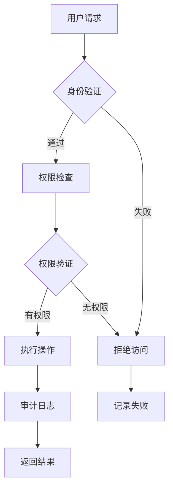

#### 2. 数据加密

| 加密层级 | 描述 | 实现方式 |
|----------|------|----------|
| 传输加密 | HTTPS/TLS | 自动启用 |
| 存储加密 | 数据库加密 | 配置选项 |
| 内存加密 | 运行时保护 | 系统级配置 |
| 备份加密 | 备份文件加密 | 备份策略 |

### 备份与恢复

#### 备份策略

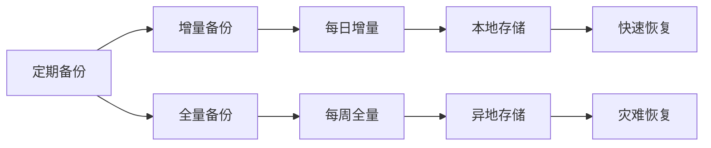

#### 恢复流程

1. **数据完整性检查**: 验证备份文件的完整性
2. **版本兼容性**: 确保备份与当前版本兼容
3. **逐步恢复**: 优先恢复关键数据
4. **验证测试**: 恢复后进行功能验证

### 监控与告警

#### 关键指标监控

| 指标类别 | 监控项目 | 告警阈值 |
|----------|----------|----------|
| 性能指标 | 搜索延迟 | >100ms |
| 资源使用 | CPU使用率 | >80% |
| 资源使用 | 内存使用率 | >85% |
| 可用性 | 连接成功率 | <99% |
| 错误率 | 搜索失败率 | >5% |

## 故障排除指南

### 常见问题及解决方案

#### 1. 性能问题

**症状**: 搜索响应时间过长

**排查步骤**:
1. 检查向量维度是否过高
2. 验证索引配置是否合理
3. 监控系统资源使用情况
4. 分析查询模式和数据分布

**解决方案**:
- 优化向量维度
- 调整索引参数
- 增加硬件资源
- 实施数据分片

#### 2. 内存溢出

**症状**: 应用程序崩溃或内存不足

**排查步骤**:
1. 检查向量存储大小
2. 监控内存使用趋势
3. 分析数据增长模式
4. 检查内存泄漏

**解决方案**:
- 实施数据压缩
- 使用流式处理
- 增加内存容量
- 优化数据结构

#### 3. 连接问题

**症状**: 无法连接到向量数据库

**排查步骤**:
1. 验证网络连接
2. 检查认证凭据
3. 确认端口开放
4. 查看防火墙设置

**解决方案**:
- 配置正确的网络设置
- 更新认证信息
- 开放必要端口
- 调整防火墙规则

### 调试工具

#### 1. 日志分析

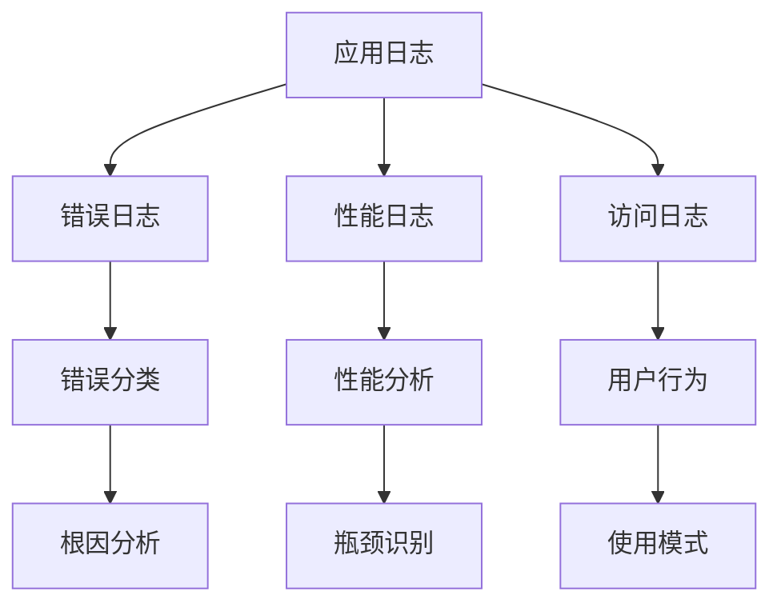

#### 2. 性能分析

| 工具 | 用途 | 使用场景 |
|------|------|----------|
| Profiler | 函数级性能分析 | 代码优化 |
| Monitor | 系统级监控 | 资源管理 |
| Tracer | 分布式追踪 | 复杂查询调试 |
| Debugger | 交互式调试 | 问题定位 |

**章节来源**
- [libs/core/tests/unit_tests/vectorstores/test_vectorstore.py](file://libs/core/tests/unit_tests/vectorstores/test_vectorstore.py#L1-L50)
- [libs/core/tests/unit_tests/vectorstores/test_in_memory.py](file://libs/core/tests/unit_tests/vectorstores/test_in_memory.py#L1-L50)

## 结论

LangChain Vectorstores提供了一个强大而灵活的向量存储解决方案，支持从简单的内存存储到复杂的分布式向量数据库的各种部署场景。其模块化的设计使得集成新的向量数据库变得简单，而统一的接口保证了应用的一致性。

### 主要优势

1. **统一接口**: 所有向量数据库都遵循相同的接口规范
2. **灵活性**: 支持多种部署模式和配置选项
3. **可扩展性**: 从单机到大规模集群的无缝扩展
4. **性能优化**: 内置多种性能优化策略
5. **生产就绪**: 完善的安全和监控机制

### 最佳实践建议

1. **根据需求选择合适的向量数据库**
2. **实施适当的监控和告警机制**
3. **制定完善的数据备份和恢复策略**
4. **定期进行性能调优和容量规划**
5. **建立完善的运维流程和故障处理机制**

通过合理的设计和部署，LangChain Vectorstores能够为AI应用提供高效、可靠、可扩展的向量存储服务，支撑复杂的语义搜索和推荐应用场景。