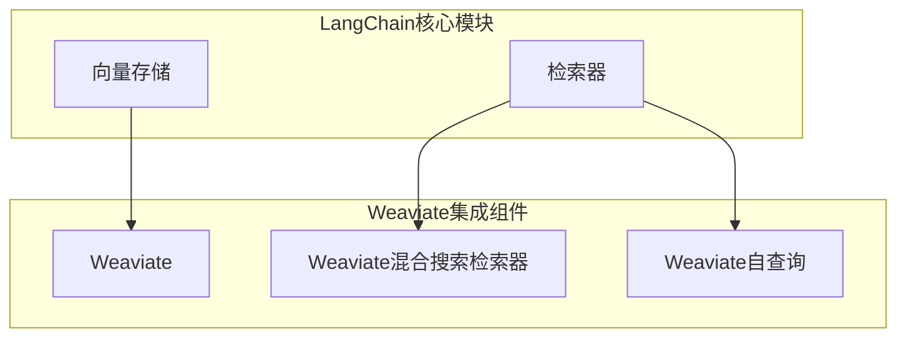
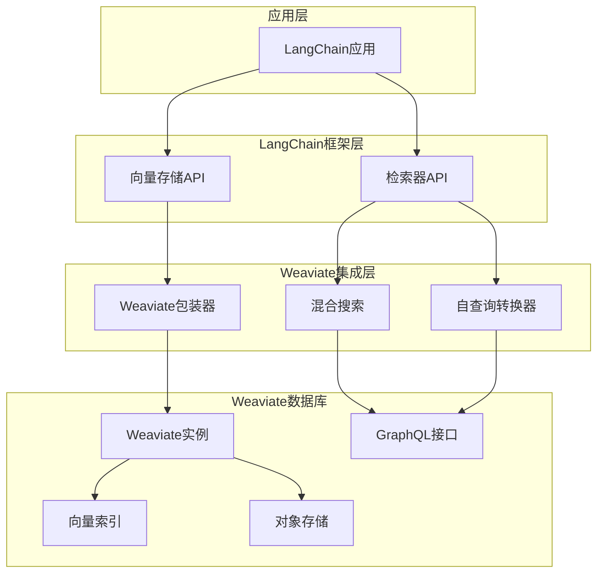
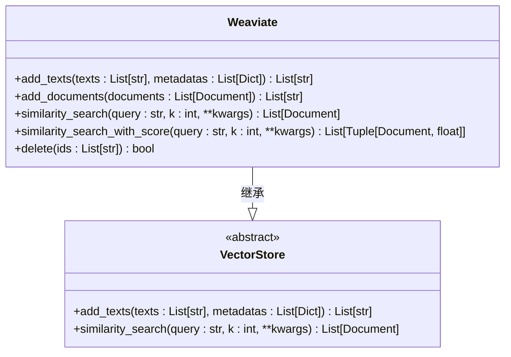
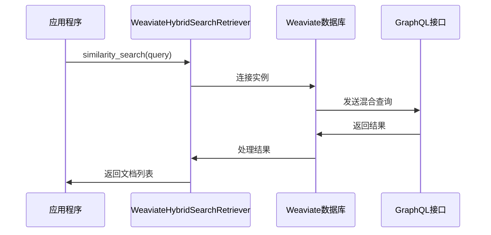
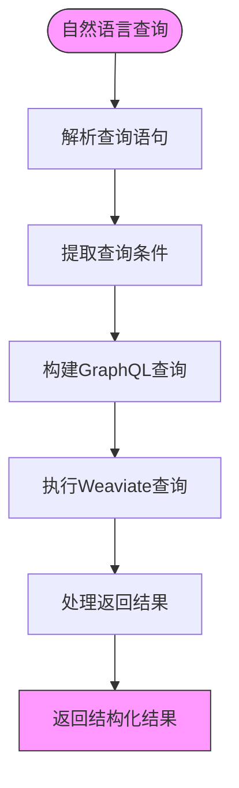
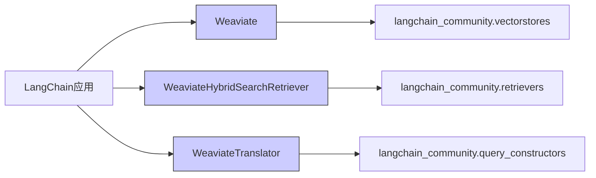

# Weaviate集成

<cite>
**本文档中引用的文件**  
- [weaviate.py](file://libs/langchain/langchain_classic/vectorstores/weaviate.py)
- [weaviate_hybrid_search.py](file://libs/langchain/langchain_classic/retrievers/weaviate_hybrid_search.py)
- [weaviate.py](file://libs/langchain/langchain_classic/retrievers/self_query/weaviate.py)
- [base.py](file://libs/langchain/langchain_classic/retrievers/self_query/base.py)
- [__init__.py](file://libs/langchain/langchain_classic/vectorstores/__init__.py)
</cite>

## 目录
1. [简介](#简介)
2. [项目结构](#项目结构)
3. [核心组件](#核心组件)
4. [架构概述](#架构概述)
5. [详细组件分析](#详细组件分析)
6. [依赖分析](#依赖分析)
7. [性能考虑](#性能考虑)
8. [故障排除指南](#故障排除指南)
9. [结论](#结论)

## 简介
本文档深入探讨LangChain与Weaviate向量数据库的集成。Weaviate作为一个模块化、开源的知识图谱型向量数据库，具备将向量搜索与结构化查询相结合的独特能力。文档详细说明了如何通过LangChain的Weaviate类连接到本地或云端的Weaviate实例，定义数据模式（schema），执行向量的导入、检索和删除操作。同时，文档还展示了如何利用Weaviate的GraphQL接口进行复杂的混合搜索，将语义相似性与精确的属性过滤相结合，并涵盖其模块化架构、可扩展性设计、数据一致性保证以及在构建复杂知识库应用中的最佳实践。

## 项目结构
LangChain项目中与Weaviate集成相关的组件主要分布在`vectorstores`和`retrievers`模块中。这些模块提供了与Weaviate数据库交互的核心功能，包括向量存储、混合搜索和自查询检索器。

**图示来源**
- [weaviate.py](file://libs/langchain/langchain_classic/vectorstores/weaviate.py)
- [weaviate_hybrid_search.py](file://libs/langchain/langchain_classic/retrievers/weaviate_hybrid_search.py)
- [weaviate.py](file://libs/langchain/langchain_classic/retrievers/self_query/weaviate.py)

**章节来源**
- [weaviate.py](file://libs/langchain/langchain_classic/vectorstores/weaviate.py)
- [weaviate_hybrid_search.py](file://libs/langchain/langchain_classic/retrievers/weaviate_hybrid_search.py)

## 核心组件
LangChain中与Weaviate集成的核心组件包括：
- **Weaviate向量存储**：提供与Weaviate数据库的基本连接和操作功能
- **Weaviate混合搜索检索器**：支持结合向量相似性和关键词搜索的混合检索
- **Weaviate自查询检索器**：允许使用自然语言查询自动生成结构化数据库查询

这些组件共同构成了LangChain与Weaviate集成的基础，使开发者能够充分利用Weaviate的知识图谱和向量搜索能力。

**章节来源**
- [weaviate.py](file://libs/langchain/langchain_classic/vectorstores/weaviate.py)
- [weaviate_hybrid_search.py](file://libs/langchain/langchain_classic/retrievers/weaviate_hybrid_search.py)
- [weaviate.py](file://libs/langchain/langchain_classic/retrievers/self_query/weaviate.py)

## 架构概述
LangChain与Weaviate的集成架构采用分层设计，通过抽象层与具体的Weaviate实现分离。这种设计允许LangChain在保持统一API的同时，利用Weaviate特有的功能。

**图示来源**
- [weaviate.py](file://libs/langchain/langchain_classic/vectorstores/weaviate.py)
- [weaviate_hybrid_search.py](file://libs/langchain/langchain_classic/retrievers/weaviate_hybrid_search.py)
- [base.py](file://libs/langchain/langchain_classic/retrievers/self_query/base.py)

## 详细组件分析

### Weaviate向量存储分析
Weaviate向量存储组件提供了与Weaviate数据库的基本交互功能，包括文档的添加、检索和删除操作。该组件通过动态导入机制与`langchain_community.vectorstores`中的实际实现连接。

**图示来源**
- [weaviate.py](file://libs/langchain/langchain_classic/vectorstores/weaviate.py)

**章节来源**
- [weaviate.py](file://libs/langchain/langchain_classic/vectorstores/weaviate.py)

### Weaviate混合搜索分析
Weaviate混合搜索检索器组件支持结合向量相似性和关键词搜索的混合检索功能。这种混合搜索能够同时利用语义相似性和精确的文本匹配，提供更准确的搜索结果。

**图示来源**
- [weaviate_hybrid_search.py](file://libs/langchain/langchain_classic/retrievers/weaviate_hybrid_search.py)

**章节来源**
- [weaviate_hybrid_search.py](file://libs/langchain/langchain_classic/retrievers/weaviate_hybrid_search.py)

### Weaviate自查询分析
Weaviate自查询组件允许使用自然语言查询自动生成针对Weaviate的结构化查询。该组件通过查询构造器将自然语言转换为Weaviate的GraphQL查询。

**图示来源**
- [weaviate.py](file://libs/langchain/langchain_classic/retrievers/self_query/weaviate.py)
- [base.py](file://libs/langchain/langchain_classic/retrievers/self_query/base.py)

**章节来源**
- [weaviate.py](file://libs/langchain/langchain_classic/retrievers/self_query/weaviate.py)
- [base.py](file://libs/langchain/langchain_classic/retrievers/self_query/base.py)

## 依赖分析
Weaviate集成组件的依赖关系体现了LangChain的模块化设计原则。核心功能实现在`langchain_community`包中，而`langchain`主包通过动态导入提供向后兼容的接口。

**图示来源**
- [weaviate.py](file://libs/langchain/langchain_classic/vectorstores/weaviate.py)
- [weaviate_hybrid_search.py](file://libs/langchain/langchain_classic/retrievers/weaviate_hybrid_search.py)
- [weaviate.py](file://libs/langchain/langchain_classic/retrievers/self_query/weaviate.py)

**章节来源**
- [weaviate.py](file://libs/langchain/langchain_classic/vectorstores/weaviate.py)
- [weaviate_hybrid_search.py](file://libs/langchain/langchain_classic/retrievers/weaviate_hybrid_search.py)
- [weaviate.py](file://libs/langchain/langchain_classic/retrievers/self_query/weaviate.py)

## 性能考虑
在使用LangChain与Weaviate集成时，需要考虑以下性能因素：
- 向量嵌入的计算成本
- 混合搜索的查询复杂度
- 大规模数据导入的批处理优化
- 缓存策略以减少重复查询
- 连接池管理以提高并发性能

通过合理配置这些参数，可以显著提升系统的响应速度和吞吐量。

## 故障排除指南
在使用Weaviate集成时可能遇到的常见问题及解决方案：

1. **连接问题**：确保Weaviate实例正在运行且网络可达
2. **认证失败**：检查API密钥和认证配置
3. **模式错误**：验证数据模式与Weaviate类定义的一致性
4. **性能瓶颈**：监控查询响应时间并优化索引配置
5. **依赖冲突**：确保langchain和langchain-community版本兼容

**章节来源**
- [weaviate.py](file://libs/langchain/langchain_classic/vectorstores/weaviate.py)
- [weaviate_hybrid_search.py](file://libs/langchain/langchain_classic/retrievers/weaviate_hybrid_search.py)

## 结论
LangChain与Weaviate的集成提供了一套强大的工具，用于构建基于知识图谱的智能应用。通过结合向量搜索和结构化查询的能力，开发者可以创建更精确、更智能的检索系统。Weaviate的模块化架构和可扩展性设计使其成为构建复杂知识库应用的理想选择。随着AI应用的不断发展，这种集成将在语义搜索、推荐系统和智能问答等领域发挥越来越重要的作用。