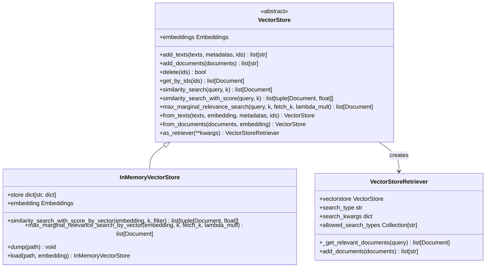
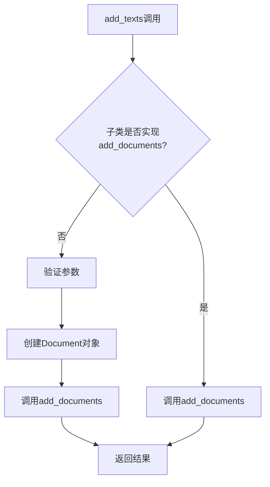
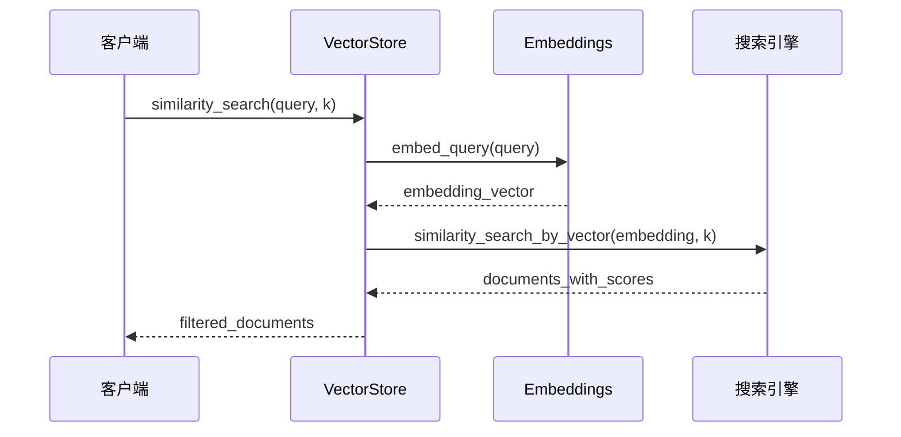
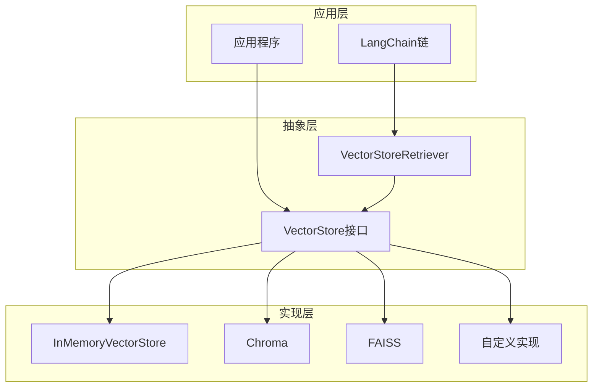
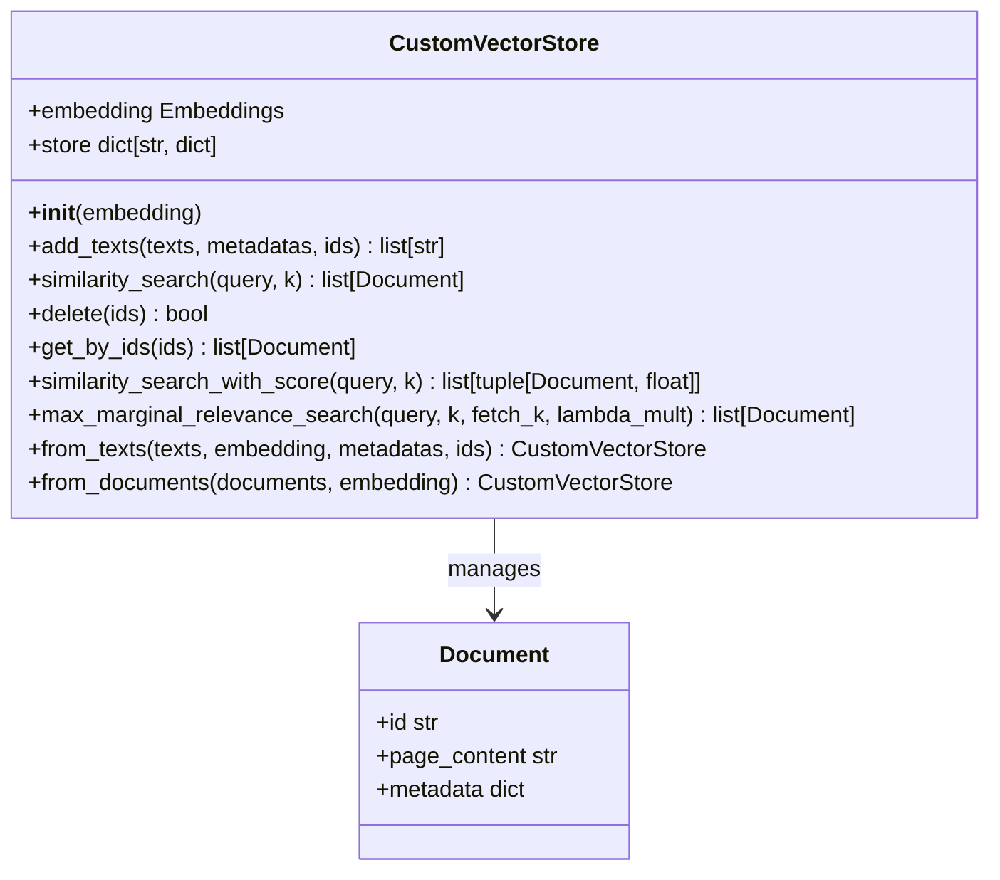
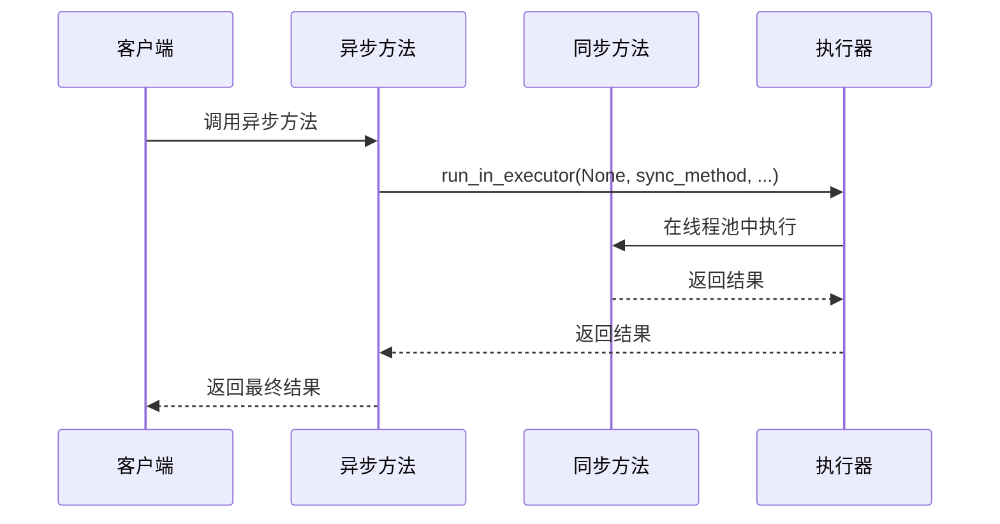
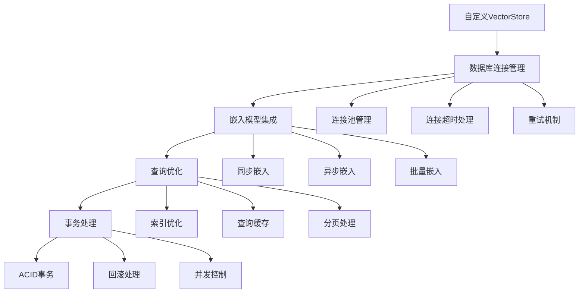
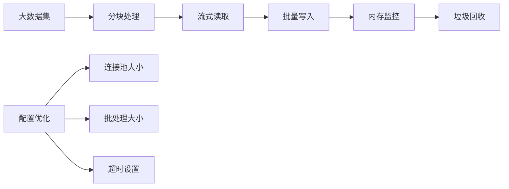
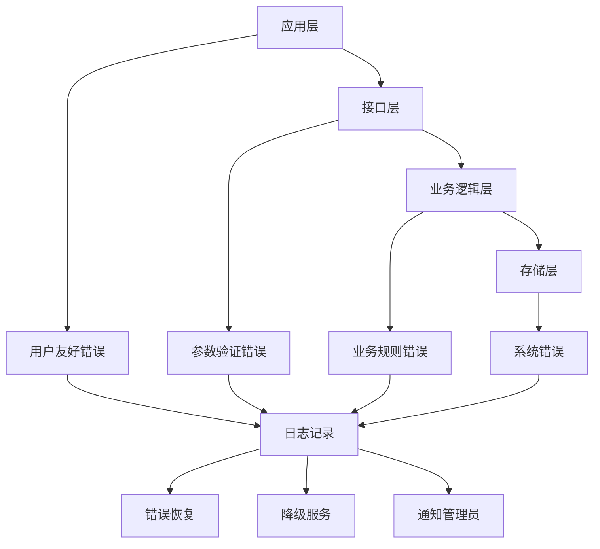
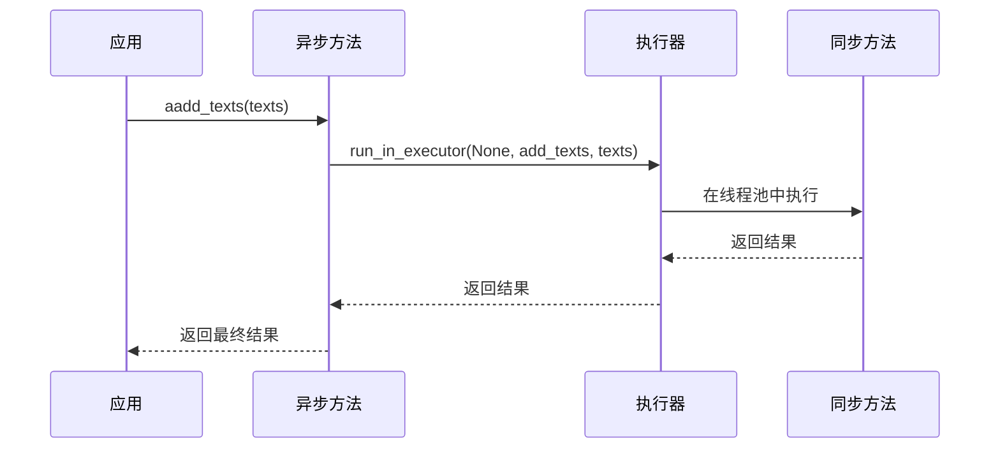

# 基础接口与自定义实现

<cite>
**本文档中引用的文件**
- [base.py](file://libs/core/langchain_core/vectorstores/base.py)
- [in_memory.py](file://libs/core/langchain_core/vectorstores/in_memory.py)
- [utils.py](file://libs/core/langchain_core/vectorstores/utils.py)
- [__init__.py](file://libs/core/langchain_core/vectorstores/__init__.py)
- [test_vectorstore.py](file://libs/core/tests/unit_tests/vectorstores/test_vectorstore.py)
</cite>

## 目录
1. [简介](#简介)
2. [VectorStore抽象基类设计](#vectorstore抽象基类设计)
3. [核心方法详解](#核心方法详解)
4. [接口统一性优势](#接口统一性优势)
5. [自定义实现指南](#自定义实现指南)
6. [完整实现示例](#完整实现示例)
7. [性能与最佳实践](#性能与最佳实践)
8. [错误处理与异步支持](#错误处理与异步支持)
9. [总结](#总结)

## 简介

LangChain的VectorStore抽象基类为向量数据库提供了统一的接口规范，使得开发者能够轻松地为新的或私有向量数据库创建LangChain适配器。这种设计模式不仅简化了应用开发，还确保了不同向量存储实现之间的一致性和互操作性。

VectorStore接口的核心价值在于：
- **统一抽象**：为所有向量存储提供一致的操作接口
- **灵活扩展**：支持自定义向量存储实现
- **异步支持**：内置异步操作能力
- **检索器集成**：无缝集成到LangChain的检索链中

## VectorStore抽象基类设计

### 类结构概览



**图表来源**
- [base.py](file://libs/core/langchain_core/vectorstores/base.py#L43-L1095)
- [in_memory.py](file://libs/core/langchain_core/vectorstores/in_memory.py#L35-L547)

### 抽象基类特性

VectorStore抽象基类采用Python的ABC（Abstract Base Class）机制，确保所有子类都必须实现核心方法。这种设计提供了以下优势：

- **强制实现**：通过`@abstractmethod`装饰器确保关键方法的实现
- **默认实现**：提供智能的默认实现，减少重复代码
- **双向兼容**：同时支持`add_texts`和`add_documents`两种接口
- **异步支持**：每个同步方法都有对应的异步版本

**节来源**
- [base.py](file://libs/core/langchain_core/vectorstores/base.py#L43-L100)

## 核心方法详解

### add_texts方法

`add_texts`方法是向量存储的基础写入操作，负责将文本数据转换为嵌入向量并存储。

#### 方法签名与契约

```python
def add_texts(
    self,
    texts: Iterable[str],
    metadatas: list[dict] | None = None,
    *,
    ids: list[str] | None = None,
    **kwargs: Any,
) -> list[str]:
```

#### 预期行为

1. **输入验证**：检查`metadatas`和`ids`列表长度是否匹配
2. **文档创建**：将文本和元数据组合成Document对象
3. **批量处理**：支持迭代器输入，提高内存效率
4. **ID管理**：自动分配UUID或使用提供的ID
5. **返回值**：返回新添加文档的ID列表

#### 实现策略

VectorStore提供了智能的默认实现，当子类没有重写`add_documents`方法时，会自动调用`add_texts`：



**图表来源**
- [base.py](file://libs/core/langchain_core/vectorstores/base.py#L50-L85)

**节来源**
- [base.py](file://libs/core/langchain_core/vectorstores/base.py#L50-L85)

### similarity_search方法

`similarity_search`是最核心的查询方法，用于基于语义相似度检索相关文档。

#### 方法契约

```python
@abstractmethod
def similarity_search(
    self, query: str, k: int = 4, **kwargs: Any
) -> list[Document]:
```

#### 搜索类型支持

VectorStore支持多种搜索类型：

1. **similarity**：标准相似度搜索
2. **similarity_score_threshold**：带阈值的相似度搜索
3. **mmr**：最大边际相关性搜索

#### 默认实现流程



**图表来源**
- [base.py](file://libs/core/langchain_core/vectorstores/base.py#L380-L420)

**节来源**
- [base.py](file://libs/core/langchain_core/vectorstores/base.py#L380-L420)

### delete方法

`delete`方法提供删除功能，支持按ID删除或清空整个存储。

#### 方法签名

```python
def delete(self, ids: list[str] | None = None, **kwargs: Any) -> bool | None:
```

#### 行为约定

- **单个ID**：删除指定ID的文档
- **多个ID**：批量删除文档
- **None**：删除所有文档
- **返回值**：成功返回True，不支持返回None，失败返回False

**节来源**
- [base.py](file://libs/core/langchain_core/vectorstores/base.py#L87-L95)

### get_by_ids方法

`get_by_ids`方法允许根据文档ID直接检索文档，这是向量存储的重要功能。

#### 实现特点

- **无序返回**：不保证返回顺序与输入ID顺序一致
- **部分匹配**：找不到的ID会被忽略而不是抛出异常
- **重复处理**：重复ID可能产生重复文档

**节来源**
- [base.py](file://libs/core/langchain_core/vectorstores/base.py#L97-L115)

## 接口统一性优势

### 开发者体验提升

VectorStore接口的统一设计显著提升了开发者体验：

#### 1. 一致性操作

无论使用哪种向量存储，开发者都可以使用相同的API：

```python
# 统一的初始化方式
vector_store = VectorStore.from_texts(
    texts=["文档内容"],
    embedding=embeddings,
    metadatas=[{"key": "value"}]
)

# 统一的查询方式
results = vector_store.similarity_search("查询文本", k=5)
```

#### 2. 无缝切换

不同向量存储之间的切换只需替换初始化参数：

```python
# 切换到不同的向量存储
from langchain_community.vectorstores import Chroma
from langchain_community.vectorstores import FAISS

# 使用Chroma
chroma_store = Chroma.from_texts(texts, embeddings)

# 使用FAISS
faiss_store = FAISS.from_texts(texts, embeddings)
```

#### 3. 检索器集成

所有VectorStore实例都可以直接转换为检索器：

```python
retriever = vector_store.as_retriever(
    search_type="mmr",
    search_kwargs={"k": 5, "fetch_k": 20, "lambda_mult": 0.5}
)
```

### 应用架构简化



**图表来源**
- [base.py](file://libs/core/langchain_core/vectorstores/base.py#L895-L924)

**节来源**
- [base.py](file://libs/core/langchain_core/vectorstores/base.py#L895-L924)

## 自定义实现指南

### 实现步骤

创建自定义VectorStore需要遵循以下步骤：

#### 1. 继承VectorStore基类

```python
from langchain_core.vectorstores import VectorStore
from langchain_core.embeddings import Embeddings

class CustomVectorStore(VectorStore):
    def __init__(self, embedding: Embeddings):
        self.embedding = embedding
        # 初始化自定义存储
```

#### 2. 实现必需的抽象方法

至少需要实现以下两个核心方法：

```python
def similarity_search(
    self, query: str, k: int = 4, **kwargs: Any
) -> list[Document]:
    # 实现相似度搜索逻辑
    pass

def add_texts(
    self, texts: Iterable[str], metadatas: list[dict] | None = None, 
    ids: list[str] | None = None, **kwargs: Any
) -> list[str]:
    # 实现文本添加逻辑
    pass
```

#### 3. 可选的优化实现

为了获得更好的性能，可以实现以下方法：

```python
def similarity_search_with_score(
    self, query: str, k: int = 4, **kwargs: Any
) -> list[tuple[Document, float]]:
    # 实现带分数的相似度搜索
    pass

def max_marginal_relevance_search(
    self, query: str, k: int = 4, fetch_k: int = 20, 
    lambda_mult: float = 0.5, **kwargs: Any
) -> list[Document]:
    # 实现最大边际相关性搜索
    pass
```

### 设计原则

#### 1. Liskov替换原则

自定义实现应该完全符合VectorStore接口的契约，确保任何使用VectorStore的地方都可以无缝替换为自定义实现。

#### 2. 错误处理

- **参数验证**：验证输入参数的有效性
- **异常处理**：捕获并适当处理底层存储的异常
- **优雅降级**：在功能不可用时提供合理的默认行为

#### 3. 性能考虑

- **批量操作**：优先支持批量添加和查询
- **缓存策略**：实现适当的缓存机制
- **资源管理**：正确管理数据库连接和内存使用

**节来源**
- [test_vectorstore.py](file://libs/core/tests/unit_tests/vectorstores/test_vectorstore.py#L15-L95)

## 完整实现示例

### 内存向量存储实现

以下是一个完整的自定义向量存储实现示例，展示了如何从零开始构建一个简单的内存向量存储：

#### 基础实现结构



**图表来源**
- [in_memory.py](file://libs/core/langchain_core/vectorstores/in_memory.py#L35-L100)

#### 关键实现细节

1. **存储结构设计**
   - 使用字典存储文档，键为ID，值为包含向量、文本和元数据的字典
   - 支持动态ID生成（UUID）

2. **相似度计算**
   - 使用余弦相似度计算向量间的相似度
   - 支持过滤器功能

3. **MMR算法实现**
   - 基于scikit-learn的余弦相似度计算
   - 支持多样性控制参数

#### 异步支持实现



**图表来源**
- [base.py](file://libs/core/langchain_core/vectorstores/base.py#L150-L180)

**节来源**
- [in_memory.py](file://libs/core/langchain_core/vectorstores/in_memory.py#L35-L547)

### 连接到私有数据库

#### 数据库连接模式



#### 实现要点

1. **连接管理**：实现连接池和连接生命周期管理
2. **事务支持**：确保操作的原子性和一致性
3. **性能优化**：实现查询缓存和批量操作
4. **错误恢复**：提供重试机制和故障转移

## 性能与最佳实践

### 性能优化策略

#### 1. 批量操作优化

```python
# 推荐：批量添加
texts = ["文本1", "文本2", "文本3"]
ids = vector_store.add_texts(texts, batch_size=100)

# 避免：逐个添加
for text in texts:
    vector_store.add_texts([text])
```

#### 2. 缓存策略

- **嵌入缓存**：缓存频繁查询的文本嵌入
- **结果缓存**：缓存相似度搜索结果
- **元数据缓存**：缓存文档元数据

#### 3. 并发处理

```python
# 异步批量添加
await vector_store.aadd_texts(texts, metadatas=metadatas)

# 并行查询
tasks = [vector_store.asimilarity_search(text) for text in queries]
results = await asyncio.gather(*tasks)
```

### 内存管理

#### 大规模数据处理



#### 资源限制

- **内存限制**：监控内存使用，避免OOM
- **连接限制**：控制数据库连接数量
- **查询限制**：限制并发查询数量

### 测试策略

#### 单元测试覆盖

```python
# 测试基本功能
def test_add_texts():
    vs = CustomVectorStore(embeddings)
    ids = vs.add_texts(["测试文本"])
    assert len(ids) == 1

# 测试查询功能
def test_similarity_search():
    vs = CustomVectorStore(embeddings)
    vs.add_texts(["相关文本1", "相关文本2"])
    results = vs.similarity_search("查询文本")
    assert len(results) > 0
```

**节来源**
- [test_vectorstore.py](file://libs/core/tests/unit_tests/vectorstores/test_vectorstore.py#L100-L150)

## 错误处理与异步支持

### 错误处理模式

#### 1. 分层错误处理



#### 2. 常见错误场景

| 错误类型 | 处理策略 | 示例 |
|---------|---------|------|
| 参数无效 | 验证后抛出ValueError | 文本为空、ID格式错误 |
| 存储失败 | 重试机制+降级 | 数据库连接失败 |
| 嵌入失败 | 使用备用模型 | API限流、网络错误 |
| 查询超时 | 设置合理超时 | 大规模数据查询 |

### 异步支持实现

#### 异步方法映射



**图表来源**
- [base.py](file://libs/core/langchain_core/vectorstores/base.py#L150-L180)

#### 异步最佳实践

1. **避免阻塞操作**：确保异步方法不包含CPU密集型操作
2. **合理使用线程池**：避免过度消耗系统资源
3. **错误传播**：正确处理异步异常
4. **资源清理**：确保异步上下文的正确清理

### 可靠性保障

#### 1. 重试机制

```python
from tenacity import retry, stop_after_attempt, wait_exponential

@retry(
    stop=stop_after_attempt(3),
    wait=wait_exponential(multiplier=1, min=4, max=10)
)
def add_texts_with_retry(self, texts):
    return self.add_texts(texts)
```

#### 2. 健康检查

```python
def health_check(self) -> dict:
    try:
        # 检查数据库连接
        self.similarity_search("health check", k=1)
        return {"status": "healthy"}
    except Exception as e:
        return {"status": "unhealthy", "error": str(e)}
```

**节来源**
- [base.py](file://libs/core/langchain_core/vectorstores/base.py#L150-L200)

## 总结

LangChain的VectorStore抽象基类提供了一个强大而灵活的框架，用于构建统一的向量存储解决方案。通过深入理解其设计原理和实现细节，开发者可以：

### 核心价值

1. **统一接口**：提供一致的操作界面，简化应用开发
2. **灵活扩展**：支持各种向量存储技术的集成
3. **异步支持**：内置异步操作能力，提升性能
4. **检索器集成**：无缝集成到LangChain生态系统

### 实施建议

1. **遵循接口契约**：严格遵守VectorStore的方法签名和行为约定
2. **性能优化**：实现批量操作和适当的缓存机制
3. **错误处理**：建立完善的错误处理和恢复机制
4. **测试覆盖**：确保全面的单元测试和集成测试

### 发展方向

随着向量数据库技术的不断发展，VectorStore接口也在持续演进：

- **更多搜索类型**：支持更复杂的查询模式
- **增强的过滤功能**：提供更精细的数据筛选能力
- **分布式支持**：适应大规模部署需求
- **云原生集成**：更好地支持容器化和微服务架构

通过掌握VectorStore的基础接口和自定义实现技巧，开发者可以构建出既符合LangChain生态标准又满足特定业务需求的向量存储解决方案。