# LangChain经典功能综合指南

<cite>
**本文档中引用的文件**
- [libs/core/langchain_core/__init__.py](file://libs/core/langchain_core/__init__.py)
- [libs/langchain/langchain_classic/__init__.py](file://libs/langchain/langchain_classic/__init__.py)
- [libs/langchain/langchain_classic/agents/__init__.py](file://libs/langchain/langchain_classic/agents/__init__.py)
- [libs/langchain/langchain_classic/chains/__init__.py](file://libs/langchain/langchain_classic/chains/__init__.py)
- [libs/langchain/langchain_classic/document_loaders/__init__.py](file://libs/langchain/langchain_classic/document_loaders/__init__.py)
- [libs/langchain/langchain_classic/embeddings/__init__.py](file://libs/langchain/langchain_classic/embeddings/__init__.py)
- [libs/langchain/langchain_classic/vectorstores/__init__.py](file://libs/langchain/langchain_classic/vectorstores/__init__.py)
- [libs/langchain/langchain_classic/memory/__init__.py](file://libs/langchain/langchain_classic/memory/__init__.py)
- [libs/langchain/langchain_classic/output_parsers/__init__.py](file://libs/langchain/langchain_classic/output_parsers/__init__.py)
- [libs/core/langchain_core/runnables/base.py](file://libs/core/langchain_core/runnables/base.py)
- [libs/core/README.md](file://libs/core/README.md)
- [README.md](file://README.md)
</cite>

## 目录
1. [简介](#简介)
2. [项目架构概览](#项目架构概览)
3. [Agents：自主实体](#agents自主实体)
4. [Chains：组件链式组合](#chains组件链式组合)
5. [Chat Models与LLMs集成](#chat-models与llms集成)
6. [Document Loaders：数据提取](#document-loaders数据提取)
7. [Embeddings与Vectorstores](#embeddings与vectorstores)
8. [Memory：上下文维护](#memory上下文维护)
9. [Output Parsers：结构化输出](#output-parsers结构化输出)
10. [Runnables：统一执行协议](#runnables统一执行协议)
11. [总结](#总结)

## 简介

LangChain是一个强大的框架，用于构建基于大型语言模型(LLM)的应用程序。它通过标准化的接口连接模型、嵌入、向量存储等组件，简化了AI应用程序的开发过程。本文档将深入探讨LangChain的经典功能，包括Agents、Chains、Chat Models、Document Loaders、Embeddings、Memory和Output Parsers等核心组件。

LangChain的核心理念是模块化和可组合性。通过将不同的组件连接起来，开发者可以构建复杂的AI应用程序，同时保持代码的可维护性和可扩展性。

## 项目架构概览

LangChain采用分层架构设计，核心抽象定义在`langchain-core`包中，具体实现分布在各个专门的包中。

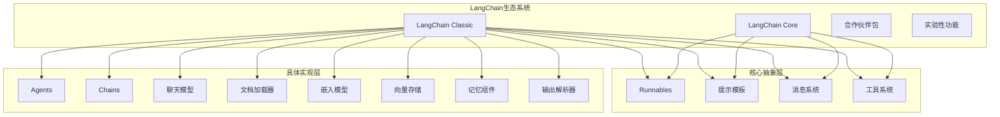

**图表来源**
- [libs/core/langchain_core/__init__.py](file://libs/core/langchain_core/__init__.py#L1-L21)
- [libs/langchain/langchain_classic/__init__.py](file://libs/langchain/langchain_classic/__init__.py#L1-L50)

**章节来源**
- [libs/core/README.md](file://libs/core/README.md#L1-L48)
- [README.md](file://README.md#L1-L79)

## Agents：自主实体

Agents是LangChain中最强大的功能之一，它们能够使用工具和规划能力来完成复杂任务。与传统的Chains不同，Agents使用语言模型作为推理引擎来决定要采取哪些行动以及行动顺序。

### 核心概念

Agents的核心特性包括：
- **自主决策**：使用LLM进行推理和决策
- **工具调用**：集成外部工具和API
- **规划能力**：能够制定和执行行动计划
- **状态感知**：维护和更新任务状态

### 主要Agents类型

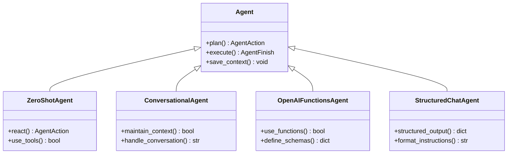

**图表来源**
- [libs/langchain/langchain_classic/agents/__init__.py](file://libs/langchain/langchain_classic/agents/__init__.py#L1-L165)

### 工具系统

Agents通过工具系统与外部世界交互：

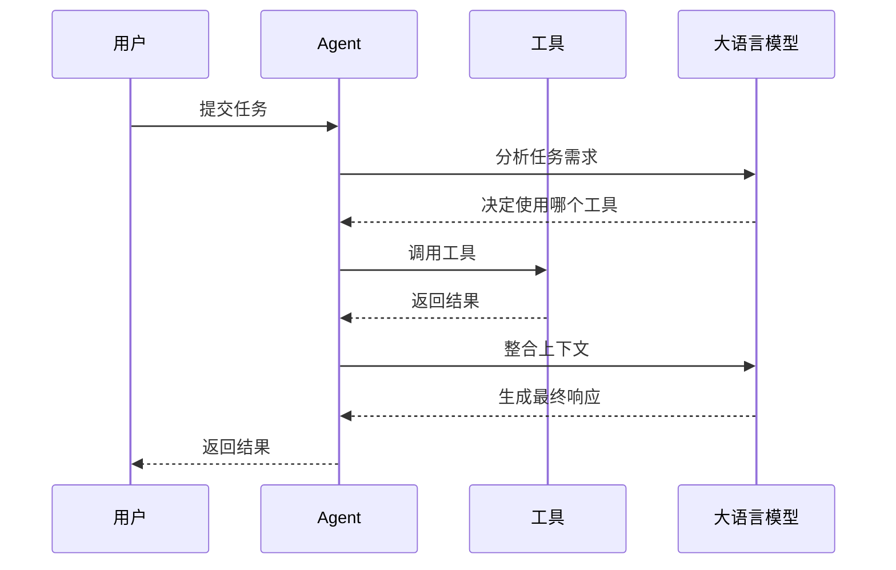

**图表来源**
- [libs/langchain/langchain_classic/agents/tool_calling_agent/base.py](file://libs/langchain/langchain_classic/agents/tool_calling_agent/base.py#L1-L50)

**章节来源**
- [libs/langchain/langchain_classic/agents/__init__.py](file://libs/langchain/langchain_classic/agents/__init__.py#L1-L165)

## Chains：组件链式组合

Chains是LangChain中用于将多个组件链接在一起以创建复杂执行流程的核心概念。它们编码了一系列对组件（如模型、文档检索器、其他Chains等）的调用序列，并为此序列提供了一个简单的接口。

### Chains的核心特性

- **可重用性**：易于重复使用的组件
- **有状态性**：添加Memory即可获得状态
- **可观测性**：传递Callbacks执行额外功能
- **可组合性**：与其他组件组合，包括其他Chains

### 常见Chains类型

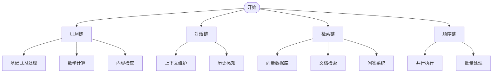

**图表来源**
- [libs/langchain/langchain_classic/chains/__init__.py](file://libs/langchain/langchain_classic/chains/__init__.py#L1-L97)

### 链式组合模式

LangChain提供了多种链式组合模式：

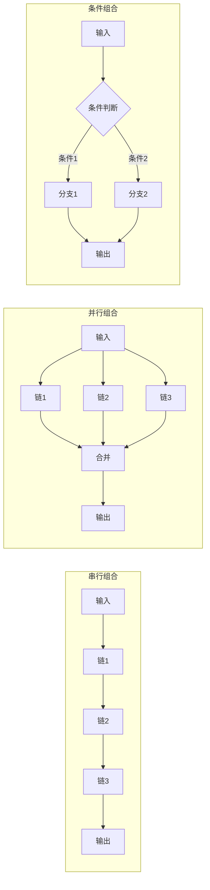

**章节来源**
- [libs/langchain/langchain_classic/chains/__init__.py](file://libs/langchain/langchain_classic/chains/__init__.py#L1-L97)

## Chat Models与LLMs集成

LangChain提供了广泛的Chat Models和LLMs集成，支持超过80种不同的模型提供商和服务。

### 支持的模型提供商

| 提供商类别 | 具体提供商 | 特点 |
|-----------|-----------|------|
| 开源模型 | LlamaCpp, GPT4All | 本地部署，隐私保护 |
| 云服务 | OpenAI, Azure OpenAI | 高质量，稳定可靠 |
| 多模态 | Anthropic, Google Palm | 图像、音频处理 |
| 专业领域 | Cohere, HuggingFace | 特定领域优化 |
| 边缘计算 | Ollama, LiteLLM | 低延迟，边缘部署 |

### 模型加载和配置

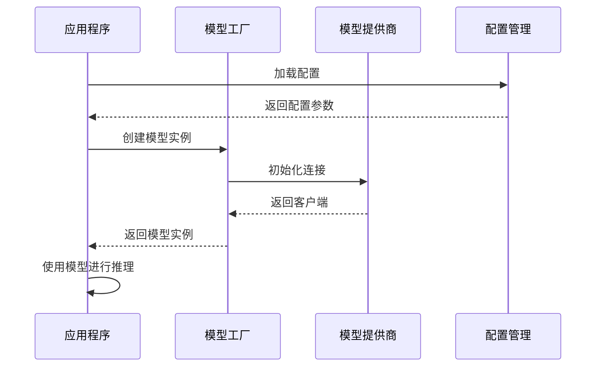

**图表来源**
- [libs/langchain/langchain_classic/chat_models/__init__.py](file://libs/langchain/langchain_classic/chat_models/__init__.py#L1-L50)

### 模型选择策略

选择合适的模型需要考虑以下因素：
- **性能要求**：响应速度和准确性平衡
- **成本预算**：API调用费用和资源消耗
- **数据安全**：是否需要本地部署
- **功能需求**：多模态、函数调用等特殊功能

**章节来源**
- [libs/langchain/langchain_classic/chat_models/__init__.py](file://libs/langchain/langchain_classic/chat_models/__init__.py#L1-L50)

## Document Loaders：数据提取

Document Loaders是LangChain中负责从200多种不同数据源提取信息的强大组件。它们能够处理各种格式和类型的文档，为后续的处理和分析提供原始数据。

### 支持的数据源

```mermaid
mindmap
root((Document Loaders))
文件系统
PDF文件
Word文档
Excel表格
文本文件
Markdown文件
网络资源
网页内容
API响应
RSS订阅
社交媒体
数据库
关系型数据库
NoSQL数据库
数据仓库
实时数据流
云服务
Google Drive
Dropbox
OneDrive
云存储
特殊格式
JSON/XML
图像文档
音频转录
视频字幕
```

**图表来源**
- [libs/langchain/langchain_classic/document_loaders/__init__.py](file://libs/langchain/langchain_classic/document_loaders/__init__.py#L54-L154)

### 加载流程

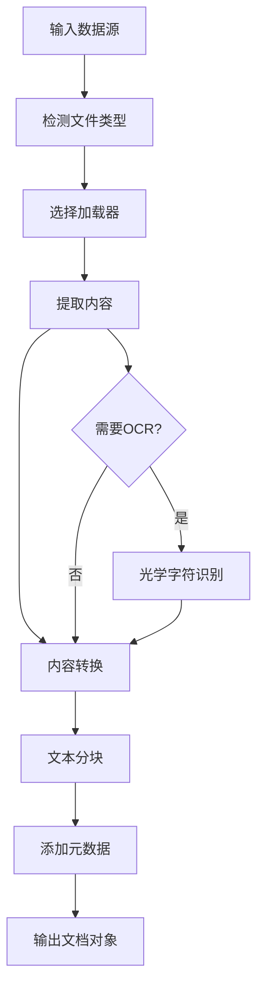

### 文档处理管道

典型的文档处理流程包括：
1. **文件发现**：扫描和识别目标文件
2. **内容提取**：从文件中提取原始文本
3. **格式转换**：将内容转换为统一格式
4. **元数据提取**：收集文件相关信息
5. **文本分块**：将长文档分割为适中块
6. **质量检查**：验证提取内容的完整性

**章节来源**
- [libs/langchain/langchain_classic/document_loaders/__init__.py](file://libs/langchain/langchain_classic/document_loaders/__init__.py#L1-L540)

## Embeddings与Vectorstores

Embeddings将文本转换为向量表示，而Vectorstores则存储和检索这些向量，为语义搜索和相似性匹配提供基础。

### 嵌入模型类型

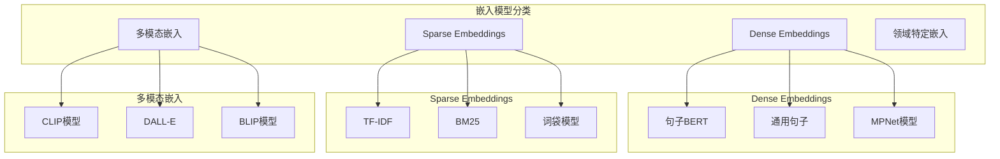

**图表来源**
- [libs/langchain/langchain_classic/embeddings/__init__.py](file://libs/langchain/langchain_classic/embeddings/__init__.py#L1-L50)

### 向量存储架构

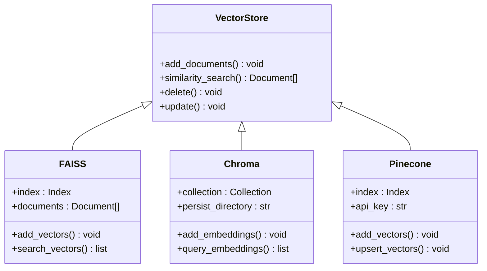

**图表来源**
- [libs/langchain/langchain_classic/vectorstores/__init__.py](file://libs/langchain/langchain_classic/vectorstores/__init__.py#L1-L50)

### 检索机制

向量检索通常包括以下步骤：
1. **查询嵌入**：将用户查询转换为向量
2. **相似性计算**：计算查询向量与存储向量的相似度
3. **排序和过滤**：根据相似度排序并应用过滤条件
4. **结果返回**：返回最相关的文档片段

**章节来源**
- [libs/langchain/langchain_classic/embeddings/__init__.py](file://libs/langchain/langchain_classic/embeddings/__init__.py#L1-L50)
- [libs/langchain/langchain_classic/vectorstores/__init__.py](file://libs/langchain/langchain_classic/vectorstores/__init__.py#L1-L50)

## Memory：上下文维护

Memory组件为对话应用维护上下文，确保连续的交互具有连贯性和一致性。

### Memory类型

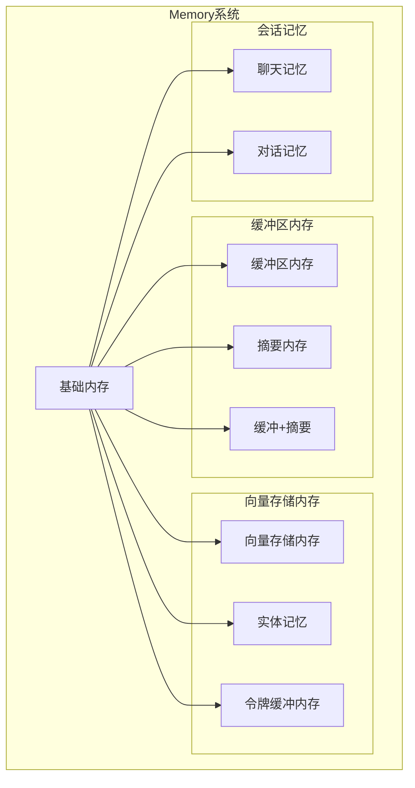

**图表来源**
- [libs/langchain/langchain_classic/memory/__init__.py](file://libs/langchain/langchain_classic/memory/__init__.py#L1-L50)

### 上下文管理策略

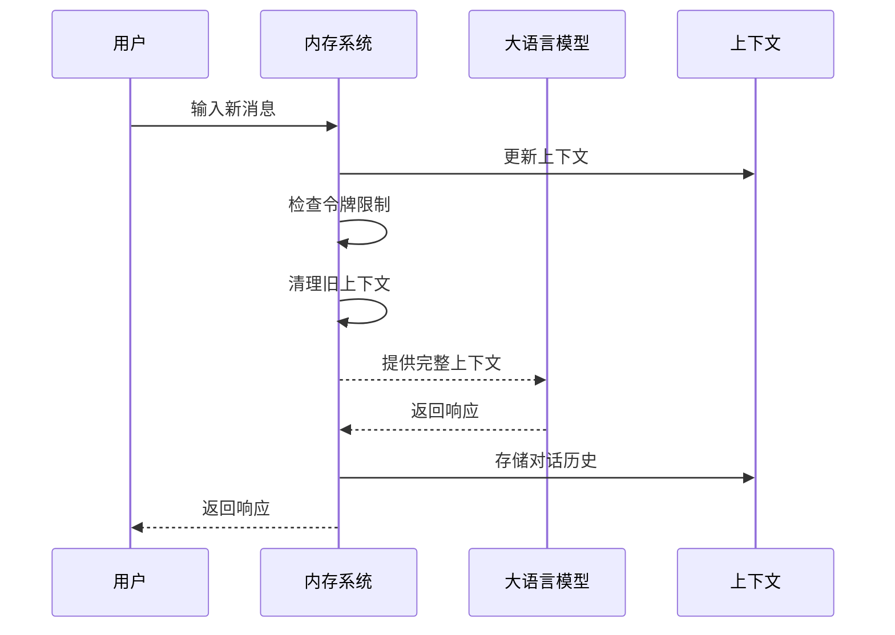

### 内存优化技术

有效的内存管理需要考虑：
- **令牌限制**：控制上下文长度避免超出模型限制
- **重要性评估**：识别和保留关键对话内容
- **压缩技术**：使用摘要或实体提取减少存储空间
- **持久化策略**：在会话间保存和恢复上下文

**章节来源**
- [libs/langchain/langchain_classic/memory/__init__.py](file://libs/langchain/langchain_classic/memory/__init__.py#L1-L165)

## Output Parsers：结构化输出

Output Parsers将LLM的非结构化输出转换为结构化数据，使应用程序能够可靠地处理和使用AI生成的内容。

### 解析器类型

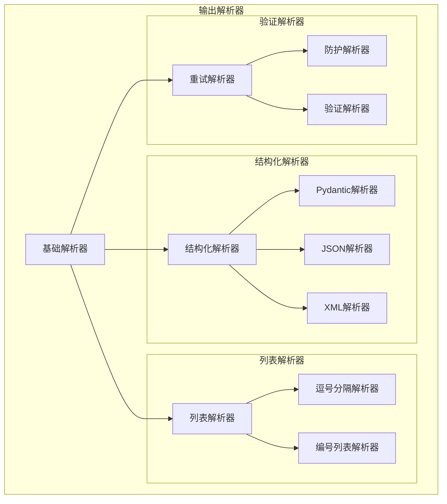

**图表来源**
- [libs/langchain/langchain_classic/output_parsers/__init__.py](file://libs/langchain/langchain_classic/output_parsers/__init__.py#L1-L50)

### 结构化输出流程

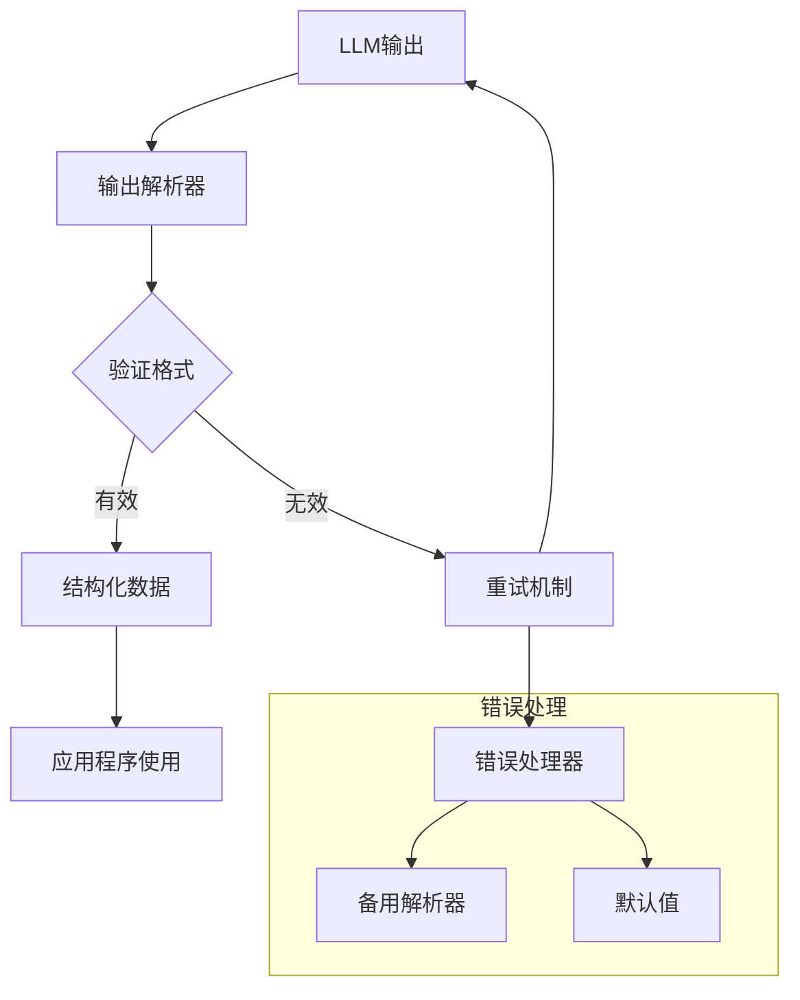

### 解析器配置

不同类型的解析器适用于不同的应用场景：
- **JSON解析器**：API响应、配置文件
- **XML解析器**：文档标记、RSS feeds
- **Pydantic解析器**：强类型验证、数据模型
- **列表解析器**：清单、分类、排序

**章节来源**
- [libs/langchain/langchain_classic/output_parsers/__init__.py](file://libs/langchain/langchain_classic/output_parsers/__init__.py#L1-L200)

## Runnables：统一执行协议

Runnables是LangChain的核心抽象，定义了所有可执行组件的标准接口。它们提供了统一的方法来调用、批处理、流式传输、转换和组合组件。

### Runnables核心接口

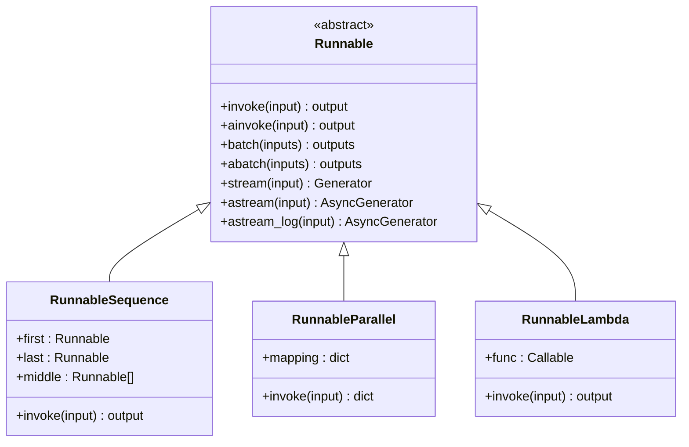

**图表来源**
- [libs/core/langchain_core/runnables/base.py](file://libs/core/langchain_core/runnables/base.py#L1-L200)

### LCEL表达式语言

LangChain Expression Language (LCEL) 是一种声明式的方式来组合Runnable对象成链。任何使用这种方式构造的链都会自动获得同步、异步、批处理和流式支持。

```mermaid
graph LR
subgraph "LCEL组合原语"
Sequence[RunnableSequence<br/>| 操作符]
Parallel[RunnableParallel<br/>字典语法]
Lambda[RunnableLambda<br/>自定义函数]
Branch[RunnableBranch<br/>条件分支]
Router[RunnableRouter<br/>路由选择]
end
subgraph "执行模式"
Sync[同步执行]
Async[异步执行]
Batch[批处理]
Stream[流式传输]
end
Sequence --> Sync
Sequence --> Async
Sequence --> Batch
Sequence --> Stream
Parallel --> Sync
Parallel --> Async
Parallel --> Batch
Parallel --> Stream
```

### 组合模式示例

LCEL提供了多种组合模式：

1. **串行组合**：`chain = prompt | llm | parser`
2. **并行组合**：`chain = {"summary": summary | llm, "keywords": keywords | llm}`
3. **条件组合**：`chain = condition | {"true": true_chain, "false": false_chain}`
4. **路由组合**：`chain = router | {"qa": qa_chain, "search": search_chain}`

**章节来源**
- [libs/core/langchain_core/runnables/base.py](file://libs/core/langchain_core/runnables/base.py#L1-L200)

## 总结

LangChain的经典功能构成了一个强大而灵活的AI应用开发框架。通过Agents的自主决策能力、Chains的组件组合、Chat Models的广泛集成、Document Loaders的数据提取、Embeddings的向量表示、Memory的上下文维护和Output Parsers的结构化输出，开发者可以构建出功能丰富、性能优异的LLM驱动应用程序。

这些核心功能的设计原则体现了LangChain的三个关键优势：
1. **模块化**：每个组件都是独立的，可以单独使用或组合使用
2. **可扩展性**：新的组件和功能可以轻松集成到现有体系中
3. **可维护性**：清晰的抽象层次和标准接口使得代码易于理解和维护

随着AI技术的不断发展，LangChain的这些经典功能将继续演进，为开发者提供更加强大和易用的工具来构建下一代AI应用程序。