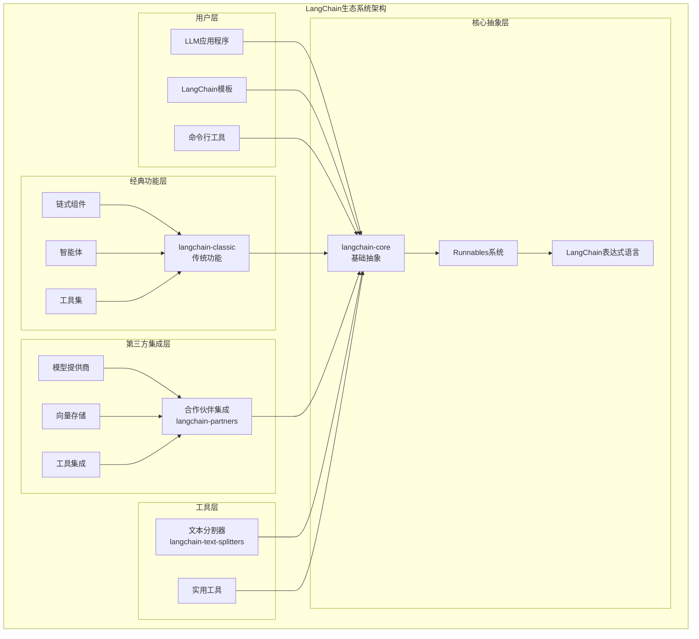
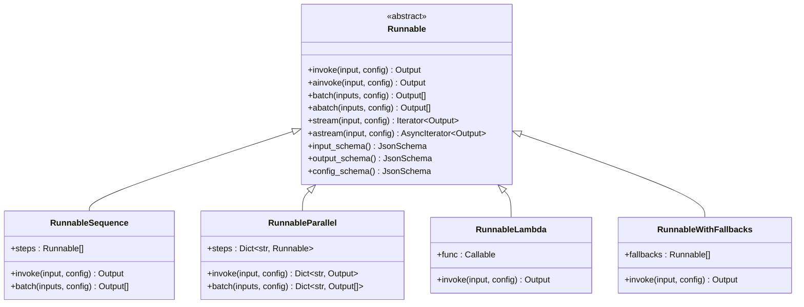
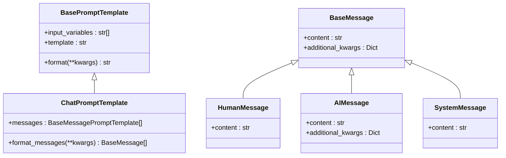
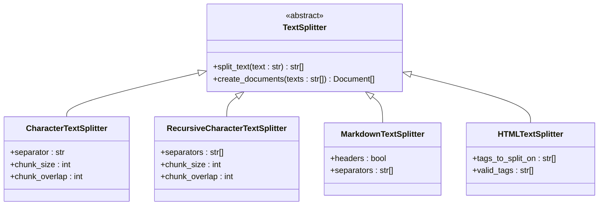
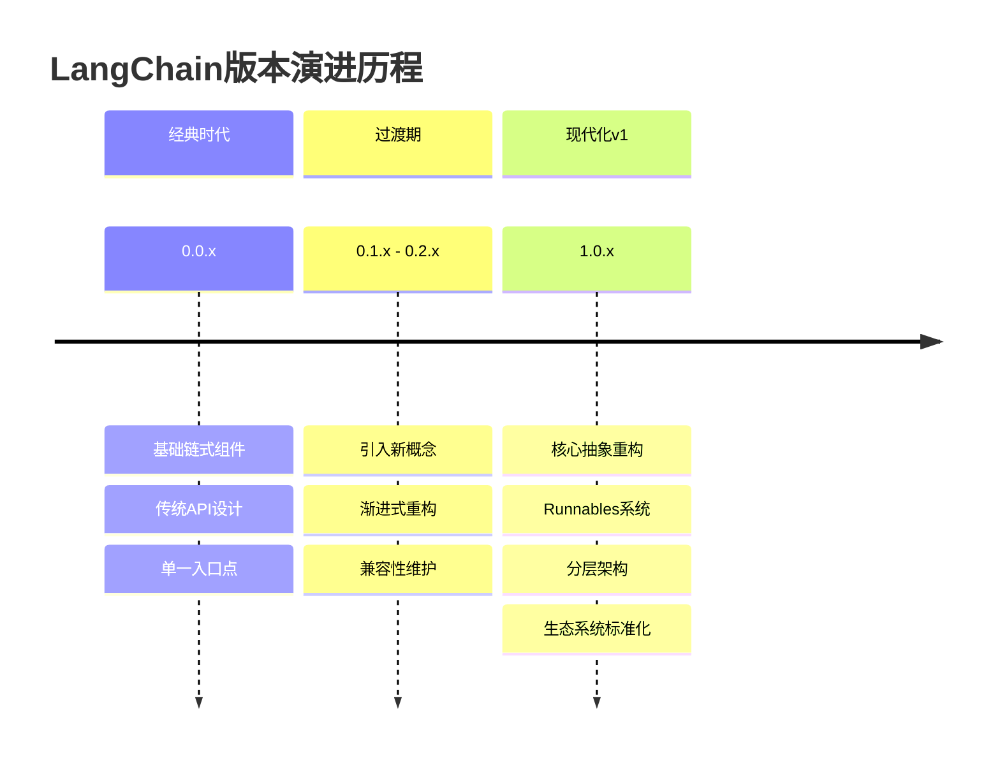
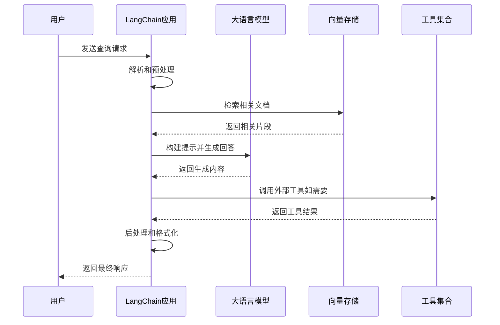

# LangChain项目概述

<cite>
**本文档中引用的文件**
- [README.md](file://README.md)
- [libs/core/README.md](file://libs/core/README.md)
- [libs/langchain/README.md](file://libs/langchain/README.md)
- [libs/cli/README.md](file://libs/cli/README.md)
- [MIGRATE.md](file://MIGRATE.md)
- [libs/core/langchain_core/__init__.py](file://libs/core/langchain_core/__init__.py)
- [libs/langchain/langchain_classic/__init__.py](file://libs/langchain/langchain_classic/__init__.py)
- [libs/text-splitters/langchain_text_splitters/__init__.py](file://libs/text-splitters/langchain_text_splitters/__init__.py)
- [libs/core/langchain_core/runnables/base.py](file://libs/core/langchain_core/runnables/base.py)
- [libs/core/langchain_core/version.py](file://libs/core/langchain_core/version.py)
- [libs/langchain/langchain_classic/base_language.py](file://libs/langchain/langchain_classic/base_language.py)
- [libs/partners/README.md](file://libs/partners/README.md)
</cite>

## 目录
1. [项目简介](#项目简介)
2. [核心愿景与设计哲学](#核心愿景与设计哲学)
3. [项目架构概览](#项目架构概览)
4. [核心组件详解](#核心组件详解)
5. [生态系统与集成](#生态系统与集成)
6. [版本演进历程](#版本演进历程)
7. [技术优势与特性](#技术优势与特性)
8. [应用场景与用例](#应用场景与用例)
9. [未来发展方向](#未来发展方向)
10. [总结](#总结)

## 项目简介

LangChain是一个专为构建大型语言模型（LLM）驱动应用程序而设计的综合性框架。它通过提供标准化的接口和可互操作的组件，简化了LLM与各种数据源和外部系统的集成过程，同时确保技术决策的未来兼容性。

LangChain的核心使命是帮助开发者构建可靠的智能代理应用，通过统一的抽象层连接不同的模型提供商、工具、向量存储和检索器，为LLM应用程序开发提供完整的解决方案套件。

**章节来源**
- [README.md](file://README.md#L1-L79)
- [libs/core/README.md](file://libs/core/README.md#L1-L48)

## 核心愿景与设计哲学

### 设计哲学

LangChain的设计哲学围绕以下几个核心原则：

1. **模块化与可组合性**：所有核心组件都设计为独立且相互解耦的抽象层，支持灵活的组合和重用
2. **标准化接口**：提供统一的接口规范，使不同供应商的模型和服务能够无缝集成
3. **未来兼容性**：采用稳定的版本控制策略，确保向后兼容性和平滑的技术演进
4. **生产就绪**：经过大规模生产环境验证，具备高稳定性和可靠性

### 核心目标

LangChain致力于解决以下关键挑战：

- **实时数据增强**：轻松连接LLM到多样化数据源和内外部系统
- **模型互操作性**：在工程团队实验过程中快速切换模型，适应行业前沿发展
- **标准化集成**：通过统一接口简化与各种第三方服务的集成
- **可扩展架构**：支持从小规模原型到大规模生产部署的无缝扩展

**章节来源**
- [libs/core/README.md](file://libs/core/README.md#L15-L30)

## 项目架构概览

LangChain采用分层架构设计，包含四个主要层次，每个层次都有明确的职责和边界：



**图表来源**
- [libs/core/langchain_core/__init__.py](file://libs/core/langchain_core/__init__.py#L1-L21)
- [libs/langchain/langchain_classic/__init__.py](file://libs/langchain/langchain_classic/__init__.py#L1-L425)
- [libs/text-splitters/langchain_text_splitters/__init__.py](file://libs/text-splitters/langchain_text_splitters/__init__.py#L1-L69)

### 架构层次说明

1. **langchain-core**：定义了整个LangChain生态系统的基线抽象，包含聊天模型、LLM、向量存储、检索器等核心接口
2. **langchain-classic**：提供传统的链式组件和智能体功能，作为经典版本的延续
3. **langchain-partners**：第三方集成包，包含与各种模型提供商和服务的专门集成
4. **langchain-text-splitters**：专门的文本分割工具，支持多种格式的文本处理

**章节来源**
- [libs/core/langchain_core/__init__.py](file://libs/core/langchain_core/__init__.py#L1-L21)
- [libs/langchain/langchain_classic/__init__.py](file://libs/langchain/langchain_classic/__init__.py#L1-L50)

## 核心组件详解

### Runnables系统 - Universal Invocation Protocol

Runnables是LangChain的核心创新，提供了一个统一的工作单元抽象，支持同步、异步、批量和流式执行模式。



**图表来源**
- [libs/core/langchain_core/runnables/base.py](file://libs/core/langchain_core/runnables/base.py#L80-L200)

#### 核心特性

1. **多执行模式**：统一支持同步、异步、批量和流式调用
2. **组合原语**：通过`RunnableSequence`和`RunnableParallel`实现复杂工作流
3. **自动优化**：默认使用线程池执行批量调用，支持原生异步优化
4. **配置管理**：通过配置参数控制执行行为、添加标签和元数据

### LangChain表达式语言（LCEL）

LCEL提供了一种声明式的链式组合方式，允许开发者以简洁的方式构建复杂的LLM应用程序。

```mermaid
flowchart LR
Input[输入] --> Transform1[转换1]
Transform1 --> Transform2[转换2]
Transform2 --> Transform3[转换3]
Transform3 --> Output[输出]
subgraph "LCEL表示"
Chain = Transform1 | Transform2 | Transform3
end
```

**图表来源**
- [libs/core/langchain_core/runnables/base.py](file://libs/core/langchain_core/runnables/base.py#L100-L150)

### 智能体与工具系统

LangChain提供了完整的智能体框架，支持：
- **多类型智能体**：从简单的规则驱动到复杂的推理智能体
- **工具集成**：内置大量工具，支持自定义工具开发
- **记忆机制**：提供短期和长期记忆解决方案
- **检索增强生成（RAG）**：集成向量存储和检索功能

### 提示工程与消息管理



**图表来源**
- [libs/core/langchain_core/prompts/base.py](file://libs/core/langchain_core/prompts/base.py#L1-L100)

**章节来源**
- [libs/core/langchain_core/runnables/base.py](file://libs/core/langchain_core/runnables/base.py#L80-L200)

## 生态系统与集成

### 第三方集成生态

LangChain建立了广泛的第三方集成生态系统，涵盖以下主要类别：

| 集成类别 | 主要提供商 | 功能范围 |
|---------|-----------|----------|
| 大语言模型 | OpenAI, Anthropic, Google, Ollama | 文本生成、对话、函数调用 |
| 向量数据库 | Chroma, Qdrant, Pinecone | 向量存储、相似度搜索 |
| 搜索引擎 | SerpAPI, Exa, Perplexity | 网络搜索、知识检索 |
| 编程语言 | Groq, MistralAI, DeepSeek | 专用模型支持 |
| 开发工具 | LangSmith, LangGraph | 开发、测试、监控 |

### 文本分割器

LangChain提供了专门的文本分割器库，支持多种格式的文本处理：



**图表来源**
- [libs/text-splitters/langchain_text_splitters/__init__.py](file://libs/text-splitters/langchain_text_splitters/__init__.py#L1-L69)

**章节来源**
- [libs/partners/README.md](file://libs/partners/README.md#L1-L8)
- [libs/text-splitters/langchain_text_splitters/__init__.py](file://libs/text-splitters/langchain_text_splitters/__init__.py#L1-L69)

## 版本演进历程

### 从经典版本到v1的重大变革

LangChain经历了重要的架构演进，从经典的版本体系过渡到现代化的v1架构：



### 关键里程碑

1. **经典版本（0.0.x-0.2.x）**：
   - 单一入口点设计
   - 传统链式组件
   - 基础智能体功能

2. **过渡版本（0.3.x）**：
   - 新概念引入
   - 渐进式架构改进
   - 兼容性保持

3. **现代v1版本（1.0.x+）**：
   - 核心抽象层分离
   - Runnables统一协议
   - 完整生态系统标准化

### 迁移指南

LangChain提供了详细的迁移指南，帮助开发者从旧版本平滑升级：

- [迁移到LangChain v1.0](https://docs.langchain.com/oss/python/migrate/langchain-v1)
- [迁移到LangChain v0.3](https://python.langchain.com/docs/versions/v0_3/)
- [迁移到LangChain v0.2](https://python.langchain.com/docs/versions/v0_2/)

**章节来源**
- [MIGRATE.md](file://MIGRATE.md#L1-L10)
- [libs/core/langchain_core/version.py](file://libs/core/langchain_core/version.py#L1-L4)

## 技术优势与特性

### 可运行组件（Runnables）

Runnables系统是LangChain的核心创新，具有以下技术优势：

1. **统一抽象**：所有工作单元都遵循相同的接口规范
2. **自动优化**：批量操作自动使用线程池优化
3. **异步支持**：原生支持异步执行，性能更优
4. **组合能力**：支持复杂的链式和并行组合
5. **配置管理**：灵活的配置系统支持动态调整

### 追踪与可观测性

LangChain内置了完整的追踪系统，提供：

- **执行追踪**：记录每个组件的执行过程
- **性能监控**：跟踪延迟、吞吐量等指标
- **调试支持**：详细的日志和错误信息
- **生产监控**：集成监控平台的能力

### 提示工程能力

- **模板系统**：灵活的提示模板和格式化
- **消息管理**：完整的对话历史管理
- **上下文处理**：智能的上下文窗口管理
- **多模态支持**：文本、图像等多种输入格式

### 模型集成

- **标准化接口**：统一的模型调用接口
- **多提供商支持**：OpenAI、Anthropic、本地模型等
- **函数调用**：原生支持模型函数调用
- **流式响应**：实时响应流处理

**章节来源**
- [libs/core/langchain_core/runnables/base.py](file://libs/core/langchain_core/runnables/base.py#L80-L150)

## 应用场景与用例

### 主要应用场景

1. **智能客服系统**
   - 自动问答机器人
   - 多轮对话管理
   - 上下文理解

2. **内容生成平台**
   - 文章写作助手
   - 社交媒体内容生成
   - 个性化推荐

3. **企业知识管理**
   - 智能文档检索
   - 知识图谱构建
   - 问答系统

4. **开发辅助工具**
   - 代码生成和解释
   - 测试用例生成
   - 文档自动生成

### 典型用例流程



## 未来发展方向

### 技术演进路线

1. **架构现代化**
   - 更加模块化的组件设计
   - 增强的类型安全支持
   - 性能优化和内存管理

2. **生态系统扩展**
   - 更多第三方集成
   - 开发者工具完善
   - 云原生支持增强

3. **智能化提升**
   - 更先进的提示工程技术
   - 智能体能力增强
   - 多模态支持扩展

4. **生产就绪特性**
   - 更完善的监控和追踪
   - 自动化测试和质量保证
   - 安全性和隐私保护

### 社区和生态建设

- **开源贡献**：持续欢迎社区贡献和反馈
- **文档完善**：提供更丰富的学习资源
- **最佳实践**：分享成功的应用案例
- **培训和支持**：提供专业的技术支持和培训

## 总结

LangChain作为一个成熟的LLM应用开发框架，在过去几年中经历了从传统架构到现代化设计的完整演进。其核心价值体现在：

### 核心价值主张

1. **简化开发复杂性**：通过标准化接口和模块化设计，大幅降低LLM应用开发的门槛
2. **促进生态繁荣**：建立开放的生态系统，鼓励第三方集成和创新
3. **确保技术前瞻性**：持续的技术演进确保框架的长期可用性
4. **支持规模化部署**：从原型到生产的完整支持，满足不同规模的需求

### 技术创新亮点

- **Runnables统一协议**：开创性的工作单元抽象，实现了真正的可组合性
- **LangChain表达式语言**：声明式编程范式，极大提升了开发效率
- **分层架构设计**：清晰的职责分离，支持灵活的定制和扩展
- **完整的工具链**：从开发到部署的全生命周期支持

### 适用人群

- **初学者**：通过简洁的API和丰富的文档快速上手
- **经验开发者**：通过高级特性和扩展能力满足复杂需求
- **企业团队**：通过稳定性和生产就绪特性支持大规模部署

LangChain不仅是一个技术框架，更是推动LLM应用开发标准化的重要力量。随着人工智能技术的不断发展，LangChain将继续引领这一领域的创新和发展，为构建下一代智能应用提供坚实的基础。